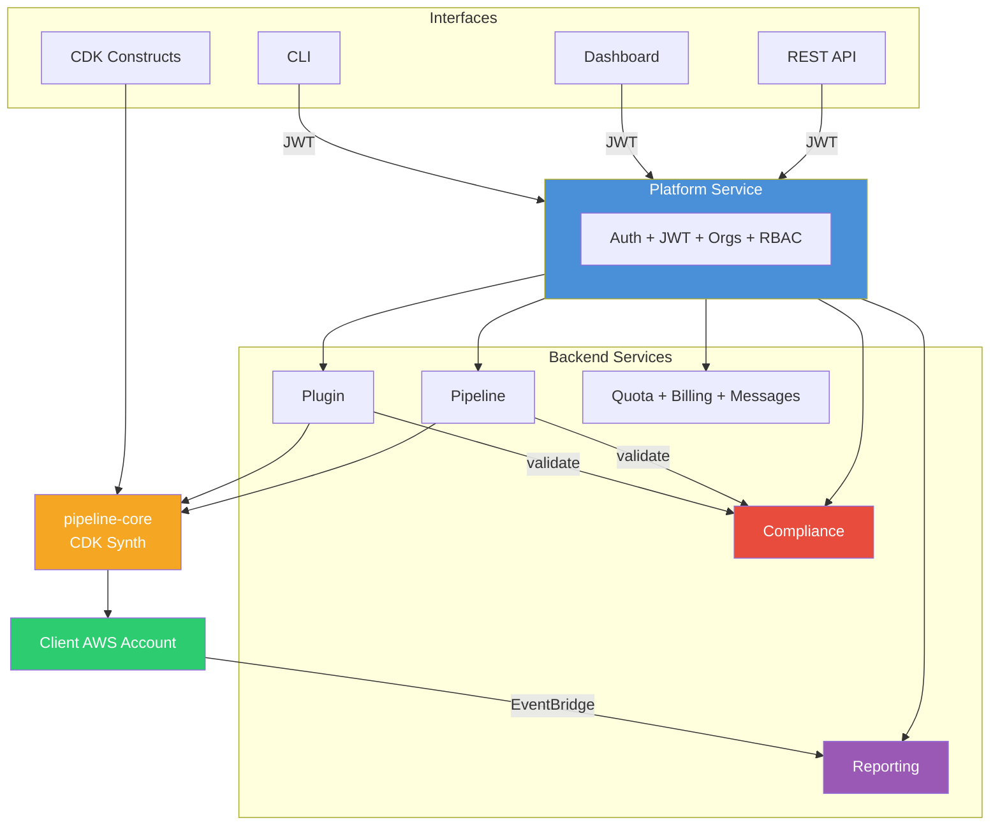

<p align="center">
  <strong>Pipeline Builder</strong><br/>
  <em>Self-service AWS CodePipelines — from a dashboard, CLI, CDK construct, or a single AI prompt.</em>
</p>

<p align="center">
  <a href="LICENSE"></a>
  
  
  
  
</p>

---
**Self-Service CI/CD for AWS

Pipeline Builder is a platform that enables development teams to create, deploy, and manage compliant AWS CI/CD pipelines through a simple self-service interface. Platform and DevOps teams maintain control through governance policies, reusable templates, and centralized plugin management while developers gain the freedom to deploy applications quickly and consistently.

Rather than manually configuring AWS CodePipeline, CodeBuild, IAM roles, and deployment stages, teams can generate production-ready pipelines in minutes.

## At a Glance

| 125 | 5 | 4 | 12 | 18 |
|:---:|:-:|:-:|:--:|:--:|
| **plugins** ready to use | **interfaces** to create pipelines | **deploy targets** from laptop to Fargate | **AI models** for pipeline generation | **compliance operators** for guardrails |

## Why Pipeline Builder

| Challenge | How Pipeline Builder Solves It |
|-----------|-------------------------------|
| CI/CD set-up demands deep AWS expertise | Self-service creation via dashboard, CLI, REST API, CDK, or AI prompt — no CDK or buildspec knowledge required |
| Governance happens after the fact | Per-team compliance rules **block** non-compliant pipelines and plugins at creation time (HTTP 403), with full audit trail |
| Build steps get copy-pasted across teams | 125 versioned, containerized plugins shared from a central catalog — one source of truth, ten categories |
| Teams share infrastructure without isolation | Every pipeline, plugin, secret, quota, and bill scoped to its organization with RBAC and quota enforcement |
| Vendor lock-in with SaaS CI/CD platforms | Pipelines deploy as **native AWS CodePipeline + CodeBuild** in the client's account — keep running even if Pipeline Builder is removed |
| No visibility into CI/CD health or cost | EventBridge-fed analytics: success rates, duration percentiles, failure heatmaps, per-team cost attribution |

---

## Capabilities

### Five Ways to Build a Pipeline

Meet developers where they are — visual, scripted, declarative, or AI-driven. Same backend, same compliance, same audit trail.

| Interface | Best For | What You Do |
|-----------|----------|-------------|
| **Dashboard** | Application developers | Point, click, configure stages visually, deploy |
| **AI Prompt** | Brand-new repositories | Paste a Git URL — Pipeline Builder analyzes the repo and generates stages and plugins automatically |
| **CLI** | CI integration, scripting | `pipeline-manager create-pipeline` from any shell |
| **REST API** | Platform teams, automation | Full CRUD + AI generation endpoints |
| **CDK Construct** | Infrastructure-as-code shops | `PipelineBuilder` construct deployable from any CDK app |

### Multi-Provider AI Generation

Generate a complete pipeline — sources, stages, plugins, env vars — from a Git URL or natural-language prompt. Teams pick the provider that matches their procurement, data residency, or model preferences.

| Provider | Models |
|----------|--------|
| Anthropic | Claude Sonnet 4, Claude Haiku 4.5 |
| OpenAI | GPT-4o, GPT-4o Mini |
| Google | Gemini 2.0 Flash, Gemini 2.5 Pro |
| xAI | Grok 3, Grok 3 Fast, Grok 3 Mini |
| Amazon Bedrock | Claude 3.5 Sonnet v2, Nova Pro, Nova Lite |

### 125 Pre-Built Plugins, Ten Categories

Reusable build steps covering the full CI/CD lifecycle — language toolchains, security scanners, quality gates, test runners, artifact publishing, deployment, monitoring, and notifications. Every plugin runs as an isolated container step inside AWS CodePipeline, with secrets injected from AWS Secrets Manager at build time.

Plugin images are built with **rootless BuildKit** (`buildkitd`) — the same daemonless path on every target (Fargate, EC2/k8s, minikube, local):

- **Rootless & unprivileged** — `moby/buildkit:rootless` runs as a non-root user with no `privileged: true`, **no Docker daemon, and no docker-socket mount**, eliminating the classic dind/socket attack surface.
- **Builds and pushes directly** — parses the Dockerfile, builds with native **layer caching**, and pushes the OCI image **straight to the registry** — no intermediate `docker save`/`docker push`.
- **Trust built in** — carries the system CA bundle and negotiates registry bearer tokens with the host trust store — no per-container cert mounts.
- **One code path everywhere** — the deploy target only changes where the sidecar is hosted (ECS task / k8s pod / compose service).

| Category | Count | Examples |
|----------|-------|---------|
| Language | 11 | Java, Python, Node.js, Go, Rust, .NET, C++, PHP, Ruby |
| Security | 40 | Snyk, SonarCloud, Trivy, Veracode, Semgrep, Checkmarx, Fortify |
| Quality | 17 | ESLint, Prettier, Checkstyle, Clippy, Ruff, ShellCheck |
| Testing | 14 | Jest, Pytest, Cypress, Playwright, k6, Postman, Artillery |
| Artifact & Registry | 16 | Docker, ECR, GHCR, npm, PyPI, Maven, NuGet, Cargo |
| Deploy | 13 | Terraform, CloudFormation, Kubernetes, Helm, Pulumi, ECS, Lambda, CDK |
| Infrastructure | 5 | CDK synth, manual approval, S3 cache, shell |
| Monitoring | 3 | Datadog, New Relic, Sentry |
| Notification | 5 | Slack, Teams, PagerDuty, email, GitHub status |
| AI | 1 | Dockerfile generation (multi-provider) |

### Synth-Time Templating

A minimal template language for pipeline configs and plugin specs — resolved **once at synthesis time** with no runtime evaluation, no shell-out, no code execution. Same engine, two scopes:

**In `pipeline.json`** — self-references compose values from other metadata/vars:

```json
{
  "projectName": "{{ vars.service }}-{{ metadata.env }}",
  "metadata": {
    "env": "prod",
    "namespace": "{{ vars.service }}-{{ metadata.env }}",
    "clusterName": "acme-eks-{{ metadata.env }}"
  },
  "vars": { "service": "checkout" }
}
```

**In `plugin-spec.yaml`** — one plugin, many environments:

```yaml
name: kubectl-deploy
requiredMetadata: [namespace]
metadataTypes: { replicas: number }
env:
  KUBE_NAMESPACE: "{{ pipeline.metadata.namespace }}"
commands:
  - "kubectl apply -f k8s/{{ pipeline.metadata.env | default: 'staging' }}/"
  - "kubectl scale deployment {{ pipeline.projectName }} --replicas={{ pipeline.metadata.replicas | number }}"
```

**Capabilities:**
- **Path lookups** — `pipeline.*` (metadata, vars, projectName, orgId), `plugin.*`, `env.*` (own declared env vars)
- **`| default: '...'`** — fallback value when the path is undefined
- **Type coercion** — `| number`, `| bool`, `| json` for non-string fields
- **Plugin contracts** — `requiredMetadata` / `requiredVars` / `metadataTypes` declare what a plugin needs, validated at upload
- **Self-references with cycle detection** in pipeline configs
- **Preview & validate** — `pipeline-manager validate-templates`, `--show-resolved` flag, `?resolve=true` API param
- **Editor support** — frontend MetadataEditor parses tokens inline as you type

Fully backward-compatible: pipelines and plugins without `{{ ... }}` continue working unchanged. See [Template Syntax](docs/templates.md) for the full grammar, scope reference, and migration guide.

### Policy-as-Code Compliance Engine

Validate plugins and pipelines **before** they're created — not in a quarterly audit. Each organization owns and enforces its own policy; the platform's system organization publishes a recommended rule catalog that any organization can subscribe to, and a parent organization can push rules down to its child teams.

- **18 operators** — equals, contains, regex, numeric comparison, value-in-set, field presence, not-empty, array count, string length — plus computed fields (`$count`, `$length`, `$keys`, `$lines`) and cross-field conditions
- **Three severities** — `warning` (advisory), `error` / `critical` (block creation with HTTP 403)
- **Published rule catalog** — the platform organization publishes recommended rules; each organization subscribes and opts in per rule
- **Per-entity exemptions** — temporarily bypass a subscribed rule for a specific pipeline or plugin with audit
- **Bulk scans + audit trail** — sweep existing resources, generate evidence for compliance reviews
- **10 sample rules** included — security scanning required, privileged plugins blocked, naming conventions, timeout caps

### Organizations & Teams

An **organization** is a self-contained, isolated workspace (your company, business unit, or squad). Each user belongs to one or more organizations and acts within one at a time; every pipeline, plugin, compliance rule, quota, secret, and bill is scoped to the organization that owns it. The platform's system organization publishes a shared plugin and rule catalog that any organization can pull from.

A **team** is an organization nested one level under a parent organization (the org → team hierarchy). Nesting is **opt-in** — by default every organization is a flat, top-level root with no teams. A team keeps its own members, roles, quotas, secrets, and billing, but its parent can manage it: a parent-org admin administers its teams (effective RBAC), and plugin-catalog visibility, compliance rules marked *apply to child teams*, shared-root quota caps, and analytics roll down/up the parent ↔ team relationship.

- **RBAC** — Owner, Admin, Member roles enforced at the API layer, per organization; a parent-org admin inherits admin over its teams
- **Feature tiers** — Developer, Pro, Unlimited (AI generation, bulk ops, audit log gated by tier)
- **Per-organization quotas** — four dimensions: `plugins`, `pipelines`, `apiCalls`, `aiCalls` (AI sized smaller because external $ cost); a parent's limit can be shared across its teams
- **Public + private plugins** — publish a plugin to the shared catalog (visible to every organization) or keep it private to yours; a parent's private plugins are visible to its teams
- **Isolated secrets** — AWS Secrets Manager path `pipeline-builder/{orgId}/{secretName}` (per organization), injected at build time, never stored in images

### Execution Analytics

Every CodePipeline and CodeBuild state change flows through EventBridge into the reporting service.

- Execution counts and success rates per organization / project
- Duration percentiles (p50, p90, p99)
- Stage-level failure heatmaps — see which stages fail most across the organization
- Error categorization — build vs test vs deploy failures
- Per-organization cost attribution

### Built for Production

- **Zero-trust internal calls** — service-to-service HTTP uses short-lived JWTs minted via `signServiceToken()`; internal traffic satisfies the same `requireAuth` middleware as user requests (no per-route bypass)
- **Kubernetes-ready endpoints** — every service exposes `GET /health` (liveness), `GET /ready` (503 when any dependency is `disconnected`), `GET /warmup` (pre-opens connection pools), and `GET /metrics` (Prometheus scrape)
- **Graceful degradation** — readiness reflects real dependency state; load balancers route around partially-failed services automatically

---

## Architecture



| Service | Purpose |
|---------|---------|
| **Platform** | Auth, organizations, teams, users, JWT, RBAC — central gateway |
| **Pipeline** | Pipeline CRUD + AI generation + CDK synthesis |
| **Plugin** | Plugin CRUD + rootless BuildKit (`buildkitd`) image builds + AI generation |
| **Image Registry** | Stores and serves containerized plugin images with token-based auth, per-org storage quotas, and garbage collection |
| **Compliance** | Per-organization rule enforcement (subscribe to the shared catalog), policy management, audit trail |
| **Reporting** | Execution reports + build analytics via EventBridge |
| **Quota** | Resource limits per team |
| **Billing** | Subscriptions and plans per organization |
| **Message** | Organization and team announcements |

For detailed end-to-end flows (plugin upload, pipeline creation, CDK synthesis, CodePipeline execution), see [Architecture Flow](docs/architecture-flow.md). For how Pipeline Builder benefits engineering organizations, see [Organization Benefits](docs/organization-benefits.md). For cut-and-paste pipeline examples by language, see [Developer Guide](docs/developer-guide.md).

---

## Quick Start

```bash
git clone <repo-url> pipeline-builder && cd pipeline-builder

cd deploy/local && chmod +x bin/startup.sh && ./bin/startup.sh   # 1. pull images + start the stack
cd ../.. && ./deploy/bin/init-platform.sh local                  # 2. register admin + load plugins
```

Then open **https://localhost:8443** and log in with the default local admin
`admin@internal` / `SecurePassword123!` — create teams, load more plugins, and
build pipelines. (`init-platform.sh` registers the admin and loads the plugin
catalog; see [Post-Deploy: Initialize Platform](docs/README.md#post-deploy-initialize-platform).)

> First load uses a **self-signed cert** — if the page is blank with
> `ERR_CERT_AUTHORITY_INVALID` for JS chunks in the console, trust
> `deploy/local/certs/nginx-tls.crt` (see [deploy/local — Troubleshooting](deploy/local/README.md#troubleshooting)).

> **Prerequisites:** Docker only — the local stack pulls prebuilt **public** images,
> so no registry login is needed. Node.js >= 24.14 + pnpm >= 10.33 are needed only
> to build from source or use the CLI.
>
> **Change the default password immediately** on any environment reachable beyond your laptop.

---

## Deployment Options

| Target | Best for | Cost |
|--------|----------|------|
| **[Local](deploy/local/)** | Development | Free |
| **[Minikube](deploy/minikube/)** | Local Kubernetes | Free |
| **[EC2](docs/aws-deployment.md#ec2)** | Dev/staging | ~$30-80/mo |
| **[Fargate](docs/aws-deployment.md#fargate)** | Production | ~$100-300/mo |

---

## Documentation

### Getting Started

| Document | Description |
|----------|-------------|
| [Overview](docs/README.md) | Key concepts, usage guides, operational how-to |
| [Developer Guide](docs/developer-guide.md) | Cut-and-paste pipeline examples for 7 languages |
| [Samples](docs/samples.md) | Pipeline configs and CDK patterns |
| [Organization Benefits](docs/organization-benefits.md) | What orgs gain from standardizing on the platform |
| [Architecture Flow](docs/architecture-flow.md) | End-to-end flow diagrams (request → build → deploy) |

### Developer Reference

| Document | Description |
|----------|-------------|
| [API Reference](docs/api-reference.md) | REST endpoints, query params, curl examples |
| [CDK Usage](docs/cdk-usage.md) | `PipelineBuilder` construct, sources, stages, VPC, IAM, secrets |
| [Metadata Keys](docs/metadata-keys.md) | 80 typed CodePipeline, CodeBuild, networking, and IAM configuration keys |
| [Template Syntax](docs/templates.md) | `{{ ... }}` interpolation for pipeline configs and plugin specs |
| [Plugin Catalog](docs/plugins/README.md) | 125 pre-built plugins across 10 categories |

### Operations

| Document | Description |
|----------|-------------|
| [AWS Deployment](docs/aws-deployment.md) | EC2 and Fargate deployment guides |
| [Environment Variables](docs/environment-variables.md) | Full config reference for all services |
| [Compliance](docs/compliance.md) | Rule engine, validation, audit trail |

---

## License

Apache License 2.0 — see [LICENSE](LICENSE).
