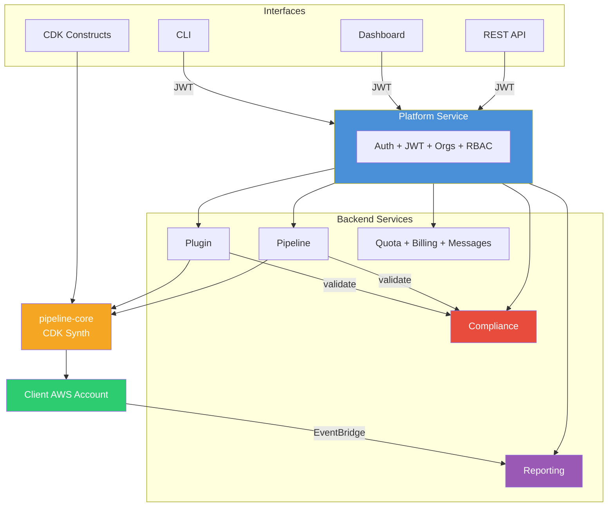

<p align="center">
  <strong>Pipeline Builder</strong><br/>
  <em>Production-ready AWS CodePipelines from TypeScript, CLI, or a single AI prompt.</em>
</p>

<p align="center">
  <a href="LICENSE"></a>
  
  
  
  
</p>

---

Pipeline Builder turns plugin definitions and pipeline configs into fully deployed AWS CodePipeline infrastructure — inside the client's AWS account with zero lock-in.

## Quick Start

```bash
git clone <repo-url> pipeline-builder && cd pipeline-builder
pnpm install && pnpm build

# Launch full local stack (frontend, APIs, databases, observability)
cd deploy/local && chmod +x bin/startup.sh && ./bin/startup.sh
```

Open **https://localhost:8443** — register, create an org, and start building pipelines.

> **Prerequisites:** Node.js >= 24.9, pnpm >= 10.25, Docker

---

## Five Ways to Create a Pipeline

| Method | Example |
|--------|---------|
| **CDK Construct** | `new PipelineBuilder(stack, 'P', { ... })` |
| **CLI** | `pipeline-manager create-pipeline --file props.json` |
| **REST API** | `POST /api/pipelines` |
| **Dashboard** | Point, click, deploy |
| **AI Prompt** | *"Build and deploy a Next.js app from GitHub"* |

---

## Architecture



| Service | Purpose |
|---------|---------|
| **Platform** | Auth, orgs, users, JWT, RBAC — central gateway for all requests |
| **Pipeline** | Pipeline CRUD + AI generation |
| **Plugin** | Plugin CRUD + Docker builds + AI generation |
| **Compliance** | Per-org rule enforcement, policy management, audit trail |
| **Reporting** | Pipeline execution reports + plugin build analytics |
| **Quota** | Resource limits per org |
| **Billing** | Subscriptions and plans |
| **Message** | Org announcements and messaging |

---

## Compliance

Per-organization rule enforcement that restricts available plugins, sets standards, and enforces policies across all pipeline and plugin operations.

**What it does:**
- Validates plugin uploads and pipeline creates against configurable rules
- Blocks non-compliant operations with detailed violation reports
- Supports 18 operators including regex, numeric ranges, set membership, and computed fields (`$count`, `$length`, `$lines`)
- Cross-field rules for conditional checks (e.g., "if pluginType=CodeBuildStep then timeout must be < 900")
- Rule prioritization, effective date scheduling, and org/global scoping

**Benefits:**
- Enforce security standards org-wide (no public plugins, required secrets, banned commands)
- Prevent cost overruns (restrict compute types, limit timeouts)
- Maintain naming conventions and configuration standards
- Pre-flight validation lets developers check compliance before uploading
- Full audit trail of every compliance check (pass, warn, block)

```bash
# Create a rule that blocks plugins without required secrets
curl -X POST https://localhost:8443/api/compliance/rules \
  -H "Authorization: Bearer $TOKEN" -H "x-org-id: my-org" \
  -H "Content-Type: application/json" \
  -d '{"name":"require-secrets","target":"plugin","severity":"error",
       "field":"$count(secrets)","operator":"gte","value":1}'

# Pre-flight check before uploading
curl -X POST https://localhost:8443/api/compliance/validate/plugin/dry-run \
  -H "Authorization: Bearer $TOKEN" -H "x-org-id: my-org" \
  -H "Content-Type: application/json" \
  -d '{"attributes":{"name":"my-plugin","secrets":[]}}'
# → { "blocked": true, "violations": [{ "ruleName": "require-secrets", ... }] }
```

See the full [Compliance Guide](docs/compliance.md).

---

## Reporting

Real-time pipeline execution analytics and plugin build metrics — powered by EventBridge event ingestion and time-series aggregation.

**What it does:**
- Tracks every CodePipeline execution, stage transition, and action outcome
- Records plugin Docker build success/failure rates and durations
- Aggregates metrics over configurable time intervals (hourly, daily, weekly)
- Identifies stage bottlenecks, error patterns, and failure hotspots

**Benefits:**
- Visibility into pipeline health and deployment frequency (DORA metrics)
- Identify slow stages and optimize build times
- Track plugin build reliability across versions
- Spot recurring errors before they become incidents
- Per-org isolation — each organization sees only their own data

**Available reports:**

| Report | Endpoint | Data |
|--------|----------|------|
| Execution count | `GET /reports/execution/count` | Total, succeeded, failed, canceled |
| Success rate | `GET /reports/execution/success-rate` | Time-series pass/fail percentages |
| Average duration | `GET /reports/execution/duration` | Avg, min, max, p95 in ms |
| Stage failures | `GET /reports/execution/stage-failures` | Per-stage failure counts and rates |
| Stage bottlenecks | `GET /reports/execution/bottlenecks` | Per-stage avg/max duration |
| Error patterns | `GET /reports/execution/errors` | Grouped error messages with counts |
| Plugin summary | `GET /reports/plugins/summary` | Total, active, public/private breakdown |
| Build success rate | `GET /reports/plugins/build-success-rate` | Time-series build outcomes |
| Build duration | `GET /reports/plugins/build-duration` | Per-plugin avg/max build times |
| Build errors | `GET /reports/plugins/build-errors` | Per-plugin failure counts |

```bash
# Get pipeline success rate for the last 7 days
curl "https://localhost:8443/api/reports/execution/success-rate?interval=daily&from=2026-03-10" \
  -H "Authorization: Bearer $TOKEN" -H "x-org-id: my-org"

# Find the slowest pipeline stages
curl "https://localhost:8443/api/reports/execution/bottlenecks" \
  -H "Authorization: Bearer $TOKEN" -H "x-org-id: my-org"
```

Reporting requires EventBridge event ingestion. See the [AWS Deployment Guide](docs/aws-deployment.md) for setup.

---

## CDK Construct

```typescript
import { App, Stack } from 'aws-cdk-lib';
import { PipelineBuilder } from '@mwashburn160/pipeline-core';

const app = new App();
const stack = new Stack(app, 'MyPipelineStack', {
  env: { account: '123456789012', region: 'us-east-1' },
});

new PipelineBuilder(stack, 'MyPipeline', {
  project: 'my-app',
  organization: 'my-org',
  synth: {
    source: {
      type: 'github',
      options: { repo: 'my-org/my-app', branch: 'main',
        connectionArn: 'arn:aws:codestar-connections:us-east-1:...:connection/...' },
    },
    plugin: { name: 'cdk-synth', version: '1.0.0' },
  },
  stages: [
    {
      stageName: 'Test',
      steps: [{ name: 'unit-tests', plugin: { name: 'jest', version: '1.0.0' } }],
    },
    {
      stageName: 'Deploy',
      steps: [{ name: 'deploy-prod', plugin: { name: 'cdk-deploy', version: '1.0.0' },
        env: { ENVIRONMENT: 'production' } }],
    },
  ],
});
```

```bash
cdk synth   # preview CloudFormation
cdk deploy  # deploy to AWS
```

---

## IAM Roles

Four role configuration types via `RoleConfig`:

| Type | Use Case |
|------|----------|
| `roleArn` | Existing roles by ARN (`mutable: false` to prevent CDK modification) |
| `roleName` | Existing roles by name |
| `codeBuildDefault` | Auto-created CodeBuild service role |
| `oidc` | Dynamic roles via OIDC federation (GitHub Actions, GitLab CI) |

<details>
<summary>OIDC example (GitHub Actions)</summary>

```typescript
const role: RoleConfig = {
  type: 'oidc',
  options: {
    issuer: 'https://token.actions.githubusercontent.com',
    clientIds: ['sts.amazonaws.com'],
    conditions: {
      'token.actions.githubusercontent.com:sub': 'repo:my-org/my-repo:ref:refs/heads/main',
      'token.actions.githubusercontent.com:aud': 'sts.amazonaws.com',
    },
  },
};
```

</details>

All four work at pipeline level (`BuilderProps.role`). Step-level roles via [metadata keys](docs/metadata-keys.md).

---

## CLI

```bash
npm install -g @mwashburn160/pipeline-manager
export PLATFORM_TOKEN=<jwt-from-login>

# Upload plugin → create pipeline → deploy
pipeline-manager upload-plugin --file ./node-build.zip --organization my-org --name node-build --version 1.0.0
pipeline-manager create-pipeline --file ./pipeline-props.json --project my-app --organization my-org
pipeline-manager deploy --id <pipeline-id> --profile production
```

| Command | Description |
|---------|-------------|
| `upload-plugin --file <zip>` | Upload a plugin ZIP |
| `list-plugins` | List plugins |
| `get-plugin --id <id>` | Get plugin by ID |
| `create-pipeline --file <json>` | Create pipeline from JSON |
| `list-pipelines` | List pipelines |
| `get-pipeline --id <id>` | Get pipeline by ID |
| `deploy --id <id>` | Deploy pipeline to AWS via CDK |
| `store-credentials -e <email> -p <pass>` | Store service credentials in Secrets Manager |
| `setup-events` | Deploy EventBridge reporting infrastructure |
| `bootstrap --account <id> --region <r>` | Bootstrap CDK toolkit stack |
| `version` | Show version info |

Output: `--format table|json|yaml|csv` | File: `--output <path>` | Flags: `--debug` `--verbose` `--quiet`

| Variable | Description | Default |
|----------|-------------|---------|
| `PLATFORM_TOKEN` | **Required.** JWT from login | — |
| `PLATFORM_BASE_URL` | Platform API URL | `https://localhost:8443` |
| `TLS_REJECT_UNAUTHORIZED` | Set `0` for self-signed certs | — |

---

## Dashboard

Next.js frontend at `https://localhost:8443` with pages for pipelines, plugins, compliance, reporting, organizations, users, billing, messages, quotas, settings, tokens, and logs. AI Builder tabs available in pipeline and plugin creation flows. Compliance dashboard provides rule management, violation feeds, and audit trail visibility.

---

## AI Providers

| Provider | Models |
|----------|--------|
| Anthropic | Claude Sonnet 4, Claude Haiku 4.5 |
| OpenAI | GPT-4o, GPT-4o Mini |
| Google | Gemini 2.0 Flash, Gemini 2.5 Pro |
| xAI | Grok 3, Grok 3 Fast, Grok 3 Mini |
| Amazon Bedrock | Claude 3.5 Sonnet, Nova Pro, Nova Lite |

Available when API key is configured. See [environment variables](docs/environment-variables.md).

---

## Local Development

```bash
cd deploy/local
./bin/startup.sh    # generates TLS, creates volumes, starts everything
./bin/shutdown.sh   # tears it down
```

| Service | URL |
|---------|-----|
| Dashboard + API | https://localhost:8443 |
| PgAdmin | http://localhost:5480 |
| Mongo Express | http://localhost:27081 |
| Grafana | http://localhost:3200 |
| Registry UI | http://localhost:5080 |

Databases initialize automatically on first startup.

---

## Deployment

| Target | Command | Best for |
|--------|---------|----------|
| **Local** | `deploy/local/bin/startup.sh` | Development |
| **Minikube** | `kubectl apply -k deploy/minikube/k8s/` | Local Kubernetes |
| **[EC2](docs/aws-deployment.md#ec2)** | `aws cloudformation deploy ...` | Dev/staging (~$30-80/mo) |
| **[Fargate](docs/aws-deployment.md#fargate)** | `bash bin/deploy.sh ...` | Production (~$100-300/mo) |

See the full [AWS Deployment Guide](docs/aws-deployment.md).

---

## Project Structure

```
pipeline-builder/
├── packages/
│   ├── api-core/            # Auth, logging, HTTP client, response utilities
│   ├── pipeline-data/       # Drizzle ORM schemas, CRUD service, reporting service
│   ├── pipeline-core/       # AWS CDK constructs, plugin system, metadata
│   ├── api-server/          # Express factory, SSE, request context
│   ├── ai-core/             # Multi-LLM support (Anthropic, OpenAI, Google, xAI, Bedrock)
│   ├── event-ingestion/     # Lambda handler for EventBridge → reporting API
│   └── pipeline-manager/    # CLI tool
├── api/
│   ├── pipeline/            # Pipeline CRUD + AI generation + registry
│   ├── plugin/              # Plugin CRUD + Docker builds + AI generation
│   ├── compliance/          # Per-org rule enforcement + audit trail
│   ├── reporting/           # Execution reports + build analytics
│   ├── quota/               # Quota enforcement
│   ├── billing/             # Billing management
│   └── message/             # Messaging
├── platform/                # Auth, orgs, users, audit log
├── frontend/                # Next.js dashboard
├── deploy/
│   ├── plugins/             # 125 pre-built plugins
│   ├── local/               # Docker Compose
│   ├── minikube/            # Kubernetes manifests
│   └── aws/ec2/ + fargate/  # AWS CloudFormation
└── docs/
```

**Build order:** api-core → pipeline-data → pipeline-core → api-server → services

---

## Contributing

```bash
# After changing .projenrc.ts:
pnpm dlx projen && pnpm install

# Build and test
pnpm build && pnpm test
```

> Dependencies are managed in `.projenrc.ts`, not `package.json`. Internal deps use `workspace:*`.

| Tool | Version |
|------|---------|
| pnpm | 10.25 |
| Projen | 0.99 |
| Nx | 22 |
| TypeScript | 5.9 |
| Express | 5.2 |
| Drizzle ORM | — |
| AWS CDK | 2.240 |

---

## Docs

- [API Reference](docs/api-reference.md) — endpoints, query params, curl examples
- [Compliance](docs/compliance.md) — per-org rule enforcement, rule engine, validation endpoints
- [Environment Variables](docs/environment-variables.md) — full config reference
- [AWS Deployment](docs/aws-deployment.md) — EC2 and Fargate guides + reporting setup
- [Metadata Keys](docs/metadata-keys.md) — 50+ CodePipeline/CodeBuild config keys
- [Samples](docs/samples.md) — pipeline configs and CDK TypeScript examples
- [Plugin Catalog](docs/plugins/README.md) — 125 pre-built plugins across 10 categories

---

## License

Apache License 2.0 — see [LICENSE](LICENSE).
