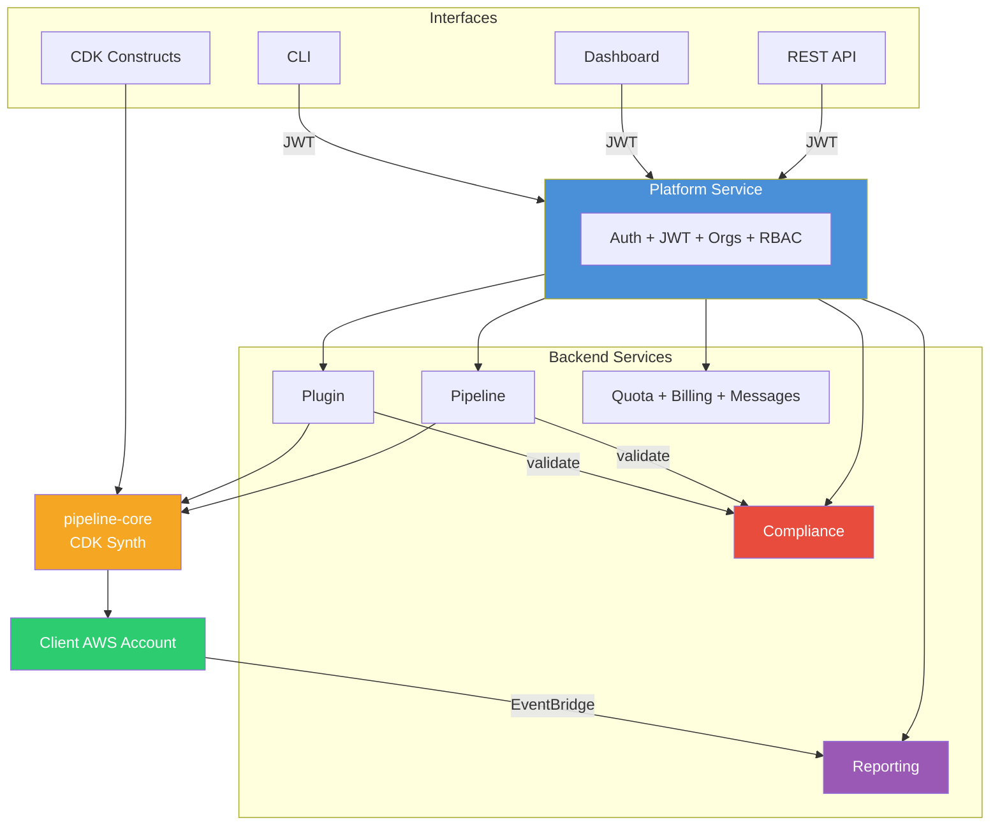

<p align="center">
  <strong>Pipeline Builder</strong><br/>
  <em>Production-ready AWS CodePipelines from TypeScript, CLI, or a single AI prompt.</em>
</p>

<p align="center">
  <a href="LICENSE"></a>
  
  
  
  
</p>

---

Pipeline Builder turns plugin definitions and pipeline configs into fully deployed AWS CodePipeline infrastructure — inside the client's AWS account with zero lock-in.

## Highlights

| Challenge | How Pipeline Builder Solves It |
|-----------|-------------------------------|
| Developers need AWS expertise to set up CI/CD | Self-service pipeline creation via dashboard, CLI, API, or AI prompt |
| No governance over what gets deployed | Per-org compliance rules block non-compliant resources before deployment |
| Build steps are copy-pasted across teams | 125 reusable plugins shared and versioned across projects |
| Multi-team environments lack isolation | Every resource scoped to an organization with RBAC access control |
| Vendor lock-in with CI/CD platforms | Pipelines deploy as native AWS CodePipeline + CodeBuild in the client's own account |
| No visibility into CI/CD costs | Per-org quotas, billing integration, and execution analytics |

---

## Features

### Five Ways to Create Pipelines

| Interface | Description |
|-----------|-------------|
| **Dashboard** | Visual pipeline builder — point, click, deploy |
| **AI Prompt** | Paste a Git URL, get a complete pipeline generated from your repo |
| **CLI** | `pipeline-manager create-pipeline` for scripted workflows and CI integration |
| **REST API** | Full CRUD + AI generation endpoints for programmatic control |
| **CDK Construct** | `PipelineBuilder` construct for infrastructure-as-code |

### AI-Powered Generation

Analyzes a Git repository and generates stages and plugins automatically.

| Provider | Models |
|----------|--------|
| Anthropic | Claude Sonnet 4, Claude Haiku 4.5 |
| OpenAI | GPT-4o, GPT-4o Mini |
| Google | Gemini 2.0 Flash, Gemini 2.5 Pro |
| xAI | Grok 3, Grok 3 Fast, Grok 3 Mini |
| Amazon Bedrock | Claude 3.5 Sonnet, Nova Pro, Nova Lite |

### 125 Pre-Built Plugins

Reusable build steps covering the full CI/CD lifecycle. Every plugin runs as an isolated container step inside AWS CodePipeline.

| Category | Count | Examples |
|----------|-------|---------|
| Language | 11 | Java, Python, Node.js, Go, Rust, .NET, C++, PHP, Ruby |
| Security | 40 | Snyk, SonarCloud, Trivy, Veracode, Semgrep, Checkmarx, Fortify |
| Quality | 17 | ESLint, Prettier, Checkstyle, Clippy, Ruff, ShellCheck |
| Testing | 14 | Jest, Pytest, Cypress, Playwright, k6, Postman, Artillery |
| Artifact & Registry | 16 | Docker, ECR, GHCR, npm, PyPI, Maven, NuGet, Cargo |
| Deploy | 11 | Terraform, CloudFormation, Kubernetes, Helm, Pulumi, ECS, Lambda |
| Infrastructure | 5 | CDK synth/deploy, manual approval, S3 cache |
| Monitoring | 3 | Datadog, New Relic, Sentry |
| Notification | 5 | Slack, Teams, PagerDuty, email, GitHub status |
| AI | 2 | Dockerfile generation (local + cloud) |

### Compliance Engine

Per-organization rule enforcement that validates plugins and pipelines before creation.

- 18 operators — equals, contains, regex, numeric comparison, array count, string length
- Computed fields, cross-field conditions, published rule catalog
- Severity levels — `warning` (non-blocking), `error` / `critical` (blocking)
- Bulk scans, audit trail, 10 sample rules included

### Multi-Tenant Organizations

Every resource — pipelines, plugins, compliance rules, quotas, secrets, billing — scoped to an organization with role-based access (Owner, Admin, Member), feature tiers (Developer, Pro, Unlimited), and per-org quotas.

### Execution Analytics

EventBridge captures CodePipeline and CodeBuild state changes. Reports include execution counts, success rates, duration percentiles, stage failure heatmaps, and error categorization.

---

## Architecture



| Service | Purpose |
|---------|---------|
| **Platform** | Auth, orgs, users, JWT, RBAC — central gateway |
| **Pipeline** | Pipeline CRUD + AI generation + CDK synthesis |
| **Plugin** | Plugin CRUD + Docker image builds + AI generation |
| **Compliance** | Per-org rule enforcement, policy management, audit trail |
| **Reporting** | Execution reports + build analytics via EventBridge |
| **Quota** | Resource limits per org |
| **Billing** | Subscriptions and plans |
| **Message** | Org announcements and messaging |

---

## Quick Start

```bash
git clone <repo-url> pipeline-builder && cd pipeline-builder
pnpm install && pnpm build

cd deploy/local && chmod +x bin/startup.sh && ./bin/startup.sh
```

Open **https://localhost:8443** — register, create an org, and start building pipelines.

> **Prerequisites:** Node.js >= 24.9, pnpm >= 10.25, Docker

---

## Deployment Options

| Target | Best for | Cost |
|--------|----------|------|
| **[Local](deploy/local/)** | Development | Free |
| **[Minikube](deploy/minikube/)** | Local Kubernetes | Free |
| **[EC2](docs/aws-deployment.md#ec2)** | Dev/staging | ~$30-80/mo |
| **[Fargate](docs/aws-deployment.md#fargate)** | Production | ~$100-300/mo |

---

## Documentation

| Document | Description |
|----------|-------------|
| [Getting Started](docs/README.md) | Key concepts, usage guides, operational how-to |
| [API Reference](docs/api-reference.md) | REST endpoints, query params, curl examples |
| [Compliance](docs/compliance.md) | Rule engine, validation, audit trail |
| [Environment Variables](docs/environment-variables.md) | Full config reference for all services |
| [AWS Deployment](docs/aws-deployment.md) | EC2 and Fargate deployment guides |
| [Metadata Keys](docs/metadata-keys.md) | 56 CodePipeline/CodeBuild configuration keys |
| [Samples](docs/samples.md) | Pipeline configs and CDK examples for 7 languages |
| [Plugin Catalog](docs/plugins/README.md) | 125 pre-built plugins across 10 categories |

---

## License

Apache License 2.0 — see [LICENSE](LICENSE).
