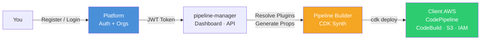
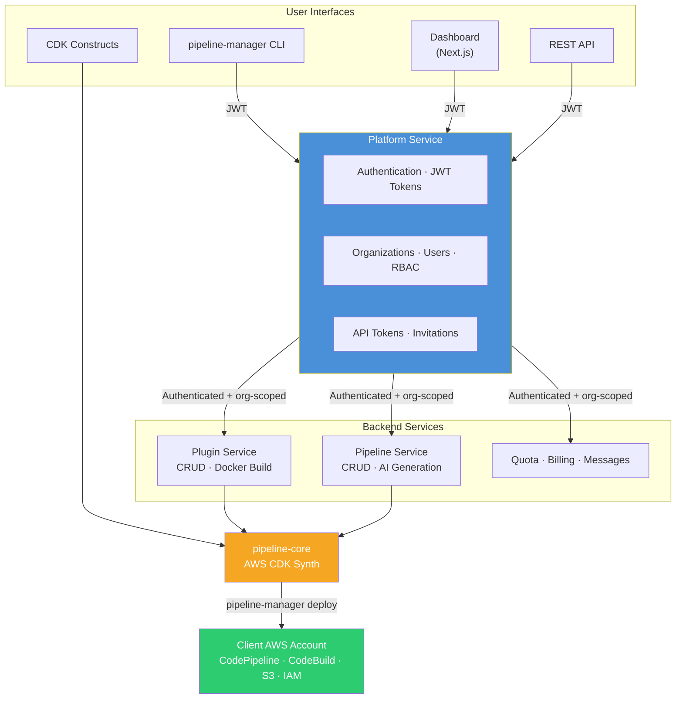
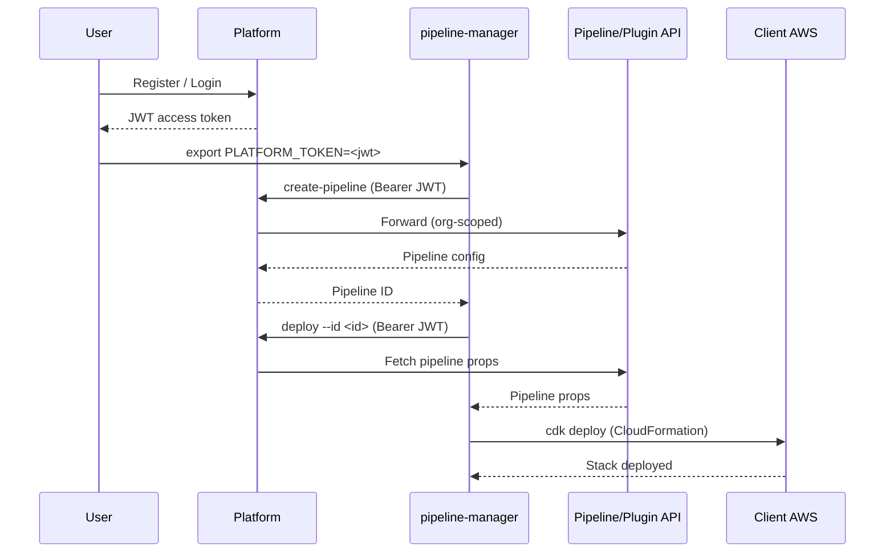
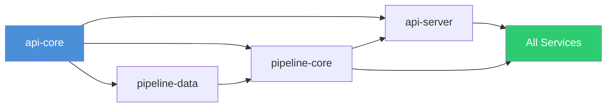

<p align="center">
  <strong>Pipeline Builder</strong><br/>
  <em>Production-ready AWS CodePipelines from TypeScript, CLI, or a single AI prompt.</em>
</p>

<p align="center">
  <a href="LICENSE"></a>
  
  
  
  
</p>

---

Pipeline Builder turns plugin definitions and pipeline configs into fully deployed AWS CodePipeline infrastructure — all inside the client's AWS account with zero lock-in. Define pipelines as CDK constructs, manage them from the CLI or dashboard, or generate them from a natural language prompt.



---

## Quick Start

```bash
git clone <repo-url> pipeline-builder && cd pipeline-builder
pnpm install && pnpm build
```

**Launch the full local stack** (frontend, APIs, databases, observability):

```bash
cd deploy/local && chmod +x bin/startup.sh && ./bin/startup.sh
```

Open **https://localhost:8443** — register an account, create an organization, and you're ready to build pipelines.

**Deploy your first pipeline in under a minute:**

```bash
npm install -g @mwashburn160/pipeline-manager
export PLATFORM_TOKEN=<jwt-from-login>

pipeline-manager create-pipeline --file my-pipeline.json --project my-app --organization my-org
pipeline-manager deploy --id <pipeline-id>
```

> **Prerequisites:** Node.js >= 24.9, pnpm >= 10.25, Docker

---

## Five Ways to Create a Pipeline

| Method | Best for | Example |
|--------|----------|---------|
| **CDK Construct** | Teams embedding pipelines in their own CDK stacks | `new PipelineBuilder(stack, 'P', { ... })` |
| **CLI** | Scripted/automated pipeline creation | `pipeline-manager create-pipeline --file props.json` |
| **REST API** | Integration with other tooling | `POST /api/pipelines` |
| **Dashboard** | Visual creation and management | Point, click, deploy |
| **AI Prompt** | Fastest path from idea to pipeline | *"Build and deploy a Next.js app from GitHub"* |

---

## Why Pipeline Builder

<table>
<tr>
<td width="50%">

### 100% AWS Native

All resources deploy to the client's account. No third-party servers, no data leaving their infrastructure. Generates standard CloudFormation — clients can eject to raw CDK at any time.

</td>
<td width="50%">

### Plugin-First Architecture

Reusable build step definitions (Docker + manifest). Update a plugin version once and it rolls out across every pipeline that references it — across all clients.

</td>
</tr>
<tr>
<td>

### Type-Safe Configuration

Full TypeScript IntelliSense for 50+ metadata keys. Catch misconfigurations at compile time, not after a failed deployment.

```typescript
metadata: {
  [MetadataKeys.COMPUTE_TYPE]: 'BUILD_GENERAL1_LARGE',
  [MetadataKeys.TIMEOUT]: '60',
  [MetadataKeys.VPC_ID]: 'vpc-12345'
}
```

</td>
<td>

### AI-Powered Generation

Describe what you need in plain language. Pipeline Builder generates the complete plugin or pipeline config using Claude, GPT-4o, Gemini, Grok, or Bedrock.

```
POST /api/pipelines/generate
{ "prompt": "CI/CD for a Python FastAPI app
   with unit tests and staging deploy" }
```

</td>
</tr>
</table>

---

## Architecture

### How Everything Connects



### Platform Service — The Auth Gateway

Every API call flows through **Platform**. The Platform service handles user registration, login, JWT issuance, organization management, and role-based access control. When `pipeline-manager` or the dashboard makes a request, Platform validates the JWT, resolves the user's organization, and forwards the request to the appropriate backend service with org-scoped access.



### Services

| Service | Purpose | Relationship to Platform |
|---------|---------|--------------------------|
| **Platform** | Auth, orgs, users, JWT tokens, RBAC | **Central gateway** — all requests authenticate here first |
| **Pipeline** | Pipeline config CRUD + AI generation | Receives org-scoped requests forwarded by Platform |
| **Plugin** | Plugin CRUD, Docker builds, AI generation | Receives org-scoped requests forwarded by Platform |
| **Quota** | Resource limits per organization | Enforces org-level quotas set via Platform |
| **Billing** | Subscription plans and lifecycle | Linked to organizations managed by Platform |
| **Message** | Org-to-org announcements and messaging | Scoped to organizations managed by Platform |

---

## Using the CDK Construct

The core of Pipeline Builder — a CDK construct you drop into any stack:

```typescript
import { App, Stack } from 'aws-cdk-lib';
import { PipelineBuilder } from '@mwashburn160/pipeline-core';

const app = new App();
const stack = new Stack(app, 'MyPipelineStack', {
  env: { account: '123456789012', region: 'us-east-1' }
});

new PipelineBuilder(stack, 'MyPipeline', {
  project: 'my-app',
  organization: 'my-org',
  synth: {
    source: {
      type: 'github',
      options: {
        repo: 'my-org/my-app',
        branch: 'main',
        connectionArn: 'arn:aws:codestar-connections:us-east-1:...:connection/...'
      }
    },
    plugin: { name: 'cdk-synth', version: '1.0.0' }
  },
  stages: [
    {
      stageName: 'Test',
      steps: [{ name: 'unit-tests', plugin: { name: 'jest', version: '1.0.0' } }]
    },
    {
      stageName: 'Deploy',
      steps: [
        {
          name: 'deploy-prod',
          plugin: { name: 'cdk-deploy', version: '1.0.0' },
          env: { ENVIRONMENT: 'production' }
        }
      ]
    }
  ]
});
```

```bash
cdk synth   # preview the CloudFormation
cdk deploy  # deploy the pipeline to AWS
```

---

## Working with Plugins

Plugins are reusable build step definitions — a `manifest.yaml` and `Dockerfile` packaged as a ZIP. Create them once, reference them across pipelines.

### Create a Plugin

<details>
<summary><strong>Inline definition (CDK only)</strong></summary>

```typescript
new PipelineBuilder(stack, 'Pipeline', {
  project: 'api',
  organization: 'acme',
  synth: {
    source: { type: 'github', options: { repo: 'acme/api', branch: 'main' } },
    plugin: {
      name: 'node-build',
      version: '1.0.0',
      pluginType: 'CodeBuildStep',
      commands: ['npm ci', 'npm run build'],
      env: { NODE_ENV: 'production' }
    }
  }
});
```

</details>

<details>
<summary><strong>Upload via CLI</strong></summary>

```bash
pipeline-manager upload-plugin \
  --file ./my-plugin.zip \
  --organization my-org \
  --name node-build \
  --version 1.0.0 \
  --active

# Validate without uploading
pipeline-manager upload-plugin --file ./my-plugin.zip --organization my-org --dry-run
```

</details>

<details>
<summary><strong>Upload via REST API</strong></summary>

```bash
curl -X POST https://localhost:8443/api/plugins \
  -H "Authorization: Bearer $TOKEN" \
  -H "x-org-id: $ORG_ID" \
  -F "plugin=@./my-plugin.zip" \
  -F "accessModifier=private"
```

</details>

<details>
<summary><strong>AI-assisted generation</strong></summary>

Use the **AI Builder** tab in the dashboard, or call the API directly:

```bash
# Step 1: Generate config + Dockerfile
curl -X POST https://localhost:8443/api/plugins/generate \
  -H "Authorization: Bearer $TOKEN" \
  -H "x-org-id: $ORG_ID" \
  -H "Content-Type: application/json" \
  -d '{ "prompt": "A plugin that builds a Go binary and runs golangci-lint" }'

# Step 2: Deploy the generated plugin
curl -X POST https://localhost:8443/api/plugins/deploy-generated \
  -H "Authorization: Bearer $TOKEN" \
  -H "x-org-id: $ORG_ID" \
  -H "Content-Type: application/json" \
  -d '{ ... generated config ... }'
```

</details>

---

## Working with Pipelines

Pipelines define the full CI/CD workflow: source repository, synth step, and build/test/deploy stages. Each stage references plugins for its build steps.

### Create a Pipeline

<details>
<summary><strong>CLI from a JSON file</strong></summary>

```bash
pipeline-manager create-pipeline \
  --file ./pipeline-props.json \
  --project my-app \
  --organization my-org \
  --name my-app-pipeline \
  --access private

# Preview without creating
pipeline-manager create-pipeline --file ./pipeline-props.json --project my-app --organization my-org --dry-run
```

<details>
<summary>Example <code>pipeline-props.json</code></summary>

```json
{
  "project": "my-app",
  "organization": "my-org",
  "synth": {
    "source": {
      "type": "github",
      "options": {
        "repo": "my-org/my-app",
        "branch": "main",
        "connectionArn": "arn:aws:codestar-connections:us-east-1:123456789012:connection/..."
      }
    },
    "plugin": { "name": "cdk-synth", "version": "1.0.0" }
  },
  "stages": [
    {
      "stageName": "Test",
      "steps": [{ "name": "unit-tests", "plugin": { "name": "jest", "version": "1.0.0" } }]
    }
  ]
}
```

</details>
</details>

<details>
<summary><strong>REST API</strong></summary>

```bash
curl -X POST https://localhost:8443/api/pipelines \
  -H "Authorization: Bearer $TOKEN" \
  -H "x-org-id: $ORG_ID" \
  -H "Content-Type: application/json" \
  -d '{
    "project": "my-app",
    "organization": "my-org",
    "pipelineName": "my-app-pipeline",
    "accessModifier": "private",
    "props": {
      "project": "my-app",
      "organization": "my-org",
      "synth": {
        "source": { "type": "github", "options": { "repo": "my-org/my-app", "branch": "main" } },
        "plugin": { "name": "cdk-synth", "version": "1.0.0" }
      }
    }
  }'
```

</details>

<details>
<summary><strong>AI-assisted generation</strong></summary>

```bash
curl -X POST https://localhost:8443/api/pipelines/generate \
  -H "Authorization: Bearer $TOKEN" \
  -H "x-org-id: $ORG_ID" \
  -H "Content-Type: application/json" \
  -d '{
    "prompt": "CI/CD pipeline for a Next.js app with unit tests and production deploy",
    "provider": "anthropic",
    "model": "claude-sonnet-4-20250514"
  }'
```

Review the generated props, then create via `POST /api/pipelines`.

</details>

### Deploy a Pipeline to AWS

```bash
# Deploy a stored pipeline by ID
pipeline-manager deploy --id <pipeline-id>

# Deploy with a specific AWS profile
pipeline-manager deploy --id <pipeline-id> --profile production

# Synth only (generate CloudFormation without deploying)
pipeline-manager deploy --id <pipeline-id> --synth
```

---

## Pipeline Manager CLI

The `pipeline-manager` CLI is the primary tool for managing plugins, pipelines, and deployments from the terminal. It authenticates against the **Platform service** using a JWT token — the same token you get when registering or logging in through the dashboard.

### Setup

```bash
# Install globally
npm install -g @mwashburn160/pipeline-manager

# Authenticate with a token from Platform (register/login at https://localhost:8443)
export PLATFORM_TOKEN=<jwt-from-platform>
```

### End-to-End Workflow

```bash
# 1. Upload a reusable plugin
pipeline-manager upload-plugin --file ./node-build.zip --organization my-org --name node-build --version 1.0.0

# 2. Create a pipeline that references the plugin
pipeline-manager create-pipeline --file ./pipeline-props.json --project my-app --organization my-org

# 3. Deploy to the client's AWS account
pipeline-manager deploy --id <pipeline-id> --profile production
```

Every command communicates with the Platform service, which validates your identity, resolves your organization, and routes the request to the appropriate backend API.

### Command Reference

| Command | Description |
|---------|-------------|
| `upload-plugin --file <zip>` | Upload a plugin ZIP to the platform |
| `list-plugins` | List plugins (with filtering, pagination, sorting) |
| `get-plugin --id <id>` | Get a plugin by ID |
| `create-pipeline --file <json>` | Create a pipeline from a props JSON file |
| `list-pipelines` | List pipelines (with filtering, pagination, sorting) |
| `get-pipeline --id <id>` | Get a pipeline by ID |
| `deploy --id <id>` | Fetch pipeline config from Platform, run `cdk deploy` to AWS |
| `version` | Show version and environment info |

**Output formats:** `--format table|json|yaml|csv` | **Save to file:** `--output <path>`
**Flags:** `--debug` `--verbose` `--quiet` `--no-color`

### Environment Variables

| Variable | Required | Description | Default |
|----------|----------|-------------|---------|
| `PLATFORM_TOKEN` | **Yes** | JWT access token from Platform login | — |
| `PLATFORM_BASE_URL` | No | Platform API base URL | `https://localhost:8443` |
| `CLI_CONFIG_PATH` | No | Path to YAML config file | `../config.yml` |
| `TLS_REJECT_UNAUTHORIZED` | No | Set `0` to skip SSL verification (dev only) | — |

---

## Frontend Dashboard

The Next.js dashboard provides visual management for the full plugin and pipeline lifecycle.

| Page | Path | Description |
|------|------|-------------|
| Pipelines | `/dashboard/pipelines` | Create, edit, delete pipeline configs |
| Plugins | `/dashboard/plugins` | Upload, edit, delete plugins |
| Organizations | `/dashboard/organizations` | Teams and members |
| Users | `/dashboard/users` | User management (admin) |
| Billing | `/dashboard/billing` | Subscription management |
| Messages | `/dashboard/messages` | Announcements inbox |
| Quotas | `/dashboard/quotas` | Resource quota viewer |
| Settings | `/dashboard/settings` | Account preferences |
| Tokens | `/dashboard/tokens` | API token management |
| Logs | `/dashboard/logs` | Activity log viewer |

**AI Builder** tabs are available in both the Create Pipeline and Create Plugin flows.

---

## AI Providers

| Provider | Models |
|----------|--------|
| Anthropic | Claude Sonnet 4, Claude Haiku 4.5 |
| OpenAI | GPT-4o, GPT-4o Mini |
| Google | Gemini 2.0 Flash, Gemini 2.5 Pro |
| xAI | Grok 3, Grok 3 Fast, Grok 3 Mini |
| Amazon Bedrock | Claude 3.5 Sonnet, Nova Pro, Nova Lite |

Providers are available when their API key is configured on the server.

---

## Local Development

### What You Get

| Service | URL |
|---------|-----|
| **Dashboard** | https://localhost:8443 |
| **API Gateway** | https://localhost:8443/api/* |
| **PgAdmin** | http://localhost:5480 |
| **Mongo Express** | http://localhost:27081 |
| **Grafana** | http://localhost:3200 |
| **Registry UI** | http://localhost:5080 |

### Startup / Shutdown

```bash
cd deploy/local
./bin/startup.sh    # generates TLS certs, creates volumes, starts everything
./bin/shutdown.sh   # tears it down
```

### API Routing (NGINX)

| Path | Service |
|------|---------|
| `/api/pipeline/*` | Pipeline service |
| `/api/plugin/*` | Plugin service |
| `/api/quota/*` | Quota service |
| `/api/billing/*` | Billing service |
| `/api/messages/*` | Message service |
| `/auth/*`, `/users/*`, `/organizations/*` | Platform service |

### Key Environment Variables

Set in `deploy/local/.env` before first run:

| Variable | Description | Default |
|----------|-------------|---------|
| `JWT_SECRET` | **Required** — 32+ char base64 secret | — |
| `POSTGRES_PASSWORD` | PostgreSQL password | `password` |
| `MONGO_INITDB_ROOT_PASSWORD` | MongoDB password | `password` |
| `LOG_LEVEL` | Logging verbosity | `info` |
| `QUOTA_DEFAULT_PLUGINS` | Plugin quota per org | `100` |
| `QUOTA_DEFAULT_PIPELINES` | Pipeline quota per org | `10` |
| `BILLING_PROVIDER` | `stub` (local) or `aws-marketplace` (prod) | `stub` |

Databases initialize automatically on first startup — no manual migrations.

### Minikube

```bash
kubectl apply -k deploy/minikube/k8s/
```

Includes all services, databases, and observability (Prometheus, Loki, Grafana) via Kustomize.

### AWS Deployment

Two production-ready AWS deployment options are available. Both use Let's Encrypt for TLS.

| Option | Description | Best for |
|--------|-------------|----------|
| **[EC2 (Minikube)](docs/aws-deployment.md#option-1-ec2-minikube)** | Single hardened EC2 instance running Minikube | Dev/staging, small teams, cost-focused |
| **[Fargate](docs/aws-deployment.md#option-2-fargate)** | Serverless containers on ECS Fargate with ALB | Production, high availability, scaling |

```bash
# EC2: Single CloudFormation stack
cd deploy/aws/ec2
aws cloudformation deploy --stack-name pipeline-builder --template-file template.yaml \
  --parameter-overrides DomainName=pipeline.example.com HostedZoneId=Z123 KeyPairName=my-key GhcrToken=ghp_xxx \
  --capabilities CAPABILITY_IAM

# Fargate: 6 CloudFormation stacks
cd deploy/aws/fargate
bash bin/deploy.sh --domain pipeline.example.com --hosted-zone-id Z123 --ghcr-token ghp_xxx
```

See the full [AWS Deployment Guide](docs/aws-deployment.md) for architecture details, prerequisites, and troubleshooting.

---

## Package Structure

```
pipeline-builder/
├── packages/
│   ├── api-core/            # Auth, logging, HTTP client, response utilities
│   ├── pipeline-data/       # Drizzle ORM schemas, CRUD service base class
│   ├── pipeline-core/       # AWS CDK constructs, plugin system, metadata
│   ├── api-server/          # Express factory, SSE, request context
│   └── pipeline-manager/    # CLI tool
├── api/
│   ├── pipeline/            # Pipeline CRUD + AI generation
│   ├── plugin/              # Plugin CRUD + Docker builds + AI generation
│   ├── quota/               # Quota enforcement
│   ├── billing/             # Billing management
│   └── message/             # Messaging
├── platform/                # Auth, orgs, users
├── frontend/                # Next.js dashboard
├── deploy/
│   ├── plugins/             # 125 pre-built plugins (Dockerfile + manifest.yaml)
│   ├── local/               # Docker Compose
│   ├── minikube/            # Kubernetes manifests
│   └── aws/
│       ├── ec2/             # EC2 + Minikube (CloudFormation)
│       └── fargate/         # ECS Fargate (6 CloudFormation stacks)
└── docs/                    # API reference, metadata keys, AWS deployment guide
```

**Build order** (Nx handles this automatically):



---

## Contributing

| Tool | Version | Purpose |
|------|---------|---------|
| pnpm | 10.25 | Workspace management |
| Projen | 0.99 | Project config as code |
| Nx | 22 | Build orchestration and caching |
| TypeScript | 5.9 | Type-safe codebase |
| Drizzle ORM | — | PostgreSQL access |
| Express | 5.2 | REST APIs |
| Next.js | 16 | Frontend |
| AWS CDK | 2.240 | Infrastructure generation |

### Workflow

```bash
# 1. Make changes in packages/, api/, platform/, or frontend/

# 2. If you changed .projenrc.ts:
pnpm dlx projen && pnpm install

# 3. Build and test
pnpm build && pnpm test
```

> Internal dependencies must use `workspace:*` in `.projenrc.ts` — not pinned versions.
> Dependencies are managed in `.projenrc.ts`, not `package.json`. Run `pnpm dlx projen && pnpm install` after changes.

---

## Plugin Catalog

**125 pre-built plugins** across **10 categories** covering every CI/CD pipeline stage: [docs/plugins/README.md](docs/plugins/README.md).

| Category | Plugins | Doc |
|----------|---------|-----|
| Language | 11 | [language.md](docs/plugins/language.md) |
| Security | 40 | [security.md](docs/plugins/security.md) |
| Quality | 17 | [quality.md](docs/plugins/quality.md) |
| Monitoring | 3 | [monitoring.md](docs/plugins/monitoring.md) |
| Artifact & Registry | 16 | [artifact.md](docs/plugins/artifact.md) |
| Deploy | 11 | [deploy.md](docs/plugins/deploy.md) |
| Infrastructure | 5 | [infrastructure.md](docs/plugins/infrastructure.md) |
| Testing | 14 | [testing.md](docs/plugins/testing.md) |
| Notification | 5 | [notification.md](docs/plugins/notification.md) |
| AI | 2 | [ai.md](docs/plugins/ai.md) |

## Metadata Keys

Pipeline Builder provides 50+ strongly-typed metadata keys for CodePipeline, CodeBuild, and network configuration. See [docs/metadata-keys.md](docs/metadata-keys.md) for the full reference.

## AWS Deployment

Production deployment to AWS via EC2 or Fargate with Let's Encrypt TLS: [docs/aws-deployment.md](docs/aws-deployment.md).

## Environment Variables

Complete reference for all environment variables across every service, package, and deployment target: [docs/environment-variables.md](docs/environment-variables.md).

## API Reference

Full endpoint documentation, query parameters, and curl examples: [docs/api-reference.md](docs/api-reference.md).

All requests require a JWT bearer token and `x-org-id` header.

## Samples

Ready-to-use pipeline configurations and CDK TypeScript examples: [docs/samples.md](docs/samples.md).

| Category | Count | Description |
|----------|-------|-------------|
| Pipeline Samples | 7 | Language-specific CI/CD pipelines (React, Spring Boot, Django, Gin, Axum, Rails, ASP.NET Core) |
| CDK JSON Samples | 4 | Infrastructure patterns (VPC, cross-account, S3 source, multi-region) |
| CDK TypeScript Examples | 6 | Programmatic usage (basic, VPC, multi-account, monorepo, IAM roles, secrets) |

---

## License

Apache License 2.0 — see [LICENSE](LICENSE).
