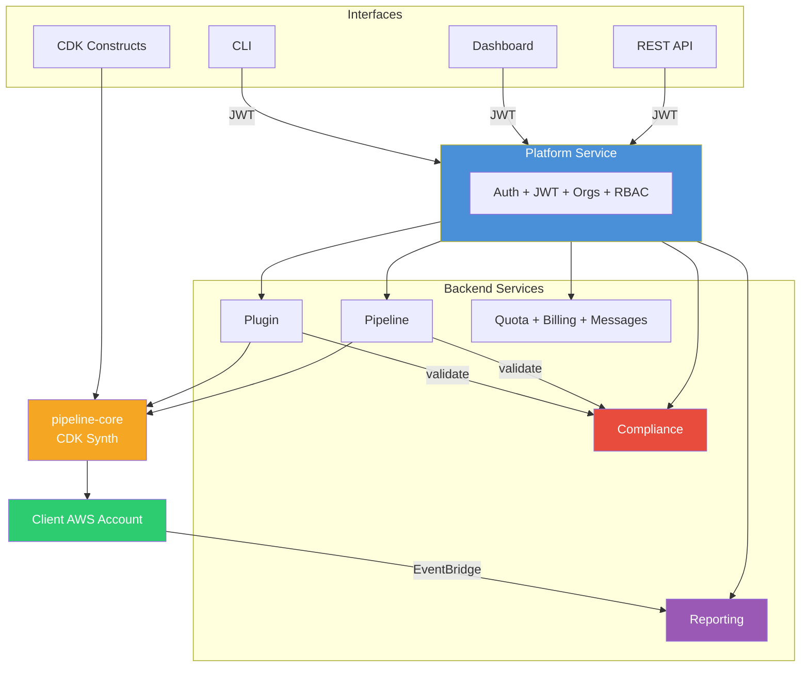

<p align="center">
  <strong>Pipeline Builder</strong><br/>
  <em>Production-ready AWS CodePipelines from TypeScript, CLI, or a single AI prompt.</em>
</p>

<p align="center">
  <a href="LICENSE"></a>
  
  
  
  
</p>

---

Pipeline Builder turns plugin definitions and pipeline configs into fully deployed AWS CodePipeline infrastructure — inside the client's AWS account with zero lock-in.

**Why teams use it:**

- **Self-service CI/CD** — developers create pipelines through a dashboard, CLI, API, or AI prompt without needing AWS expertise
- **Organizational governance** — per-org compliance rules enforce security standards, naming conventions, and resource limits before anything gets deployed
- **Reusable plugins** — 125 pre-built plugins for builds, tests, security scans, deploys, and monitoring; teams share and version plugins across projects
- **Multi-tenant isolation** — every resource is scoped to an organization with RBAC access control
- **No vendor lock-in** — pipelines deploy as native AWS CodePipeline + CodeBuild in the client's own account
- **Cost visibility** — per-org quotas, billing integration, and execution analytics

## Quick Start

```bash
git clone <repo-url> pipeline-builder && cd pipeline-builder
pnpm install && pnpm build

cd deploy/local && chmod +x bin/startup.sh && ./bin/startup.sh
```

Open **https://localhost:8443** — register, create an org, and start building pipelines.

> **Prerequisites:** Node.js >= 24.9, pnpm >= 10.25, Docker

---

## Architecture



| Service | Purpose |
|---------|---------|
| **Platform** | Auth, orgs, users, JWT, RBAC — central gateway |
| **Pipeline** | Pipeline CRUD + AI generation |
| **Plugin** | Plugin CRUD + Docker builds + AI generation |
| **Compliance** | Per-org rule enforcement, policy management, audit trail |
| **Reporting** | Execution reports + build analytics |
| **Quota** | Resource limits per org |
| **Billing** | Subscriptions and plans |
| **Message** | Org announcements and messaging |

---

## Organizations

Organizations are the core isolation boundary. Every resource — pipelines, plugins, compliance rules, quotas, secrets, and billing — is scoped to an organization.

### Creating an Organization

Register an account, then create one or more organizations. The creator becomes the **owner**.

**From the dashboard** — navigate to **Team** and click **Create Organization**. Available to org admins, org owners, and system admins. You can also use the **org switcher** in the sidebar to switch between organizations.

**From the API:**

```bash
curl -X POST https://localhost:8443/api/organization \
  -H "Authorization: Bearer $TOKEN" -H "Content-Type: application/json" \
  -d '{"name":"acme-platform","displayName":"Acme Platform Team"}'
```

### Roles

| Role | Capabilities |
|------|-------------|
| **Owner** | Full control — manage members, transfer ownership, delete org |
| **Admin** | Manage plugins, pipelines, compliance rules, quotas, and invite members |
| **Member** | Create and manage their own pipelines and plugins |

Invite members via email from the dashboard or API. Invitees join with the role specified at invite time. A user can belong to multiple organizations and switch between them.

### Team Structures

Different teams use separate organizations to maintain isolation while sharing the same platform:

| Organization | Team | Purpose |
|-------------|------|---------|
| `acme-platform` | Platform / DevOps | Approved base plugins, org-wide compliance rules, shared pipeline templates |
| `acme-backend` | Backend engineering | Java/Go service pipelines, internal plugins, team-specific quotas |
| `acme-frontend` | Frontend engineering | Node.js/React pipelines, Cypress testing plugins, deploy-to-CDN workflows |
| `acme-data` | Data engineering | Python/Spark pipelines, notebook linting, S3 artifact publishing |
| `acme-security` | Security | Strict compliance rules (required scans, no public plugins), audit trail review |

### What Each Org Controls

- **Plugins** — upload private plugins or use shared public ones; control which versions are available
- **Compliance rules** — enforce security standards, naming conventions, resource limits, and banned commands
- **Quotas** — set limits on pipelines, plugins, and API calls
- **Billing** — per-org subscription plans and usage tracking
- **Secrets** — stored in AWS Secrets Manager under `pipeline-builder/{orgId}/{secretName}`, injected at build time

---

## Creating Pipelines

Five ways to create a pipeline — pick the one that fits your workflow:

| Method | Best for |
|--------|----------|
| **Dashboard** | Visual pipeline creation — point, click, deploy |
| **AI Prompt** | Paste a Git URL, get a complete pipeline generated from your repo |
| **CLI** | Scripted workflows and CI integration |
| **REST API** | Programmatic pipeline management |
| **CDK Construct** | Infrastructure-as-code, version-controlled alongside your app |

### Dashboard and AI

The web UI at `https://localhost:8443` provides visual pipeline and plugin management. The AI builder analyzes a Git repository and generates the right stages and plugins automatically — powered by local (Ollama) or cloud AI providers:

| Provider | Models |
|----------|--------|
| Ollama (local) | Llama 3, Code Llama, Mistral, DeepSeek, Qwen |
| Anthropic | Claude Sonnet 4, Claude Haiku 4.5 |
| OpenAI | GPT-4o, GPT-4o Mini |
| Google | Gemini 2.0 Flash, Gemini 2.5 Pro |
| xAI | Grok 3, Grok 3 Fast, Grok 3 Mini |
| Amazon Bedrock | Claude 3.5 Sonnet, Nova Pro, Nova Lite |

Ollama runs locally with no API key. Cloud providers available when API keys are configured.

### CLI

```bash
npm install -g @mwashburn160/pipeline-manager
export PLATFORM_TOKEN=<jwt-from-login>

pipeline-manager upload-plugin --file ./node-build.zip --organization my-org --name node-build --version 1.0.0
pipeline-manager create-pipeline --file ./pipeline-props.json --project my-app --organization my-org
pipeline-manager deploy --id <pipeline-id> --profile production
```

### CDK Construct

```typescript
import { App, Stack } from 'aws-cdk-lib';
import { PipelineBuilder } from '@mwashburn160/pipeline-core';

const app = new App();
const stack = new Stack(app, 'MyPipelineStack', {
  env: { account: '123456789012', region: 'us-east-1' },
});

new PipelineBuilder(stack, 'MyPipeline', {
  project: 'my-app',
  organization: 'my-org',
  synth: {
    source: {
      type: 'github',
      options: { repo: 'my-org/my-app', branch: 'main',
        connectionArn: 'arn:aws:codestar-connections:us-east-1:...:connection/...' },
    },
    plugin: { name: 'cdk-synth', version: '1.0.0' },
  },
  stages: [
    {
      stageName: 'Test',
      steps: [{ name: 'unit-tests', plugin: { name: 'jest', version: '1.0.0' } }],
    },
    {
      stageName: 'Deploy',
      steps: [{ name: 'deploy-prod', plugin: { name: 'cdk-deploy', version: '1.0.0' },
        env: { ENVIRONMENT: 'production' } }],
    },
  ],
});
```

---

## Deployment

| Target | Best for | Cost |
|--------|----------|------|
| **[Local](deploy/local/)** | Development | Free |
| **[Minikube](deploy/minikube/)** | Local Kubernetes | Free |
| **[EC2](docs/aws-deployment.md#ec2)** | Dev/staging | ~$30-80/mo |
| **[Fargate](docs/aws-deployment.md#fargate)** | Production | ~$100-300/mo |

---

## Documentation

| Document | Description |
|----------|-------------|
| [API Reference](docs/api-reference.md) | REST endpoints, query params, curl examples |
| [Compliance](docs/compliance.md) | Rule engine, validation, audit trail |
| [Environment Variables](docs/environment-variables.md) | Full config reference for all services |
| [AWS Deployment](docs/aws-deployment.md) | EC2 and Fargate deployment guides |
| [Metadata Keys](docs/metadata-keys.md) | 50+ CodePipeline/CodeBuild configuration keys |
| [Samples](docs/samples.md) | Pipeline configs and CDK examples for 7 languages |
| [Plugin Catalog](docs/plugins/README.md) | 125 pre-built plugins across 10 categories |

---

## License

Apache License 2.0 — see [LICENSE](LICENSE).
