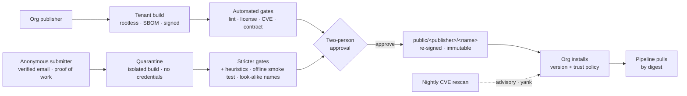
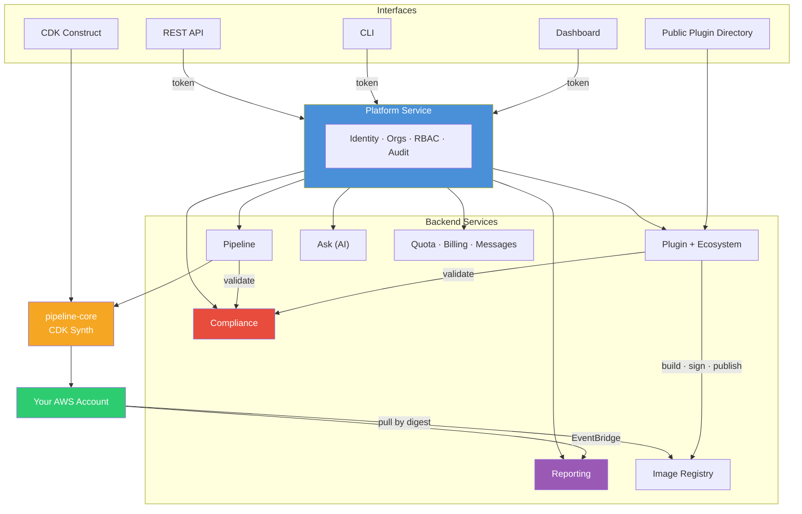

<p align="center">
  <strong>Pipeline Builder</strong><br/>
  <em>Self-service AWS CodePipelines with golden paths for developers and guardrails for platform teams.</em>
</p>

<p align="center">
  <a href="LICENSE"></a>
  
  
  
  
</p>

---

## Overview

Pipeline Builder is a **self-hosted, self-service CI/CD platform for AWS**. Developers get a production-ready AWS CodePipeline in minutes from the dashboard, the CLI, the REST API, a CDK construct, or a single AI prompt. Platform and security teams stay in control through policy-as-code compliance, governed golden-path templates, and a signed, moderated plugin ecosystem.

Every pipeline is synthesized as **native AWS CodePipeline + CodeBuild in your own AWS account**. There is no proprietary runner and no lock-in: if you remove Pipeline Builder, your pipelines keep running.

It is multi-tenant from the ground up. Every pipeline, plugin, secret, quota, log line, and bill belongs to an organization, and organizations can nest teams, bring their own SSO, and see each other only through deliberate, audited sharing.

## Highlights

- **Five ways to build, one set of rules.** The dashboard, AI prompt, CLI, REST API, and CDK construct all go through the same compliance checks, quotas, and audit trail.
- **AI across 5 providers and 14 models.** Generate a whole pipeline from a Git URL or a sentence, or ask the in-app assistant. The assistant can read and propose, but never writes on its own.
- **A plugin ecosystem, not just a catalog.** 119 Official plugins sit in a public, searchable directory, alongside listings from Verified, Community, and Unverified publishers. Orgs install plugins with version and trust policies, and users rate and review them. Every listing and version is approved by two people.
- **Supply chain you can verify.** Every plugin image is built by rootless BuildKit, carries an SBOM, is cosign-signed with its trust tier, and is pinned by digest. A nightly CVE rescan drives security advisories.
- **Plugin quarantine.** Anonymous submissions are optional and off by default. Each one lands in quarantine storage, is built on an isolated BuildKit with no credentials, runs a smoke test with no network, and must pass fail-closed gates (CVE scan, license, lint, malware and credential-access heuristics, look-alike names) plus human moderation before it's listed.
- **Governance before the fact.** 18-operator policy-as-code blocks non-compliant pipelines and plugins at creation (HTTP 403), with curated SOC 2 / PCI / CIS rule libraries available.
- **Modern identity.** Passkeys, TOTP, SSO over OIDC or SAML 2.0, SCIM provisioning, scoped personal access keys, service accounts, and CLI sign-in by device authorization.
- **Evidence by default.** The audit trail is hash-chained, tamper-evident, and verifiable. Each org's logs are isolated as their own Loki tenant. DORA metrics use measured lead times.
- **Runs anywhere you do.** Deploy to a laptop with Docker or minikube, to a single EC2 host, or to EKS Auto Mode. Every target runs the same Istio ambient mesh with strict mTLS.

## At a Glance

| 119 | 5 | 14 | 18 | 4 | 4 |
|:---:|:-:|:--:|:--:|:-:|:-:|
| **Official plugins** in 10 categories | **interfaces** to build pipelines | **AI models** across 5 providers | **compliance operators** | **plugin trust tiers** | **deploy targets**, from laptop to EKS |

## Why Pipeline Builder

| Challenge | How Pipeline Builder solves it |
|-----------|--------------------------------|
| CI/CD setup demands deep AWS expertise | Self-service creation from a dashboard, CLI, API, CDK, or AI prompt; no CDK or buildspec knowledge required |
| Governance happens after the fact | Compliance rules **block** non-compliant pipelines and plugins at creation, with exemptions and a full audit trail |
| Build steps are copy-pasted across teams | Versioned, containerized plugins shared through a governed ecosystem with installs, version policies, and reviews |
| Third-party build steps are a supply-chain risk | Signed, SBOM-attested, digest-pinned images; trust tiers baked into signatures; two-person approval for every public listing |
| Teams share infrastructure without isolation | Everything is scoped per organization, with RBAC, quotas, per-org secrets, per-org log tenants, and row-level security |
| SaaS CI/CD creates lock-in | Pipelines deploy as native AWS resources in your account and keep running without the platform |
| No visibility into delivery health | EventBridge-fed analytics, DORA metrics, maturity scorecards, and plugin health scores |

---

## Capabilities

### Build pipelines five ways

| Interface | Best for | What you do |
|-----------|----------|-------------|
| **Dashboard** | Application developers | Configure sources and stages visually, then deploy |
| **AI prompt** | New repositories | Paste a Git URL; the repo is analyzed and stages and plugins are generated for you |
| **CLI** | Scripting and CI | `pipeline-manager pipeline create` from any shell |
| **REST API** | Platform automation | Full CRUD plus AI generation endpoints |
| **CDK construct** | Infrastructure-as-code teams | Deploy the `PipelineBuilder` construct from any CDK app |

**Golden-path templates.** Platform teams publish governed starters with declared inputs. A developer picks one, sets the project and target repository, and gets a pipeline that still passes compliance and quota checks. Templates can be saved from an existing pipeline, authored from scratch, or imported.

**Synth-time templating.** A small `{{ .. }}` language for pipeline configs and plugin specs is resolved once, at synthesis, with no runtime evaluation and no shell-out. It supports path lookups, `| default:` fallbacks, type coercion, self-references with cycle detection, and plugin contracts (`requiredMetadata`, `metadataTypes`) that are validated at upload. See [Template Syntax](docs/templates.md).

### AI that proposes, you decide

| Provider | Models |
|----------|--------|
| Anthropic | Claude Sonnet 5, Claude Opus 5, Claude Haiku 4.5 |
| OpenAI | GPT-5.6 Sol, GPT-5.6 Terra, GPT-5.6 Luna |
| Google | Gemini 3.7 Flash, Gemini 3.1 Pro |
| xAI | Grok 4.6, Grok 4.5, Grok 4.3 |
| Amazon Bedrock | Claude Sonnet 4.5, Amazon Nova Pro, Amazon Nova Lite |

- **Pipeline generation** from a Git URL or natural language. It draws on the plugins your org can actually use and prefers your own, Official, and Verified plugins.
- **Plugin generation** writes a Dockerfile and spec checked against the same lint rules the catalog enforces.
- **Ask**, an in-app assistant grounded in the docs and your org's data. Its tools can only read or propose. Anything it drafts is created only when you confirm, through your own session.

### Plugin ecosystem

A plugin runs inside CodeBuild with your pipeline's secrets and IAM role, so a shared plugin is a supply-chain dependency. The ecosystem treats it as one. Every public plugin is built by the platform, gated, approved by two people, signed with its trust tier, pinned by digest, and watched for new CVEs after it ships.


```mermaid
flowchart LR
  O["Org publisher"] --> T["Tenant build<br/>rootless · SBOM · signed"]
  A["Anonymous submitter<br/>verified email · proof of work"] --> Q["Quarantine<br/>isolated build · no credentials"]
  T --> G["Automated gates<br/>lint · license · CVE · contract"]
  Q --> H["Stricter gates<br/>+ heuristics · offline smoke test · look-alike names"]
  G --> M{"Two-person<br/>approval"}
  H --> M
  M -->|approve| P["public/&lt;publisher&gt;/&lt;name&gt;<br/>re-signed · immutable"]
  P --> I["Org installs<br/>version + trust policy"]
  I --> R["Pipeline pulls<br/>by digest"]
  S["Nightly CVE rescan"] -.->|advisory · yank| I
```

**Discover**
- **Public directory**: `/plugins` has full-text search, facets, category pages, and a page per plugin with README, versions, SBOM, advisories, reviews, and health. Anyone can browse it without signing in, and sign-in is always one click away.
- **119 Official plugins** in 10 categories (table below), maintained under the `pipeline-builder` publisher and available to every org by default.

**Trust tiers and governance**
- **Four tiers**: **Official**, **Verified** (Team+ publishers with a verified domain and MFA), **Community** (any signed-in org), and **Unverified** (anonymous submissions).
- **Tier in the signature.** The tier and publisher are baked into each image's cosign signature and checked on every lookup. A mismatch fails the step (`409 IMAGE_VERIFICATION_FAILED`).
- **Only the system org approves.** Every new listing and version needs **two-person approval with no self-dealing**, from a dedicated system-org-only **Ecosystem Manager** role at MFA-level assurance. Tenants submit requests; they can't publish directly.
- **Auto-approval**, where configured, applies only to narrow, gate-green updates such as Official patch and minor releases. It is capped and audited.

**Plugin quarantine for anonymous submissions** (optional, off by default)
- **Identity-light, not identity-free.** A submission needs a verified email via a single-use magic link and a **self-hosted proof-of-work** challenge (no third-party captcha, so it works air-gapped). Each email and IP gets at most 3 submissions a day. The email is stored only hashed and encrypted, is never displayed, and is purged 90 days after the decision.
- **Quarantine storage.** The zip lands in a dedicated `plugin-quarantine` bucket with 30-day expiry. The image goes to a `quarantine/<id>` registry namespace that only the plugin service can reach: no tenant, and not even a super admin, can list or pull it.
- **Isolated build pool.** Submissions are built on a **separate BuildKit** that is never the tenant builder. It has no credentials, no service-account token, and no cloud identity. On EKS it runs on its own tainted node pool. Egress is limited to package mirrors and the registry, and the mesh blocks it from reaching every other service.
- **Fail-closed gates**: spec and contract validation, SPDX license, Dockerfile lint, a non-root image, a grype vulnerability threshold, and **heuristics** that look for crypto miners, obfuscated payloads, cloud-credential and metadata-endpoint access, pipe-to-shell installs, and secret-looking defaults. A **smoke test** then runs with no network.
- **Name protection**: reserved names and **confusable look-alikes** of popular plugins are refused.
- **Human moderation.** Moderators see the gate report, every heuristic finding, the SBOM, and a diff against the previous version. Approved submissions are listed as `community/<name>` at the **Unverified** tier. The submitter can later **claim** the listing by creating an account with the same email.

**Supply chain**
- **Rootless BuildKit** runs with no Docker daemon and no socket mount, and every image runs as non-root.
- Every image carries an **SPDX SBOM** and **SLSA provenance**.
- Upload hardening rejects zip bombs, path traversal, and symlink entries.
- **Pinned at request time.** A request pins the digest, so the image that ships is the one that was reviewed.
- On approval, the image is copied into a read-only `public/*` namespace and **re-signed fresh**. Listed versions are **immutable**, and pipelines pull by digest on every run.

**Consume on your terms**
- Orgs **install** listings with semver version policies, choose which trust tiers they allow, block specific listings, and can require **in-org approval** for new installs. Teams inherit their parent's installs.
- Pipelines reference plugins by publisher and version range. Resolution is predictable: your own org, then your parent org, then Official. A same-name shadow comes with a warning.

**Respond fast**
- A **nightly CVE rescan** drafts security advisories when a new critical or high vulnerability hits a listed version, and security fixes get a faster review lane.
- Published advisories notify every installing org, and pipelines **warn or block** per org policy.
- Moderators can **yank** versions or **suspend** listings instantly. Publishers can pause or deprecate their own.

**Quality signals**
- **Reviews and ratings** from signed-in users, with a **verified-use** badge drawn from real runs, moderation, and publisher replies.
- **Health score** from 0 to 100, built from runtime success rate, vulnerabilities, freshness (including base-image age), signing, smoke test, docs, and rating. It is shown in the directory and used to rank AI suggestions.
- **Publisher Insights**: installs, k-anonymous active-org counts, success rate, rating trend, and open reports and advisories.

**Author with confidence**
- `pipeline-manager plugin new | validate | test | publish` scaffolds from base images and runs the server's own lint, template-contract, and heuristic checks locally.
- **Catalog metadata is detected** from the package (spec, README, Dockerfile labels), and you accept or edit each field.
- AI plugin generation flags similar existing plugins to curb duplicates.

| Category | Count | Examples |
|----------|-------|----------|
| Language | 11 | Java, Python, Node.js, Go, Rust, .NET, C++, PHP, Ruby |
| Security | 34 | Snyk, SonarCloud, Trivy, Veracode, Semgrep, Checkmarx, Fortify |
| Quality | 17 | ESLint, Prettier, Checkstyle, Clippy, Ruff, ShellCheck |
| Testing | 14 | Jest, Pytest, Cypress, Playwright, k6, Postman, Artillery |
| Artifact & Registry | 16 | Docker, ECR, GHCR, npm, PyPI, Maven, NuGet, Cargo |
| Deploy | 13 | Terraform, CloudFormation, Kubernetes, Helm, Pulumi, ECS, Lambda, CDK |
| Infrastructure | 5 | CDK synth, manual approval, S3 cache, shell |
| Monitoring | 3 | Datadog, New Relic, Sentry |
| Notification | 5 | Slack, Teams, PagerDuty, email, GitHub status |
| AI | 1 | Dockerfile generation (multi-provider) |

See [Installing Plugins](docs/plugin-installing.md), [Publishing Plugins](docs/plugin-publishing.md), and the [Plugin Catalog](docs/plugins/README.md).

### Policy-as-code compliance

Validate plugins and pipelines **before** they exist, not in a quarterly audit.

- **18 operators**: equality, comparison, contains, set membership, regex, presence, not-empty, count, and length. Computed fields (`$count`, `$length`, `$keys`, `$lines`) and cross-field conditions are also available.
- **Three severities**: `warning` is advisory; `error` and `critical` block creation with HTTP 403.
- **Rule catalog and inheritance.** The system org publishes recommended rules that orgs subscribe to rule by rule. Parent orgs push rules down to their teams.
- **Curated add-ons**: **Standard** covers CI/CD best practices, **Advanced** covers SOC 2 / PCI / CIS, and the **Suite** bundles both. Authoring your own rules stays free.
- **Exemptions, bulk and scheduled scans, and evidence** for audits, plus notifications through the in-app inbox, email, or an HMAC-signed webhook, sent immediately or as digests.

See [Compliance](docs/compliance.md).

### Organizations, access, and identity

- **Organizations and teams.** An organization is the isolation boundary. Teams nest one level under a parent, which is opt-in. Parents administer their teams, and visibility, compliance, pooled quotas, and analytics roll across the hierarchy.
- **RBAC.** Roles are sets of fine-grained `resource:action` permissions. Built-in Admin and Member roles can be extended with custom roles. Reads and writes are both enforced, and privilege changes revoke live sessions.
- **Sign-in.** Email and password (with a breached-password check and org password policies), six social providers, and per-org SSO over **OIDC or SAML 2.0**. SSO supports just-in-time membership, IdP group → role mapping, and **SCIM 2.0** provisioning.
- **Strong authentication.** **Passkeys (WebAuthn)** and **TOTP**, with assurance levels that sensitive admin actions require. Resetting a lost MFA factor needs two people. Impersonation for support requires the user's consent.
- **Machine access.** Personal access keys limited to a subset of your permissions, service accounts, per-service internal keys, ES256-signed tokens published over JWKS, and CLI sign-in by device authorization.
- **Plans and billing.** Four tiers (Developer, Pro, Team, Enterprise) with seat and resource quotas, stackable add-on bundles, coupons and usage credits, and Stripe or AWS Marketplace billing. With billing disabled, everything is unlimited.
- **Isolated secrets.** Each org's secrets live under its own AWS Secrets Manager path. They are injected at build time and never baked into images.

See [Roles & Permissions](docs/permissions.md) and [Authentication & SSO](docs/authentication.md).

### Observe and improve

- **Execution analytics.** CodePipeline and CodeBuild events flow through EventBridge and give success rates, p50/p90/p99 durations, stage failure heatmaps, error categories, and per-org cost attribution. The ingestion Lambda runs in your account and **never forwards your AWS account number or pipeline ARNs**.
- **DORA metrics.** Deployment frequency, change failure rate, MTTR fed by an incident webhook for PagerDuty, Datadog, or Alertmanager, and **measured** commit-to-deploy lead time, with performance bands and trends.
- **Developer portal.** Catalog ownership, a *My Services* view, and a per-pipeline maturity scorecard that grades compliance posture and DORA from A to F.
- **Per-org logs.** A Loki-backed log explorer in which each org is its own tenant, with masking at ingest and permission-gated export.
- **Tamper-evident audit.** Every privileged action goes into a per-tenant hash chain that you can check with `/audit/verify`. A durable spool keeps the security log intact through outages.

### Built for production

- **Zero-trust internals.** Service-to-service calls use short-lived signed tokens and the same auth middleware as user requests. Underneath, an **Istio ambient mesh** enforces STRICT mTLS and identity-based authorization on every target.
- **Data safety.** Postgres enforces row-level security per tenant. Soft-deleted pipelines and plugins can be restored within a retention window, and backups are documented with RPO/RTO targets.
- **Operable.** Every service exposes `/health`, `/ready`, `/warmup`, and `/metrics`. The platform ships with Prometheus, Thanos, Grafana dashboards, Alertmanager rules, Jaeger tracing, and Kiali.
- **Redis high availability** with Sentinel on the AWS targets, and graceful degradation when a dependency is down.

---

## Architecture


```mermaid
flowchart TB
    subgraph Interfaces
        DASH["Dashboard"] & CLI["CLI"] & API["REST API"] & CDK["CDK Construct"] & DIR["Public Plugin Directory"]
    end

    subgraph Platform["Platform Service"]
        AUTH["Identity · Orgs · RBAC · Audit"]
    end

    subgraph Backend["Backend Services"]
        PIPELINE["Pipeline"] & PLUGIN["Plugin + Ecosystem"]
        COMPLIANCE["Compliance"]
        REPORTING["Reporting"]
        REGISTRY["Image Registry"]
        ASK["Ask (AI)"]
        SUPPORT["Quota · Billing · Messages"]
    end

    CORE["pipeline-core<br/>CDK Synth"]
    AWS["Your AWS Account"]

    DASH & CLI & API -->|token| Platform
    DIR --> PLUGIN
    CDK --> CORE
    Platform --> PIPELINE & PLUGIN & COMPLIANCE & REPORTING & ASK & SUPPORT
    PLUGIN & PIPELINE -->|validate| COMPLIANCE
    PLUGIN -->|build · sign · publish| REGISTRY
    PIPELINE --> CORE
    CORE --> AWS
    AWS -->|pull by digest| REGISTRY
    AWS -->|EventBridge| REPORTING

    style Platform fill:#4A90D9,color:#fff
    style CORE fill:#F5A623,color:#fff
    style AWS fill:#2ECC71,color:#fff
    style COMPLIANCE fill:#E74C3C,color:#fff
    style REPORTING fill:#9B59B6,color:#fff
```

| Service | Purpose |
|---------|---------|
| **Platform** | Identity (passwords, OAuth, SSO, passkeys, TOTP, SCIM), organizations and teams, RBAC, audit trail, log access |
| **Pipeline** | Pipeline CRUD, AI generation, templates, CDK synthesis |
| **Plugin** | Plugin builds (rootless BuildKit), the plugin ecosystem (publishers, listings, installs, reviews, advisories, public directory), AI plugin generation |
| **Image Registry** | Plugin images with token auth, signing and SBOM attestation, per-org storage quotas, garbage collection |
| **Compliance** | Per-org rule enforcement, rule catalog and subscriptions, scans, exemptions |
| **Reporting** | Execution analytics, DORA metrics, incidents, via EventBridge |
| **Ask** | Grounded in-app AI assistant (read and propose only) |
| **Quota / Billing / Message** | Resource limits pooled across teams, subscriptions and bundles, announcements, conversations, and attachments |

For end-to-end flows (plugin build, publish, pipeline create, synth, execution), see [Architecture Flow](docs/architecture-flow.md). For the business case, see [Organization Benefits](docs/organization-benefits.md).

---

## Quick Start

**Recommended: install with the CLI.** `pipeline-manager infra provision` picks the target and checks prerequisites. It can fetch missing single-binary tools (`yq`, `kubectl`, `minikube`), generate the local `.env` with secrets, and build the exact, validated command to run. With an AI key set, it can also parse a natural-language goal and diagnose failures.

```bash
npm install -g @pipeline-builder/pipeline-manager
pipeline-manager infra provision --target docker              # show the plan, then ask to confirm
pipeline-manager infra provision --target docker --yes        # non-interactive (for CI)
pipeline-manager infra provision --target docker --json       # print the plan as JSON, run nothing
# or describe the goal: pipeline-manager infra provision --prompt "deploy to EKS in us-east-1 with email"
```

> **`--init <mode>`** controls post-deploy initialization. The default, **`auto`**, has the deploy initialize the platform itself: on EC2 at first boot, on EKS in `setup.sh`'s final phase, and on `local`/`minikube` through `infra provision`. Use **`--init manual`** to run `init-platform` yourself (for example, to set real admin credentials) or **`--init skip`** to do nothing. See the [AWS deployment guide](docs/aws-deployment.md#ai-assisted-install-infra-provision).

Prefer to run it directly? Every target ships a `bin/setup.sh`:

```bash
git clone https://github.com/mwashburn160/pipeline-builder.git && cd pipeline-builder

(cd deploy/local/docker && ./bin/setup.sh)     # 1. pull images and start the stack
./deploy/bin/init-platform.sh docker           # 2. register the admin and load plugins
```

> **Minikube instead of Docker?** Run `(cd deploy/local/minikube && ./bin/setup.sh)`, then `./deploy/bin/init-platform.sh minikube`. On an ~8-core laptop use **`LEAN=1`**, because the full stack plus the Istio mesh won't fit in 8 vCPU. LEAN drops the optional observability and admin services and runs single replicas. For more disk, use **`DISK_SIZE=60g`** (default 30g; applies only when the cluster is created). For a clean restart, run `minikube delete --profile=pipeline-builder`.

Then open **https://localhost:8443** and sign in as the default local admin, `admin@internal` / `Pipeline-Builder-Dev-2026!`. **Change this password immediately** on any environment reachable beyond your laptop.

> The first load uses a **self-signed certificate**. If the page is blank with `ERR_CERT_AUTHORITY_INVALID` errors for JS chunks, trust `deploy/local/docker/certs/nginx-tls.crt` (see [Troubleshooting](deploy/local/docker/README.md#troubleshooting)).
>
> **Prerequisites:** Docker only. The local stack pulls prebuilt public images, so no registry login is needed. Node.js >= 24.14 and pnpm >= 10.33 are needed only to build from source or use the CLI.

---

## Deployment Options

| Target | Best for | Cost |
|--------|----------|------|
| **[Local (Docker Compose)](deploy/local/docker/)** | Development | Free |
| **[Minikube](deploy/local/minikube/)** | Local Kubernetes | Free |
| **[EC2](docs/aws-deployment.md#ec2)** | Dev / staging | ~$140–265/mo |
| **[EKS (Auto Mode)](docs/aws-deployment.md#eks)** | Production | ~$150–400/mo |

---

## Development

Building from source (not needed just to *run* the platform):

```bash
pnpm install          # Node.js >= 24.14, pnpm >= 10.33
pnpm build            # compile, test, and lint every package
```

| Path | Contains |
|------|----------|
| `packages/` | Shared libraries: `api-core`, `api-server`, `ai-core`, `pipeline-data`, `pipeline-core`, `pipeline-events`, `pipeline-manager` (the CLI) |
| `api/` | Backend services: pipeline, plugin, image-registry, compliance, reporting, ask, quota, billing, message |
| `platform/` | Identity, organizations, users, audit, and the observability proxy |
| `frontend/` | Next.js dashboard and public plugin directory |
| `deploy/` | Per-target install (`local/docker`, `local/minikube`, `aws/ec2`, `aws/eks`) and the plugin catalog (`deploy/plugins`) |
| `docs/` | Documentation |

> **This repo is [projen](https://projen.io)-managed.** `package.json`, `tsconfig.json`, and the CI workflows are **generated**. Edit `.projenrc.ts` / `projenrc/` and re-run `pnpm dlx projen`, or your change is overwritten on the next synth.

---

## Documentation

The full docs hub is **[docs/](docs/README.md)**, grouped by task. For a term, see the **[Content Index](docs/content-index.md)** (A–Z).

### Start here

| Document | Description |
|----------|-------------|
| [Onboarding a New Organization](docs/onboarding.md) | First admin: login → org → members → access key → `store-token` → `setup-events` → first pipeline |
| [Pipeline Manager CLI](docs/pipeline-manager.md) | Provision the platform, build and deploy pipelines, author plugins, run audits |
| [AWS Deployment](docs/aws-deployment.md) | Deploy to EC2 or EKS: modes, post-deploy setup, reporting, teardown |

### Build

| Document | Description |
|----------|-------------|
| [Developer Guide](docs/developer-guide.md) | Five ways to create a pipeline, plus cut-and-paste patterns for 7 languages |
| [CDK Usage](docs/cdk-usage.md) | `PipelineBuilder` construct: sources, stages, VPC, IAM, secrets |
| [Template Syntax](docs/templates.md) | `{{ .. }}` synth-time interpolation and golden-path templates |
| [Metadata Keys](docs/metadata-keys.md) | Typed CodePipeline, CodeBuild, networking, and IAM configuration keys |
| [Plugin Catalog](docs/plugins/README.md) | 119 Official plugins across 10 categories |
| [Installing Plugins](docs/plugin-installing.md) | Trust tiers, installs, version policies, consumption policy, reviews |
| [Publishing Plugins](docs/plugin-publishing.md) | Publisher profiles, publish requests, catalog metadata, pausing |
| [Developer Portal](docs/developer-portal.md) | Catalog ownership, My Services, golden-path templates, maturity scorecards |
| [Samples](docs/samples.md) | Ready-to-load pipeline templates for 7 languages, plus CDK patterns |

### Govern

| Document | Description |
|----------|-------------|
| [Organization Benefits](docs/organization-benefits.md) | What orgs gain from standardizing on the platform |
| [Roles & Permissions](docs/permissions.md) | Permission catalog, built-in roles, assurance tiers, session invalidation, impersonation |
| [Compliance](docs/compliance.md) | Per-org rule engine: validation, enforcement, add-ons, audit trail |
| [Authentication & SSO](docs/authentication.md) | Passwords, OAuth, OIDC and SAML SSO, SCIM, passkeys, TOTP, device sign-in |
| [Audit Events](docs/audit-events.md) | Hash-chained trail, `/audit/verify`, action catalog |
| [Logs](docs/observability-logs.md) | Per-org application logs: search, masking, export |
| [Billing Providers](docs/billing-providers.md) | Stripe and AWS Marketplace setup |
| [Billing Add-on Bundles](docs/billing-bundles.md) | Stackable add-ons that raise pooled caps and unlock features |
| [Billing Discounts](docs/billing-discounts.md) | Coupon codes and usage credits |

### Operate

| Document | Description |
|----------|-------------|
| [Deploy Operations](docs/deploy-operations.md) | Preflight, secret rotation, backups and DR, teardown |
| [Service Mesh](docs/service-mesh.md) | Istio ambient: STRICT mTLS and identity-based authorization |
| [Environment Variables](docs/environment-variables.md) | Every configuration variable, by subsystem |
| [Notifications](docs/notifications.md) | Email, Slack, webhooks and the in-app inbox — what an operator enables, what an org configures |
| [DORA Metrics](docs/dora-metrics.md) | Deployment frequency, change failure rate, MTTR, measured lead time |
| [Incident Webhook](docs/incidents-webhook.md) | Connect PagerDuty, Datadog, or Alertmanager for change failure rate and MTTR |

### Reference

| Document | Description |
|----------|-------------|
| [API Reference](docs/api-reference.md) | REST endpoints, query parameters, curl examples |
| [Architecture Flow](docs/architecture-flow.md) | End-to-end flow diagrams (request → build → deploy) |
| [Error Handling](docs/error-handling.md) | Error-to-HTTP convention |

---

## License

Apache License 2.0. See [LICENSE](LICENSE).
