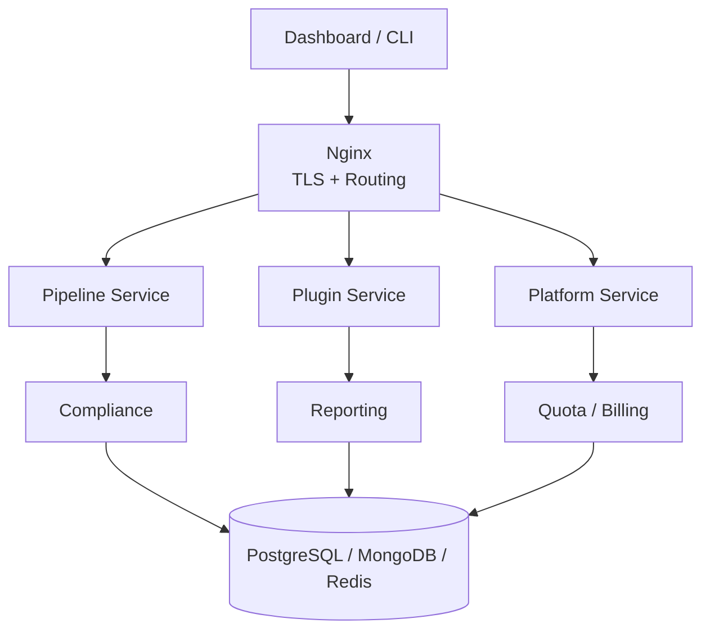

# Documentation

Operational guides, usage how-to's, and detailed reference for Pipeline Builder.

## Getting Started

1. **Deploy** — choose [Local](../deploy/local/), [Minikube](../deploy/minikube/), [EC2, or Fargate](aws-deployment.md)
2. **Register** — create an admin user and organization
3. **Load plugins** — upload from `deploy/plugins/` or create your own
4. **Build pipelines** — use the dashboard, CLI, API, or AI prompt

---

## Key Concepts

- **Pipeline** — CI/CD definition composed of stages, each referencing plugins. Synthesized into AWS CDK stacks at deploy time.
- **Plugin** — Reusable build step packaged as a Dockerfile + plugin-spec.yaml. Runs as an isolated CodeBuild action inside CodePipeline. Supports `build_image` (build at upload) or `prebuilt` (pre-built image.tar bundled in zip).
- **Organization** — Multi-tenant isolation boundary. All resources are scoped to an org with RBAC access control.
- **Compliance Rule** — Configurable constraint that validates plugins and pipelines before creation. Supports 18 operators, computed fields, and cross-field checks.
- **Metadata Keys** — Typed configuration keys controlling CodePipeline and CodeBuild behavior (IAM, networking, compute). See [Metadata Keys](metadata-keys.md).
- **Secrets** — Plugin credentials stored in AWS Secrets Manager under `pipeline-builder/{orgId}/{secretName}`. Injected at build time, never stored in images.

---

## Guides

| Document | Description |
|----------|-------------|
| [API Reference](api-reference.md) | REST endpoints for pipelines, plugins, compliance, reporting, and AI generation |
| [Compliance](compliance.md) | Per-org rule engine with 18 operators, computed fields, audit trail |
| [Environment Variables](environment-variables.md) | Configuration reference for all services |
| [AWS Deployment](aws-deployment.md) | EC2 and Fargate deployment with post-deploy setup |
| [Metadata Keys](metadata-keys.md) | 56 CodePipeline/CodeBuild configuration keys |
| [CDK Usage](cdk-usage.md) | PipelineBuilder construct, sources, stages, VPC, IAM, secrets |
| [Template Syntax](templates.md) | `{{ ... }}` interpolation for pipeline configs and plugin specs |
| [Samples](samples.md) | Pipeline configs for 7 languages and CDK patterns |
| [Plugin Catalog](plugins/README.md) | 124 pre-built plugins across 10 categories |

---

## Organizations

Organizations are the core isolation boundary. Every resource — pipelines, plugins, compliance rules, quotas, secrets, and billing — is scoped to an organization.

### Creating an Organization

Register an account, then create one or more organizations. The creator becomes the **owner**.

**From the dashboard** — navigate to **Team** and click **Create Organization**.

**From the API:**

```bash
curl -X POST https://localhost:8443/api/organization \
  -H "Authorization: Bearer $TOKEN" -H "Content-Type: application/json" \
  -d '{"name":"acme-platform","displayName":"Acme Platform Team"}'
```

### Roles

| Role | Capabilities |
|------|-------------|
| **Owner** | Full control — manage members, transfer ownership, delete org |
| **Admin** | Manage plugins, pipelines, compliance rules, quotas, and invite members |
| **Member** | Create and manage their own pipelines and plugins |

Invite members via email from the dashboard or API. A user can belong to multiple organizations.

### Feature Tiers

| Feature | Developer | Pro | Unlimited |
|---------|-----------|-----|-----------|
| Pipeline / plugin CRUD | yes | yes | yes |
| AI pipeline generation | - | yes | yes |
| AI plugin generation | - | yes | yes |
| Bulk operations | - | yes | yes |
| Audit log | - | - | yes |
| Custom integrations | - | - | yes |
| Priority support | - | yes | yes |

System org users always have access to all features.

### What Each Org Controls

- **Plugins** — upload private plugins or use shared public ones; control which versions are available
- **Compliance rules** — enforce security standards, naming conventions, resource limits
- **Quotas** — set limits on pipelines, plugins, and API calls
- **Billing** — per-org subscription plans and usage tracking
- **Secrets** — stored in AWS Secrets Manager, injected at build time

---

## Creating Pipelines

### Dashboard and AI

The web UI at `https://localhost:8443` provides visual pipeline and plugin management. The AI builder analyzes a Git repository and generates the right stages and plugins automatically.

### CLI

```bash
npm install -g @pipeline-builder/pipeline-manager
export PLATFORM_TOKEN=<jwt-from-login>

pipeline-manager upload-plugin --file ./node-build.zip --organization my-org --name node-build --version 1.0.0
pipeline-manager create-pipeline --file ./pipeline-props.json --project my-app --organization my-org
pipeline-manager deploy --id <pipeline-id> --profile production
```

### REST API

```bash
# Create a pipeline
curl -X POST https://localhost:8443/api/pipelines \
  -H "Authorization: Bearer $TOKEN" -H "x-org-id: $ORG_ID" \
  -H "Content-Type: application/json" \
  -d '{
    "project": "my-app",
    "organization": "my-org",
    "pipelineName": "my-app-pipeline",
    "accessModifier": "private",
    "props": {
      "project": "my-app",
      "organization": "my-org",
      "synth": {
        "source": { "type": "github", "options": { "repo": "my-org/my-app", "branch": "main" } },
        "plugin": { "name": "cdk-synth", "version": "1.0.0" }
      }
    }
  }'

# AI-generate a pipeline
curl -X POST https://localhost:8443/api/pipelines/generate \
  -H "Authorization: Bearer $TOKEN" -H "x-org-id: $ORG_ID" \
  -H "Content-Type: application/json" \
  -d '{"prompt": "Build a Node.js app from GitHub, run tests, and deploy with CDK", "provider": "anthropic", "model": "claude-sonnet-4"}'
```

See the [API Reference](api-reference.md) for the full endpoint list.

### CDK Construct

```typescript
import { App, Stack } from 'aws-cdk-lib';
import { PipelineBuilder } from '@mwashburn160/pipeline-core';

const app = new App();
const stack = new Stack(app, 'MyPipelineStack', {
  env: { account: '123456789012', region: 'us-east-1' },
});

new PipelineBuilder(stack, 'MyPipeline', {
  project: 'my-app',
  organization: 'my-org',
  synth: {
    source: {
      type: 'github',
      options: { repo: 'my-org/my-app', branch: 'main',
        connectionArn: 'arn:aws:codestar-connections:us-east-1:...:connection/...' },
    },
    plugin: { name: 'cdk-synth', version: '1.0.0' },
  },
  stages: [
    { stageName: 'Test', steps: [{ name: 'unit-tests', plugin: { name: 'jest', version: '1.0.0' } }] },
    { stageName: 'Deploy', steps: [{ name: 'deploy-prod', plugin: { name: 'cdk-deploy', version: '1.0.0' }, env: { ENVIRONMENT: 'production' } }] },
  ],
});
```

See [Samples](samples.md) for more CDK patterns.

---

## Start / Stop

### Local (Docker Compose)

```bash
cd deploy/local && ./bin/startup.sh        # Start
cd deploy/local && docker compose down     # Stop
cd deploy/local && docker compose down -v  # Stop + remove volumes
```

### Minikube

```bash
bash deploy/minikube/bin/startup.sh        # Start
bash deploy/minikube/bin/shutdown.sh       # Stop
kubectl get pods -n pipeline-builder       # Check
```

### AWS EC2

```bash
sudo bash /opt/pipeline-builder/deploy/aws/ec2/bin/startup.sh    # Start
sudo bash /opt/pipeline-builder/deploy/aws/ec2/bin/shutdown.sh   # Stop
sudo -u minikube kubectl get pods -n pipeline-builder             # Check
```

### AWS Fargate

```bash
cd deploy/aws/fargate
bash bin/deploy.sh --stack-prefix pb --region us-east-1 --domain app.example.com  # Deploy
bash bin/teardown.sh --stack-prefix pb --region us-east-1                          # Teardown
```

See [AWS Deployment](aws-deployment.md) for full instructions and post-deploy setup.

### Post-Deploy: Initialize Platform

After starting any target, run `init-platform.sh` to register the admin user and load plugins:

```bash
# Local / Minikube — interactive
./deploy/bin/init-platform.sh local
./deploy/bin/init-platform.sh minikube

# EC2 — requires minikube user context
sudo -u minikube PLATFORM_BASE_URL=https://your-ip bash /opt/pipeline-builder/deploy/bin/init-platform.sh ec2

# Non-interactive with prebuilt images and controlled parallelism
PLUGIN_BUILD_STRATEGY=prebuilt PARALLEL_JOBS=2 ./deploy/bin/init-platform.sh local
```

Key env vars: `PLUGIN_BUILD_STRATEGY` (`build_image`/`prebuilt`), `PLUGIN_CATEGORY` (comma-separated filter), `PARALLEL_JOBS` (upload concurrency, auto-lowered to 1 for prebuilt), `FORCE_REBUILD` (rebuild existing image.tar files).

---

## Architecture



| Service | Purpose |
|---------|---------|
| **Platform** | Auth, orgs, users, JWT, RBAC |
| **Pipeline** | Pipeline CRUD, AI generation, CDK synthesis |
| **Plugin** | Plugin CRUD, Docker image builds, AI generation |
| **Compliance** | Per-org rule enforcement, policy management, audit trail |
| **Reporting** | Execution analytics via EventBridge ingestion |
| **Quota** | Resource limits per organization |
| **Billing** | Subscriptions and usage billing |
| **Message** | Org announcements and conversations |

---

## Plugin Categories

124 plugins across 10 categories. See the [Plugin Catalog](plugins/README.md) for the full list.

| Category | Count | Details |
|----------|-------|---------|
| [Language](plugins/language.md) | 11 | Java, Python, Node.js, Go, Rust, .NET |
| [Security](plugins/security.md) | 40 | Snyk, SonarCloud, Trivy, Veracode, Semgrep |
| [Quality](plugins/quality.md) | 17 | ESLint, Prettier, Checkstyle, Clippy, Ruff |
| [Testing](plugins/testing.md) | 14 | Jest, Pytest, Cypress, Playwright, k6 |
| [Artifact](plugins/artifact.md) | 16 | Docker, ECR, GHCR, npm, PyPI, Maven |
| [Deploy](plugins/deploy.md) | 13 | Terraform, CloudFormation, Kubernetes, Helm, CDK |
| [Infrastructure](plugins/infrastructure.md) | 4 | CDK synth, manual approval, S3 cache |
| [Monitoring](plugins/monitoring.md) | 3 | Datadog, New Relic, Sentry |
| [Notification](plugins/notification.md) | 5 | Slack, Teams, PagerDuty, email |
| [AI](plugins/ai.md) | 1 | Dockerfile generation (multi-provider) |
