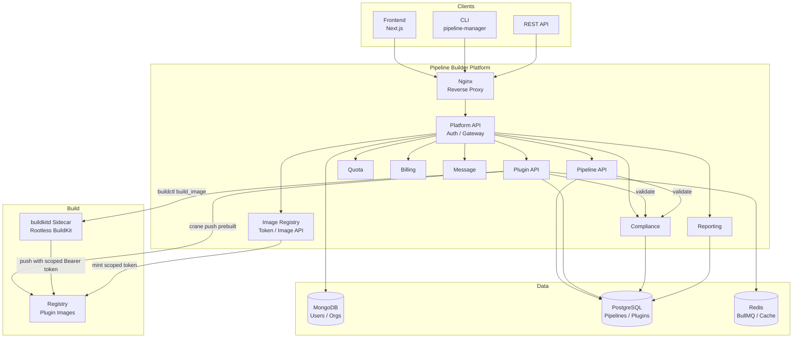
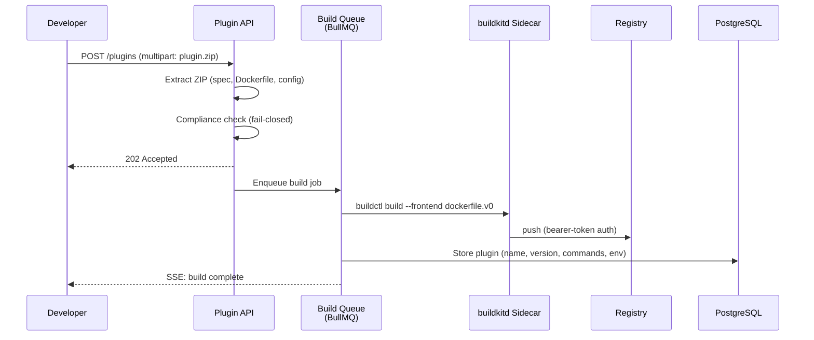
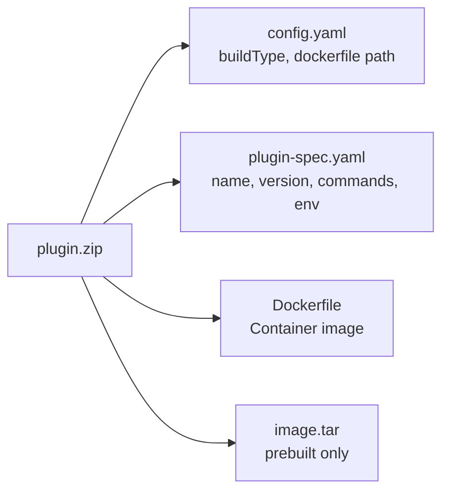
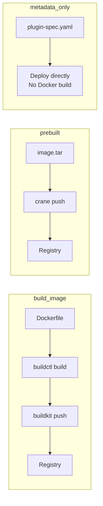
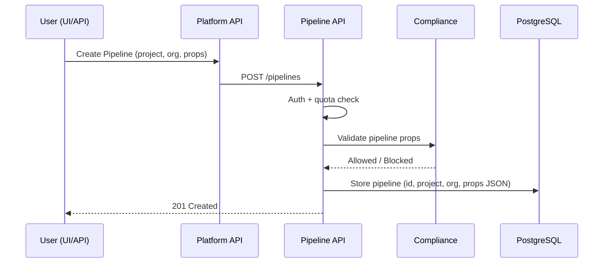
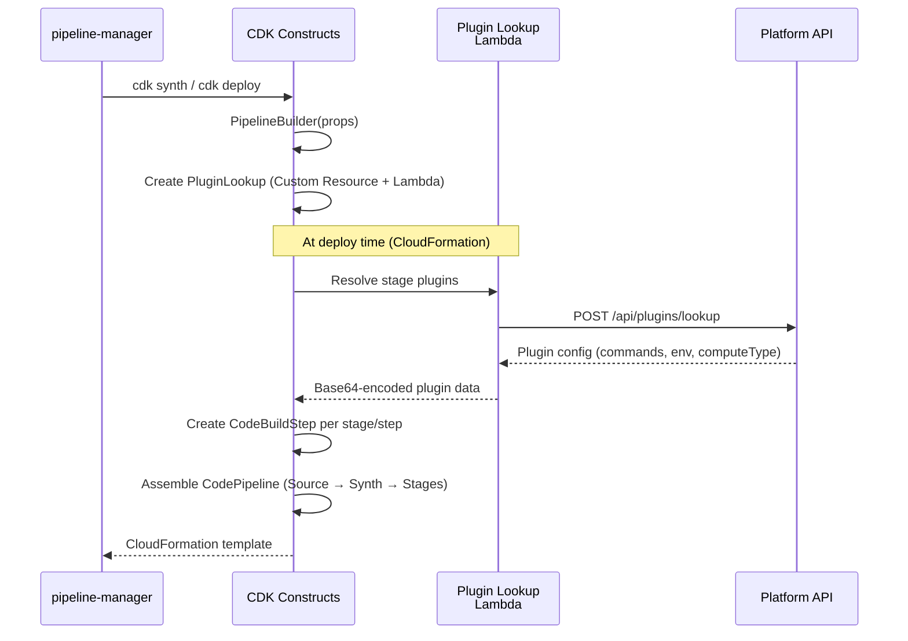
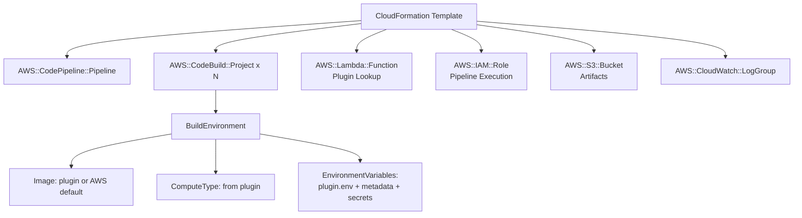
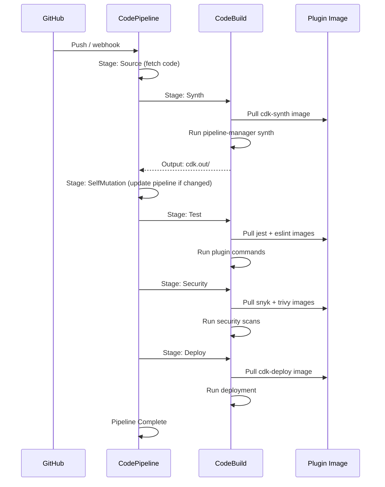
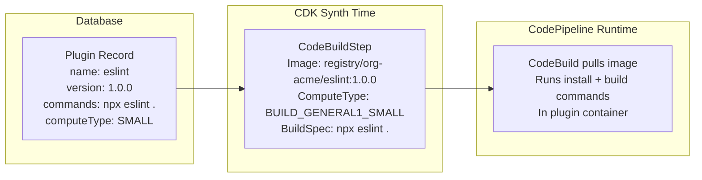
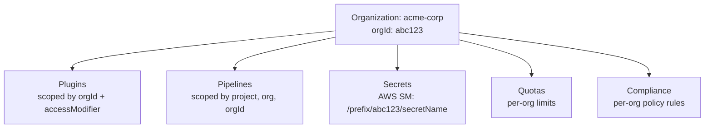

# Pipeline Builder - Architecture Flow

## Overview

Pipeline Builder is a multi-team platform for creating AWS CodePipeline CI/CD pipelines using reusable, containerized plugins. Users define pipelines through the UI/API, and the system synthesizes them into CloudFormation templates via AWS CDK. It ships with 119 ready-to-use plugins spanning build, test, security, quality, monitoring, and infrastructure, and can also generate new plugins and pipelines from natural-language prompts via pluggable AI providers (Anthropic, OpenAI, Amazon Bedrock).

---

## System Architecture



---

## Flow 1: Plugin Upload & Build

Plugins are containerized build tools (e.g., `eslint`, `terraform`, `docker-build`) packaged as ZIP files containing a Dockerfile and plugin-spec.yaml.



### Plugin ZIP Structure



### Build Types



---

## Flow 2: Pipeline Creation

Users compose pipelines from plugins via the UI or API.



### BuilderProps Structure (stored as JSON in `props` column)

```json
{
  "project": "my-app",
  "organization": "acme-corp",
  "pipelineName": "main-pipeline",
  "synth": {
    "source": { "repo": "owner/repo", "branch": "main" },
    "plugin": { "name": "cdk-synth" }
  },
  "stages": [
    {
      "stageName": "Test",
      "steps": [
        { "plugin": { "name": "jest" } },
        { "plugin": { "name": "eslint" } }
      ]
    },
    {
      "stageName": "Security",
      "steps": [
        { "plugin": { "name": "snyk-nodejs" } },
        { "plugin": { "name": "trivy" } }
      ]
    },
    {
      "stageName": "Deploy",
      "steps": [
        { "plugin": { "name": "cdk-deploy" } }
      ]
    }
  ]
}
```

---

## Flow 3: CDK Synthesis (Pipeline to CloudFormation)

The pipeline definition is synthesized into an AWS CloudFormation template using CDK.



### Generated CloudFormation Resources



---

## Flow 4: CodePipeline Execution

When the generated pipeline runs (triggered by source change, schedule, or manual start).



### How Plugin Images Are Used at Runtime



---

## Key Components

| Component | Purpose | Key Files |
|-----------|---------|-----------|
| **Frontend** | Pipeline/plugin management UI | `frontend/pages/dashboard/` |
| **Platform API** | Auth gateway, user/org management | `platform/src/controllers/` |
| **Pipeline API** | Pipeline CRUD, compliance | `api/pipeline/src/` |
| **Plugin API** | Plugin upload, build queue, AI generation | `api/plugin/src/` |
| **Image Registry** | Registry bearer-token minting, image management/GC | `api/image-registry/src/` |
| **pipeline-core** | CDK constructs, plugin lookup | `packages/pipeline-core/src/pipeline/` |
| **pipeline-data** | DB schemas (Drizzle ORM) | `packages/pipeline-data/src/database/` |
| **pipeline-manager** | CLI for cdk synth/deploy | `packages/pipeline-manager/` |
| **buildkitd sidecar** | Rootless BuildKit daemon for plugin builds | K8s native sidecar / ECS sidecar / compose service |
| **Registry** | Docker image storage | Docker Registry v2 |

---

## Multi-Team Isolation


