# Pipeline Builder - Architecture Flow

## Overview

Pipeline Builder is a multi-team platform for creating AWS CodePipeline CI/CD pipelines using reusable, containerized plugins. Users define pipelines through the UI/API, and the system synthesizes them into CloudFormation templates via AWS CDK. It ships with 119 ready-to-use plugins spanning build, test, security, quality, monitoring, and infrastructure, and can also generate new plugins and pipelines from natural-language prompts via pluggable AI providers (Anthropic, OpenAI, Google, xAI, and Amazon Bedrock).

---

## System Architecture

> **Service mesh**: every service-to-service and service-to-datastore hop shown
> below runs over an [Istio ambient mesh](service-mesh.md) — STRICT mutual TLS +
> identity-based L4 authorization (via the per-node `ztunnel`). The only plaintext
> edges are the ALB/nginx TLS ingress and two PERMISSIVE carve-outs.

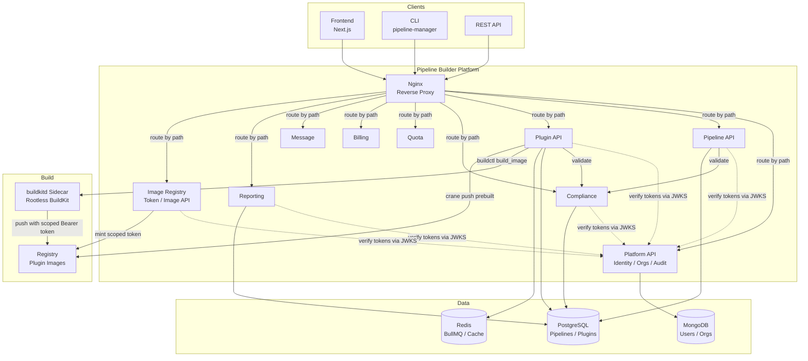
```mermaid
flowchart TB
    subgraph Clients
        FE[Frontend<br/>Next.js]
        CLI[CLI<br/>pipeline-manager]
        API_EXT[REST API]
    end

    subgraph Platform["Pipeline Builder Platform"]
        NGINX[Nginx<br/>Reverse Proxy]
        PLATFORM[Platform API<br/>Identity / Orgs / Audit]
        PIPELINE[Pipeline API]
        PLUGIN[Plugin API]
        COMPLIANCE[Compliance]
        QUOTA[Quota]
        BILLING[Billing]
        MESSAGE[Message]
        REPORTING[Reporting]
        IMGREG[Image Registry<br/>Token / Image API]
    end

    subgraph Data
        MONGO[(MongoDB<br/>Users / Orgs)]
        PG[(PostgreSQL<br/>Pipelines / Plugins)]
        REDIS[(Redis<br/>BullMQ / Cache)]
    end

    subgraph Build
        BK[buildkitd Sidecar<br/>Rootless BuildKit]
        REG[Registry<br/>Plugin Images]
    end

    FE & CLI & API_EXT --> NGINX
    NGINX -->|route by path| PLATFORM & PIPELINE & PLUGIN & COMPLIANCE & QUOTA & BILLING & MESSAGE & REPORTING & IMGREG
    PIPELINE & PLUGIN & COMPLIANCE & REPORTING & IMGREG -.->|verify tokens via JWKS| PLATFORM
    PLUGIN & PIPELINE -->|validate| COMPLIANCE
    PLATFORM --> MONGO
    PIPELINE & PLUGIN & COMPLIANCE & REPORTING --> PG
    PLUGIN --> REDIS
    PLUGIN -->|buildctl build_image| BK
    PLUGIN -->|crane push prebuilt| REG
    BK -->|push with scoped Bearer token| REG
    IMGREG -->|mint scoped token| REG
```

---

## Flow 1: Plugin Upload & Build

Plugins are containerized build tools (e.g., `eslint`, `terraform`, `docker-build`) packaged as ZIP files containing a Dockerfile and plugin-spec.yaml.

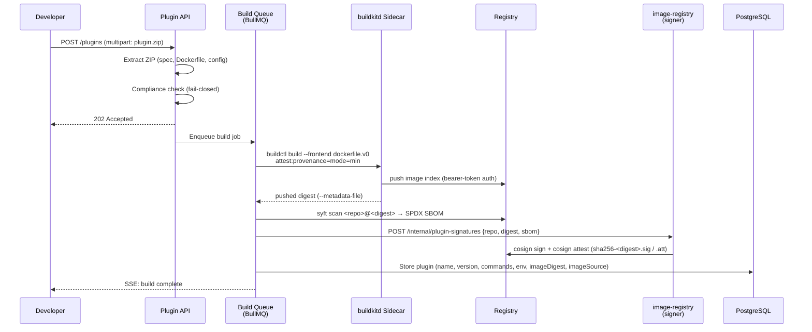
```mermaid
sequenceDiagram
    participant Dev as Developer
    participant API as Plugin API
    participant Queue as Build Queue<br/>(BullMQ)
    participant BK as buildkitd Sidecar
    participant Reg as Registry
    participant IR as image-registry<br/>(signer)
    participant DB as PostgreSQL

    Dev->>API: POST /plugins (multipart: plugin.zip)
    API->>API: Extract ZIP (spec, Dockerfile, config)
    API->>API: Compliance check (fail-closed)
    API-->>Dev: 202 Accepted

    API->>Queue: Enqueue build job

    Queue->>BK: buildctl build --frontend dockerfile.v0<br/>attest:provenance=mode=min
    BK->>Reg: push image index (bearer-token auth)
    BK-->>Queue: pushed digest (--metadata-file)
    Queue->>Reg: syft scan <repo>@<digest> → SPDX SBOM
    Queue->>IR: POST /internal/plugin-signatures {repo, digest, sbom}
    IR->>Reg: cosign sign + cosign attest (sha256-<digest>.sig / .att)
    Queue->>DB: Store plugin (name, version, commands, env, imageDigest, imageSource)
    Queue-->>Dev: SSE: build complete
```

Every pushed image is signed by digest and carries a signed SPDX SBOM attestation
before the plugin row is written — a failure in either step fails the build. The
signing key lives only in **image-registry**: the plugin pod shares its network
namespace with the buildkitd sidecar running untrusted tenant `RUN` steps, so it
holds just the public key. For a `build_image` plugin the signed digest is an
image index that also carries BuildKit's SLSA provenance (`mode=min` — `max` would
publish build args); a `prebuilt` upload gets the SBOM and signature but no
provenance (`imageSource: uploaded`). See [Plugin supply chain](plugins/README.md#supply-chain-sbom-signature-provenance).

### Plugin ZIP Structure

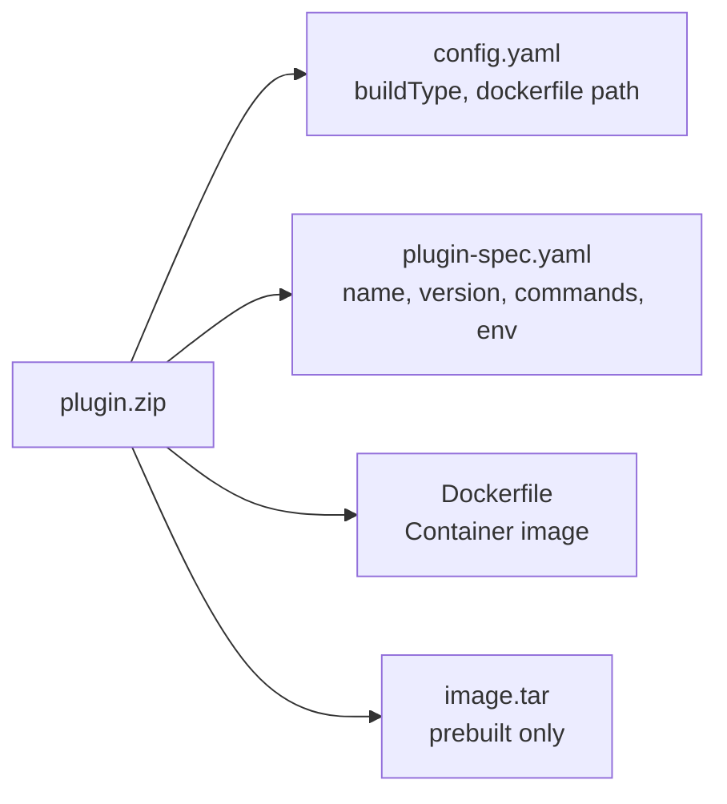
```mermaid
flowchart LR
    ZIP[plugin.zip] --> Config[config.yaml<br/>buildType, dockerfile path]
    ZIP --> Spec[plugin-spec.yaml<br/>name, version, commands, env]
    ZIP --> DF[Dockerfile<br/>Container image]
    ZIP --> TAR[image.tar<br/>prebuilt only]
```

### Build Types

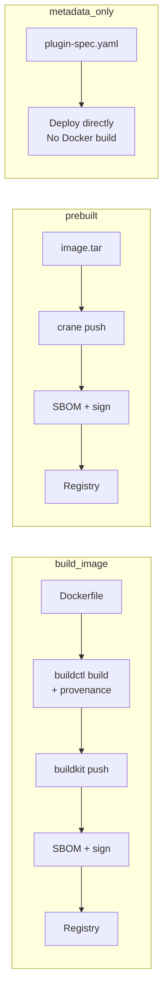
```mermaid
flowchart LR
    subgraph build_image
        DF2[Dockerfile] --> Build[buildctl build<br/>+ provenance] --> Push1[buildkit push] --> Sign1[SBOM + sign] --> R1[Registry]
    end

    subgraph prebuilt
        TAR2[image.tar] --> Push2[crane push] --> Sign2[SBOM + sign] --> R2[Registry]
    end

    subgraph metadata_only
        Spec2[plugin-spec.yaml] --> Direct[Deploy directly<br/>No Docker build]
    end
```

---

## Flow 1b: Publishing to the Plugin Ecosystem

A plugin reaches **other organizations** only through the plugin ecosystem:
the publisher requests a listing, the system organization approves it, and the
approved version is copied into a read-only `public/*` registry namespace.
`visibility: public` never crosses an org boundary on its own.

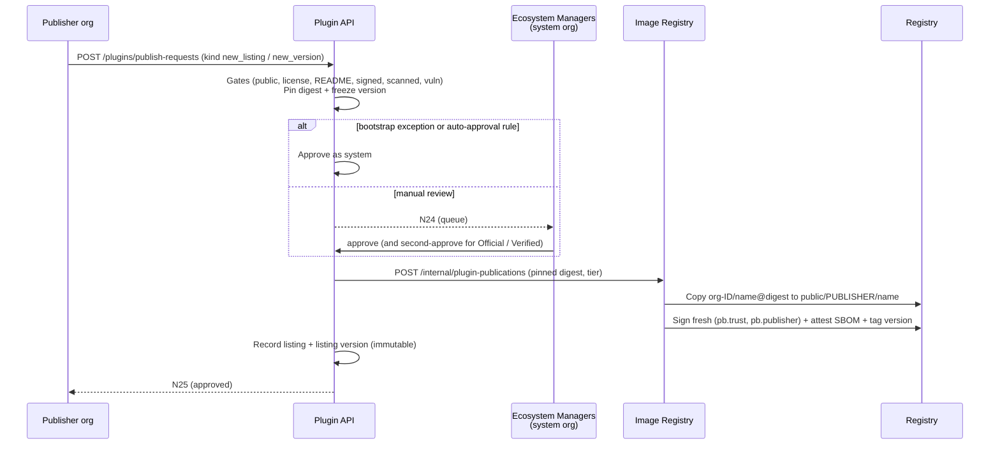
```mermaid
sequenceDiagram
    participant Pub as Publisher org
    participant Plugin as Plugin API
    participant Mod as Ecosystem Managers<br/>(system org)
    participant IR as Image Registry
    participant Reg as Registry

    Pub->>Plugin: POST /plugins/publish-requests (kind new_listing / new_version)
    Plugin->>Plugin: Gates (public, license, README, signed, scanned, vuln)<br/>Pin digest + freeze version
    alt bootstrap exception or auto-approval rule
        Plugin->>Plugin: Approve as system
    else manual review
        Plugin-->>Mod: N24 (queue)
        Mod->>Plugin: approve (and second-approve for Official / Verified)
    end
    Plugin->>IR: POST /internal/plugin-publications (pinned digest, tier)
    IR->>Reg: Copy org-ID/name@digest to public/PUBLISHER/name
    IR->>Reg: Sign fresh (pb.trust, pb.publisher) + attest SBOM + tag version
    Plugin->>Plugin: Record listing + listing version (immutable)
    Plugin-->>Pub: N25 (approved)
```

- **Official catalog.** The system org's plugins are listings under the
  `pipeline-builder` publisher, loaded by `load-plugins.sh` as the
  `official-catalog-loader` service account (`publishRequest=true`). The first
  load rides the one-time bootstrap exception; later gate-green patch/minor
  updates ride the seeded Official auto-approval rule.
- **Resolution until installs ship.** Plugin reads and lookups include another
  org's plugin only when it is a system-org row that is the source of a live
  Official listing version (`OFFICIAL_LISTED_PLUGIN_SCOPE` in pipeline-data).
  W2 switches resolution to installs (implicit for Official) and to the
  listing's `public/*` image repository.
- **Re-sign job.** A tier change, suspension, handle change or transfer
  re-signs every published image with the new annotations, then drops the
  lookup verify cache.

---

## Flow 2: Pipeline Creation

Users compose pipelines from plugins via the UI or API.

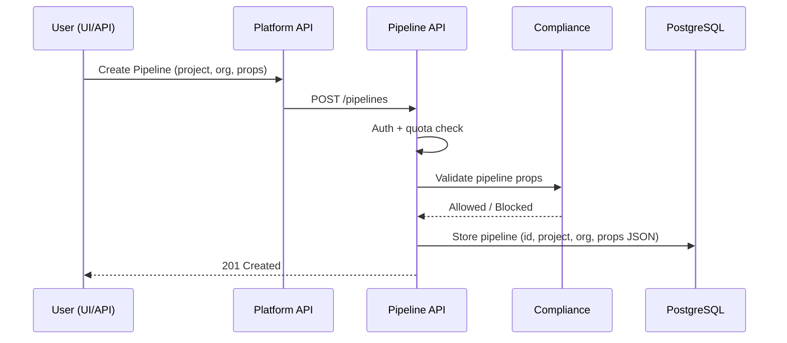
```mermaid
sequenceDiagram
    participant User as User (UI/API)
    participant Plat as Platform API
    participant Pipe as Pipeline API
    participant Comp as Compliance
    participant DB as PostgreSQL

    User->>Plat: Create Pipeline (project, org, props)
    Plat->>Pipe: POST /pipelines
    Pipe->>Pipe: Auth + quota check
    Pipe->>Comp: Validate pipeline props
    Comp-->>Pipe: Allowed / Blocked
    Pipe->>DB: Store pipeline (id, project, org, props JSON)
    Pipe-->>User: 201 Created
```

### BuilderProps Structure (stored as JSON in `props` column)

```json
{
  "project": "my-app",
  "organization": "acme-corp",
  "pipelineName": "main-pipeline",
  "synth": {
    "source": { "repo": "owner/repo", "branch": "main" },
    "plugin": { "name": "cdk-synth" }
  },
  "stages": [
    {
      "stageName": "Test",
      "steps": [
        { "plugin": { "name": "jest" } },
        { "plugin": { "name": "eslint" } }
      ]
    },
    {
      "stageName": "Security",
      "steps": [
        { "plugin": { "name": "snyk-nodejs" } },
        { "plugin": { "name": "trivy" } }
      ]
    },
    {
      "stageName": "Deploy",
      "steps": [
        { "plugin": { "name": "cdk-deploy" } }
      ]
    }
  ]
}
```

---

## Flow 3: CDK Synthesis (Pipeline to CloudFormation)

The pipeline definition is synthesized into an AWS CloudFormation template using CDK.

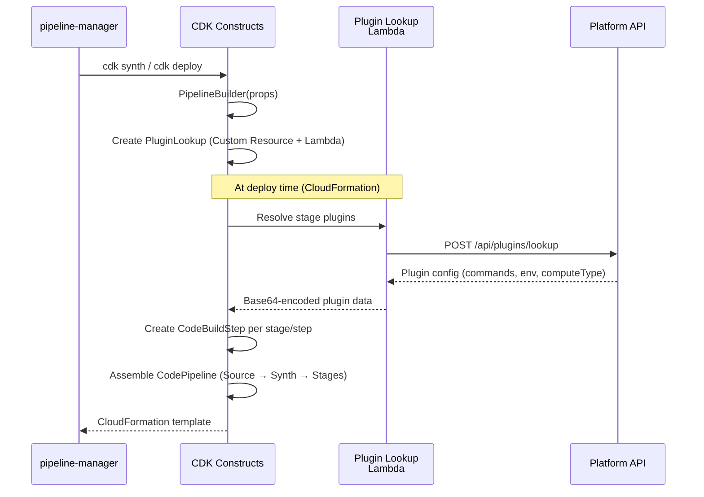
```mermaid
sequenceDiagram
    participant CLI as pipeline-manager
    participant CDK as CDK Constructs
    participant Lambda as Plugin Lookup<br/>Lambda
    participant API as Platform API

    CLI->>CDK: cdk synth / cdk deploy
    CDK->>CDK: PipelineBuilder(props)
    CDK->>CDK: Create PluginLookup (Custom Resource + Lambda)

    Note over CDK,Lambda: At deploy time (CloudFormation)
    CDK->>Lambda: Resolve stage plugins
    Lambda->>API: POST /api/plugins/lookup
    API-->>Lambda: Plugin config (commands, env, computeType)
    Lambda-->>CDK: Base64-encoded plugin data

    CDK->>CDK: Create CodeBuildStep per stage/step
    CDK->>CDK: Assemble CodePipeline (Source → Synth → Stages)
    CDK-->>CLI: CloudFormation template
```

`pipeline-manager` pre-resolves every plugin through the same `POST /api/plugins/lookup`
before synth. For a plugin that runs on its own image, the plugin service first runs
`cosign verify` against the plugin-signing public key and answers **409
`IMAGE_VERIFICATION_FAILED`** if the signature doesn't verify (or the plugin has no
signed digest) — which aborts the synth rather than falling back. The synthesized
CodeBuild image is then pinned **by digest** (`<repo>@sha256:…`), never by the
mutable `name:version` tag.

### Generated CloudFormation Resources

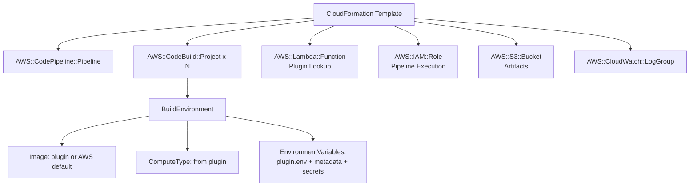
```mermaid
flowchart TB
    CFN[CloudFormation Template]
    CFN --> CP[AWS::CodePipeline::Pipeline]
    CFN --> CB1[AWS::CodeBuild::Project x N]
    CFN --> LF[AWS::Lambda::Function<br/>Plugin Lookup]
    CFN --> IAM[AWS::IAM::Role<br/>Pipeline Execution]
    CFN --> S3[AWS::S3::Bucket<br/>Artifacts]
    CFN --> CW[AWS::CloudWatch::LogGroup]

    CB1 --> BE[BuildEnvironment]
    BE --> IMG[Image: plugin or AWS default]
    BE --> CT[ComputeType: from plugin]
    BE --> ENV[EnvironmentVariables:<br/>plugin.env + metadata + secrets]
```

---

## Flow 4: CodePipeline Execution

When the generated pipeline runs (triggered by source change, schedule, or manual start).

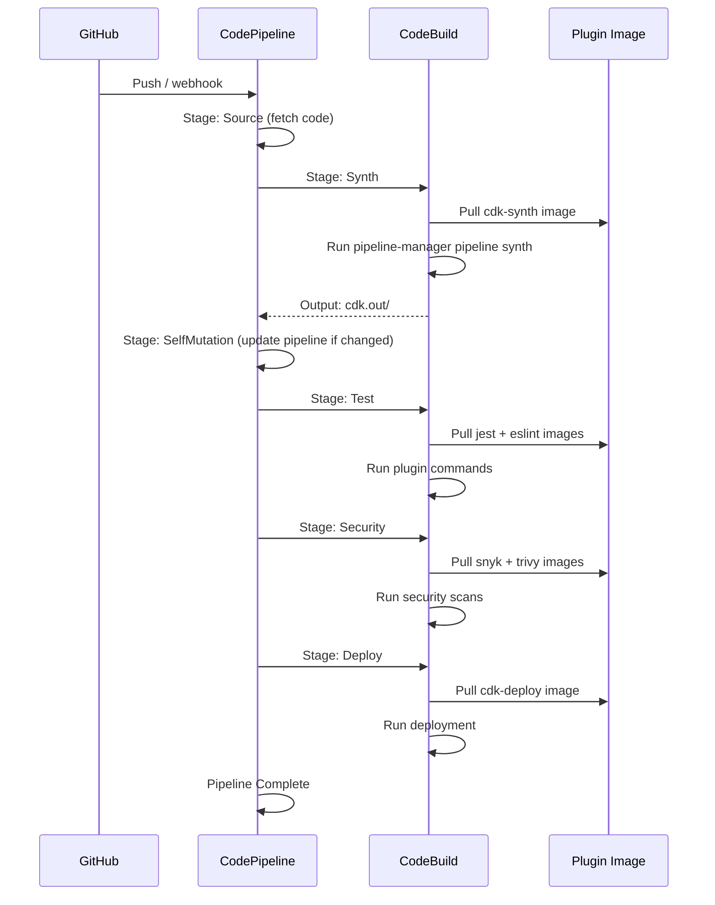
```mermaid
sequenceDiagram
    participant GH as GitHub
    participant CP as CodePipeline
    participant CB as CodeBuild
    participant IMG as Plugin Image

    GH->>CP: Push / webhook
    CP->>CP: Stage: Source (fetch code)

    CP->>CB: Stage: Synth
    CB->>IMG: Pull cdk-synth image
    CB->>CB: Run pipeline-manager pipeline synth
    CB-->>CP: Output: cdk.out/

    CP->>CP: Stage: SelfMutation (update pipeline if changed)

    CP->>CB: Stage: Test
    CB->>IMG: Pull jest + eslint images
    CB->>CB: Run plugin commands

    CP->>CB: Stage: Security
    CB->>IMG: Pull snyk + trivy images
    CB->>CB: Run security scans

    CP->>CB: Stage: Deploy
    CB->>IMG: Pull cdk-deploy image
    CB->>CB: Run deployment

    CP->>CP: Pipeline Complete
```

### How Plugin Images Are Used at Runtime

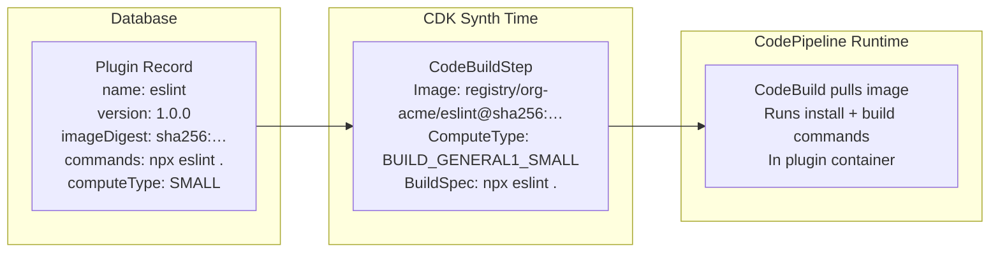
```mermaid
flowchart LR
    subgraph Database
        Plugin[Plugin Record<br/>name: eslint<br/>version: 1.0.0<br/>imageDigest: sha256:…<br/>commands: npx eslint .<br/>computeType: SMALL]
    end

    subgraph "CDK Synth Time"
        CBS[CodeBuildStep<br/>Image: registry/org-acme/eslint@sha256:…<br/>ComputeType: BUILD_GENERAL1_SMALL<br/>BuildSpec: npx eslint .]
    end

    subgraph "CodePipeline Runtime"
        CB2[CodeBuild pulls image<br/>Runs install + build commands<br/>In plugin container]
    end

    Plugin --> CBS --> CB2
```

---

## Key Components

| Component | Purpose | Key Files |
|-----------|---------|-----------|
| **Frontend** | Pipeline/plugin management UI | `frontend/pages/dashboard/` |
| **Platform API** | Sign-in and token issuance (ES256, published as JWKS), user/org management, audit | `platform/src/controllers/` |
| **Pipeline API** | Pipeline CRUD, compliance | `api/pipeline/src/` |
| **Plugin API** | Plugin upload, build queue, AI generation, the plugin ecosystem (publishers, publish requests, the Ecosystem console) | `api/plugin/src/`, `api/plugin/src/services/ecosystem/` |
| **Image Registry** | Registry bearer-token minting, image management/GC | `api/image-registry/src/` |
| **pipeline-core** | CDK constructs, plugin lookup | `packages/pipeline-core/src/pipeline/` |
| **pipeline-data** | DB schemas (Drizzle ORM) | `packages/pipeline-data/src/database/` |
| **pipeline-manager** | CLI for cdk synth/deploy | `packages/pipeline-manager/` |
| **buildkitd sidecar** | Rootless BuildKit daemon for plugin builds | K8s native sidecar / ECS sidecar / compose service |
| **Registry** | Docker image storage | Docker Registry v2 |

---

## Multi-Team Isolation

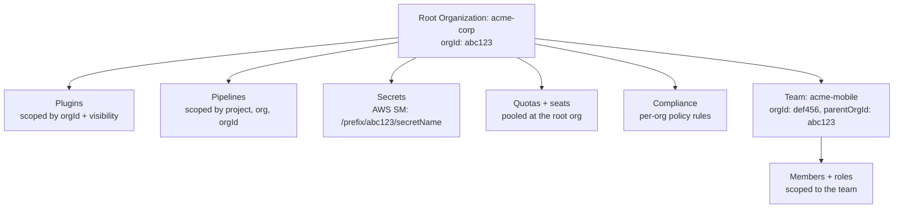
```mermaid
flowchart TB
    ROOT[Root Organization: acme-corp<br/>orgId: abc123]
    ROOT --> PLUG[Plugins<br/>scoped by orgId + visibility]
    ROOT --> PIPE[Pipelines<br/>scoped by project, org, orgId]
    ROOT --> SEC[Secrets<br/>AWS SM: /prefix/abc123/secretName]
    ROOT --> QUO[Quotas + seats<br/>pooled at the root org]
    ROOT --> COMP[Compliance<br/>per-org policy rules]
    ROOT --> TEAM[Team: acme-mobile<br/>orgId: def456, parentOrgId: abc123]
    TEAM --> TMEM[Members + roles<br/>scoped to the team]
```

**Org → team hierarchy.** A **team** is a nested `Organization` (a doc with `parentOrgId` set, sharing the same schema/collection). Resource scoping is per org/team by `orgId` — but **seats, quotas, and billing pool at the root** organization (a person on several teams counts as one seat; usage sums across the subtree). **Roles (permission sets) and the derived per-org label are per org/team**; a user's effective permissions are the union of their assigned Roles, resolved in whichever org/team is active. A root-org admin can administer its child teams via the hierarchy (`canAdministerOrg`), while super-admins span everything.
