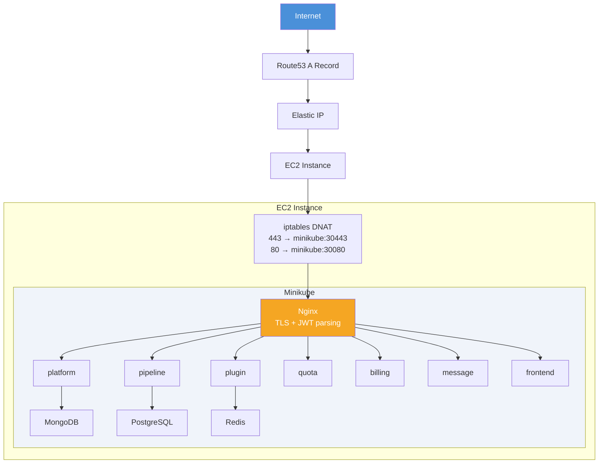
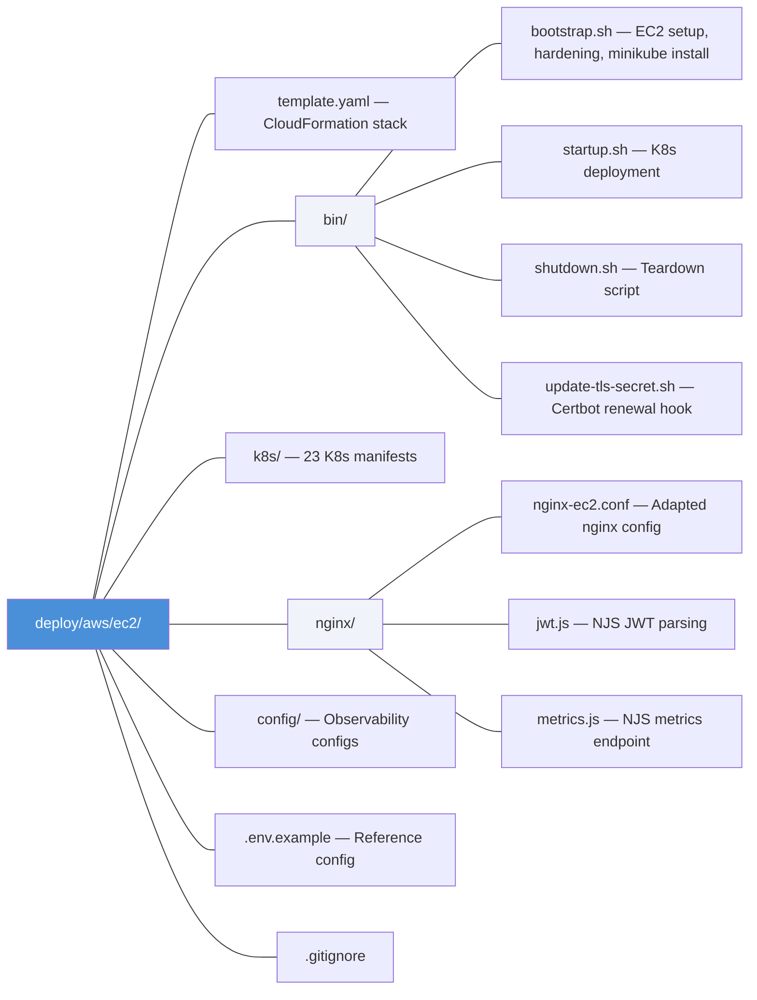
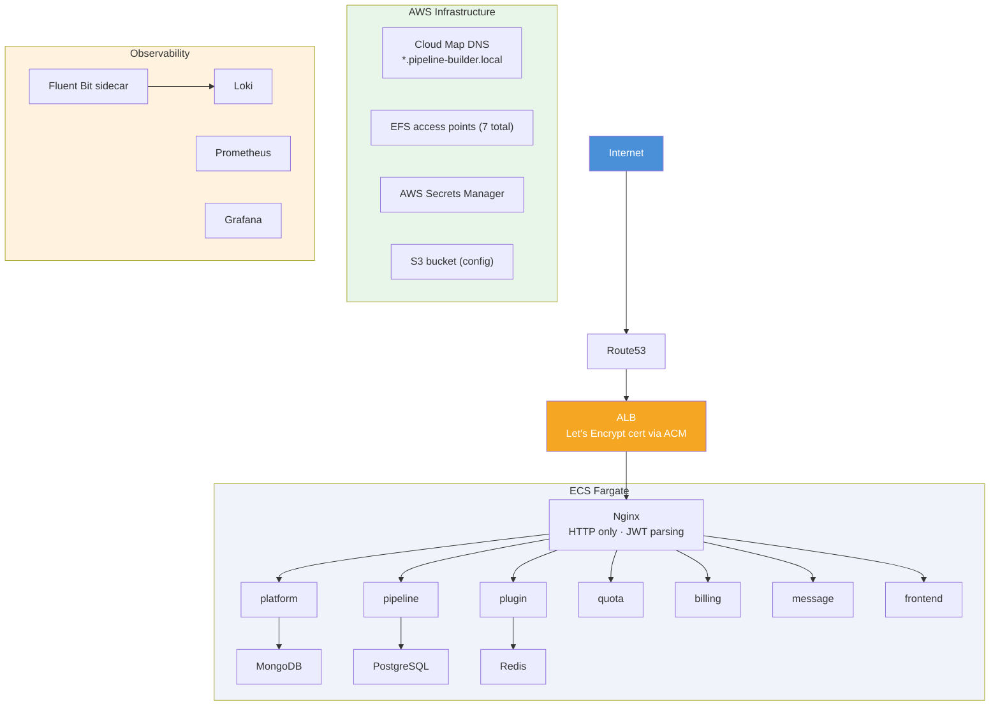
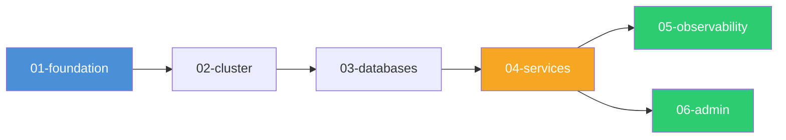
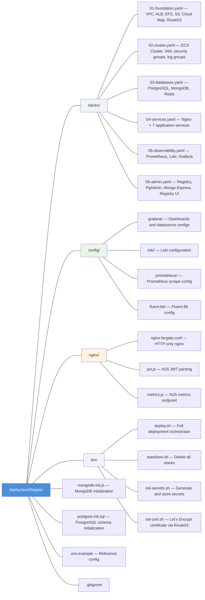

# AWS Deployment Guide

Pipeline Builder supports two AWS deployment methods: **EC2 (Minikube)** for single-instance Kubernetes and **Fargate** for serverless container orchestration.

Both methods use **Let's Encrypt** for TLS certificates and deploy the full stack: application services, databases, observability (Prometheus, Loki, Grafana), and admin tools (PgAdmin, Mongo Express, Registry UI).

---

## Comparison

| Feature | EC2 (Minikube) | Fargate |
|---------|---------------|---------|
| **Runtime** | Kubernetes on a single EC2 instance | AWS ECS Fargate (serverless containers) |
| **Infrastructure** | 1 CloudFormation stack | 6 CloudFormation stacks |
| **Networking** | VPC + public subnet + iptables | VPC + ALB + private subnets + NAT |
| **TLS** | Let's Encrypt (certbot on instance) | Let's Encrypt (certbot + ACM import) |
| **Service Discovery** | K8s DNS (cluster.local) | AWS Cloud Map (pipeline-builder.local) |
| **Storage** | hostPath PVCs on EBS | AWS EFS with access points |
| **Secrets** | K8s Secrets | AWS Secrets Manager |
| **Config** | K8s ConfigMaps | S3 bucket |
| **Logging** | Promtail DaemonSet | Fluent Bit sidecar (FireLens) |
| **Scaling** | Vertical only (instance resize) | Horizontal (adjust desired count) |
| **Cost** | Lower (~$30-80/mo) | Higher (~$100-300/mo) |
| **Best for** | Dev/staging, small teams | Production, high availability |

---

## Option 1: EC2 (Minikube)

Deploys Pipeline Builder on a single hardened EC2 instance running Minikube. All K8s manifests from the minikube deployment are reused with minimal adaptation.

### Prerequisites

- AWS CLI configured with appropriate permissions
- An SSH key pair created in the target region
- A Route53 hosted zone for your domain

### Architecture



### Deploy

```bash
cd deploy/aws/ec2

# Deploy CloudFormation stack
aws cloudformation deploy \
  --stack-name pipeline-builder \
  --template-file template.yaml \
  --parameter-overrides \
    DomainName=pipeline.example.com \
    HostedZoneId=Z1234567890 \
    KeyPairName=my-keypair \
    GhcrToken=ghp_xxxxxxxxxxxx \
  --capabilities CAPABILITY_IAM

# SSH to the instance (optional, for debugging)
ssh -i my-keypair.pem ec2-user@pipeline.example.com
```

### What Happens

1. CloudFormation creates VPC, subnet, security group, Elastic IP, EC2 instance, Route53 record
2. EC2 UserData clones the repo and runs `bin/bootstrap.sh`
3. Bootstrap installs Docker, Minikube, kubectl, certbot
4. Obtains Let's Encrypt certificate via certbot (standalone challenge)
5. Starts Minikube and deploys all K8s manifests via `bin/startup.sh`
6. Sets up iptables DNAT for port forwarding (443->30443, 80->30080)

### EC2 Hardening

- IMDSv2 required (token-based metadata)
- Encrypted gp3 EBS volume
- fail2ban for SSH brute-force protection
- SSH password authentication disabled
- Automatic security updates via dnf-automatic
- Restricted security group (SSH CIDR-locked, only 80/443 public)

### Files



### Teardown

```bash
aws cloudformation delete-stack --stack-name pipeline-builder
```

---

## Option 2: Fargate

Deploys Pipeline Builder as serverless containers on AWS ECS Fargate. The K8s manifests are translated into ECS task definitions with Cloud Map service discovery, EFS persistence, and ALB ingress.

### Prerequisites

- AWS CLI configured with appropriate permissions
- A Route53 hosted zone for your domain
- certbot + certbot-dns-route53 installed locally (for Let's Encrypt)
  - macOS: `brew install certbot && pip3 install certbot-dns-route53`
  - Linux: `pip3 install certbot certbot-dns-route53`

### Architecture



### Deploy

```bash
cd deploy/aws/fargate

# Step 1: Obtain Let's Encrypt certificate (imports to ACM)
bash bin/init-cert.sh --domain pipeline.example.com

# Step 2: Deploy everything (secrets + stacks + configs)
bash bin/deploy.sh \
  --domain pipeline.example.com \
  --hosted-zone-id Z1234567890 \
  --ghcr-token ghp_xxxxxxxxxxxx
```

Or combine into one command (deploy.sh calls init-cert.sh automatically):

```bash
bash bin/deploy.sh \
  --domain pipeline.example.com \
  --hosted-zone-id Z1234567890 \
  --ghcr-token ghp_xxxxxxxxxxxx
```

### CloudFormation Stacks

Stacks are deployed in dependency order. Each exports values consumed by downstream stacks.



| Stack | Contents |
|-------|----------|
| **01-foundation** | VPC (multi-AZ), ALB, Route53, EFS + 7 access points, S3 config bucket, Cloud Map namespace |
| **02-cluster** | ECS Cluster, IAM roles, 6 security groups, CloudWatch log groups |
| **03-databases** | PostgreSQL (+ EFS), MongoDB (+ replica set init sidecar + EFS), Redis |
| **04-services** | Nginx, Platform, Pipeline, Plugin, Quota, Billing, Message, Frontend |
| **05-observability** | Prometheus (+ EFS), Loki (+ EFS), Grafana (+ EFS) |
| **06-admin** | Docker Registry (+ EFS), PgAdmin (+ EFS), Mongo Express, Registry UI |

### Service Resources

| Service | CPU | Memory | Cloud Map Name |
|---------|-----|--------|----------------|
| nginx | 512 | 1024 | nginx.pipeline-builder.local |
| platform | 512 | 1024 | platform.pipeline-builder.local |
| pipeline | 512 | 1024 | pipeline.pipeline-builder.local |
| plugin | 1024 | 2048 | plugin.pipeline-builder.local |
| quota | 512 | 1024 | quota.pipeline-builder.local |
| billing | 512 | 1024 | billing.pipeline-builder.local |
| message | 512 | 1024 | message.pipeline-builder.local |
| frontend | 256 | 512 | frontend.pipeline-builder.local |
| postgres | 1024 | 2048 | postgres.pipeline-builder.local |
| mongodb | 1024 | 2048 | mongodb.pipeline-builder.local |
| redis | 256 | 512 | redis.pipeline-builder.local |
| prometheus | 512 | 1024 | prometheus.pipeline-builder.local |
| loki | 512 | 1024 | loki.pipeline-builder.local |
| grafana | 512 | 1024 | grafana.pipeline-builder.local |
| registry | 512 | 512 | registry.pipeline-builder.local |
| pgadmin | 256 | 512 | pgadmin.pipeline-builder.local |
| mongo-express | 256 | 512 | mongo-express.pipeline-builder.local |
| registry-ui | 256 | 512 | registry-express.pipeline-builder.local |

### Key Design Decisions

**K8s to Fargate Translation:**

| Kubernetes Concept | Fargate Equivalent |
|---|---|
| K8s DNS (`svc.cluster.local`) | Cloud Map (`*.pipeline-builder.local`) |
| hostPath PVCs | EFS access points |
| K8s Secrets | AWS Secrets Manager |
| K8s ConfigMaps | S3 bucket (downloaded at container startup) |
| NodePort + iptables | ALB + target groups |
| Let's Encrypt (certbot on host) | Let's Encrypt (certbot + ACM import) |
| Docker socket mount | Kaniko sidecar |
| Promtail DaemonSet | Fluent Bit sidecar (FireLens) |
| K8s NetworkPolicies | Security groups |
| K8s init containers | ECS container dependency ordering |

**Config files via S3:** Fargate can't use ConfigMaps. Config files are stored in S3 and downloaded at container startup via init sidecar containers (using `amazon/aws-cli` image).

**Nginx HTTP-only:** ALB terminates TLS using the Let's Encrypt certificate imported to ACM. Nginx listens on port 8080 (HTTP only) and handles JWT parsing + routing.

**MongoDB Replica Set:** Uses a non-essential sidecar container that waits for MongoDB to start, runs `rs.initiate()`, then exits. Fargate handles the essential container lifecycle.

### TLS Certificate Renewal

Let's Encrypt certificates expire every 90 days. Renew before expiry:

```bash
bash bin/init-cert.sh --domain pipeline.example.com --region us-east-1
```

This re-runs certbot and re-imports the certificate to ACM. The ALB picks up the new certificate automatically (same ARN is reused).

### Monitoring

```bash
# List all ECS services
aws ecs list-services --cluster pipeline-builder --region us-east-1

# Check service status
aws ecs describe-services --cluster pipeline-builder \
  --services nginx platform pipeline plugin quota billing message frontend \
  --region us-east-1

# View logs
aws logs tail /pipeline-builder/nginx --follow --region us-east-1

# Check ALB target health
aws elbv2 describe-target-health \
  --target-group-arn $(aws cloudformation describe-stacks \
    --stack-name pb-foundation \
    --query "Stacks[0].Outputs[?OutputKey=='NginxTargetGroupArn'].OutputValue" \
    --output text) \
  --region us-east-1
```

### Access Points

After deployment, access the application at:

| Service | URL |
|---------|-----|
| Application | `https://your-domain.com` |
| Grafana | `https://your-domain.com/grafana/` |
| PgAdmin | `https://your-domain.com/pgadmin/` |
| Mongo Express | `https://your-domain.com/mongo-express/` |
| Registry UI | `https://your-domain.com/registry-express/` |

### Teardown

```bash
bash bin/teardown.sh --stack-prefix pb --region us-east-1
```

This deletes all 6 stacks in reverse dependency order and empties the S3 config bucket. Secrets Manager secrets are NOT deleted automatically (shown in output).

### Files



---

## Troubleshooting

### Common Issues

**ECS tasks stuck in PROVISIONING:**
- Check CloudWatch logs for the service: `aws logs tail /pipeline-builder/<service> --follow`
- Verify security groups allow required traffic
- Check Secrets Manager permissions in the Task Execution Role

**ALB health checks failing:**
- Ensure nginx service is running and healthy
- Check the target group health: `aws elbv2 describe-target-health --target-group-arn <arn>`
- Verify port 8080 is accessible from the ALB security group

**MongoDB replica set not initialized:**
- Check the mongo-init container logs
- Manually exec into the mongo task if needed

**Certificate errors:**
- Ensure certbot has Route53 permissions (route53:GetChange, route53:ChangeResourceRecordSets, route53:ListHostedZones)
- Verify the domain resolves to the ALB after deployment
- Check ACM certificate status: `aws acm describe-certificate --certificate-arn <arn>`

**Image pull failures:**
- Verify GHCR credentials in Secrets Manager: `aws secretsmanager get-secret-value --secret-id pipeline-builder/ghcr-auth`
- Ensure Task Execution Role has secretsmanager:GetSecretValue permission
- Check NAT Gateway is routing to the internet (Fargate tasks are in private subnets)
