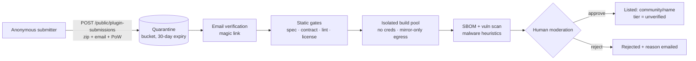
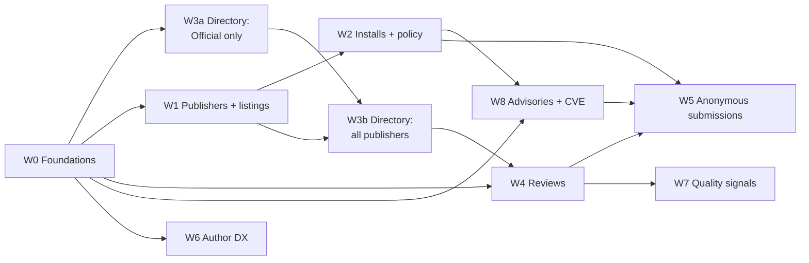

# Plan: Plugin Ecosystem

**Status:** PLAN, rev 2.5 — no code yet (2026-09-21; rev 2.5: plans and limits D15, implicit Official installs D16, docs and help G47)
**Goal:** turn the plugin catalog from "what the platform ships plus what each org
uploads for itself" into a public ecosystem:

- There is a public, searchable directory page that anyone can browse without
  signing in.
- Anyone, including someone who isn't logged in, can submit a public plugin.
- Signed-in users rate and review plugins.
- Every org decides how much of the ecosystem its pipelines may use.

Forward-only, fresh-install. No compat layers (see the repo's no-backward-compat
convention).

---

## 0. Review log: gaps found and what changed (rev 2: G1–G24; rev 2.4: G25–G46; rev 2.5: G47–G48)

Rev 1 was reviewed against the code. Findings marked **(verified)** were checked in
the source.

| # | Gap in rev 1 | Severity | Change in rev 2 |
|---|---|---|---|
| G1 | **Cross-org installs can't be pulled (verified).** The registry token service allows pull only on `system/*`, `library/*` and the caller's own `org-<id>/*` (`api/image-registry/src/services/token-service.ts` ~L105-137). An installed `@acme/x` would pass lookup and then fail at CodeBuild image pull. | Critical | Publishing **copies** the signed image, signature and attestation into a read-only `public/<publisher>/<name>` namespace, which every authenticated identity may pull and only image-registry may push (§3.3). |
| G2 | **The same bug already exists for teams (verified).** A team resolves its parent org's `public` plugins (`read-plugins.ts` parent hierarchy), but the team's registry credential can't pull `org-<parent>/*`. | High (live bug) | W0.0: let a team identity pull its parent org's namespace (the token already carries `parentOrganizationId`). |
| G3 | **Versions aren't immutable (verified).** Re-uploading an existing `(org, name, version)` overwrites the row in place (`deployVersion` `onConflictDoUpdate`) with a new digest, so consumers pinned to `1.2.0` silently get different code. | Critical for a public ecosystem | Published (listed) versions are immutable; a re-upload is rejected; mistakes are handled by **yank** plus a new version (§3.4). |
| G4 | **`@publisher/name` doesn't fit the system.** Plugin names must match `^[a-z0-9][a-z0-9._-]*$`; they are also CDK construct IDs, the resolver's cache key and the registry path. | High | Publisher is a separate field on the plugin reference: `plugin: { publisher: 'acme', name: 'terraform-plan' }`. `@acme/terraform-plan` is display-only. Resolution order is explicit (§3.5). |
| G5 | **Rev 1 redefined `visibility: public`** as "listed publicly", which silently breaks today's meaning (the org plus its teams). | High | The visibility ladder is unchanged. Listing is a separate, explicit **listing** entity (§3.1). |
| G6 | **No markdown sanitizer exists (verified).** The "help-doc sanitizer" rev 1 planned to reuse doesn't exist; help docs are pre-generated TS blocks. | High (XSS) | README and review markdown are rendered **server-side** to sanitized HTML (unified + rehype-sanitize, strict allowlist), external images are blocked, and links get `rel="nofollow ugc noopener"` (§6a). |
| G7 | **Rev 1 assumed a single instance.** The platform also ships as self-hosted (docker, minikube, ec2, eks). | High (scope) | The ecosystem is **per instance**. The hosted instance is the public hub. Self-hosted installs default the public directory **on** (their own catalog) and anonymous submissions **off**. Hub → self-hosted sync is decision D7. |
| G8 | **The telemetry design was fragile.** Rev 1 injected plugin env vars and read them back at ingest, but ingest events already carry `stageName`/`actionName` **(verified)**. | Medium | Synth writes a step manifest `(pipeline, stage, action) → (publisher, plugin, version, digest)`, and ingest joins on it (W0.1). |
| G9 | **No CVE response.** Nightly rescans find new criticals, but nothing tells installers or stops use. | High | Security advisories plus a CVE response loop (W8): notify installers; org policy can block at lookup. |
| G10 | **No publisher or org lifecycle.** Deleting, suspending or abandoning a publisher org would strand consumers. | Medium | Copied images keep consumers working. Listings get `unmaintained` / `transferred` states and an ownership transfer flow (§3.6). |
| G11 | **Legal and privacy weren't covered.** | Medium | Publisher terms, content policy, takedown contact, required SPDX license, GDPR handling for reviews and submitter emails (§8). |
| G12 | **The public API is behind a CDN.** Rate limits keyed on a spoofable `X-Forwarded-For` repeat a past bug (the 2026-07-09 rate-limiter header-trust fix). | Medium | Key on the trusted client IP only (the `TRUST_PROXY` hop count); responses never vary on auth (§6a). |
| G13 | **Captcha choice unstated; email is a hidden dependency.** | Medium | Self-hosted proof-of-work: no third party, works air-gapped, no tracking. Anonymous submissions are **unavailable** unless outbound email is configured (D1). |
| G14 | **No success metrics, sizing, flags or rollback.** | Medium | §10 KPIs, T-shirt sizes per workstream, a feature flag per workstream, kill switches (§9). |
| G15 | **Reviewer privacy.** "Verified user" could reveal which orgs use a plugin. | Medium | Reviews show a display name only; the badge never names the org; adoption counts are k-anonymous (≥ 5). |
| G16 | **Rating integrity.** Rev 1 didn't handle review rings (sock-puppet accounts), bursts or self-promotion. | Medium | Unverified reviews count at half weight; per-org and per-IP review throttles; anomaly holds (§5). |
| G17 | **Existing code keyed by bare name.** `plugin-usage`, AI plugin selection and auto-placeholder creation all assume names are unique. | Medium | Rekey on `(publisher, name)`. AI selection includes installed plugins; placeholders can't take a listed name (W2). |
| G18 | **The directory launched empty of content.** | Low | W0.2 imports the 117 existing per-plugin `README.md` files at load, so W3a launches with real pages. |
| G19 | **No test strategy for the anonymous path.** | Medium | W5 acceptance: zip-bomb / path-traversal / symlink fuzz (reusing `zip-extract` bounds), SSRF-free build pool, moderation bypass tests. |
| G20 | **Cost unbounded.** | Low | Build-minute and storage caps for the anonymous pool; submissions expire after 30 days in quarantine. |
| G21 | **Notification recipients were undefined.** "Emailed", "notified" and "admins" were used loosely, with no rule for who receives what. | Medium | §5b defines recipients per event, resolved from permissions, with channels, timing, preferences and privacy rules. |
| G22 | **No moderator role (verified).** "Superadmin-only" permissions can be held only by superadmins (`SUPERADMIN_ONLY_PERMISSIONS`, rejected by `sanitizePermissions`). There is no way to grant moderation without full superadmin. | Medium | New **system-org-only** permission class, held only through a new built-in **Ecosystem Manager** role that exists only in the system org and is assigned by superadmins (§5a, §5a.1). |
| G24 | **Tenant orgs could govern the ecosystem.** Rev 2.2 let publishers self-list without review (D5), publish their own advisories, yank versions others depend on, mark listings unmaintained and complete ownership transfers on their own. | High (requirement) | **Only the system org manages or approves the ecosystem** (§3.0). Tenant orgs can author, submit, request, restrict their own listings and govern their own org's consumption. Every admission, expansion, trust change or removal is a request decided by the system org's Ecosystem Managers. |
| G25 | **A version could be swapped after review.** A publisher could submit `1.2.0`, have image A reviewed, then re-upload `1.2.0` as image B before approval. | Critical | A request **pins the digest**; approval publishes exactly that digest; the version is frozen from the moment a request exists (§3.4). |
| G26 | **System-org admins bypassed the approval queue (verified).** The loader uploads with `visibility=public` (`load-plugin-worker.sh`), and a system-org `public` plugin reaches every org immediately. | Critical | Official plugins become **listings** under the `pipeline-builder` publisher, approved like any other, and **auto-installed** for every org. `public` visibility no longer grants cross-org reach anywhere. A narrow, audited **bootstrap** exception covers the initial catalog load (§3.1). |
| G27 | **No separation of duties.** A manager who is also a tenant-org member could approve their own org's request; a superadmin could upload and approve an Official plugin alone. | High | Conflict-of-interest rule, plus **two-person approval** for high-impact decisions (§3.0.1). |
| G28 | **Anonymous reads would hit FORCE row-level security (verified).** `ALTER TABLE plugins FORCE ROW LEVEL SECURITY`; every read path assumes a tenant context. | High | A dedicated read-only public path with its own DB role and views limited to listed rows, plus a test (§6a). |
| G29 | **Copied cosign signatures likely won't verify in `public/*`.** The signed payload records the source repository (to be confirmed in W1). | High | Don't copy `.sig`/`.att`. Sign and re-attest the SBOM **fresh** in `public/*` (§3.3). |
| G30 | **The image path was still the org namespace.** `supply-chain.ts` `refFor` and synth's `resolvePluginImage` both derive the repository from `plugin.orgId`. | High | Lookup returns the listing's `imageRepository`; verification and synth use it (W2). |
| G31 | **Security fixes waited on the 2-day queue.** | High | A **security-fix lane**: requests linked to an advisory go to a priority queue with a 4-hour SLA (§3.0). |
| G32 | **Claiming an anonymous submission moved the listing directly,** contradicting §3.0. | Medium | A claim is a transfer request decided by the system org (§4.2). |
| G33 | **Teams were undefined.** Could a team submit for its root publisher? Do root installs apply to teams? | Medium | Requests come only from the root org; root installs are inherited by teams; team installs stay team-local (§3.1, §3.2). |
| G34 | **No re-sign on tier change or suspension.** | Medium | A re-sign job over every listed version, plus cache invalidation (§3.3). |
| G35 | **"No new egress" couldn't be checked.** Plugins don't declare network needs. | Medium | Optional spec field `network.egress` (declared hosts); auto-approval compares declarations (W0.2). |
| G36 | **Listing metadata edits had no path;** publisher links went live unreviewed (phishing). | Medium | Metadata edits are `listing_update` requests; links are https-only with no shorteners (§3.1). |
| G37 | **Pause semantics were ambiguous for version ranges.** | Low | Defined in §3.4. |
| G38 | **Only anonymous submissions got a diff view.** | Medium | Every request shows spec, Dockerfile, SBOM, vuln and declared-egress diffs against the previous approved version (§3.0.2). |
| G39 | **W3a would have been rebuilt.** It searched `plugins`, and W3b switched to listings. | Medium | Listings are created in **W0.8** for the Official catalog, so W3a is built on the final model. |
| G40 | **`public/*` storage and GC unowned.** Deployed pipelines pull by digest on **every** run, so deleting an image breaks production. | High | Storage attributed to the publisher; GC only for images that no step manifest references and that were yanked more than 180 days ago (§3.3). |
| G41 | **No product packaging.** | Medium | D15. |
| G42 | **No operations plan.** | Medium | §9a metrics, dashboard, alerts, staffing. |
| G43 | **No end-to-end test.** | Medium | §8a test strategy. |
| G44 | **No documentation deliverables.** | Low | §12a. |
| G45 | **No total effort.** | Low | §6 header: about 34–44 engineer-weeks, plus moderation staffing. |
| G46 | **Small gaps:** magic-link rules, terms re-acceptance, auto-update notice, retention of rejected items. | Low | §4.2, §3.1, N27, §8. |
| G47 | **Docs and help were under-planned.** "Regenerate frontend help" alone doesn't surface anything: the help manifest (`frontend/scripts/generate-help.mjs`) **deliberately excludes `docs/plugins/*`**, so new publishing/installing docs would never reach the help center. The hand-authored `plugins` and `registry` topics (with a stale ~76-entry `PLUGIN_CATALOG`) and "What's new" weren't mentioned; many affected docs weren't named. | Medium | §12a rewritten: help manifest entries, hand-authored topic rewrites, What's-new entries, a per-workstream docs checklist, and the drift, corpus and search tests as done-criteria. |
| G48 | **"Publishing on Pro and above" conflicted with anonymous submissions.** A Developer user who can't publish signed-in would just submit anonymously: lower trust, more moderation. | Medium | D15 revised: publishing on every plan within a `listings` limit (§3.7). |
| G23 | **Incomplete audit catalog.** Audit actions were mentioned piecemeal, with no anonymous-actor sentinel and no `affectedOrgId` rules. | Medium | §5c: full action catalog, actor and `affectedOrgId` rules, details redaction, and the lists to update. |

---

## 1. Why this needs care: a plugin is code that runs with the customer's keys

A plugin is not passive content like an app-store screenshot or a blog post. At
pipeline runtime its image runs in the **consuming** org's CodeBuild project, with:

- that org's declared secrets (Secrets Manager `pipeline-builder/<orgId>/…`),
- that pipeline's IAM role (often able to deploy to production), and
- that org's source code checked out in the workspace.

So a public plugin is a software-supply-chain dependency, like an npm package or a
GitHub Action. **Accepting uploads from people who aren't logged in is feasible, but
only if "uploaded" and "trusted to run" are kept as separate states.**

## 2. Where we are (surveyed 2026-09-21)

| Area | Exists | Missing |
|---|---|---|
| Authoring | Strict spec schema and contract check; CLI `plugin new/validate/upload`; AI generation; `test-plugins.sh` | Running a plugin locally; CI for the catalog; contract fields (`requiredMetadata/Vars`, `smokeTest`) are validated but **not stored** |
| Catalog | 119 plugins in 10 categories; filters; favorites; "used by N pipelines" (own org); dev-portal fields | Ratings, reviews, installs, verified publisher; README in the UI (117 README files exist on disk but aren't stored); license; changelog |
| Sharing | Visibility ladder; system-org `public` reaches every org; teams inherit the parent org's public plugins (**but can't pull the parent's images — G2**) | Cross-org publishing; no install model (compliance has one: `compliance_rule_subscriptions` + `pinnedVersion`) |
| Versioning | Semver check; one default per name; exact pin; soft delete, restore, purge | **Mutable versions (G3)**; ranges documented but the query is `eq`; nothing acts on `deprecated`; each upload auto-promotes to default; delete ignores in-use pipelines |
| Trust | Compliance at upload and update; **signed image + SBOM + provenance + digest pinning**; rootless buildkit; egress policy | No vulnerability scan; SOC2/PCI/CIS plugin rules test fields never sent (`signed`, `scanned`, `tags`); 118/119 images run as root |
| Quality | Plugin **build** reports | Plugin **runtime** telemetry, so no success rate, adoption or health score |
| Composition | Templates; AI picks plugins by keyword; auto placeholders | No existence or contract check at pipeline create; AI ignores lifecycle and quality |

## 3. Target model

### 3.0 Governance: only the system org manages or approves the ecosystem

**Rule:** no organization other than the system org can manage or approve
anything in the plugin ecosystem. Ecosystem decisions are made only by the system
org's **Ecosystem Managers** (§5a.1) and superadmins, through system-org-only
permissions (§5a).

| Ecosystem decision | Who decides |
|---|---|
| A listing (new plugin) enters the directory | System org: approve or reject a **publish request** |
| A new version of a listing becomes installable | System org: approve or reject a **version request**, manually or through **auto-approval rules the system org configures** (e.g. a patch release from a Verified publisher that passes every gate). A version that fixes a published advisory takes the **security-fix lane**: priority queue, 4-hour SLA, immediate N24. |
| A listing's metadata changes (summary, category, description, links, logo) | System org: approve a `listing_update` request (auto-approval allowed for Verified text-only edits) |
| A publisher's tier (Community → Verified, …) | System org |
| A publisher's handle or display name (impersonation risk) | System org approves the change |
| A version is **yanked** (stops resolving for installers) | System org. A publisher can **request** it and can immediately **pause** it (below). |
| Listing state `unmaintained` / `suspended` / `listed` | System org, manually or by rules it configures (§3.6) |
| Ownership transfer between orgs | System org approves, after both orgs agree |
| A security **advisory** is published or withdrawn | System org. Publishers can **submit** drafts. |
| Moderating anonymous submissions and reviews | System org |
| Featured or curated collections in the directory | System org |
| Auto-approval rules, reserved names, moderation SLAs | System org |

**What tenant orgs keep:**

| Tenant capability | Why it isn't ecosystem management |
|---|---|
| Author plugins; upload them to their own org (today's behavior) | Private to the org; nothing enters the ecosystem |
| Create a publisher profile, accept terms, **submit** publish, version, yank, transfer and advisory **requests** | Requests, decided by the system org |
| **Pause** their own listing or version: hide it from new installs immediately, while existing installs keep resolving | Only *restricts* their own reach, never expands it or breaks consumers, so it's safe without review; unpausing is a request. |
| Reply to reviews on their own listings | Replies are moderated by the system org like reviews |
| Install listings into their own org; approve installs **within their own org**; set their own org's consumption policy (§3.2) | Governs only that org's pipelines, not the ecosystem (decision D13) |

#### 3.0.1 Separation of duties

- **No self-dealing.** A manager can't decide a request submitted by an org they
  belong to. The request's org is compared against the manager's memberships at
  decision time. For Official requests (the system org is the requester), the
  approver must not be the person who uploaded that version.
- **Two-person approval** (a second Ecosystem Manager or superadmin confirms,
  following the existing two-person MFA-reset pattern) for:
  - Official listing and version approvals;
  - tier changes to Verified;
  - unyank;
  - lifting a suspension or takedown;
  - creating or widening an auto-approval rule;
  - reversing an advisory withdrawal.
- The first approval moves the request to `pending_second_approval` and sends
  N28 to the other managers. It's audited as `plugin.request.approve` plus
  `plugin.request.second-approve`.
- With only one manager plus superadmins, a superadmin must be the second
  approver. The Ecosystem console shows how many eligible approvers remain.

#### 3.0.2 Review view (every request)

Each request shows diffs against the previous **approved** version:

- plugin spec (commands, env, declared secrets, `network.egress`);
- Dockerfile;
- SBOM package diff;
- vulnerability summary diff;
- gate results.

For a first listing it also shows the publisher's history and tier. For an
anonymous submission it adds the heuristics report. Auto-approval uses exactly
these diffs.

**Enforcement:**

- Every state-changing ecosystem route is either a **system-org-only** route
  (permission in `SYSTEM_ORG_ONLY_PERMISSIONS`, *and* the caller's active org must
  be the system org), or a tenant **request/restrict** route whose only effect is
  creating a pending request or narrowing the caller's own listing.
- A governance test enumerates every ecosystem route and fails when a tenant-held
  permission can reach a route that changes listing, version, tier, publisher,
  advisory or moderation state other than the request and restrict set. It follows
  the `findInternalRouteViolations` pattern.

### 3.1 Publishers, listings, trust tiers

- A **publisher** is an org's public identity: a handle (`acme`), display name,
  tier, verified-at date, and accepted terms version and date. One publisher per
  root org.
- **Teams (G33):** requests are submitted only from the **root org**. A team's
  plugin is published by moving it to the root org or uploading it there.
  Root-org holders of `publishers:manage` and `plugins:publish` act for the
  publisher.
- **Terms versioning:** when the publisher terms change, a publisher that hasn't
  re-accepted can't submit new requests. Existing listings are unaffected.
- **Official = listings too (G26).** The system org's catalog is published as
  listings under the `pipeline-builder` publisher (tier Official), through the
  same request queue with two-person approval (§3.0.1). Official listings are
  **implicitly installed** for every org (D16), so a pipeline's
  `plugin: { name: trivy }` keeps working:
  - **Virtual, not stored:** no install rows per org. Resolution falls back to
    the Official listing when the org has no own plugin of that name, so
    Official plugins added later reach every org immediately.
  - **Version policy `minor`:** patch and minor versions flow automatically;
    a major never does (N13 notice instead).
  - An org may create an **explicit** install to pin a version or change the
    policy. That record overrides the implicit one.
  - Consumption policy can opt out (`officialInstalls: explicit`) or block
    individual Official listings (`blockedListings`) (§3.2).
  - An org's own plugin with the same name still wins (today's order). The UI
    shows a **shadowing warning** on that plugin and in the pipeline editor. `public` visibility, including
  the system org's, **no longer grants cross-org reach**; only listings do.
- **Bootstrap exception:** on a fresh install, `init-platform` / `load-plugins.sh`
  seeds the Official catalog. While the instance has **zero listings**, those
  requests are auto-approved by `SYSTEM_ACTOR_ID` with `details.bootstrap = true`
  and audited. After the first listing exists, the exception is closed for
  good. `load-plugin-worker.sh` stops sending `visibility=public` as its way of
  sharing, and submits requests instead.
- A **listing** is a plugin *name* published by a publisher: `(publisher, name)`,
  summary, category, latest README, license, links, state (`listed`,
  `unmaintained`, `suspended`, `transferred`) and stats. Reviews, installs and
  search attach to the listing. The existing `plugins` rows stay the per-version
  records. A version is **listed** once it has been published to the listing (§3.3).
- The visibility ladder is **unchanged** (G5). Listing is a separate act: a
  tenant with `plugins:publish` **requests** it for a `public` version, and the
  system org **approves** it (§3.0). Nothing a tenant does alone puts a plugin in
  the directory.
- `plugin_publish_requests(id, publisherId, listingId?, pluginId, version, digest /* pinned, G25 */, kind /* new_listing | new_version | listing_update | yank | unpause | transfer | claim | profile_change | advisory */, securityFixAdvisoryId?, payload jsonb, status /* pending | pending_second_approval | approved | rejected | withdrawn */, submittedBy, decidedBy, secondApprovedBy?, reason, autoRuleId?, createdAt, decidedAt)`
  is the single queue the Ecosystem console works from.
- **Listing metadata (G36):** summary, category, description, links and logo
  change only through `listing_update` requests. Links must be `https`,
  shorteners are refused, and they render `rel="nofollow ugc noopener"`.

| Tier | Who | How they get it | Badge |
|---|---|---|---|
| **Official** | the system org (`pipeline-builder` publisher) | each listing and version approved by two Ecosystem Managers (bootstrap excepted); auto-installed for every org | ✓ Official |
| **Verified publisher** | an org **on Team or Enterprise** (feature `verified_publisher`) with a verified domain (existing DNS verify) plus 2FA on the owner, that has passed a publisher review | **system-org approval** of a Verified application (`publishers:verify`); earned, never purchasable (§3.7) | ✓ Verified |
| **Community** | any signed-in org, **any plan**, within its `listings` limit, whose publish request was approved | `plugins:publish` + accepted publisher terms + **system-org approval of each listing** | Community |
| **Unverified** | **anyone, not logged in**; lands under the platform-owned `community` publisher | anonymous submission (§4) that passed automated gates **and** human moderation | Community · unverified |

Pending, rejected and quarantined submissions are **never** listed or resolvable.

### 3.2 Consumption: installs and org policy

An org **installs** a listing instead of relying on "the visibility predicate
returns it". The model follows compliance subscriptions:

- `plugin_installs(orgId, listingId, versionPolicy, pinnedVersion, status /* active | pending_approval */, installedBy, approvedBy, installedAt)`.
- `versionPolicy`: `pinned` | `patch` (`~`) | `minor` (`^`) | `latest`, resolved at
  lookup. This makes semver ranges real. `latest` never crosses a version the
  publisher marked `breaking` without re-approval.
- **Org consumption policy** (org-local; it decides only what *this* org's
  pipelines may use and never affects the ecosystem, §3.0), set by holders of
  `plugin-installs:manage` and inherited by teams:
  - `allowedTiers` (default: Official + Verified);
  - `requireApprovalToInstall` (default on for Community and Unverified; an org
    admin approves in the UI and the requester is notified);
  - `secretsAllowedTiers` (default: Official + Verified; lower tiers get **no
    secrets**, even if the spec declares them);
  - `blockOnAdvisory` (`critical` | `high` | `never`; default `critical`);
  - `officialInstalls` (`implicit` | `explicit`; default `implicit`, D16).
    `explicit` turns off the implicit Official install, so Official listings must
    be installed deliberately (through the org's own approval flow, if enabled).
    Meant for regulated orgs.
  - `blockedListings` (list of `(publisher, name)`; default empty): blocked
    listings don't resolve for this org's pipelines, **including Official
    ones**, and can't be installed.
  - **None of these safety controls is plan-gated** (§3.7).
- A compliance rule can express the same things, so regulated customers get an
  audited "never" rather than a mere setting.
- Own-org plugins resolve as today. Everything from other orgs, **including
  Official**, resolves only through an install (Official installs are implicit).
- **Teams (G33):** a root org's installs and policy apply to its teams. A team
  may add its own installs if the inherited policy allows it; team installs
  never propagate up to the root.

### 3.3 Publishing copies into a read-only public namespace (fixes G1 and G3)

When the system org **approves** a new-listing or new-version request (§3.0),
image-registry:

1. copies the **image manifest and blobs only** (the pinned request digest,
   G25) from `org-<id>/<name>` to `public/<publisher>/<name>@<digest>` (the copy
   route already does blob mounts), tagging `<version>`;
2. **signs fresh** in `public/*` with the tier annotation
   (`pb.trust=<tier>`, `pb.publisher=<handle>`) and **re-attests** the SBOM,
   under the same plugin-signing key. The source repo's `.sig`/`.att` aren't
   copied: the signed payload records the repository, so a copied signature
   likely wouldn't verify in `public/*` (G29; confirm in W1).

The token service grants **pull on `public/*` to every authenticated identity** and
**push to image-registry's management identity only**. Consequences:

- Consumers' CodeBuild credentials can pull installed plugins (G1).
- A publisher can't overwrite or delete a consumed version: the org namespace
  stays theirs, and `public/*` is append-only apart from yank (G3).
- Lookup verifies both the signature and the tier annotation against the org
  policy, so changing a tier in the DB without re-signing is detected.
- **Re-sign job (G34):** a tier change, publisher suspension or unsuspension
  re-signs every listed version with the new annotation, then invalidates the
  lookup verify cache. It's idempotent, resumable and audited
  (`registry.image.resign`).
- **Storage and GC (G40):** `public/<handle>/*` storage counts toward the
  publisher org's `storageBytes` rollup. Deployed pipelines pull by digest on
  **every run**, so a `public/*` image is garbage-collected only when it was
  yanked more than 180 days ago **and** no step manifest (W0.1) references it.
  Otherwise it's kept indefinitely.

### 3.4 Versions are immutable once listed

- A version is **frozen from the moment a request references it** (G25).
  Re-uploading it while a request is pending, or after it is listed, is
  rejected (409). Approval publishes the request's pinned digest, and if the
  stored digest differs, approval fails closed. Unrequested private/org
  versions keep today's overwrite behavior.
- **Yank** a version (**system org only**; a publisher *requests* it): it stops
  resolving for *new* synths. Pinned consumers get a synth error explaining the
  yank and the advisory, and their org's installs are notified. Emergency
  takedown additionally invalidates the lookup verify cache.
- **Pause** (publisher, immediate; D14). Unpausing is a request.
  - A **paused version** is hidden and excluded from range resolution for any
    install that hasn't already resolved to it. Pinned installs, and installs
    currently on it, keep resolving.
  - A **paused listing** accepts no new installs. Existing installs keep
    resolving, including to non-paused newer versions within their range.
- New **major** versions never auto-promote to default and never flow to
  `latest` installs without re-approval.

### 3.5 Referencing plugins in pipelines

```yaml
plugin: { name: terraform-plan }                              # own org, then system (today)
plugin: { publisher: acme, name: terraform-plan, filter: { version: '^1' } }  # installed listing
```

- Resolution: an explicit `publisher` resolves only that publisher's listing,
  through an install. Without it, resolution goes own org, then parent org, then
  system, as today. **No implicit shadowing** across publishers.
- Resolver cache keys and CDK construct IDs include the publisher, sanitized to
  `[A-Za-z0-9_-]`.
- **Image path (G30):** lookup returns `imageRepository` for the resolved
  version: `public/<publisher>/<name>` for any listing, including Official, and
  `org-<id>/<name>` for own-org plugins. Signature verification (`supply-chain.ts`
  `refFor`) and synth (`resolvePluginImage`) use it instead of deriving it from
  `orgId`.
- `pipeline-manager validate` and pipeline create check that the plugin exists,
  is installed and satisfies its contract (W2).

### 3.6 Publisher and org lifecycle

- **Ownership transfer:** the sending publisher requests it, the receiving org
  accepts, and the **system org approves**. Only then does the listing move;
  history is kept.
- **Publisher org deleted or suspended:** listings become `unmaintained`
  (installed versions keep resolving, because the images live in `public/*`) or
  `suspended` (yanked, for policy violations).
- **Abandoned:** a system-org rule (default: no release in 12 months plus an open
  advisory) flags the listing and an Ecosystem Manager confirms `unmaintained`,
  with a banner and a warning to installers. A publisher can't set or clear this
  state; they can request it.

### 3.7 Plans and limits (D15)

Installing is free on every plan; publishing is limited by plan. The cost of the
ecosystem (system-org review) lands on publishing, and every paid gate on
installing would reduce adoption.

| Capability | Developer | Pro | Team | Enterprise |
|---|---|---|---|---|
| Browse the public directory | anyone, no login | ✓ | ✓ | ✓ |
| Install Official, Verified and Community listings | ✓ | ✓ | ✓ | ✓ |
| Write reviews | ✓ | ✓ | ✓ | ✓ |
| Safety controls: allowed tiers, secrets policy, `blockOnAdvisory`, install approvals, `officialInstalls`, `blockedListings` | ✓ | ✓ | ✓ | ✓ |
| **Publish Community listings** (new `listings` count limit) | **3** | **10** | **25** | **100** (fair use) |
| **Eligible to apply for Verified** (`verified_publisher` feature) | — | — | ✓ | ✓ |
| Security-fix lane | ✓ | ✓ | ✓ | ✓ |
| Self-hosted (billing off → `unlimited` tier) | everything enabled; the operator's system org governs |

- **Why Developer can publish (G48):** anonymous submissions are allowed, so
  blocking signed-in publishing would push people to the anonymous path (lower
  trust, more review work). A small limit keeps signed-in publishing the
  easier route.
- **Safety is never paywalled.** Blocking on advisories, withholding secrets from
  low-trust plugins and install approvals protect every customer.
- **Verified is earned, not bought.** The plan only makes an org *eligible*. The
  badge is awarded by system-org review and can be withdrawn. There is no paid
  priority-review lane; the security-fix lane is open to everyone.
- **Mechanics:**
  - A new count quota type **`listings`** (active, non-suspended listings per
    root org; installs don't count, D6), added to `quota-tiers.ts` next to
    `plugins`, to the shared `QuotaType` used by the frontend, and to billing's
    over-cap guard.
  - A new feature flag **`verified_publisher`** in `TIER_FEATURES` for `team`
    and `enterprise` (and `unlimited`), with `FEATURE_METADATA`.
  - Request routes check the `listings` quota at *submit* time for
    `new_listing`, and re-check it at approval.
  - A later "listing pack" billing bundle can raise the limit (the existing
    bundle mechanism); not in this plan.
- **Downgrade:**
  - **Over the `listings` limit:** existing listings **stay listed**, but new
    `new_version` and `listing_update` requests are refused until the publisher
    is back under the limit. The **security-fix lane stays open**, so consumers
    never get trapped on a vulnerable version.
  - **Verified publisher below Team:** a 30-day grace period (notice N29), then
    the tier returns to Community, the re-sign job updates every image's trust
    annotation (§3.3), and installers' tier policies re-evaluate at the next
    lookup.

## 4. Anonymous public submissions

### 4.1 Flow



### 4.2 Guardrails

1. **Identity-light, not identity-free (D1).**
   - A submission needs a verified email address (magic link: single-use,
     30-minute expiry, bound to the submission id).
   - It needs a **self-hosted proof-of-work** challenge: no third-party captcha,
     which also works air-gapped.
   - Rate limits per IP (trusted client IP only, G12) and per email: 3/day.
   - The email is stored hashed plus encrypted for takedown notices, deleted 90
     days after a decision, and never displayed.
   - **Disabled unless outbound email is configured.**
2. **Quarantine by default.** The upload lands in a dedicated bucket (status
   `pending_verification` → `pending_review`, 30-day expiry). No `plugins` row, no
   push to tenant or public namespaces.
3. **Isolated build pool.**
   - A separate node pool and buildkitd; never the shared tenant sidecar.
   - Egress limited to package mirrors; no SA token, no Pod Identity.
   - Output goes to `quarantine/<id>`, pullable only by moderation tooling.
   - Build-minute and storage caps (G20).
4. **Automated gates**, all fail-closed:
   - spec, contract and SPDX license validation;
   - Dockerfile lint, and must not run as root;
   - grype vulnerability scan over the SBOM (configurable threshold);
   - heuristics: unchecked pipe-to-shell downloads, miner signatures, obfuscation,
     access to `AWS_*` / `CODEBUILD_*` credentials;
   - no secret-looking defaults in `env`;
   - `smokeTest` declared and passing.
5. **Human moderation.** A platform-admin queue (the triage UI pattern) shows the
   diff against prior versions, the scan, the SBOM and the heuristics. Target SLA
   2 business days, with an alert when the backlog exceeds it. Every decision is
   audited (`plugin.submission.approve` / `reject`).
6. **Names.** Submissions land under `community/<name>`. Names reserved by
   Official/Verified publishers, and confusable names (edit distance ≤ 1 from the
   top 100), are rejected.
7. **Updates.** A new version from the same verified email goes through the full
   flow. Alternatively the submitter **claims** the listing by creating an account
   with that email. That files a `claim` request, which the system org decides
   (G32) like a transfer from `community` to their publisher.
8. **Honest signatures.** "Signed" means "built by the platform from this
   source". Trust comes from the tier annotation plus the consuming org's policy
   (§3.3).
9. **Takedown.** Moderation can suspend a listing or yank versions instantly.
   Installers are notified.

## 5. Reviews and ratings

- **Read:** anyone, including logged-out visitors.
- **Write:** signed-in users only (D2). One review per user per listing (editable,
  with history), tied to the version used.
- **Verified use:** the badge appears when the reviewer's org ran the plugin
  successfully in the last 90 days (W0.1). **The org is never shown**; reviews
  display the reviewer's display name only (G15).
- **Weighting:** verified-use reviews count 1.0; unverified count 0.5 (D9).
- **Score:** a Bayesian average (prior of 3.5 over 10 votes), shown with the vote
  count, the star distribution, and a "recent versions" rating over the last two
  minors.
- **Integrity (G16):**
  - no reviewing listings from your own publisher org;
  - at most 20 reviews per org per day and per IP;
  - bursts of new-account reviews on one listing are held for moderation;
  - "report review" with automatic hold after N reports;
  - one "helpful" vote per user.
- **Publisher reply:** one public reply per review.
- **Security reports** never post publicly. They open a private advisory draft
  for the publisher and platform admins (W8).
- **GDPR:** deleting a user anonymizes their reviews (keeps the rating, drops
  the author and body) and removes their votes and reports.

```sql
plugin_listings(id, publisher_id, name, category, summary, readme_html, license, homepage_url, source_url,
  state /* listed|unmaintained|suspended|transferred */, search_vector tsvector, created_at, updated_at,
  UNIQUE(publisher_id, name))
publishers(id, org_id UNIQUE, handle UNIQUE, display_name, tier, verified_at, terms_accepted_at, suspended_at)
plugin_reviews(id, listing_id, version, rating smallint CHECK (rating BETWEEN 1 AND 5), title varchar(120),
  body_md text, body_html text, author_user_id, author_org_id, verified_use boolean,
  status /* published|held|removed */, helpful_count, created_at, updated_at,
  UNIQUE(listing_id, author_user_id))
plugin_review_replies(review_id PK, publisher_id, body_md, body_html, created_at, updated_at)
plugin_review_reports(review_id, reporter_user_id, reason, created_at, UNIQUE(review_id, reporter_user_id))
plugin_review_votes(review_id, user_id, PRIMARY KEY(review_id, user_id))
plugin_stats(listing_id PK, rating_bayes, rating_count, dist jsonb, install_count,
  active_org_count /* shown only if ≥ 5 */, success_rate_30d, health_score, updated_at)
plugin_advisories(id, listing_id, affected_range, severity, summary, cve_ids text[],
  state /* draft|published|withdrawn */, published_at)
```

## 5a. Permissions

### Org-assignable (in built-in bundles; grantable via custom roles)

| Permission | Grants | Bundles | Notes |
|---|---|---|---|
| `plugins:read` *(existing)* | Browse the in-app catalog; **write a review** | member, admin, owner | Reviews also need a **human session**: service accounts and exchanged access keys get `HUMAN_SESSION_REQUIRED`. |
| `plugins:publish` *(existing)* | **Submit** new-listing and new-version requests for the org's `public` versions; withdraw a pending request; **pause** own listings and versions | admin, owner | Approval is system-org only (§3.0). |
| `plugins:install` **new** | Install, upgrade or uninstall listings. When org policy requires approval, this only **requests** an install. | member, admin, owner | Members can request; approvers decide. |
| `plugin-installs:manage` **new** | Edit the org's **consumption** policy (§3.2); approve or deny install requests **within the org**; receive advisory and upgrade notices | admin, owner | Org-local only; not ecosystem management (§3.0, D13). Team orgs: holders on the team, or on the root org when the policy is inherited. Policy changes require **step-up**. |
| `publishers:manage` **new** | Create the publisher profile and accept terms; edit description and links (post-moderated); **request** handle or display-name changes, Verified status, yanks, unpausing, transfers and advisory publication; accept an incoming transfer; reply to reviews | admin, owner | Requests only; every decision is system-org (§3.0). Transfer requests and accepts require **step-up**. |

### System-org-only permissions (new class, G22)

Today's `SUPERADMIN_ONLY_PERMISSIONS` can be held **only** by superadmins. Add a
second class, `SYSTEM_ORG_ONLY_PERMISSIONS`. Its permissions are never in the
member, admin or owner bundles, and are **never assignable through any custom
role** in any org. The only ways to hold them:

- through the built-in **Ecosystem Manager** role below, which exists only in the
  system org; or
- implicitly, as a superadmin.

| Permission | Grants | Extra gate |
|---|---|---|
| `plugins:moderate` **new** | Decide every **publish request** (new listing, new version, yank, unpause, advisory); configure **auto-approval rules**, reserved names and moderation SLAs; moderation queue (anonymous submissions, held or reported reviews and replies); suspend, unmaintain or relist any listing; yank or unyank any version; emergency takedown; publish or withdraw advisories; curate featured collections | Step-up for suspend, yank, takedown and auto-approval rule changes |
| `publishers:verify` **new** | Approve or reject Verified-publisher applications; change a publisher's tier; approve handle and display-name changes; approve ownership transfers; suspend or unsuspend a publisher | Step-up for all |

Enforcement is in three places, and each is tested:

1. `sanitizePermissions` rejects these permissions in any custom role
   (`RL_PERMISSION_NOT_ASSIGNABLE`, as for the registry permissions).
2. The route gate requires the permission **and** a caller whose active org is
   the system org. A token minted in any tenant org is refused, even for the
   same user.
3. The role seeder creates the Ecosystem Manager role only when
   `isSystemOrg` is true.

## 5a.1 Built-in role: Ecosystem Manager (system org only)

A dedicated built-in role for the people who run the plugin ecosystem. Under
§3.0 they are **the only non-superadmins anywhere who can manage or approve it**:
approving every listing and version, publisher tiers and profile changes,
transfers, yanks and advisories, anonymous submissions and review moderation.
They do **not** get platform superadmin powers.

| Property | Value |
|---|---|
| Name | **Ecosystem Manager** (`system: true`: can't be renamed, deleted or have its permissions edited) |
| Exists in | **The system org only.** Seeded by `seedDefaultRoles` when `isSystemOrg` is true, next to Super Admin, Admin and Member. Never seeded in tenant orgs or teams. |
| `grantsRole` | `member`: no admin rights over the system org itself, and **never** sets `User.isSuperAdmin` |
| Permissions (seed bundle `ECOSYSTEM_MANAGER_PERMISSIONS` in api-core, next to `ROLE_PERMISSIONS`) | `plugins:read`, `plugins:moderate`, `publishers:verify`, `messages:read` (to receive in-app notices), `observability:read` (the moderation-SLA dashboard). Nothing tenant-facing, no `registry:*`, no `members:manage`. |
| Who can assign it | **Superadmins only**, and only to existing members of the system org. The role-assignment check refuses any role carrying system-org-only permissions unless the actor is a superadmin. Unassigning is also superadmin-only. |
| Assurance | Every ecosystem-management route requires an **MFA-grade session** (`requireAssurance`, aal2); destructive actions also require step-up. A holder without MFA sees an enrol prompt, not the console. |
| Visibility | The admin console gets an **Ecosystem** section (moderation queue, publisher applications, advisories, suspended listings, SLA metrics), shown when `can('plugins:moderate')` or `can('publishers:verify')`. Tenant users never see it. |
| Audit | Assignment and removal use the existing `org.role.member.add` / `org.role.member.remove` (with `affectedOrgId` = system org). Every action the role takes is audited per §5c. |
| Notifications | Holders are the **Moderators** recipients in §5b. Superadmins also receive N23 whenever someone is added to or removed from the role. |
| Fresh install | Seeded at system-org creation (fresh-install convention; no migration path). |

**Optional split (D12):** if moderation and publisher verification should be
separated, seed two roles instead: **Ecosystem Moderator** (`plugins:moderate`)
and **Publisher Verifier** (`publishers:verify`). Recommendation: one role now;
the permissions are already separate, so a split later is only a seed change.

## 5b. Notifications

### Recipient rules (resolved at send time, never stored lists)

| Recipient | Resolved as |
|---|---|
| **Submitter** | The anonymous submission's verified email. Decrypted only to send, and only for §4 transactional messages and takedown. |
| **Requester** | The user who took the action. |
| **Org approvers** | Active members of the org holding `plugin-installs:manage` (org-local install decisions only). For a team whose policy is inherited, the team's holders; if there are none, the root org's holders. If nobody holds it, the org's owners. |
| **Publisher managers** | Active members of the publisher's org holding `publishers:manage`; if none, the owners. |
| **Installing orgs** | For every org with an active install of the affected listing and version: that org's **org approvers**. |
| **Moderators** | Members of the system org's **Ecosystem Manager** role (§5a.1): holders of `plugins:moderate`, or `publishers:verify` for publisher applications. If the role is empty, superadmins. |
| **Superadmins** | Users with `isSuperAdmin`. |
| **Review author** | The user who wrote the review. Their org is never revealed to anyone else. |

### Events

Channels: in-app message (always sent; the source of truth) and email.
**Transactional** emails ignore preferences; the rest respect per-user preferences.

| # | Trigger | Recipients | Channel / timing | Opt-out? |
|---|---|---|---|---|
| N1 | Anonymous submission received | Submitter | Email (magic link), immediate | Transactional |
| N2 | Submission verified, entered the moderation queue | Moderators | In-app per moderator; **daily digest** email (09:00 UTC); immediate email only when the 2-day SLA is breached | Digest: yes. SLA breach: no. |
| N3 | Submission failed automated gates | Submitter | Email with the failed checks, immediate | Transactional |
| N4 | Submission approved (listing URL) or rejected (reason) | Submitter | Email, immediate | Transactional |
| N5 | Submission claimed by an account | Claiming user | In-app + email | Transactional |
| N6 | Verified-publisher application submitted | Moderators (`publishers:verify`) | In-app; daily digest | Yes |
| N7 | Verified application approved or rejected | Publisher managers | In-app + email | Transactional |
| N8 | Moderation action on the publisher's listing (suspend, yank, takedown) | Publisher managers; **and** installing orgs if a used version is affected | In-app + email, immediate, with reason | No |
| N9 | Ownership transfer requested | Receiving org's publisher managers | In-app + email | No |
| N10 | Transfer accepted by the receiving org (now awaiting system-org approval), declined, then approved or rejected | Both orgs' publisher managers | In-app + email | No |
| N11 | Install requested (policy requires approval) | Org approvers | In-app per approver + email, immediate | Email: yes |
| N12 | Install approved or denied | Requester | In-app + email | Email: yes |
| N13 | New version available within an install's policy | Org approvers | In-app; **weekly digest** email. A `breaking` major is immediate. | Yes |
| N14 | Listing deprecated or unmaintained | Installing orgs | In-app + email | Yes |
| N15 | New or edited review on a listing | Publisher managers | In-app; email **batched hourly** per listing | Yes |
| N16 | Publisher replied to your review | Review author | In-app + email | Yes |
| N17 | Review held (reports, burst, filter) | Moderators | In-app; daily digest | Yes |
| N18 | Your review was removed (reason) | Review author | In-app + email | Transactional |
| N19 | Review flagged as a **security issue** | Publisher managers **and** moderators | In-app + email, immediate, **private**; opens an advisory draft | No |
| N20 | Advisory draft auto-created (nightly CVE rescan) | Publisher managers and moderators | In-app + email, immediate | No |
| N21 | Advisory **published** or withdrawn | Installing orgs | In-app + email, **≤ 15 min** (§10) | No |
| N22 | Moderation SLA breach | Moderators | Email, immediate, plus a Prometheus alert | No |
| N23 | Someone added to or removed from the Ecosystem Manager role | Superadmins, and the affected user | In-app + email, immediate | No |
| N24 | Publish request submitted (new listing, new version, listing update, yank, unpause, profile change, transfer or claim awaiting approval, advisory draft) | Moderators, excluding anyone with a conflict of interest | In-app per moderator; daily digest email; **immediate** for yank, advisory and security-fix requests | Digest: yes. Yank/advisory/security-fix: no. |
| N25 | Publish request approved (with the listing or version URL) or rejected (with reason), including auto-approvals | Publisher managers | In-app + email, immediate | Transactional |
| N26 | Listing or version paused by its publisher | Installing orgs (it's hidden from new installs; their installs keep working) | In-app | Yes |
| N27 | An installed listing resolved to a new version within the install's range (auto-update) | Org approvers of that org | In-app; weekly digest email | Yes |
| N28 | A request needs a second approval (§3.0.1) | Eligible moderators (not the first approver, no conflict of interest) | In-app + email, immediate | No |
| N29 | Plan change affects publishing: over the `listings` limit, or Verified grace period started or ended | Publisher managers | In-app + email, immediate; grace reminders at 14 and 3 days | No |

### Rules

- **Privacy.** Publishers are never told which orgs installed their plugin; N11
  to N14 and N26 go only to the installing org. Review notifications carry the reviewer's
  display name only. Emails contain only the recipient's own org's data. Every
  link goes through `/login?returnTo=…` (§6a).
- **Plumbing.**
  - In-app messages go through the message service as targeted per-user
    messages (the domain-join pattern in `org-domain-service.ts`).
  - Email goes through platform's `POST /internal/notify-email` relay (platform
    holds SMTP); add `plugin` to that internal route's allowed callers, its
    route-coverage declaration and the mesh DENY policy.
  - Digests and batching use a leader-locked scheduler (the existing
    compliance digest-scheduler pattern) keyed per recipient.
- **Preferences.** New per-user keys under `ecosystem.*` (e.g.
  `ecosystem.reviews.email`, `ecosystem.upgrades.email`, `ecosystem.moderationDigest.email`),
  shown in the user's notification settings. Transactional and security
  notices (N1, N3–N5, N7–N10, N18–N23, N25, N28, N29) can't be turned off.
- **Email disabled on an instance:** in-app only, and anonymous submissions are
  unavailable (D1).
- **Failure handling.** An email send failure is logged, counted
  (`ecosystem_notification_failed_total{event}`) and retried by the relay. The
  in-app message is never lost. Advisory fan-out (N21) is idempotent per
  `(advisoryId, orgId)`.

## 5c. Audit events

Recorded through each service's remote audit client into platform's hash-chained
`audit_events`. Every new action goes into **both** lists
(`packages/api-core/src/services/remote-audit-client.ts` `REMOTE_AUDIT_ACTIONS`
and `platform/src/models/audit-event.ts`), `docs/audit-events.md` (then
regenerate help), and each route's `audited(...)` declaration (route-coverage
enforces it).

### Actor and affected-org rules

- **Actor:** `actorId({ userId })` as today. Automated jobs use
  `SYSTEM_ACTOR_ID`. **New sentinel `ANONYMOUS_ACTOR_ID = 'anonymous'`** for
  unauthenticated submissions, with `details.submissionId`. The submitter email,
  hashed or otherwise, never appears in audit.
- **`orgId`:** the actor's org. Anonymous and system actions use the system org.
- **`affectedOrgId`** (so that org's admins see changes made *to* them):
  - listing, version, review and advisory actions → **the publisher's org**;
  - install and policy actions → **the installing org**;
  - moderation actions on a publisher → the publisher's org.
- **Details:** ids, versions, digests, tier, state, reason *code* and short reason
  text only. **Never** review bodies, README content, secrets or emails.

### Catalog

| Area | Actions |
|---|---|
| Publishers | `publisher.create`, `publisher.update`, `publisher.terms.accept`, `publisher.verify.request`, `publisher.verify.approve`, `publisher.verify.reject`, `publisher.tier.change`, `publisher.suspend`, `publisher.unsuspend`, `publisher.terms.accept` (`details.termsVersion`), `publisher.transfer.request`, `publisher.transfer.accept`, `publisher.transfer.decline`, `publisher.transfer.approve`, `publisher.transfer.reject`, `publisher.profile-change.approve`, `publisher.profile-change.reject` |
| Publish requests (tenant → system) | `plugin.request.submit` (`details.kind`: `new_listing` / `new_version` / `listing_update` / `yank` / `unpause` / `transfer` / `claim` / `profile_change` / `advisory`; `details.digest`; `details.securityFix`), `plugin.request.withdraw`, `plugin.request.approve`, `plugin.request.second-approve`, `plugin.request.reject`, `plugin.request.auto-approve` (actor `SYSTEM_ACTOR_ID`, `details.autoRuleId`, or `details.bootstrap = true` for the one-time catalog seed) |
| Listings and versions (system org, except pause) | `plugin.listing.publish` (on approval; carries `digest`, `tier`), `plugin.listing.unlist`, `plugin.listing.update`, `plugin.listing.state.change` (`unmaintained` / `suspended` / `listed`), `plugin.listing.pause` / `plugin.listing.unpause` (tenant pause; unpause on approval), `plugin.version.pause`, `plugin.version.yank`, `plugin.version.unyank`, `plugin.version.deprecate`, `plugin.collection.update` (featured/curated) |
| Ecosystem configuration (system org) | `ecosystem.auto-approval-rule.create` / `.update` / `.delete`, `ecosystem.reserved-name.update`, `ecosystem.sla.update` |
| Registry | `registry.image.sign` *(exists)*, `registry.image.publish` **new** (copy to `public/*` + fresh sign + SBOM attest), `registry.image.resign` **new** (tier change / suspension re-sign job), `registry.image.yank` **new** (`public/*` tag removal on yank or takedown), `registry.image.gc` **new** (`public/*` retention sweep, per G40) |
| Plan effects | `publisher.tier.change` *(above)* with `details.reason = 'plan_downgrade'` when the Verified grace period ends; `plugin.request.reject` with `details.reason = 'listings_quota'` |
| Installs and policy | `plugin.install.request`, `plugin.install.approve`, `plugin.install.deny`, `plugin.install.create` (no approval needed), `plugin.install.upgrade`, `plugin.install.remove`, `org.plugin-install-policy.update` (org-local) |
| Reviews | `plugin.review.create`, `plugin.review.update`, `plugin.review.delete` (by author), `plugin.review.report`, `plugin.review.hold`, `plugin.review.release`, `plugin.review.remove` (moderator), `plugin.review.anonymize` (user deletion), `plugin.review.reply.create`, `plugin.review.reply.update`, `plugin.review.reply.delete` |
| Anonymous submissions | `plugin.submission.create` (actor `anonymous`), `plugin.submission.verify`, `plugin.submission.gate-fail`, `plugin.submission.approve`, `plugin.submission.reject`, `plugin.submission.claim`, `plugin.submission.expire` (system) |
| Advisories | `plugin.advisory.create` (draft: publisher, moderator, or `SYSTEM_ACTOR_ID` from CVE rescan), `plugin.advisory.publish` and `plugin.advisory.withdraw` (**system org only**) |
| Access | `authz.denied` *(exists)*: also emitted for refused system-org-only permission use (including a token from a tenant org) and for refused writes through an install the org's policy blocks. Ecosystem Manager assignment and removal: `org.role.member.add` / `org.role.member.remove` *(exist)*, `details.role = 'Ecosystem Manager'`. |

Not audited (by design): anonymous directory reads, searches, review "helpful"
votes, and notification deliveries (those are metrics, not state changes).

**UI:** the audit page gains quick filters "Ecosystem" (`publisher.*`,
`plugin.listing.*`, `plugin.request.*`, `plugin.install.*`, `org.plugin-install-policy.update`)
and "Moderation" (`plugin.submission.*`, `plugin.request.approve|reject|auto-approve`,
`plugin.review.hold|release|remove`, `publisher.suspend|verify.*`, `ecosystem.*`),
following the existing `authz.denied` quick filter. **Governance actions are
recorded with `orgId` = the system org**, so the system org's audit view is the
complete record of every ecosystem decision.

## 6. Workstreams

Sizes: S ≈ ≤1 wk, M ≈ 2–3 wks, L ≈ 4–6 wks (one engineer). Each ships behind its
own flag (§9). **Total: about 34–44 engineer-weeks** (W0 L+, W1 M+, W2 M+, W3
M, W4 M, W5 L, W6 M, W7 S, W8 M), plus ongoing **moderation staffing** (§9a).

### W0 — Foundations (L; blocks everything)

0. **Fix team pulls (G2, live bug):** the token service grants pull on
   `org-<parentOrgId>/*` to a team identity, with a test.
1. **Runtime telemetry per plugin (G8):**
   - synth records a step manifest `(pipelineId, stage, action) → (publisher, name, version, digest)` in the pipeline registry;
   - event ingest joins on it and writes `plugin_ref` and `plugin_version` onto `pipeline_events`;
   - add the reporting routes: per-plugin runtime success rate and duration.
2. **Store what the spec validates, and more:**
   - persist `requiredMetadata`, `requiredVars`, `metadataTypes`, `varsTypes` and
     `smokeTest`;
   - add `readme` (markdown ≤ 64 KB, stored sanitized, G6), `license` (SPDX),
     `changelog`, `homepageUrl` and `sourceUrl`;
   - the loader imports the 117 existing `README.md` files (G18);
   - optional `network.egress` (declared hostnames) in the spec, shown to
     consumers and compared in review and auto-approval (G35);
   - enforce the contract at pipeline create.
3. **Semver ranges** in `query-builders.ts`; no auto-promotion of majors.
4. **Lifecycle that does something:**
   - `deprecated` warns at lookup and synth, is hidden from AI selection and new
     installs, and notifies users;
   - add `yanked`.
5. **Delete safety:** refuse (or `force` + step-up) deleting a version that is in
   use or listed, and promote the next default automatically. Refund the `plugins`
   quota on delete and purge.
6. **Vulnerability scanning:**
   - grype over the SBOM at build, stored as `vuln{Critical,High}` + `scannedAt`;
   - nightly rescan;
   - send the real `signed`, `scanned`, `vuln*`, `runAsRoot` and `tags` attributes
     to compliance so the SOC2/PCI/CIS rules evaluate true data.
7. **Official catalog hygiene:**
   - non-root `USER` in all 119;
   - checksum-verified downloads;
   - a CI job running `test-plugins.sh --build` on changed plugins;
   - fix the `test-plugins.sh` enum drift.
8. **Listing core for the Official catalog (G26, G39):**
   - `publishers` and `plugin_listings` tables, and the `pipeline-builder`
     publisher;
   - listings for the Official catalog through the bootstrap exception;
   - **implicit Official installs** (D16: virtual resolution fallback, policy
     `minor`, explicit-install override, shadowing warning);
   - `public/*` namespace with fresh signing (§3.3), and the lookup `imageRepository` path (G30);
   - the anonymous read path (G28).
   This makes W3a sit on the final model, and ends `visibility=public` as a
   cross-org mechanism.

### W1 — Publishers and listings (M)

- Tenant publishers (tables exist from W0.8): handle claim with a reserved list;
  versioned terms acceptance.
- **Plans and limits (§3.7, D15):** the `listings` quota type (quota tiers, shared
  `QuotaType`, billing over-cap guard), the `verified_publisher` feature flag, quota
  checks at submit and approval, downgrade handling (grace period, N29,
  re-sign on tier drop).
- **Publish-request queue** (`plugin_publish_requests`, §3.1): tenant routes
  submit and withdraw requests (a request needs `public` visibility, a license,
  a README and a passing vuln gate); system-org routes approve or reject them.
  Approval runs the image-registry copy + tier re-sign (§3.3) and makes the
  version immutable (§3.4).
- **Auto-approval rules** (system-org configured; default: patch/minor versions
  of an already-approved listing from a **Verified** publisher that pass every
  gate with no new secrets and no new egress) and tenant **pause**.
- **Governance test** (§3.0 enforcement), **separation of duties** and two-person
  approval (§3.0.1), the **review diff view** (§3.0.2), the security-fix lane,
  `listing_update` requests, and the re-sign job (§3.3).
- Token service: pull on `public/*` for all authenticated identities; push by
  image-registry only.
- Verified-publisher application and review, handle/display-name changes and
  ownership transfers, all as requests decided in the Ecosystem console;
  `unmaintained` / `suspended` states set by the system org (§3.6).
- Permissions `publishers:manage` (§5a) and the **system-org-only permission
  class** with `plugins:moderate` / `publishers:verify` (G22).
- **Ecosystem Manager role** (§5a.1):
  - `ECOSYSTEM_MANAGER_PERMISSIONS` seed bundle, and the system-org-only branch
    in `seedDefaultRoles`;
  - the superadmin-only assignment check;
  - the system-org route guard and aal2 assurance on ecosystem routes;
  - the admin-console **Ecosystem** section;
  - N23;
  - tests that tenant orgs can never obtain the role or its permissions.
  W1 is where the role first has work (publisher verification); W4/W5/W8 add
  the moderation queue, submissions and advisories to the same console.
- **Notification plumbing** (§5b): add `plugin` to the notify-email relay's
  callers, recipient resolvers, per-user `ecosystem.*` preferences, and the
  digest/batch scheduler. W1 is the first consumer (N6–N10).
- Audit (§5c): `publisher.*`, `plugin.listing.*`, `plugin.version.*`,
  `registry.image.publish|yank`, the new `ANONYMOUS_ACTOR_ID` sentinel, and the
  audit-page quick filters.

### W2 — Installs, org policy, references (M)

- `plugin_installs` + install/uninstall/upgrade/approve routes; the
  approval flow and notifications through the message service.
- Org **consumption** policy (§3.2) with an admin UI, inherited by teams
  (org-local, D13), including `officialInstalls` and `blockedListings` (D16).
- `publisher` on plugin references, with resolution, cache keys and construct IDs
  (§3.5). Verification and synth take the image path from lookup's
  `imageRepository` (G30). Install inheritance for teams (G33).
- Lookup enforces tier, secrets policy, yank, advisory block and signature tier
  annotation.
- Rekey `plugin-usage`, AI selection (include installed listings) and
  placeholder creation (can't take a listed name) on `(publisher, name)` (G17).
- Permissions `plugins:install` and `plugin-installs:manage` (§5a); notifications
  N11–N14, N26 and N27 (§5b); audit `plugin.install.*` and `org.plugin-install-policy.update` (§5c).
- Upgrade notices include the changelog and vuln delta.

### W3 — Public plugin directory (M; W3a ships with W0)

A dedicated, public, searchable web page. Full design in §6a.

- **W3a:** the Official catalog only, built on listings (W0.8). Needs W0.2
  (README, license).
- **W3b:** adds publishers, tiers, ratings and installs as W1/W2/W4 land.

### W4 — Reviews and ratings (M)

The §5 model: routes, moderation queue, `plugin_stats` scheduler (leader lock),
UI. Notifications N15–N19, audit `plugin.review.*`, and human-session enforcement
for writes (§5a). Needs W0.1 and W3.

### W5 — Anonymous submissions (L; last, flag default off)

The §4 flow: submission API, magic link, PoW, quarantine bucket, isolated build
pool (all four deploy targets; the local targets run it on the same node with
the same policies), gates, moderation console (`plugins:moderate`),
`community` publisher, claim, takedown. Notifications N1–N5, N22 and audit
`plugin.submission.*`. Acceptance includes zip-bomb, path-traversal and symlink fuzzing, a
proof that the isolated build pool has no path to credentials, and tests that
moderation can't be bypassed (G19).

### W6 — Author experience (M)

- `pipeline-manager plugin test`: runs install + build commands locally in the
  image against a sample workspace, and checks `primaryOutputDirectory`.
- `plugin new` scaffolds from `pipeline-<eco>-base` with `USER`, `smokeTest`,
  README, license and changelog.
- CLI `validate` uses the server's Zod schema (shared from api-core).
- `plugin publish` with a local pre-flight (lint, scan preview).
- AI generation gets catalog context ("similar plugins exist") to curb duplicates.

### W7 — Quality signals (S)

- Health score 0–100: runtime success rate, vulnerabilities, freshness (last
  release, base-image age), signed with provenance, smoke test, README/license,
  rating.
- The score and lifecycle feed AI pipeline generation.
- Publisher dashboard: installs, k-anonymous active orgs, success rate, rating
  trend, open reports and advisories.

### W8 — Security advisories and CVE response (M; new in rev 2, G9)

- `plugin_advisories` (affected semver range, severity, CVEs). Publishers
  **submit** drafts; drafts are also created privately from security-flagged
  reviews and by the CVE rescan; **only the system org publishes or withdraws**.
- The nightly rescan (W0.6) opens a draft advisory automatically when a new
  critical/high affects a listed version.
- Publishing an advisory notifies every installing org (N20/N21, ≤ 15 min).
  Lookup warns, or blocks per `blockOnAdvisory`. The directory shows the advisory
  on the listing and on affected versions. Audit `plugin.advisory.*`.

## 6a. Public plugin directory: page design (W3)

### Routes

| Route | Purpose | Rendering |
|---|---|---|
| `/plugins` | Directory home: search box, category grid, featured Official, recently updated | SSR + CDN cache (`s-maxage=60, stale-while-revalidate=600`) |
| `/plugins?q=…&category=…&tier=…&sort=…` | Search results; the URL *is* the query (shareable, indexable) | same page, SSR |
| `/plugins/category/[category]` | Category landing: description, where it fits, plugin list | SSR |
| `/plugins/[publisher]/[name]` | Plugin page | SSR |
| `/login` | **Stable, bookmarkable sign-in link**: `?returnTo=` → `sanitizeReturnPath` → the existing return-to store → redirect to `/` (the sign-in page) | small client page |

- `/marketplace` is **taken** (AWS Marketplace fulfillment). `/plugins` doesn't
  clash with `/dashboard/plugins` or `/api/plugins`; verify ingress/nginx routing
  on all four targets.
- SEO: `siteUrlServerSideProps` for absolute canonical and OG URLs,
  `/sitemap.xml`, JSON-LD `SoftwareApplication` per plugin.
- The landing page links **Browse plugins**; the in-app catalog links "View public
  page" for listed plugins.
- On self-hosted instances the directory shows that instance's catalog (G7). It
  can be turned off (`PUBLIC_DIRECTORY_ENABLED`).

### Header: sign-in is always one click away

- Guests see **Sign in** and **Create account** (`/auth/register`) on every page.
  Signed-in users see **Open app** and the avatar. Rendered client-side, so the SSR
  HTML stays anonymous and cacheable.
- The sign-in link is `/login?returnTo=<current path+query>`. Password, MFA,
  passkey, OAuth and SSO completions all return to the same plugin or search
  through the existing return-to mechanism. No new redirect path.
- **Install**, **Write a review** and **Report** stay visible for guests and act
  as sign-in links carrying `returnTo`. **Submit a plugin** is the only guest write
  action (W5; a sign-in link while its flag is off).

### Search

- **Backend:** Postgres only.
  - `plugin_listings.search_vector`, weighted (name A, keywords/category B,
    summary C, README D), with a GIN index.
  - `pg_trgm` on name for typos ("terafrom" → terraform).
  - Rank = `ts_rank` blended with the Bayesian rating and installs once W4/W7
    exist. For W3a (Official only), rank is text-only over the same listings.
- **Read path under row-level security (G28):** `plugins` is
  `FORCE ROW LEVEL SECURITY`, and every normal read assumes a tenant context. The
  public API instead connects as a dedicated **`ecosystem_public_reader`** role
  that can read only two views:
  - `public_listings`: `state = 'listed'`, non-suspended publishers;
  - `public_listed_versions`: listed, non-yanked versions, with only public
    columns (no `org_id`, `created_by`, `env` values or build args).
  An RLS policy grants that role those rows and nothing else. A test proves the
  role can't read any other row or column.
- **API:** `GET /public/plugins?q&category&tier&license&computeType&needsSecrets&minRating&sort&cursor`
  returns items, facet counts and `nextCursor`.
  - Strict parameter whitelist; public rows only.
  - Never returns tenant fields (`orgId`, `createdBy`, any non-listed data).
  - 60 req/min per **trusted** client IP (G12). `Cache-Control: public`;
    responses never vary on auth, and an `Authorization` header is ignored.
- **Facets:** category, trust tier, needs-no-secrets, license, compute size,
  min rating. **Sorts:** relevance, rating, most installed, recently updated, A–Z.
- **UX:**
  - `/` shortcut to focus search;
  - debounced as-you-type with the URL updated, plus a `<form method="get">`
    fallback so search works before hydration;
  - match highlighting;
  - an empty state offering category browse and **Submit a plugin**;
  - zero-result queries are logged (no user data) so the catalog team can see gaps.
- **Accessibility:** a labelled search landmark, results count announced with
  `aria-live`, full keyboard navigation, dark mode and mobile width; Lighthouse
  a11y ≥ 95.

### Categories: high-level descriptions

`CATEGORY_DESCRIPTIONS` and icons live beside `CATEGORY_DISPLAY_NAMES` in
`frontend/src/lib/plugin-categories.ts`, kept dependency-free (the bundle-size
reason documented there). Cards show an icon, the description, a live count from
facets (no hard-coded "119"), and the top 3 plugins. Category pages add "where it
fits" and a link to `docs/plugins/<category>.md`.

| Category | Description | Pipeline stage |
|---|---|---|
| Language | Build and test toolchains for Node, Python, Java, Go, Rust, .NET, Ruby, PHP and C/C++, pinned on shared base images. | Build |
| Security | Find problems before they ship: SAST, dependency (SCA) and secret scanning, container and IaC checks. | Build · Test |
| Quality | Linters, formatters, type checks and coverage gates that keep a codebase consistent. | Build · Test |
| Testing | Unit, integration, end-to-end, load and contract testing runners. | Test |
| Artifact & Registry | Package and publish what you build: container images, npm/PyPI/Maven packages, S3 artifacts. | Publish |
| Deploy | Ship to AWS and beyond: CloudFormation/CDK, ECS, Lambda, Kubernetes, and cross-cloud deploys. | Deploy |
| Infrastructure | Synthesize and validate infrastructure as code, plus approval gates between stages. | Synth · Gate |
| Monitoring | Post-deploy checks, observability hooks and release markers. | Post-deploy |
| Notification | Tell people what happened: Slack, Teams, email and webhook notifications. | Any stage |
| AI | AI-assisted steps, e.g. generating Dockerfiles or reviewing changes. | Any stage |

### Plugin page

- **Header:** title, publisher and tier badge, one-liner, **Install** /
  **Sign in to install**, rating summary, and a banner for an active advisory or
  `unmaintained` state.
- **Tabs:**
  - **Overview:** README, served as server-sanitized HTML (G6).
  - **Versions:** semver list, changelog, `deprecated` / `yanked` / `breaking` markers.
  - **Configuration:** required secrets, `requiredMetadata` / `requiredVars`,
    compute size, outputs.
  - **Supply chain:** signed ✓, digest, built vs uploaded, provenance, SBOM
    download, vuln summary with scan date.
  - **Reviews.**
- A copyable pipeline snippet:
  `plugin: { publisher: acme, name: x, filter: { version: '^1' } }`.
- **Markdown safety (G6):** READMEs, reviews and replies are rendered server-side
  with unified + remark + rehype-sanitize (strict allowlist, no raw HTML); remote
  images blocked (no tracking pixels); links `rel="nofollow ugc noopener"`. The
  stored HTML is what's served; client-side rendering of untrusted markdown is
  forbidden.

### Acceptance

- Guest journey: search → category → plugin → "Sign in to install" → sign in by
  password, OAuth or SSO → lands back on the same plugin with Install enabled.
- `/login?returnTo=` refuses open redirects (reuse the `sanitizeReturnPath` cases).
- The public API returns no private or org rows or tenant fields, with a
  route-coverage exception stating the reason.
- SSR HTML contains results and OG tags with JavaScript disabled.

## 7. Sequencing



| Milestone | Contents | Result |
|---|---|---|
| M1 | W0 (incl. W0.8) + W3a | Honest catalog (scanned, telemetered, immutable); Official catalog on listings through `public/*`; public searchable directory with sign-in links; team pull bug fixed; `visibility=public` bypass closed |
| M2 | W1 + W2 + W3b | Orgs publish to each other through `public/*`; explicit, governed installs |
| M3 | W4 + W6 + W8 | Ratings and reviews; local plugin testing; advisories and CVE response |
| M4 | W5 + W7 | Anonymous submissions (flagged); health scores |

W8 precedes W5 on purpose: accepting anonymous code before we can notify and
block on advisories would leave no emergency brake.

## 8. Security, legal, privacy checklist

- Every unauthenticated route: rate limit on the trusted IP, size cap, public rows
  only, no tenant fields, cache headers, route-coverage exception with a reason.
- Anonymous input never reaches the tenant buildkitd, the tenant or `public/*`
  registry namespaces, or a `plugins` row before moderation.
- Lookup enforces tier, yank, advisories and policy, **backed by the signature
  annotation**.
- Markdown is sanitized server-side only (G6).
- Adoption numbers are k-anonymous (≥ 5 orgs); reviews never name the org.
- **Legal:** publisher terms and a content policy accepted at publisher creation;
  takedown/abuse contact on every listing; an SPDX license required to list;
  a DMCA-style process run through moderation.
- **Privacy:** submitter emails hashed + encrypted, deleted 90 days after
  decision; review anonymization on user deletion; zero-result search logs
  carry no user data.
- Audit coverage for every new state change, per the §5c catalog.
  New permissions (§5a) go in `docs/permissions.md` and
  `docs/permission-contract.md`, and route tables are regenerated.
- System-org-only permissions are refused for tenant custom roles, re-checked
  at the route (caller org must be the system org), with a test for each.
- **Governance test (§3.0):** no tenant-held permission reaches any route that
  changes listing, version, tier, publisher, advisory, collection, rule or
  moderation state, except the enumerated request and pause routes.
- **Separation-of-duties test:** a manager can't decide their own org's request,
  and two-person decisions can't be completed by one identity (including a
  superadmin acting twice).
- **Retention (G46):** rejected or withdrawn requests and submission metadata are
  kept 1 year; quarantined artifacts 30 days; decisions are permanent in audit.

## 8a. Test strategy (G43)

- **End-to-end in CI** on the docker-compose target, per PR touching the
  ecosystem:
  1. upload, then submit a request;
  2. try to swap the version, and expect 409;
  3. first approval, then second approval;
  4. `public/*` copy + fresh signature;
  5. install in a second org;
  6. synth pins `public/...@digest`;
  7. CodeBuild-equivalent pull with that org's registry credential;
  8. `cosign verify` with the tier annotation;
  9. yank, then synth refuses.
- **Anonymous path:** submission → magic link → gates in the isolated build pool
  → moderation, plus zip-bomb / traversal / symlink fuzz (W5).
- **Security suites:** the governance, RLS public-reader,
  system-org-only-permission and separation-of-duties tests, plus route-coverage
  for every new route.
- **Load:** public search at 60 req/s p95 < 300 ms against the full catalog.
- **Plans:** `listings` quota at submit and approval; downgrade freezes updates
  but keeps the security-fix lane open; Verified grace period expiry triggers the
  re-sign; implicit Official resolution plus `officialInstalls: explicit` and
  `blockedListings`.
- **Docs and help (G47):** `help-generated-drift`, `help-corpus` and
  `help-search` tests stay green; each workstream regenerates help in its own PR.

## 9. Flags, kill switches, rollback

| Flag (instance env) | Default | Effect when off |
|---|---|---|
| `PUBLIC_DIRECTORY_ENABLED` | on | `/plugins` and `/public/plugins*` return 404 |
| `PLUGIN_PUBLISHING_ENABLED` | on (hosted) / off (self-hosted) | tenants can't submit publish requests; existing listings still resolve |
| `PLUGIN_REVIEWS_ENABLED` | on | reviews read-only |
| `ANONYMOUS_SUBMISSIONS_ENABLED` | **off** | submission API 404; the Submit button becomes a sign-in link |

Per-publisher **suspend** and per-listing **suspend/yank** are the targeted kill
switches. All are admin actions, audited, and take effect at the next lookup (the
verify cache is invalidated).

## 9a. Operations (G42)

- **Metrics:**
  - queue depth by kind and lane (`ecosystem_requests_pending{kind,lane}`);
  - decision latency;
  - auto-approval rate;
  - second-approval wait;
  - lookup refusals by reason (tier, yank, advisory, signature, policy);
  - advisory fan-out lag;
  - re-sign job progress;
  - `public/*` storage;
  - anonymous-submission gate failures by check;
  - notification failures.
- **Grafana dashboard:** "Plugin ecosystem", shipped with the other dashboards.
- **Alert rules:**
  - SLA breach for the standard lane (2 business days) and the security lane (4 h);
  - fewer than 2 eligible approvers;
  - a spike in lookup refusals for signature or tier reasons (possible tampering);
  - advisory fan-out over 15 min;
  - a re-sign job stalled;
  - auto-approval rate anomalies (possible rule abuse).
- **Staffing:** at launch, about 0.5 FTE of Ecosystem Managers (with ≥ 50%
  auto-approval and about 100 requests a week), with at least **3** role
  holders so two-person approval and holiday cover work. Revisit monthly from
  queue metrics.

## 10. Success metrics

| Metric | Target (6 months after M2) |
|---|---|
| Directory → sign-in conversion (guest sessions that sign in) | ≥ 5% |
| Search success (sessions with a click after a search) | ≥ 60%; zero-result rate ≤ 10% |
| Active publishers (≥ 1 release in 90 days, non-Official) | ≥ 25 |
| Installs of non-Official listings | ≥ 200 org installs |
| Reviewed listings (≥ 3 reviews) | ≥ 40% of listed |
| Moderation SLA (anonymous submissions **and publish requests**) | 90% decided ≤ 2 business days; yank and advisory requests ≤ 4 hours |
| Share of version requests auto-approved by system rules | ≥ 50% (keeps system-org review load sustainable) |
| Advisory → installer notification | ≤ 15 min |
| Listed plugins with a critical CVE older than 14 days | 0 |

## 11. Decisions needed

| # | Decision | Recommendation |
|---|---|---|
| D1 | Anonymous submissions: verified email required? | **Yes**, plus self-hosted PoW. Feature unavailable without outbound email. |
| D2 | Anonymous reviews? | **No.** Read anonymous, write signed-in. |
| D3 | Can unverified or community plugins receive secrets? | **Not by default**; an org policy can allow it per tier. |
| D4 | Paid plugins / revenue share? | **Not now**; the publisher model leaves room. |
| D5 | Human moderation for signed-in Community publishing too? | **Superseded by §3.0: yes, every listing and version is decided by the system org.** To keep that sustainable, low-risk version updates (patch/minor from Verified publishers, all gates green, no new secrets or egress) are approved by **auto-approval rules the system org owns**, with an audit trail and the ability to revoke a rule. |
| D6 | Do installs count against the `plugins` quota? | **No**; installs are free. |
| D7 | Hub → self-hosted sync (self-hosted instances install from the hosted directory)? | **Later.** Per-instance first; design the listing export format in W1 so sync can be added without a schema change. |
| D8 | Cross-org pulls: copy to `public/*`, or widen token grants to installed orgs' namespaces? | **Copy** (§3.3). It enforces immutability, survives publisher deletion, and keeps the token rules simple. |
| D9 | Weight of reviews without verified use? | **0.5**, shown with a "not verified" label. |
| D10 | Who manages and approves the ecosystem? | A **new built-in, system-org-only Ecosystem Manager role** (§5a.1), assigned by superadmins. It holds `plugins:moderate` + `publishers:verify` and nothing else of note. It is **not** grantable through custom roles anywhere, so managers don't need full superadmin. |
| D11 | Can members install directly, or only request? | Members hold `plugins:install`; whether that installs or requests is decided by the org's **consumption** policy (`requireApprovalToInstall`, default on below Verified). |
| D12 | One Ecosystem Manager role, or split into Moderator + Publisher Verifier? | **One role now.** The permissions are already separate, so splitting later is only a seed change. |
| D13 | May tenant orgs still approve installs **within their own org** (org-local consumption policy)? | **DECIDED (2026-09-21): yes.** It governs only that org's pipelines, never the ecosystem. |
| D14 | Can publishers pause their own listing or version without approval? | **DECIDED (2026-09-21): yes.** Pausing only narrows their own reach (hidden from new installs, never breaks existing ones). Unpausing is a request. |
| D15 | Product packaging: which plans can publish, install and be Verified? (G41) | **Recommended (rev 2.5), §3.7:** install, review and all safety controls on **every** plan. **Publishing on every plan** within a `listings` limit (3 / 10 / 25 / 100). **Verified eligibility** on Team and Enterprise only, earned through review and never purchasable. No paid priority review. Downgrades keep listings listed, freeze non-security updates while over the limit, and give Verified a 30-day grace period. |
| D16 | Official plugins auto-installed for every org? (G26) | **Recommended (rev 2.5):** yes, as a **virtual implicit install** (no rows; resolution fallback; policy `minor`; majors never automatic). Orgs can override with an explicit install, opt out entirely (`officialInstalls: explicit`) or block individual listings (`blockedListings`). An org's own same-name plugin still wins, with a shadowing warning. Rejected: explicit installs for everything (breaks every existing pipeline), and seeding install rows at org creation (misses later Official plugins, and adds rows for nothing). |

## 12. Non-goals

- Running plugins anywhere but CodeBuild.
- Importing from other ecosystems (GitHub Actions, npm).
- Paid listings (D4); hub sync (D7) in this plan.

## 12a. Documentation and in-app help (G44, G47)

**How help is built (constraints the plan must respect):**
- Generated help topics come from `docs/*.md` through the **manifest** in
  `frontend/scripts/generate-help.mjs`. The manifest **deliberately excludes
  `docs/plugins/*`**, the indexes and the contributor docs, so a new doc appears
  in help only if it's added to the manifest (and imported and grouped in
  `frontend/src/lib/help/index.ts`).
- Five topics are **hand-authored** (`getting-started`, `pipelines`, `plugins`,
  `ai-generation`, `registry`); regeneration never touches them.
- `test/help-generated-drift.test.ts` fails the build when a doc changed without
  regenerating. `help-corpus` and `help-search` cover content and search. The
  Ask agent grounds on the same `docs/` corpus, so docs also teach Ask.
- **Definition of done for every workstream:** its docs updated, help
  regenerated (`npm run generate:help`), help tests green, in the same PR.

**New docs:**

| Doc | Audience | In help? |
|---|---|---|
| `docs/plugin-publishing.md`: publisher profile, terms, plans and `listings` limits, requests and review diffs, pause, security-fix lane, Verified eligibility | Publishers | **Yes:** new manifest entry `plugin-publishing` (group *Building*). Kept at the top level of `docs/`, not under `docs/plugins/`, so the manifest can include it. |
| `docs/plugin-installing.md`: the directory, installs and version policies, implicit Official installs, consumption policy (`officialInstalls`, `blockedListings`), trust tiers, advisories, reviews | Consumers and org admins | **Yes:** new manifest entry `plugin-installing` (group *Building*) |
| `docs/runbooks/ecosystem-moderation.md`: queues and SLAs, two-person approval, conflict of interest, takedown, re-sign job, bootstrap exception, staffing | Ecosystem Managers | **No:** staff runbook, linked from the Ecosystem console |

**Hand-authored help topics to rewrite:**
- `frontend/src/lib/help/plugins.ts`: replace the stale ~76-entry
  `PLUGIN_CATALOG` table with a link to the live public directory (`/plugins`) and
  its category descriptions (§6a). Add trust tiers, installs, version policies,
  reviews, advisories and publishing requests, linking to the two new topics.
- `frontend/src/lib/help/registry.ts`: the `public/*` namespace, fresh signing and
  tier annotations, immutability, the GC and retention rules (§3.3).
- `frontend/src/lib/help/getting-started.ts`: "Browse plugins" and the `/login`
  link.
- `frontend/src/lib/help/whats-new.ts`: one entry per milestone (M1–M4).

**Existing docs to update** (generated into help unless noted):

| Doc | Change | Workstream |
|---|---|---|
| `docs/plugins/README.md` *(not in help)* | Supply-chain section: listings, `public/*`, trust tiers; link the two new docs | W0.8, W1 |
| `docs/architecture-flow.md` | Request → approval → `public/*` publish flow; implicit Official resolution | W0.8, W1 |
| `docs/developer-portal.md` | Catalog is listings plus installs; health score; shadowing warning | W2, W7 |
| `docs/pipeline-manager.md` | `plugin test`, `plugin publish`; `publisher` on plugin references | W2, W6 |
| `docs/templates.md` | Plugin references with `publisher`; version ranges | W2 |
| `docs/onboarding.md` | Public directory, `/login`, Official plugins available without installing | W3a |
| `docs/permissions.md` | New permissions, the system-org-only class, Ecosystem Manager role | W1, W2 |
| `docs/permission-contract.md` *(contributor doc, not in help)* | Hand-edited rows for every new route | every WS |
| `docs/audit-events.md` | Full §5c catalog, actor rules, new quick filters | W0.8 onwards |
| `docs/api-reference.md` | Public read API, request, install and review routes, new error codes | W1–W5 |
| `docs/error-handling.md` | New 409/403 codes (verification, frozen version, quota, policy block) | W0, W2 |
| `docs/compliance.md` | Plugin rules now receive real `signed`/`scanned`/`vuln*`/`runAsRoot` data | W0.6 |
| `docs/billing-bundles.md` and pricing pages | `listings` limit per plan; `verified_publisher` eligibility (§3.7) | W1 |
| `docs/environment-variables.md` | Feature flags (§9), public-reader DB role, isolated build pool settings | W0.8, W3, W5 |
| `docs/aws-deployment.md`, `docs/deploy-operations.md` | Isolated build pool, `public/*` storage and GC, `ecosystem_public_reader` role | W0.8, W5 |
| `docs/service-mesh.md` | Network policy for the isolated build pool; notify-email caller change | W1, W5 |
| `docs/runbooks/secret-rotation.md` *(not in help)* | Plugin-signing key rotation now also means re-signing `public/*` | W1 |
| `docs/README.md`, `docs/content-index.md` *(indexes, not in help)* | Links and A–Z entries (Ecosystem, Listings, Publishers, Installs, Reviews, Advisories, Ecosystem Manager) | M1–M4 |
