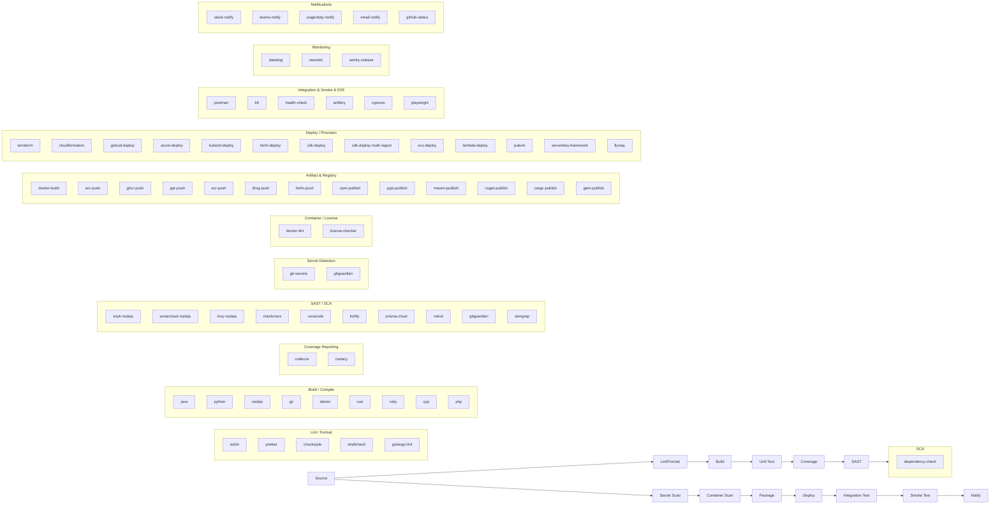
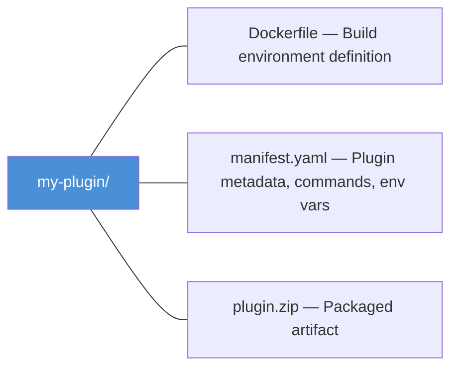

# Plugin Catalog

Pipeline Builder ships with **125 plugins** across **10 categories**, covering the full CI/CD lifecycle from source checkout through deployment and notification. Every plugin runs as an isolated container step inside AWS CodePipeline, so your build environment is reproducible and your secrets never leak into image layers.

**Related docs:** [Samples](../samples.md) | [Metadata Keys](../metadata-keys.md) | [API Reference](../api-reference.md) | [Environment Variables](../environment-variables.md)

## Table of Contents

- [Categories](#categories) -- All 10 plugin categories with links
- [CI/CD Pipeline Coverage](#cicd-pipeline-coverage) -- Visual diagram of plugin-to-stage mapping
- [Requirements](#requirements) -- How plugins work with CodePipeline
- [Secrets Reference](#secrets-reference) -- Required credentials per plugin
- [How Secrets Work](#how-secrets-work) -- Secrets Manager naming, setup, and IAM
- [Plugin Structure](#plugin-structure) -- Dockerfile + manifest layout
- [Version Management](#version-management) -- Centralized version control and update process

---

## Categories

| Category | Plugins | Description | Doc |
|----------|---------|-------------|-----|
| Language | 11 | Build, test, and compile across major languages | [language.md](language.md) |
| Security | 40 | SAST, SCA, secret detection, container scanning, license compliance | [security.md](security.md) |
| Quality | 17 | Linting, formatting, static analysis, code coverage reporting | [quality.md](quality.md) |
| Monitoring | 3 | APM and release tracking | [monitoring.md](monitoring.md) |
| Artifact & Registry | 16 | Package publishing, container image push, and binary compilation | [artifact.md](artifact.md) |
| Deploy | 11 | Cloud provisioning, K8s, serverless, database migration | [deploy.md](deploy.md) |
| Infrastructure | 5 | AWS CDK synth/deploy, pipeline utilities (approval gates, caching) | [infrastructure.md](infrastructure.md) |
| Testing | 14 | Unit, integration, API contract, load/performance, E2E browser, and smoke testing | [testing.md](testing.md) |
| Notification | 5 | Pipeline status alerts (Slack, Teams, PagerDuty, email, GitHub) | [notification.md](notification.md) |
| AI | 2 | AI-powered Dockerfile generation (local + cloud) | [ai.md](ai.md) |

---

## CI/CD Pipeline Coverage

The diagram below shows which plugins map to each stage of a typical CI/CD pipeline.



---

## Requirements

- **All plugins run as AWS CodeBuild steps** (`CodeBuildStep` in `CodePipeline`). The Pipeline Builder CDK construct wires each plugin into the pipeline as an isolated build action.
- **Each plugin consists of three files**: a `Dockerfile` that defines the build environment, a `manifest.yaml` that declares metadata and commands, and a `plugin.zip` that packages both for upload.
- **Plugins requiring tokens or API keys inject them at runtime** via CodeBuild environment secrets (backed by AWS Secrets Manager or SSM Parameter Store). Secrets are **never** baked into the Dockerfile via `ENV` or `ARG` instructions.

Refer to the [Secrets Reference](#secrets-reference) table below for a complete list of vendor plugins and their required secrets.

---

## Secrets Reference

The following table lists every plugin that requires external tokens or credentials. All secrets are injected at runtime through CodeBuild environment variables and should be stored in AWS Secrets Manager.

| Plugin | Category | Required Secrets | Source |
|--------|----------|-----------------|--------|
| snyk-nodejs | security | `SNYK_TOKEN` | [snyk.io](https://snyk.io) |
| sonarcloud-nodejs | security | `SONAR_TOKEN` | [sonarcloud.io](https://sonarcloud.io) |
| dependency-check | security | `NVD_API_KEY` (optional) | [nvd.nist.gov](https://nvd.nist.gov) |
| veracode | security | `VERACODE_API_ID`, `VERACODE_API_KEY` | [veracode.com](https://veracode.com) |
| checkmarx | security | `CX_CLIENT_SECRET` | [checkmarx.com](https://checkmarx.com) |
| prisma-cloud | security | `PRISMA_ACCESS_KEY`, `PRISMA_SECRET_KEY` | [paloaltonetworks.com](https://www.paloaltonetworks.com) |
| mend | security | `MEND_API_KEY`, `MEND_ORG_TOKEN` | [mend.io](https://www.mend.io) |
| gitguardian | security | `GITGUARDIAN_API_KEY` | [gitguardian.com](https://www.gitguardian.com) |
| fortify | security | `FOD_CLIENT_ID`, `FOD_CLIENT_SECRET` or `FORTIFY_SSC_TOKEN` | [microfocus.com](https://www.microfocus.com) |
| semgrep | security | `SEMGREP_APP_TOKEN` (optional) | [semgrep.dev](https://semgrep.dev) |
| codecov | quality | `CODECOV_TOKEN` | [codecov.io](https://codecov.io) |
| codacy | quality | `CODACY_PROJECT_TOKEN` | [codacy.com](https://www.codacy.com) |
| datadog | monitoring | `DD_API_KEY` | [datadoghq.com](https://www.datadoghq.com) |
| newrelic | monitoring | `NEW_RELIC_API_KEY` | [newrelic.com](https://newrelic.com) |
| sentry-release | monitoring | `SENTRY_AUTH_TOKEN` | [sentry.io](https://sentry.io) |
| docker-build | artifact | ECR: IAM role / DockerHub: `DOCKER_USERNAME`, `DOCKER_PASSWORD` | - |
| ghcr-push | artifact | `GITHUB_TOKEN` | [github.com](https://github.com) |
| gar-push | artifact | `GOOGLE_APPLICATION_CREDENTIALS` | [cloud.google.com](https://cloud.google.com) |
| acr-push | artifact | `AZURE_CLIENT_ID`, `AZURE_CLIENT_SECRET`, `AZURE_TENANT_ID` | [azure.microsoft.com](https://azure.microsoft.com) |
| jfrog-push | artifact | `JFROG_TOKEN` | [jfrog.com](https://jfrog.com) |
| npm-publish | artifact | `NPM_TOKEN` | [npmjs.com](https://www.npmjs.com) |
| pypi-publish | artifact | `TWINE_USERNAME`, `TWINE_PASSWORD` | [pypi.org](https://pypi.org) |
| maven-publish | artifact | `OSSRH_USERNAME`, `OSSRH_PASSWORD`, `GPG_PASSPHRASE` | [central.sonatype.com](https://central.sonatype.com) |
| nuget-publish | artifact | `NUGET_API_KEY` | [nuget.org](https://www.nuget.org) |
| cargo-publish | artifact | `CARGO_REGISTRY_TOKEN` | [crates.io](https://crates.io) |
| gem-publish | artifact | `GEM_HOST_API_KEY` | [rubygems.org](https://rubygems.org) |
| pulumi | deploy | `PULUMI_ACCESS_TOKEN` | [pulumi.com](https://www.pulumi.com) |
| gcloud-deploy | deploy | `GOOGLE_APPLICATION_CREDENTIALS` | [cloud.google.com](https://cloud.google.com) |
| azure-deploy | deploy | `AZURE_CLIENT_ID`, `AZURE_CLIENT_SECRET`, `AZURE_TENANT_ID` | [azure.microsoft.com](https://azure.microsoft.com) |
| kubectl-deploy | deploy | `KUBECONFIG` or cluster credentials | - |
| helm-deploy | deploy | `KUBECONFIG` or cluster credentials | - |
| flyway | deploy | `FLYWAY_URL`, `FLYWAY_USER`, `FLYWAY_PASSWORD` | [flywaydb.org](https://flywaydb.org) |
| slack-notify | notification | `SLACK_WEBHOOK_URL` | [api.slack.com](https://api.slack.com) |
| teams-notify | notification | `TEAMS_WEBHOOK_URL` | [learn.microsoft.com](https://learn.microsoft.com) |
| pagerduty-notify | notification | `PAGERDUTY_ROUTING_KEY` | [pagerduty.com](https://www.pagerduty.com) |
| email-notify | notification | `SMTP_PASSWORD` (optional) | - |
| github-status | notification | `GITHUB_TOKEN` | [github.com](https://github.com) |
| dockerfile-multi-provider | ai | `AI_API_KEY` (varies by provider) | - |

---

## How Secrets Work

Plugin secrets are resolved at **pipeline synth time** through AWS Secrets Manager. Each organization stores secrets in their own AWS account using a naming convention. The pipeline builder never stores secret values — it only references them by name.

### Naming Convention

```
pipeline-builder/{orgId}/{secretName}
```

For example, if your organization ID is `acme-corp` and a plugin requires `SNYK_TOKEN`, create this secret in AWS Secrets Manager:

```
pipeline-builder/acme-corp/SNYK_TOKEN
```

### Setup Steps

1. **Check which secrets a plugin requires** — look at the `secrets` field in the plugin's manifest or the [Secrets Reference](#secrets-reference) table above.

2. **Create secrets in AWS Secrets Manager** in your AWS account:
   ```bash
   aws secretsmanager create-secret \
     --name "pipeline-builder/my-org-id/SNYK_TOKEN" \
     --secret-string "your-token-value"
   ```

3. **Deploy your pipeline** — the pipeline builder automatically injects each declared secret as a `SECRETS_MANAGER`-type environment variable in the CodeBuild step. No additional configuration is needed in the pipeline definition.

### How It Works at Build Time

When a pipeline is synthesized, the builder:

1. Reads the plugin's `secrets` array from the database
2. For each secret, generates a CodeBuild environment variable with `type: SECRETS_MANAGER` and `value: pipeline-builder/{orgId}/{secretName}`
3. At build time, AWS CodeBuild resolves the secret name from Secrets Manager and injects the plaintext value into the build environment

```yaml
# What the plugin manifest declares:
secrets:
  - name: SNYK_TOKEN
    required: true
    description: "Snyk API token for vulnerability scanning"

# What CodeBuild receives (generated automatically):
environmentVariables:
  SNYK_TOKEN:
    value: pipeline-builder/acme-corp/SNYK_TOKEN
    type: SECRETS_MANAGER
```

### Required vs Optional Secrets

- **`required: true`** — The secret must exist in Secrets Manager before the pipeline runs. CodeBuild will fail if it can't resolve the secret.
- **`required: false`** — The secret is still injected if it exists, but the plugin should handle the case where it's missing (e.g., skip an optional integration).

### Multi-Organization Isolation

Each organization's secrets are scoped by their `orgId` in the naming convention. This means:

- Organization `acme-corp` stores secrets under `pipeline-builder/acme-corp/*`
- Organization `globex` stores secrets under `pipeline-builder/globex/*`
- Two orgs using the same plugin (e.g., Snyk) each manage their own `SNYK_TOKEN` independently
- Secrets never cross organizational boundaries

### IAM Permissions

The CodeBuild service role must have permission to read secrets matching the naming pattern. Add this policy to your CodeBuild role:

```json
{
  "Effect": "Allow",
  "Action": "secretsmanager:GetSecretValue",
  "Resource": "arn:aws:secretsmanager:*:*:secret:pipeline-builder/{orgId}/*"
}
```

Replace `{orgId}` with your actual organization ID or use a wildcard for multi-org setups.

---

## Plugin Structure

Every plugin follows the same three-file layout:



The `manifest.yaml` declares everything the pipeline builder needs to wire the plugin into a CodeBuild step:

```yaml
name: my-plugin
description: ...
keywords: [...]
version: 1.0.0
pluginType: CodeBuildStep
computeType: SMALL | MEDIUM | LARGE
timeout: 15
failureBehavior: fail
secrets:
  - name: MY_TOKEN
    required: true
    description: "API token for the service"
primaryOutputDirectory: output-dir
dockerfile: Dockerfile
installCommands:
  - ...
commands:
  - ...
env:
  KEY: value
```

| Field | Description |
|-------|-------------|
| `name` | Unique plugin identifier used in pipeline definitions |
| `description` | Human-readable summary shown in the plugin catalog |
| `keywords` | Tags for search and categorization |
| `version` | Semantic version of the plugin |
| `pluginType` | Must be `CodeBuildStep` (the only supported type) |
| `computeType` | CodeBuild instance size: `SMALL` (3 GB / 2 vCPU), `MEDIUM` (7 GB / 4 vCPU), or `LARGE` (15 GB / 8 vCPU) |
| `timeout` | Maximum execution time in minutes |
| `failureBehavior` | What happens on failure: `fail` (stop pipeline), `warn` (continue with warning), `ignore` |
| `secrets` | List of required secrets with `name`, `required` (boolean), and `description` |
| `primaryOutputDirectory` | Directory where build artifacts are written |
| `dockerfile` | Path to the Dockerfile relative to the plugin root |
| `installCommands` | Commands run during the install phase (dependency setup) |
| `commands` | Commands run during the build phase (the actual work) |
| `env` | Default environment variables (non-secret values only) |

---

## Version Management

All tool versions are centralized in [`deploy/plugins/plugin-versions.yaml`](../../deploy/plugins/plugin-versions.yaml). This is the single source of truth for every tool version across all plugins.

### Install Types (ranked by fragility, lowest to highest)

| Type | Method | Example |
|------|--------|---------|
| `copy_from` | `COPY --from=image:tag` — no URLs, most resilient | hadolint, trivy, k6 |
| `npm` / `pip` | Package manager install | snyk, codecov, checkov |
| `curl_tar` | `curl \| tar` from GitHub release tarball | helm, checkmarx CLI |
| `curl_bin` | `curl -o` single binary download | codacy, kubectl |
| `curl_zip` | `curl` + `unzip` | rain, sonar-scanner |
| `script` | Vendor install script (least resilient) | veracode |

### Dockerfile Patterns

**Multi-stage `COPY --from` (preferred)**:
```dockerfile
ARG TOOL_VERSION=1.0.0
FROM vendor/tool:v${TOOL_VERSION} AS tool-src
FROM ubuntu:24.04
ARG TOOL_VERSION
COPY --from=tool-src /usr/bin/tool /opt/tool/versions/tool-${TOOL_VERSION}
RUN ln -sf /opt/tool/versions/tool-${TOOL_VERSION} /usr/local/bin/tool
```

Key rules:
- `ARG` before `FROM` for image tag parameterization
- Re-declare `ARG` after `FROM` for use in the build stage
- Use `curl` (not `wget`) for downloads
- Version ARG defaults must match `plugin-versions.yaml` defaults

### Verification Scripts

```bash
# Verify all tool versions are downloadable/pullable
./deploy/bin/generate-plugins.sh --verify

# Check a single tool
./deploy/bin/generate-plugins.sh --check-one trivy

# Dump the parsed version matrix
./deploy/bin/generate-plugins.sh --dump

# Verify URLs directly from Dockerfiles
./deploy/bin/verify-plugin-urls.sh
```

### Updating a Version

1. Edit the version in `deploy/plugins/plugin-versions.yaml`
2. Update the corresponding Dockerfile `ARG` default
3. Run `./deploy/bin/generate-plugins.sh --check-one <tool>` to verify
4. Re-zip the plugin: `cd deploy/plugins/<category>/<plugin> && rm plugin.zip && zip -r plugin.zip . -x '*.zip'`
