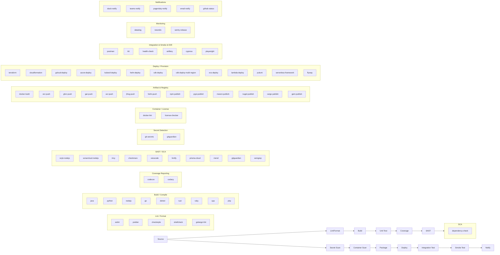
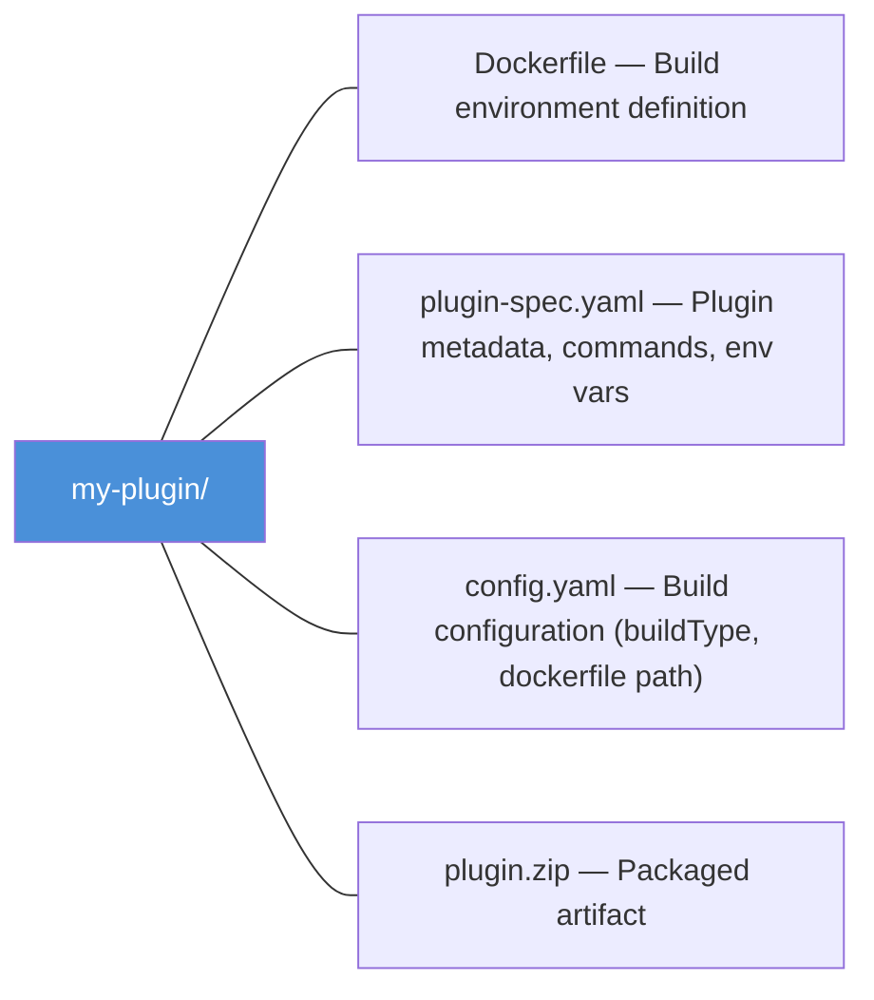

# Plugin Catalog

Pipeline Builder ships with **119 plugins** across **10 categories**, covering the full CI/CD lifecycle from source checkout through deployment and notification. All but one run as an isolated containerized `CodeBuildStep` inside AWS CodePipeline (the exception is `infrastructure/manual-approval`, a native `ManualApprovalStep` gate), so your build environment is reproducible and your secrets never leak into image layers.

**Related docs:** [Samples](../samples.md) | [Metadata Keys](../metadata-keys.md) | [API Reference](../api-reference.md) | [Environment Variables](../environment-variables.md)

## Table of Contents

- [Categories](#categories) -- All 10 plugin categories with links
- [CI/CD Pipeline Coverage](#cicd-pipeline-coverage) -- Visual diagram of plugin-to-stage mapping
- [Requirements](#requirements) -- How plugins work with CodePipeline
- [Secrets Reference](#secrets-reference) -- Required credentials per plugin
- [How Secrets Work](#how-secrets-work) -- Secrets Manager naming, setup, and IAM
- [Plugin Structure](#plugin-structure) -- Dockerfile + spec layout
- [Catalog metadata](#catalog-metadata) -- Detected from the package, then accepted or edited
- [Supply Chain](#supply-chain-sbom-signature-provenance) -- SBOM, image signing, provenance, digest pinning
- [Vulnerability scanning](#vulnerability-scanning) -- grype over the signed SBOM, nightly rescan, compliance facts
- [Version lifecycle](#version-lifecycle-deprecate-yank-delete) -- Deprecate, yank, and safe delete
- [Publishing to the ecosystem](#publishing-to-the-ecosystem) -- Listings, the `public/*` namespace, trust tiers, the Official catalog, installs ([Plugin Publishing](../plugin-publishing.md), [Plugin Installing](../plugin-installing.md))
- [Version Management](#version-management) -- Centralized version control and update process

---

## Categories

| Category | Plugins | Description | Doc |
|----------|---------|-------------|-----|
| Language | 11 | Build, test, and compile across major languages | [language.md](language.md) |
| Security | 34 | SAST, SCA, secret detection, container scanning, license compliance | [security.md](security.md) |
| Quality | 17 | Linting, formatting, static analysis, code coverage reporting | [quality.md](quality.md) |
| Monitoring | 3 | APM and release tracking | [monitoring.md](monitoring.md) |
| Artifact & Registry | 16 | Package publishing, container image push, and binary compilation | [artifact.md](artifact.md) |
| Deploy | 13 | Cloud provisioning, K8s, serverless, database migration | [deploy.md](deploy.md) |
| Infrastructure | 5 | AWS CDK synth, pipeline utilities (approval gates, S3 cache, raw shell step) | [infrastructure.md](infrastructure.md) |
| Testing | 14 | Unit, integration, API contract, load/performance, E2E browser, and smoke testing | [testing.md](testing.md) |
| Notification | 5 | Pipeline status alerts (Slack, Teams, PagerDuty, email, GitHub) | [notification.md](notification.md) |
| AI | 1 | AI-powered Dockerfile generation (multi-provider) | [ai.md](ai.md) |

---

## CI/CD Pipeline Coverage

The diagram below shows which plugins map to each stage of a typical CI/CD pipeline.


```mermaid
flowchart LR
    Source --> Lint/Format
    Lint/Format --> Build
    Build --> Test[Unit Test]
    Test --> Coverage
    Coverage --> SAST
    SAST --> SCA
    Source --> SecretScan[Secret Scan]
    SecretScan --> ContainerScan[Container Scan]
    ContainerScan --> Package
    Package --> Deploy
    Deploy --> Integration[Integration Test]
    Integration --> Smoke[Smoke Test]
    Smoke --> Notify

    subgraph "Lint / Format"
        direction TB
        eslint
        prettier
        checkstyle
        shellcheck
        golangci-lint
    end

    subgraph "Build / Compile"
        direction TB
        java
        python
        nodejs
        go
        dotnet
        rust
        ruby
        cpp
        php
    end

    subgraph "Coverage Reporting"
        direction TB
        codecov
        codacy
    end

    subgraph "SAST / SCA"
        direction TB
        snyk-nodejs
        sonarcloud-nodejs
        trivy
        checkmarx
        veracode
        fortify
        prisma-cloud
        mend
        gitguardian_sast[gitguardian]
        semgrep
    end

    subgraph "SCA"
        direction TB
        dependency-check
    end

    subgraph "Secret Detection"
        direction TB
        git-secrets
        gitguardian_sec[gitguardian]
    end

    subgraph "Container / License"
        direction TB
        docker-lint
        license-checker
    end

    subgraph "Artifact & Registry"
        direction TB
        docker-build
        ecr-push
        ghcr-push
        gar-push
        acr-push
        jfrog-push
        helm-push
        npm-publish
        pypi-publish
        maven-publish
        nuget-publish
        cargo-publish
        gem-publish
    end

    subgraph "Deploy / Provision"
        direction TB
        terraform
        cloudformation
        gcloud-deploy
        azure-deploy
        kubectl-deploy
        helm-deploy
        cdk-deploy
        cdk-deploy-multi-region
        ecs-deploy
        lambda-deploy
        pulumi
        serverless-framework
        flyway
    end

    subgraph "Integration & Smoke & E2E"
        direction TB
        postman
        k6
        health-check
        artillery
        cypress
        playwright
    end

    subgraph "Monitoring"
        direction TB
        datadog
        newrelic
        sentry-release
    end

    subgraph "Notifications"
        direction TB
        slack-notify
        teams-notify
        pagerduty-notify
        email-notify
        github-status
    end
```

---

## Requirements

- **All plugins run as AWS CodeBuild steps** (`CodeBuildStep` in `CodePipeline`). The Pipeline Builder CDK construct wires each plugin into the pipeline as an isolated build action.
- **Each plugin consists of three files**: a `Dockerfile` that defines the build environment, a `plugin-spec.yaml` that declares metadata and commands, and a `plugin.zip` that packages both for upload.
- **Plugins requiring tokens or API keys inject them at runtime** via CodeBuild environment secrets (backed by AWS Secrets Manager or SSM Parameter Store). Secrets are **never** baked into the Dockerfile via `ENV` or `ARG` instructions.

Refer to the [Secrets Reference](#secrets-reference) table below for a complete list of vendor plugins and their required secrets.

---

## Secrets Reference

The following table lists every plugin that requires external tokens or credentials. All secrets are injected at runtime through CodeBuild environment variables and should be stored in AWS Secrets Manager.

| Plugin | Category | Required Secrets | Source |
|--------|----------|-----------------|--------|
| snyk-nodejs | security | `SNYK_TOKEN` | [snyk.io](https://snyk.io) |
| sonarcloud-nodejs | security | `SONAR_TOKEN` | [sonarcloud.io](https://sonarcloud.io) |
| dependency-check | security | `NVD_API_KEY` (optional) | [nvd.nist.gov](https://nvd.nist.gov) |
| veracode | security | `VERACODE_API_ID`, `VERACODE_API_KEY` | [veracode.com](https://veracode.com) |
| checkmarx | security | `CX_CLIENT_SECRET` | [checkmarx.com](https://checkmarx.com) |
| prisma-cloud | security | `PRISMA_ACCESS_KEY`, `PRISMA_SECRET_KEY` | [paloaltonetworks.com](https://www.paloaltonetworks.com) |
| mend | security | `MEND_API_KEY`, `MEND_ORG_TOKEN` | [mend.io](https://www.mend.io) |
| gitguardian | security | `GITGUARDIAN_API_KEY` | [gitguardian.com](https://www.gitguardian.com) |
| fortify | security | `FOD_CLIENT_ID`, `FOD_CLIENT_SECRET` or `FORTIFY_SSC_TOKEN` | [microfocus.com](https://www.microfocus.com) |
| semgrep | security | `SEMGREP_APP_TOKEN` (optional) | [semgrep.dev](https://semgrep.dev) |
| codecov | quality | `CODECOV_TOKEN` | [codecov.io](https://codecov.io) |
| codacy | quality | `CODACY_PROJECT_TOKEN` | [codacy.com](https://www.codacy.com) |
| datadog | monitoring | `DD_API_KEY` | [datadoghq.com](https://www.datadoghq.com) |
| newrelic | monitoring | `NEW_RELIC_API_KEY` | [newrelic.com](https://newrelic.com) |
| sentry-release | monitoring | `SENTRY_AUTH_TOKEN` | [sentry.io](https://sentry.io) |
| docker-build | artifact | ECR: IAM role / DockerHub: `DOCKER_USERNAME`, `DOCKER_PASSWORD` | - |
| ghcr-push | artifact | `GITHUB_TOKEN` | [github.com](https://github.com) |
| gar-push | artifact | `GOOGLE_APPLICATION_CREDENTIALS` | [cloud.google.com](https://cloud.google.com) |
| acr-push | artifact | `AZURE_CLIENT_ID`, `AZURE_CLIENT_SECRET`, `AZURE_TENANT_ID` | [azure.microsoft.com](https://azure.microsoft.com) |
| jfrog-push | artifact | `JFROG_TOKEN` | [jfrog.com](https://jfrog.com) |
| npm-publish | artifact | `NPM_TOKEN` | [npmjs.com](https://www.npmjs.com) |
| pypi-publish | artifact | `TWINE_PASSWORD` | [pypi.org](https://pypi.org) |
| maven-publish | artifact | `OSSRH_USERNAME`, `OSSRH_PASSWORD`, `GPG_PASSPHRASE` | [central.sonatype.com](https://central.sonatype.com) |
| nuget-publish | artifact | `NUGET_API_KEY` | [nuget.org](https://www.nuget.org) |
| cargo-publish | artifact | `CARGO_REGISTRY_TOKEN` | [crates.io](https://crates.io) |
| gem-publish | artifact | `GEM_HOST_API_KEY` | [rubygems.org](https://rubygems.org) |
| pulumi | deploy | `PULUMI_ACCESS_TOKEN` | [pulumi.com](https://www.pulumi.com) |
| gcloud-deploy | deploy | `GOOGLE_APPLICATION_CREDENTIALS` | [cloud.google.com](https://cloud.google.com) |
| azure-deploy | deploy | `AZURE_CLIENT_ID`, `AZURE_CLIENT_SECRET`, `AZURE_TENANT_ID` | [azure.microsoft.com](https://azure.microsoft.com) |
| kubectl-deploy | deploy | `KUBECONFIG_DATA` (base64) | - |
| helm-deploy | deploy | `KUBECONFIG_DATA` (base64) | - |
| flyway | deploy | `FLYWAY_USER`, `FLYWAY_PASSWORD` | [flywaydb.org](https://flywaydb.org) |
| slack-notify | notification | `SLACK_WEBHOOK_URL` | [api.slack.com](https://api.slack.com) |
| teams-notify | notification | `TEAMS_WEBHOOK_URL` | [learn.microsoft.com](https://learn.microsoft.com) |
| pagerduty-notify | notification | `PAGERDUTY_ROUTING_KEY` | [pagerduty.com](https://www.pagerduty.com) |
| email-notify | notification | `SMTP_PASSWORD` (optional) | - |
| github-status | notification | `GITHUB_TOKEN` | [github.com](https://github.com) |
| dockerfile-multi-provider | ai | `AI_API_KEY` (varies by provider) | - |

---

## How Secrets Work

Plugin secrets are resolved at **pipeline synth time** through AWS Secrets Manager. Each organization stores secrets in their own AWS account using a naming convention. The pipeline builder never stores secret values — it only references them by name.

### Naming Convention

```
pipeline-builder/{orgId}/{secretName}
```

For example, if your organization ID is `acme-corp` and a plugin requires `SNYK_TOKEN`, create this secret in AWS Secrets Manager:

```
pipeline-builder/acme-corp/SNYK_TOKEN
```

### Setup Steps

1. **Check which secrets a plugin requires** — look at the `secrets` field in the plugin's spec or the [Secrets Reference](#secrets-reference) table above.

2. **Create secrets in AWS Secrets Manager** in your AWS account:
   ```bash
   aws secretsmanager create-secret \
     --name "pipeline-builder/my-org-id/SNYK_TOKEN" \
     --secret-string "your-token-value"
   ```

3. **Deploy your pipeline** — the pipeline builder automatically injects each declared secret as a `SECRETS_MANAGER`-type environment variable in the CodeBuild step. No additional configuration is needed in the pipeline definition.

### Obtaining credentials

Where to get each value before you store it under `pipeline-builder/{orgId}/{secretName}`. Store the token exactly as the secret name in the plugin's [Secrets Reference](#secrets-reference) row.

**Security & quality tokens**

- **`SNYK_TOKEN`** — [snyk.io](https://snyk.io) → Account settings → **General → Auth Token** (or **Service accounts** for CI). Shared by all `snyk-*` variants.
- **`SONAR_TOKEN`** — [sonarcloud.io](https://sonarcloud.io) → **My Account → Security → Generate Token**. SonarCloud also needs **`SONAR_ORGANIZATION`** + **`SONAR_PROJECT_KEY`** (env, from the project's *Information* panel) — set those as step metadata, not secrets.
- **`GITGUARDIAN_API_KEY`** — [dashboard.gitguardian.com](https://dashboard.gitguardian.com) → **API → Personal access tokens** with the `scan` scope.
- **`CODECOV_TOKEN`** — [codecov.io](https://codecov.io) → your repo → **Settings → Repository Upload Token**.
- **`CODACY_PROJECT_TOKEN`** — Codacy → project → **Settings → Integrations → Project API token**.
- **Enterprise scanners** (`veracode`, `checkmarx`, `fortify`, `prisma-cloud`, `mend`) — generate API credentials in each vendor's console (API ID/key, client secret, or access/secret key pair); see the [Security → Enterprise](security.md#enterprise-vendor) table for the exact secret names.

**Monitoring**

- **`DD_API_KEY`** — [Datadog](https://app.datadoghq.com) → **Organization Settings → API Keys**.
- **`NEW_RELIC_API_KEY`** — New Relic → **Administration → API keys** (a **User** key).
- **`SENTRY_AUTH_TOKEN`** — Sentry → **Settings → Developer Settings → Auth Tokens** with `project:releases`.

**Notifications**

- **`SLACK_WEBHOOK_URL`** — [api.slack.com/apps](https://api.slack.com/apps) → create an app → **Incoming Webhooks** → *Add New Webhook to Workspace* → copy the `https://hooks.slack.com/services/…` URL.
- **`TEAMS_WEBHOOK_URL`** — Teams channel → **Connectors → Incoming Webhook** → copy the URL.
- **`PAGERDUTY_ROUTING_KEY`** — PagerDuty service → **Integrations → Events API v2** → copy the Integration/Routing key.
- **`GITHUB_TOKEN`** (`github-status`, `ghcr-push`) — [github.com/settings/tokens](https://github.com/settings/tokens): `repo:status` for status checks, `write:packages` for GHCR.

**Package & registry publishing**

- **`NPM_TOKEN`** — [npmjs.com](https://www.npmjs.com) → **Access Tokens → Generate** (Automation). **`NUGET_API_KEY`** — nuget.org → **API Keys**. **`CARGO_REGISTRY_TOKEN`** — crates.io → **Account Settings → API Tokens**. **`GEM_HOST_API_KEY`** — rubygems.org → **Settings → API keys**. **`TWINE_PASSWORD`** — PyPI → **Account settings → API tokens** (username `__token__`).
- **Container registries** — `ghcr-push` uses a `GITHUB_TOKEN` with `write:packages`; `gar-push` a GCP service-account JSON (`GOOGLE_APPLICATION_CREDENTIALS`); `acr-push` an Azure service principal (`AZURE_CLIENT_ID`/`_SECRET`/`_TENANT_ID`); `jfrog-push` a JFrog identity token. **`ecr-push` needs no secret** — it authenticates with the CodeBuild role's IAM.

**Deploy**

- **`KUBECONFIG_DATA`** (`kubectl-deploy`, `helm-deploy`) — base64-encode a kubeconfig scoped to a deploy service account: `base64 -w0 ~/.kube/config`, store the output.
- **`PULUMI_ACCESS_TOKEN`** — [app.pulumi.com](https://app.pulumi.com) → **Access Tokens**. **`GOOGLE_APPLICATION_CREDENTIALS`** (`gcloud-deploy`) — a GCP service-account key JSON. **`FLYWAY_USER`/`FLYWAY_PASSWORD`** — your database credentials (`FLYWAY_URL` is env, not a secret).
- **AWS-native deploy plugins** (`cdk-deploy`, `ecs-deploy`, `lambda-deploy`, `cloudformation`) authenticate via the CodeBuild role's IAM — **no secret to store**.

**AI**

- **`AI_API_KEY`** (`dockerfile-multi-provider`) — the API key for your `AI_PROVIDER` (Anthropic/OpenAI/Google/xAI). **`bedrock` needs no key** — it uses the CodeBuild role's IAM.

### How It Works at Build Time

When a pipeline is synthesized, the builder:

1. Reads the plugin's `secrets` array from the database
2. For each secret, generates a CodeBuild environment variable with `type: SECRETS_MANAGER` and `value: pipeline-builder/{orgId}/{secretName}`
3. At build time, AWS CodeBuild resolves the secret name from Secrets Manager and injects the plaintext value into the build environment

```yaml
# What the plugin spec declares:
secrets:
  - name: SNYK_TOKEN
    required: true
    description: "Snyk API token for vulnerability scanning"

# What CodeBuild receives (generated automatically):
environmentVariables:
  SNYK_TOKEN:
    value: pipeline-builder/acme-corp/SNYK_TOKEN
    type: SECRETS_MANAGER
```

### Required vs Optional Secrets

- **`required: true`** — The secret must exist in Secrets Manager before the pipeline runs. CodeBuild will fail if it can't resolve the secret.
- **`required: false`** — The secret is still injected if it exists, but the plugin should handle the case where it's missing (e.g., skip an optional integration).

### Multi-Organization Isolation

Each organization's secrets are scoped by their `orgId` in the naming convention. This means:

- Organization `acme-corp` stores secrets under `pipeline-builder/acme-corp/*`
- Organization `globex` stores secrets under `pipeline-builder/globex/*`
- Two orgs using the same plugin (e.g., Snyk) each manage their own `SNYK_TOKEN` independently
- Secrets never cross organizational boundaries

### IAM Permissions

The CodeBuild service role must have permission to read secrets matching the naming pattern. Add this policy to your CodeBuild role:

```json
{
  "Effect": "Allow",
  "Action": "secretsmanager:GetSecretValue",
  "Resource": "arn:aws:secretsmanager:*:*:secret:pipeline-builder/{orgId}/*"
}
```

Replace `{orgId}` with your actual organization ID or use a wildcard for multi-org setups.

---

## Plugin Structure

> **Adding a plugin?** See [`deploy/plugins/README.md`](https://github.com/mwashburn160/pipeline-builder/blob/main/deploy/plugins/README.md) for the contributor guide — directory layout, build/test/load workflow, multistage patterns, and conventions.

Every plugin follows this layout:


```mermaid
graph LR
    ROOT["my-plugin/"]
    ROOT --- A["Dockerfile — Build environment definition"]
    ROOT --- B["plugin-spec.yaml — Plugin metadata, commands, env vars"]
    ROOT --- C["config.yaml — Build configuration (buildType, dockerfile path)"]
    ROOT --- D["plugin.zip — Packaged artifact"]

    style ROOT fill:#4A90D9,color:#fff
```

### Shared base image

Most plugin Dockerfiles start with `FROM pipeline-plugin-base:24.04` — a shared base built from [`deploy/plugins/_base/_plugin-base/Dockerfile`](https://github.com/mwashburn160/pipeline-builder/blob/main/deploy/plugins/_base/_plugin-base/Dockerfile) (on `ubuntu:24.04`) that provides common system deps (`git`, `curl`, `jq`, `ca-certificates`, `gnupg`, `wget`, `unzip`, `zip`, `xz-utils`). Saves ~80 MB per image via Docker layer dedup, and gives one place to patch a CVE in a base dep instead of editing every plugin. The base also ships an `apt-retry-install` helper that wraps `apt-get` in a retry loop with backoff, so per-plugin package installs self-heal through transient mirror flaps.

7 plugins use multistage builds to drop heavy build-time dependencies that aren't needed at runtime — see the [multistage patterns](https://github.com/mwashburn160/pipeline-builder/blob/main/deploy/plugins/README.md#multistage-patterns) section in the contributor README.

### Build Types

Plugins support three build strategies, configured via `config.yaml`:

| buildType | Description | config.yaml | plugin.zip contains |
|-----------|-------------|-------------|---------------------|
| `build_image` (default) | Build Docker image from Dockerfile at upload time | `buildType: build_image` + `dockerfile: Dockerfile` | plugin-spec.yaml + config.yaml + Dockerfile |
| `prebuilt` | Use a pre-built Docker image (via `build-plugin-images.sh`) | `buildType: prebuilt` | plugin-spec.yaml + config.yaml + image.tar |
| `metadata_only` | No Docker build at all — the step runs on CodeBuild's default image. **Auto-detected** when the bundle has neither a Dockerfile nor an `image.tar` | `buildType: metadata_only` | plugin-spec.yaml + config.yaml |

To pre-build all plugin images:
```bash
./deploy/bin/build-plugin-images.sh          # build all, prompt for existing
./deploy/bin/build-plugin-images.sh --force  # rebuild all
./deploy/bin/build-plugin-images.sh --reset  # revert all to build_image
```

The `plugin-spec.yaml` declares everything the pipeline builder needs to wire the plugin into a CodeBuild step:

```yaml
name: my-plugin
description: ...
keywords: [...]
category: security
version: 1.0.0
pluginType: CodeBuildStep
computeType: SMALL | MEDIUM | LARGE
timeout: 15
failureBehavior: fail
secrets:
  - name: MY_TOKEN
    required: true
    description: "API token for the service"
primaryOutputDirectory: output-dir
dockerfile: Dockerfile
installCommands:
  - ...
commands:
  - ...
env:
  KEY: value
```

| Field | Description |
|-------|-------------|
| `name` | Unique plugin identifier used in pipeline definitions |
| `description` | Human-readable summary shown in the plugin catalog |
| `keywords` | Tags for search and categorization |
| `category` | Catalog category the plugin belongs to (e.g. `security`, `deploy`) |
| `version` | Semantic version of the plugin |
| `pluginType` | `CodeBuildStep` (default), `ManualApprovalStep` (a native gate — see `infrastructure/manual-approval`), or `ShellStep` |
| `computeType` | CodeBuild instance size: `SMALL` (3 GB / 2 vCPU), `MEDIUM` (7 GB / 4 vCPU), `LARGE` (15 GB / 8 vCPU), or `X2_LARGE` (145 GB / 72 vCPU) |
| `timeout` | Maximum execution time in minutes |
| `failureBehavior` | What happens on failure: `fail` (stop pipeline), `warn` (continue with warning), `ignore` |
| `secrets` | List of required secrets with `name`, `required` (boolean), and `description` |
| `primaryOutputDirectory` | Directory where build artifacts are written |
| `dockerfile` | Path to the Dockerfile relative to the plugin root |
| `installCommands` | Commands run during the install phase (dependency setup) |
| `commands` | Commands run during the build phase (the actual work) |
| `env` | Default environment variables (non-secret values only) |
| `smokeTest` | Optional shell command run after `docker build` to assert the tool is on `PATH` and reports a version |
| `summary` | Optional one-line card summary (≤ 160). When absent it is the first sentence of the description |
| `license` | SPDX license identifier from the allowlist (e.g. `Apache-2.0`, `MIT`) |
| `homepageUrl`, `sourceUrl`, `documentationUrl` | Project links — `https:` only, no URL shorteners, no credentials |
| `icon` | Curated icon key (`trivy`) or `{ key, badge }` |
| `changelog` | Release notes for this version (markdown, ≤ 32 KB) |

---

## Catalog metadata

The descriptive fields a version shows in the catalog are **detected from the
package** and then **accepted or edited** at upload. The package supplies the
defaults; you have the last word — on descriptive fields only.

**Where each field comes from** (the first non-empty source wins):

| Field | 1. `plugin-spec.yaml` | 2. `README.md` | 3. The plugin's own Dockerfile `LABEL` |
|---|---|---|---|
| `summary` | `summary` | — | — (then the first sentence of the description) |
| `description` | `description` | first paragraph | `org.opencontainers.image.description` |
| `displayName` | — (falls back to `name`) | first `# heading` | `org.opencontainers.image.title` |
| `license` | `license` | — | `org.opencontainers.image.licenses` (one allowed SPDX id) |
| `homepageUrl` | `homepageUrl` | — | `org.opencontainers.image.url` |
| `sourceUrl` | `sourceUrl` | — | `org.opencontainers.image.source` |
| `documentationUrl` | `documentationUrl` | — | `org.opencontainers.image.documentation` |
| `category`, `keywords`, `icon`, `changelog` | spec | — | — |
| README | — | `README.md` | — |

- Dockerfile labels are read **statically** from the plugin's own `LABEL`
  instructions (line continuations and quotes handled). Values containing `$`
  are ignored, because build arguments aren't known at upload. Labels a base
  image carries are **never** used: they describe the base image, not the plugin.
- Every value — detected or typed — passes the same validator (shared from
  api-core with the CLI): length caps, the SPDX allowlist, the category list,
  at most 10 keywords of at most 32 characters, and `https`-only links with no
  shorteners or credentials. A detected value that fails is shown **blank with
  the reason**, not silently dropped.
- Each version records where every value came from (`metadataSources`:
  `spec`, `readme`, `dockerfile`, `derived` or `user`), so a reviewer can tell
  what shipped in the package from what was typed in.

**In the dashboard**, the upload dialog's **Catalog details** step shows each
field with its detected value and a source badge (Spec / README / Dockerfile /
Generated), with **Accept**, **Edit** and **Accept all**.

**Over the API**, `POST /api/plugins/inspect` (the same multipart zip) returns
what would be detected, and `POST /api/plugins` takes an optional `metadata`
part with your edits — only the fields you changed; `null` clears one. Without
the part, every detected value is accepted, so scripts keep working unchanged:

```bash
curl -X POST https://localhost:8443/api/plugins \
  -H "Authorization: Bearer $TOKEN" -H "x-org-id: $ORG_ID" \
  -F "plugin=@my-plugin.zip" \
  -F 'metadata={"summary":"Scans images for CVEs.","homepageUrl":null}'
```

**After upload**, `PUT /api/plugins/:id` edits the same descriptive fields.
What the plugin **runs** — commands, install commands, env, build args,
secrets, required metadata/vars and their types, network egress, compute type,
plugin type, output directory, smoke test, timeout and failure behaviour — comes
only from the spec. A metadata payload naming any of those keys is refused with
400: changing one means uploading a new version. A version referenced by a
publish request, or published to a listing, has its catalog details frozen
with it (409).

---

## Supply Chain: SBOM, Signature, Provenance

Every plugin image the platform pushes — built from a Dockerfile or uploaded as
`image.tar`, tenant or system — is signed and carries a signed SBOM before the
plugin can be used. There is no unsigned mode.

| | `build_image` | `prebuilt` | `metadata_only` |
|---|---|---|---|
| Image pinned by digest | ✅ | ✅ | — (no image) |
| cosign signature | ✅ | ✅ | — |
| Signed SPDX SBOM attestation | ✅ | ✅ | — |
| SLSA build provenance | ✅ (BuildKit, `mode=min`) | ❌ — the platform never saw the build | — |
| `imageSource` | `built` | `uploaded` | `null` |

**At build time** the worker pushes the image and reads back the pushed digest
(buildctl's `--metadata-file`, or `crane push`'s output) — never re-resolving the
tag, which would race another push. `syft` scans that digest into an SPDX JSON
SBOM, and the **image-registry** service signs the digest with `cosign sign` and
attaches the SBOM with `cosign attest`. For a `build_image` plugin the digest is
an image index that also holds BuildKit's provenance, so the one signature covers
the image and its provenance. Provenance is `mode=min` on purpose: `max` records
the build args, which are free-form uploader input that may carry credentials.
If any step fails, the build fails and no plugin row is written.

**Why image-registry signs, not the plugin service.** The plugin pod shares its
network namespace with the buildkitd sidecar, which runs untrusted tenant
Dockerfile `RUN` steps. Any credential the plugin pod could reach (a KMS grant via
the Pod Identity agent or IMDS), a tenant build could reach too — and use to sign
arbitrary images. So the private key lives only in image-registry, and the plugin
service holds just the public key.

**At synth time** `pipeline-manager` resolves each plugin through
`POST /api/plugins/lookup`, which runs `cosign verify` against the public key and
answers **409 `IMAGE_VERIFICATION_FAILED`** when the signature doesn't verify or
the plugin has no signed digest. That aborts the synth. CodeBuild is then pointed
at `<registry>/<ns>/<name>@sha256:…` — the verified digest — never at
`<name>:<version>`. The registry has no immutable tags and a CodeBuild credential
can push to its org's namespace, so pinning the digest is what stops a re-pushed
tag from running unverified.

**Signing keys.** `PLUGIN_SIGNING_MODE=local` (docker, minikube, ec2 default)
uses an EC P-256 key generated by `deploy/bin/plugin-signing-keys.sh`;
`PLUGIN_SIGNING_MODE=kms` uses an AWS KMS `ECC_NIST_P256` key, referenced by alias.
Signing is key-based with the public transparency log off — Rekor would publish
every org id and plugin name. Signatures and attestations live beside the image
as cosign's `sha256-<digest>.sig` / `.att` tags (hidden from the registry's tag
listings, and deleted with the manifest). Rotating the key invalidates existing
signatures — see [Secret rotation](../runbooks/secret-rotation.md).

**Getting the SBOM.** The plugin detail view has a **Download SBOM** button, or:

```bash
curl -H "Authorization: Bearer $TOKEN" -OJ \
  "https://localhost:8443/api/plugins/<plugin-id>/sbom"
```

The document is read from the signed attestation, so a successful download also
proves it verified. Anyone with pull access can check an image directly:

```bash
cosign verify --key plugin-signing.pub --insecure-ignore-tlog=true <registry>/org-<id>/<name>@sha256:…
cosign verify-attestation --key plugin-signing.pub --type spdxjson --insecure-ignore-tlog=true <registry>/org-<id>/<name>@sha256:…
```

**Existing plugins** without a signed digest can't be used in a pipeline until
they're rebuilt — re-upload them (or re-run `deploy/bin/load-plugins.sh` for the
system catalog). The UI marks them **Unsigned**.

---

## Vulnerability scanning

After the image is pushed and signed, the build worker runs **grype over the
image's signed SBOM** (no layer pulls) and stores the critical / high / medium /
low counts with `scannedAt`. It also records whether the image **runs as root**,
from the pushed image config's `User` (falling back to the Dockerfile's own
final `USER`). A scan that can't run leaves the version **unscanned**
(`scannedAt` empty) — never a fake clean result.

New CVEs land against packages that were clean at build, so a **nightly rescan**
(`PLUGIN_RESCAN_ENABLED`, default on; `PLUGIN_RESCAN_INTERVAL_MS`, default 24 h)
refreshes grype's database and re-scans every active image plugin. One pod runs
each pass (a Redis leader lock), and the `PluginVulnRescanStale` alert fires when
no pass has completed for 36 h.

These facts feed compliance. At upload the image doesn't exist yet, so rules
reading `signed`, `scanned`, `vulnCritical`, `vulnHigh`, `vulnMedium`,
`vulnLow`, `runAsRoot` or `packages` are **deferred** (skipped, never passed);
the worker evaluates them on the real values before the version is saved, and a
blocked image fails the build. Scheduled compliance scans and later edits use
the stored values. `tags` (keywords plus `key=value` labels) are sent everywhere.

---

## Version lifecycle: deprecate, yank, delete

| Action | Route | Dashboard / CLI | Effect |
|---|---|---|---|
| Deprecate | `POST /api/plugins/:id/deprecate` `{ message? }` | Plugins table row action **Deprecate version**; `pipeline-manager plugin deprecate --id <id> [--message <text>]` | Still resolves, but `/plugins/lookup` answers with a `PLUGIN_DEPRECATED` warning that synth prints, and AI generation stops offering it. `{ "deprecated": false }` (**Clear deprecation**; `--undo`) reverses it |
| Yank | `POST /api/plugins/:id/yank` `{ reason }` | Row action **Yank version**; `pipeline-manager plugin yank --id <id> --reason <text>` | Stops resolving for ranges, `latest` and the default. An exact pin still resolves, with a `PLUGIN_YANKED` warning carrying the reason. Yanking the default promotes the next one. A version published to the ecosystem answers 409: request the yank there |
| Delete | `DELETE /api/plugins/:id` | Row action **Delete plugin** | Refused (409 `PLUGIN_VERSION_IN_USE`) while pipelines use the version or it is listed, unless `?force=true` with a step-up. Never allowed while a publish request references it |

Both actions need `plugins:write` (and `plugins:publish` for a public
version), the same gate as editing. The plugins table shows a **Deprecated** or
**Yanked** badge on the version (hover for the message or reason), and the
detail view explains what the state means.

**Deprecation notice.** Deprecating a version sends §5b event **N14** (in-app +
email; the email respects each user's `ecosystem.upgrades.email` preference) to
the org approvers (`plugin_installs:manage`, else the root org's, else the
owners) of every org that uses that version: the owner org's own pipeline
definitions whose version spec resolves to it, deployed pipelines whose step
manifest records it from the owner's namespace, and — when the version was
published to a listing — the listing's **installing orgs** (active installs
whose range reaches it, plus, for an Official listing, orgs using it through
the implicit install). A `public` row no longer reaches any other org by
itself. Recipients travel as per-org rules the platform relay
resolves and mails one by one, so the publisher never learns who uses the
plugin and no notice names another org. A failed notice is logged and counted
(`plugin_deprecation_notice_failures_total`); the deprecation still stands.

Deleting (or yanking) the **default** promotes the next default: the highest
stable, non-yanked version whose major is not above the removed one — a new
major is never promoted automatically. Deleting a version refunds its `plugins`
quota slot, but only while the quota period it was charged to is still current
(quota is a per-period flow, so a refund never lands in a later period).
Bulk delete applies the same rules and reports what it skipped. Bulk update
applies the same catalog freeze as a single update: a version referenced by a
publish request or published to a listing is skipped when the edit touches its
catalog fields (`description`, `category`, `keywords`), and returned in
`skipped` as `{ id, reason: 'frozen' | 'listed', statusCode: 409, code }`.

---

## Publishing to the ecosystem

Sharing a plugin with **other organizations** goes through the plugin
ecosystem, never through visibility. `visibility: public` still means "my org
and its teams"; it does not reach any other org, including for the system org's
own plugins. A plugin reaches other orgs only as a **listing**: a
`(publisher, name)` entry in the public directory whose versions the system
org approved. See [Plugin Publishing](../plugin-publishing.md) for the
publisher side and the [moderation runbook](../runbooks/ecosystem-moderation.md)
for the system-org side.

- **Requests, not self-service.** A publisher submits a new-listing or
  new-version request for a `public` version with an SPDX license, a README and
  a passing vulnerability gate. The version's image digest is **pinned** and the
  version **frozen** at submit (re-uploads answer 409 `PLUGIN_VERSION_FROZEN`).
- **The `public/*` namespace.** Approval makes image-registry copy the pinned
  digest (manifest and blobs, not its `.sig`/`.att`) into
  `public/<publisher>/<name>`, **sign it fresh** with the trust tier and
  publisher as signed annotations (`pb.trust`, `pb.publisher`), re-attest the
  SBOM and tag the version. Every authenticated identity may pull `public/*`;
  only image-registry may write it. A listed version is immutable; mistakes are
  fixed by a yank plus a new version.
- **Trust tiers.** Official (the `pipeline-builder` publisher: the system org's
  catalog), Verified (Team and Enterprise publishers approved by the system
  org), Community (any signed-in org within its `listings` limit). A tier change,
  suspension or ownership transfer re-signs every published image.
- **The Official catalog.** `deploy/bin/load-plugins.sh` uploads every plugin
  under `deploy/plugins/` to the system org with `visibility=public` and
  `publishRequest=true`, as the dedicated `official-catalog-loader` service
  account that `init-platform.sh` provisions. On a fresh instance the one-time
  **bootstrap exception** approves the initial catalog; afterwards the seeded
  **Official catalog auto-approval rule** approves gate-green patch/minor
  updates (at most one version per listing and 50 a day), and new plugins,
  majors and riskier updates wait for two Ecosystem Managers.

### Using listings: installs

An org uses another publisher's listing by **installing** it. See
[Plugin Installing](../plugin-installing.md) for the consumer side.

- **Installs and version policies.** An install records which listing an org
  uses and which versions may resolve: `pinned`, `patch` (`~`), `minor` (`^`,
  the default) or `latest` (never across a `breaking` version). A new major
  never flows automatically. Installing needs `plugins:install`, is free on
  every plan and counts against no quota.
- **Implicit Official installs.** Official listings (`pipeline-builder`) are
  installed for every org without a stored row, with policy `minor` inside the
  lowest live major. An explicit install overrides it (pin, change policy,
  move to a new major). `officialInstalls: explicit` turns this off.
- **Consumption policy.** Each org decides which tiers it allows
  (`allowedTiers`), which need an approver (`requireApprovalTiers`), which get
  secrets (`secretsAllowedTiers`: lower tiers get none, even if declared), the
  advisory block level (`blockOnAdvisory`), and which listings are blocked
  outright (`blockedListings`). Teams inherit the root's installs and policy
  and may only tighten the policy.
- **References.** `plugin: { name: trivy }` resolves the org's own plugin,
  then (for a team) the parent's shared one, then the Official listing through
  the org's install. `plugin: { publisher: acme, name: … }` resolves only
  acme's listing, through an install. An own-org plugin with an Official
  listing's name **shadows** it; lookup warns `PLUGIN_SHADOWS_LISTING`.
- **Images.** Lookup returns `imageRepository` (`public/<publisher>/<name>` for
  every listing, `org-<id>/<name>` for own plugins) and verifies the signature
  plus, for a listing, the signed tier and publisher. Synth pins
  `<repository>@<digest>`.

---

## Version Management

Runtime and tool versions are pinned **inline** as `ARG` in the Dockerfiles — the
runtime in each ecosystem base (`deploy/plugins/_base/_<eco>-base/Dockerfile`) and
each plugin's own tool in that plugin's `Dockerfile`. That is the single source of
truth. (The former centralized `plugin-versions.yaml` matrix + `generate-plugins.sh`
verifier were retired once plugins became thin `FROM pipeline-<eco>-base` layers.)

### Dockerfile Patterns

**Multi-stage `COPY --from` (preferred)**:
```dockerfile
ARG TOOL_VERSION=1.0.0
FROM vendor/tool:v${TOOL_VERSION} AS tool-src
FROM ubuntu:24.04
ARG TOOL_VERSION
COPY --from=tool-src /usr/bin/tool /opt/tool/versions/tool-${TOOL_VERSION}
RUN ln -sf /opt/tool/versions/tool-${TOOL_VERSION} /usr/local/bin/tool
```

Key rules:
- `ARG` before `FROM` for image tag parameterization
- Re-declare `ARG` after `FROM` for use in the build stage
- Use `curl` (not `wget`) for downloads
- The `ARG <TOOL>_VERSION` default IS the pin — nothing else to keep in sync

### Verification

```bash
# Build a base or plugin — the build fails loudly if a pinned version doesn't resolve
./deploy/bin/build-plugin-images.sh --bases-only
./deploy/bin/verify-plugin-urls.sh          # sanity-check download URLs in Dockerfiles
```

`verify-plugin-urls.sh` also runs in CI (`.github/workflows/plugin-urls.yml`): on
any PR that touches a plugin `Dockerfile`, weekly on a schedule, and on demand.
It is deliberately not part of the release gate — its verdict depends on
third-party uptime — so run it locally before opening a version bump rather than
finding out from the scheduled run.

### Updating a Version

1. Edit the `ARG` default — the runtime in the ecosystem base
   (`_base/_<eco>-base/Dockerfile`), or a tool in that plugin's `Dockerfile`.
2. Rebuild + test (`build-plugin-images.sh` / `test-plugins.sh --build`).
