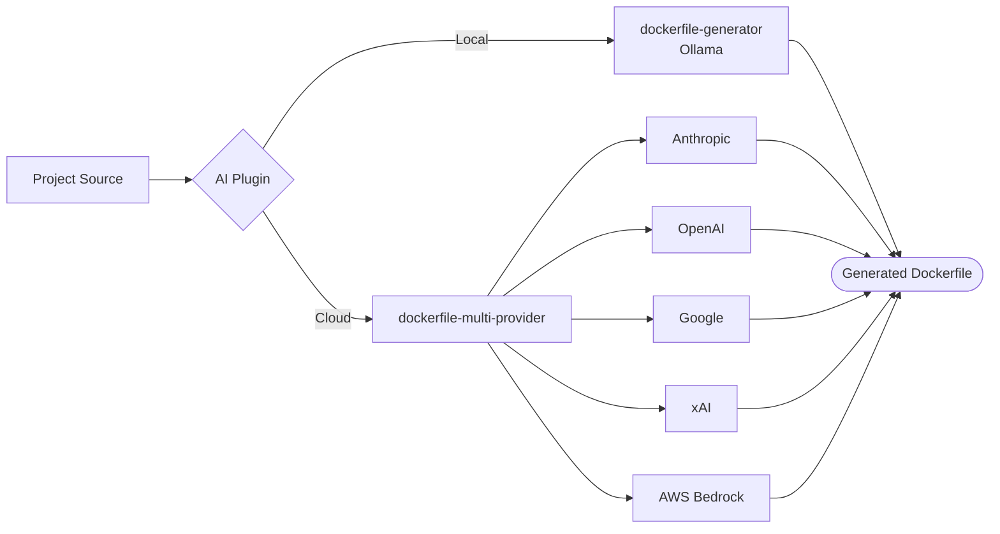

# AI Plugins

AI-powered Dockerfile generation using local or cloud AI models.

| Plugin | Provider | Compute | Secrets | Key Env Vars |
|--------|----------|---------|---------|--------------|
| dockerfile-generator | Ollama (local) | LARGE | None | `OLLAMA_MODEL`, `OLLAMA_HOST` |
| dockerfile-multi-provider | Cloud AI (Anthropic, OpenAI, Google, xAI, Bedrock) | MEDIUM | `AI_API_KEY` (varies by provider) | `AI_PROVIDER`, `AI_MODEL` |

## Supported Providers

The `dockerfile-multi-provider` plugin supports the following cloud AI providers. Set `AI_PROVIDER` to select the provider and supply the corresponding API key via `AI_API_KEY`.

| Provider | `AI_PROVIDER` Value | API Key Format |
|----------|---------------------|----------------|
| Anthropic | `anthropic` | `AI_API_KEY` set to your Anthropic API key (sk-ant-...) |
| OpenAI | `openai` | `AI_API_KEY` set to your OpenAI API key (sk-...) |
| Google | `google` | `AI_API_KEY` set to your Google AI API key |
| xAI | `xai` | `AI_API_KEY` set to your xAI API key |
| AWS Bedrock | `bedrock` | No `AI_API_KEY` required; uses AWS IAM credentials from the execution environment |
