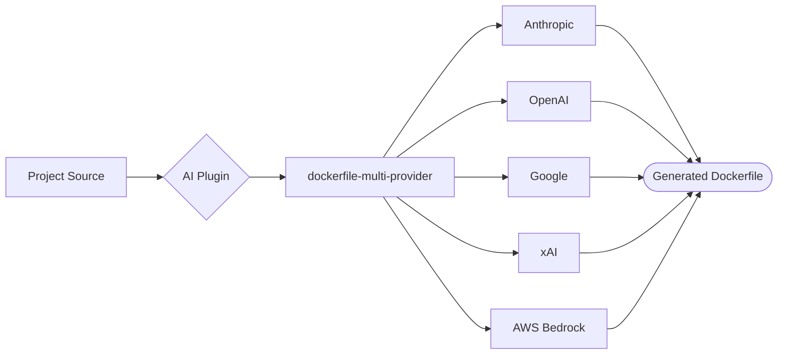

# AI Plugins

AI-powered Dockerfile generation using cloud AI models. A single multi-provider plugin scans your project's build and dependency files, then asks the AI provider of your choice to produce an optimized, production-ready Dockerfile — no per-language Dockerfile templates to maintain.

| Plugin | Provider | Compute | Secrets | Key Env Vars |
|--------|----------|---------|---------|--------------|
| dockerfile-multi-provider | Cloud AI (Anthropic, OpenAI, Google, xAI, Bedrock) | MEDIUM | `AI_API_KEY` (varies by provider) | `AI_PROVIDER`, `AI_MODEL` |

## Supported Providers

The `dockerfile-multi-provider` plugin supports the following cloud AI providers. Set `AI_PROVIDER` to select the provider and supply the corresponding API key via `AI_API_KEY`.

| Provider | `AI_PROVIDER` Value | API Key Format |
|----------|---------------------|----------------|
| Anthropic | `anthropic` | `AI_API_KEY` set to your Anthropic API key (sk-ant-...) |
| OpenAI | `openai` | `AI_API_KEY` set to your OpenAI API key (sk-...) |
| Google | `google` | `AI_API_KEY` set to your Google AI API key |
| xAI | `xai` | `AI_API_KEY` set to your xAI API key |
| AWS Bedrock | `bedrock` | No `AI_API_KEY` required; uses AWS IAM credentials from the execution environment |

Set `AI_MODEL` to the model identifier for the selected provider (for example `claude-sonnet-4` for Anthropic, `gpt-4o` for OpenAI, `gemini-2.0-flash` for Google). The plugin defaults to `AI_PROVIDER=anthropic` with the Anthropic Claude Sonnet model if neither variable is set.

`AI_API_KEY` is an optional secret: it is injected at build time from AWS Secrets Manager via CodeBuild and is required for every provider except `bedrock`, which authenticates with the CodeBuild role's IAM credentials.

## How It Works

The plugin runs as an AWS CDK `CodeBuildStep` (MEDIUM compute, 15-minute timeout) and follows these steps:

1. **Collect project context.** It scans common build and dependency files — `package.json`, `tsconfig.json`, `requirements.txt`, `pyproject.toml`, `Pipfile`, `go.mod`, `Cargo.toml`, `Gemfile`, `pom.xml`, `build.gradle`/`build.gradle.kts`, `*.csproj`/`*.sln`, `CMakeLists.txt`, `Makefile`, `docker-compose.yml`, version-pinning files (`.nvmrc`, `.python-version`, `.tool-versions`), and the directory listing — so the same plugin works across Node.js, Python, Go, Rust, Ruby, Java, .NET, and C/C++ projects.
2. **Generate the Dockerfile.** It sends the collected context to the selected provider with a system prompt that enforces production best practices: slim/alpine base images, multi-stage builds, layer ordering for cache efficiency, combined and cleaned-up `RUN` steps, sensible production env vars, pinned base-image versions, a non-root `USER`, and a `HEALTHCHECK` for web services.
3. **Write the output.** The generated Dockerfile is written to the `generated/` primary output directory (any stray Markdown fences are stripped). The step fails fast if the provider returns an empty or null response, so a bad generation never produces a silently broken artifact.
