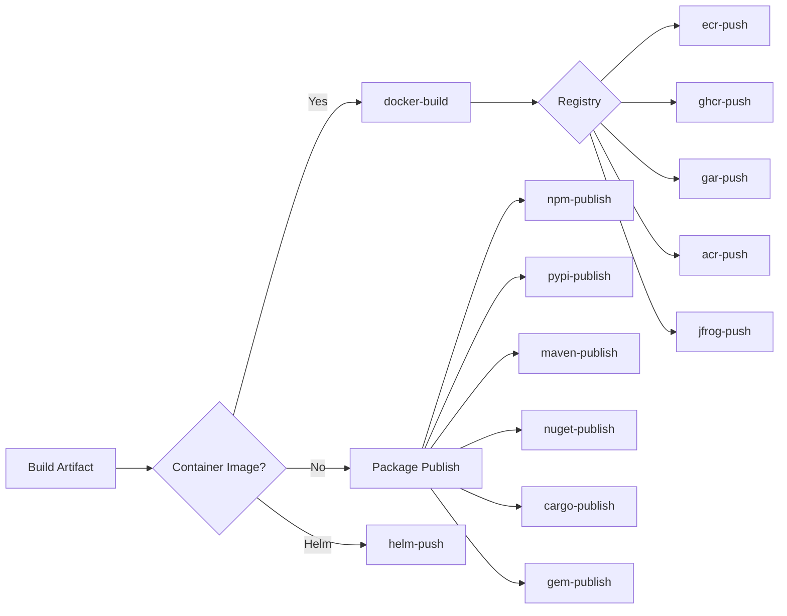

# Artifact & Registry Plugins

Build container images, push to registries, and publish packages.

## Container Build

| Plugin | Compute | Secrets | Key Env Vars |
|--------|---------|---------|--------------|
| docker-build | MEDIUM | ECR: IAM role / DockerHub: `DOCKER_USERNAME`, `DOCKER_PASSWORD` | `DOCKERFILE_PATH`, `DOCKER_CONTEXT`, `REGISTRY_TYPE`, `IMAGE_NAME`, `IMAGE_TAG` |

## Container Registries

| Plugin | Registry | Compute | Secrets | Key Env Vars |
|--------|----------|---------|---------|--------------|
| ecr-push | Amazon ECR | MEDIUM | None (AWS IAM) | `ECR_REPOSITORY`, `IMAGE_TAG`, `AWS_REGION` |
| ghcr-push | GitHub | MEDIUM | `GITHUB_TOKEN` | `GITHUB_OWNER`, `IMAGE_NAME`, `IMAGE_TAG` |
| gar-push | Google | MEDIUM | `GOOGLE_APPLICATION_CREDENTIALS` | `GAR_LOCATION`, `GAR_PROJECT`, `GAR_REPOSITORY` |
| acr-push | Azure | MEDIUM | `AZURE_CLIENT_ID`, `AZURE_CLIENT_SECRET`, `AZURE_TENANT_ID` | `ACR_REGISTRY`, `IMAGE_NAME` |
| jfrog-push | JFrog | MEDIUM | `JFROG_TOKEN` | `JFROG_URL`, `JFROG_REPO`, `IMAGE_NAME` |

## Package Publishing

| Plugin | Registry | Compute | Secrets | Key Env Vars |
|--------|----------|---------|---------|--------------|
| npm-publish | npmjs.com | SMALL | `NPM_TOKEN` | `NPM_DRY_RUN`, `NPM_TAG`, `NPM_ACCESS` |
| pypi-publish | PyPI | SMALL | `TWINE_USERNAME`, `TWINE_PASSWORD` | `PYPI_REPOSITORY` |
| maven-publish | Maven Central | SMALL | `OSSRH_USERNAME`, `OSSRH_PASSWORD`, `GPG_PASSPHRASE` | `MAVEN_REPOSITORY_URL` |
| nuget-publish | NuGet Gallery | SMALL | `NUGET_API_KEY` | `NUGET_SOURCE` |
| cargo-publish | crates.io | SMALL | `CARGO_REGISTRY_TOKEN` | `CARGO_DRY_RUN` |
| gem-publish | RubyGems | SMALL | `GEM_HOST_API_KEY` | `GEM_DRY_RUN` |

## Helm Charts

| Plugin | Registry | Compute | Secrets | Key Env Vars |
|--------|----------|---------|---------|--------------|
| helm-push | OCI / ChartMuseum / S3 | SMALL | None | `HELM_REGISTRY`, `HELM_CHART_PATH`, `HELM_REPO_URL` |
