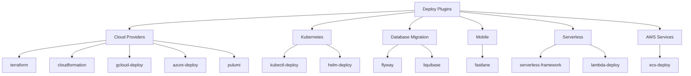
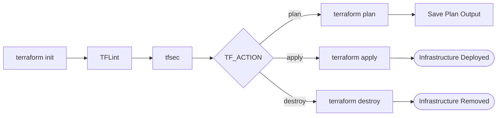

# Deploy Plugins

Cloud provisioning, Kubernetes, database migration, and mobile build plugins.

## Cloud Providers

| Plugin | Provider | Compute | Secrets | Key Env Vars |
|--------|----------|---------|---------|--------------|
| terraform | HashiCorp | MEDIUM | AWS: IAM role | `TF_VERSION`, `TF_WORKING_DIR`, `TF_ACTION`, `TF_VAR_FILE`, `TF_AUTO_APPROVE` |
| cloudformation | AWS | SMALL | AWS: IAM role | `CFN_TEMPLATE`, `CFN_STACK_NAME`, `CFN_ACTION`, `CFN_PARAMETERS`, `CFN_REGION` |
| gcloud-deploy | GCP | MEDIUM | `GOOGLE_APPLICATION_CREDENTIALS` | `GCP_PROJECT`, `GCP_REGION`, `DEPLOY_TYPE` |
| azure-deploy | Azure | MEDIUM | `AZURE_CLIENT_ID`, `AZURE_CLIENT_SECRET`, `AZURE_TENANT_ID` | `AZURE_SUBSCRIPTION`, `AZURE_RESOURCE_GROUP`, `DEPLOY_TYPE` |
| pulumi | Pulumi | MEDIUM | `PULUMI_ACCESS_TOKEN` | `PULUMI_STACK`, `PULUMI_ACTION`, `PULUMI_WORKING_DIR` |

## Kubernetes

| Plugin | Method | Compute | Secrets | Key Env Vars |
|--------|--------|---------|---------|--------------|
| kubectl-deploy | kubectl apply | MEDIUM | `KUBECONFIG` or cluster credentials | `KUBE_CONTEXT`, `KUBE_NAMESPACE`, `MANIFEST_PATH`, `DEPLOY_STRATEGY` |
| helm-deploy | Helm charts | MEDIUM | `KUBECONFIG` or cluster credentials | `HELM_RELEASE`, `HELM_CHART`, `HELM_NAMESPACE`, `HELM_VALUES_FILE` |

## Database Migration

| Plugin | Tool | Compute | Secrets | Key Env Vars |
|--------|------|---------|---------|--------------|
| flyway | Flyway | MEDIUM | `FLYWAY_URL`, `FLYWAY_USER`, `FLYWAY_PASSWORD` | `FLYWAY_LOCATIONS`, `FLYWAY_SCHEMAS`, `FLYWAY_ACTION` |
| liquibase | Liquibase | MEDIUM | `LIQUIBASE_COMMAND_URL`, `LIQUIBASE_COMMAND_USERNAME`, `LIQUIBASE_COMMAND_PASSWORD` | `LIQUIBASE_CHANGELOG_FILE`, `LIQUIBASE_ACTION` |

## Mobile

| Plugin | Platform | Compute | Secrets | Key Env Vars |
|--------|----------|---------|---------|--------------|
| fastlane | iOS/Android | LARGE | `APPLE_ID`, `APP_STORE_CONNECT_API_KEY` or `MATCH_PASSWORD` | `FASTLANE_LANE`, `PLATFORM` |

## Serverless

| Plugin | Platform | Compute | Secrets | Key Env Vars |
|--------|----------|---------|---------|--------------|
| lambda-deploy | AWS Lambda | SMALL | None (AWS IAM) | `FUNCTION_NAME`, `DEPLOY_TYPE`, `LAMBDA_ALIAS`, `S3_BUCKET` |
| serverless-framework | AWS/Azure/GCP | MEDIUM | None | `SLS_STAGE`, `SLS_REGION`, `SLS_CONFIG` |

## AWS Services

| Plugin | Service | Compute | Secrets | Key Env Vars |
|--------|---------|---------|---------|--------------|
| ecs-deploy | Amazon ECS | SMALL | None (AWS IAM) | `ECS_CLUSTER`, `ECS_SERVICE`, `TASK_DEFINITION`, `DEPLOY_STRATEGY` |

## Deploy Types

### gcloud-deploy

The `DEPLOY_TYPE` env var selects the GCP deployment target:

| Deploy Type | Description |
|-------------|-------------|
| app-engine | Deploy to Google App Engine |
| cloud-run | Deploy a container to Cloud Run |
| gke | Deploy to Google Kubernetes Engine |
| compute | Deploy to Compute Engine instances |

### azure-deploy

The `DEPLOY_TYPE` env var selects the Azure deployment target:

| Deploy Type | Description |
|-------------|-------------|
| webapp | Deploy to Azure App Service |
| container-instances | Deploy to Azure Container Instances |
| aks | Deploy to Azure Kubernetes Service |
| function | Deploy to Azure Functions |

## Terraform Actions

The `TF_ACTION` env var controls which Terraform operation is executed:

| Action | Description |
|--------|-------------|
| plan | Generate and display an execution plan without making changes |
| apply | Apply the planned changes to infrastructure |
| destroy | Destroy all resources managed by the Terraform configuration |

`TF_AUTO_APPROVE=true` is required for `apply` and `destroy` actions to skip the interactive confirmation prompt. Without it, the pipeline step will fail waiting for input.

The Terraform plugin also runs TFLint for configuration linting and tfsec for static security analysis as part of every execution.
