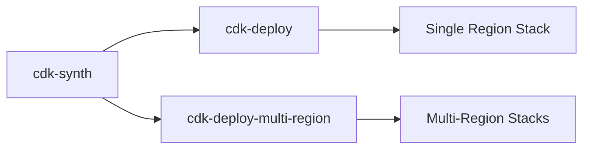
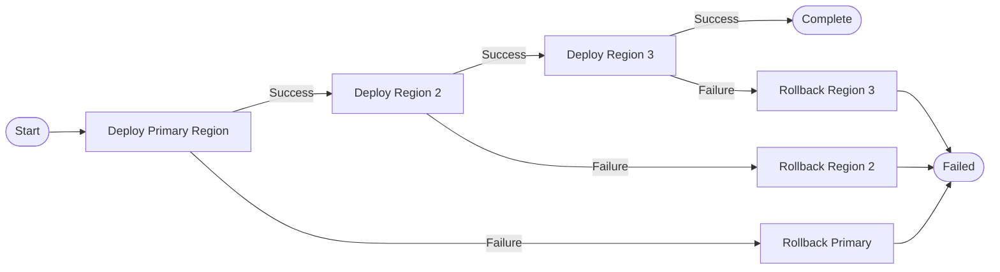
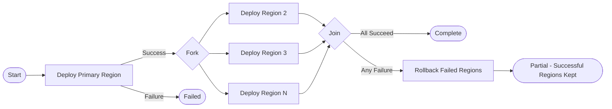

# Infrastructure Plugins

AWS CDK synthesis/deployment and pipeline utility plugins.

## CDK Plugins

| Plugin | Purpose | Compute | Secrets | Key Env Vars |
|--------|---------|---------|---------|--------------|
| cdk-synth | Synthesize CDK app to CloudFormation | MEDIUM | None (AWS IAM) | `CDK_DEFAULT_REGION`, `CDK_DEFAULT_ACCOUNT` |
| cdk-deploy | Deploy CDK stacks to one region | MEDIUM | None (AWS IAM) | `CDK_DEPLOY_ACTION`, `CDK_STACK`, `CDK_REQUIRE_APPROVAL`, `CDK_HOTSWAP` |
| cdk-deploy-multi-region | Deploy CDK stacks across multiple regions | LARGE | None (AWS IAM) | `CDK_REGIONS`, `CDK_PRIMARY_REGION`, `CDK_DEPLOY_STRATEGY`, `CDK_ROLLBACK_ON_FAILURE` |

## Pipeline Utilities

| Plugin | Purpose | Compute | Secrets | Key Env Vars |
|--------|---------|---------|---------|--------------|
| manual-approval | Pipeline approval gate with SNS notification | SMALL | `SNS_TOPIC_ARN` (optional) | `APPROVAL_TIMEOUT`, `APPROVAL_MESSAGE` |
| s3-cache | S3 build cache with zstd compression | SMALL | None (AWS IAM) | `CACHE_BUCKET`, `CACHE_KEY`, `CACHE_PATHS`, `CACHE_ACTION` |

## CDK Workflow

## Multi-Region Strategies

The `CDK_DEPLOY_STRATEGY` env var controls how stacks are deployed across regions:

### Sequential

Deploys to each region one at a time in the order specified by `CDK_REGIONS`. If a deployment fails in any region, subsequent regions are skipped. This is the safest strategy and is recommended for production workloads.

### Parallel

Deploys to all regions simultaneously. Faster than sequential but provides less isolation between regions. Best suited for non-production environments or stateless workloads where region-level failures do not cascade.

### Primary Region Canary Pattern

When `CDK_PRIMARY_REGION` is set, the deployment always starts with the primary region first regardless of the chosen strategy. Once the primary region deployment succeeds, the remaining regions proceed according to the selected strategy (sequential or parallel). This allows the primary region to serve as a canary, catching issues before they propagate to all regions.

### Rollback on Failure

When `CDK_ROLLBACK_ON_FAILURE=true`, a failed deployment in any region triggers an automatic rollback of that region to the previous known-good state. In sequential mode, this also prevents deployment to subsequent regions. In parallel mode, regions that have already completed successfully are not rolled back -- only the failed region is reverted.
