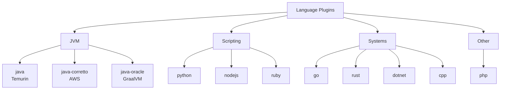

# Language Plugins

Build, test, and compile plugins for major programming languages. Most auto-detect the project's build tool or package manager, so a single plugin works across repos without per-project configuration. Runtime versions are selected via the version env vars below, with common versions pre-staged in each image for fast startup, and test runs emit standard reports (JUnit XML, coverage) where the toolchain supports them.

| Plugin | Description | Compute | Secrets | Key Env Vars |
|--------|-------------|---------|---------|--------------|
| java | Java/Kotlin (Temurin JDK) with Maven/Gradle auto-detect | MEDIUM | None | `JAVA_VERSION`, `KOTLIN_VERSION`, `BUILD_TOOL` |
| java-corretto | Java/Kotlin (Amazon Corretto) for AWS workloads | MEDIUM | None | `JAVA_VERSION`, `KOTLIN_VERSION`, `BUILD_TOOL` |
| java-oracle | Java/Kotlin (Oracle GraalVM) with native-image support | LARGE | None | `JAVA_VERSION`, `KOTLIN_VERSION`, `BUILD_TOOL`, `NATIVE_BUILD` |
| python | Python with pip/poetry/pipenv auto-detect | MEDIUM | None | `PYTHON_VERSION`, `PACKAGE_MANAGER` |
| nodejs | Node.js with npm/yarn/pnpm auto-detect | MEDIUM | None | `NODE_VERSION`, `PACKAGE_MANAGER` |
| go | Go with module support | MEDIUM | None | `GO_VERSION` |
| dotnet | .NET SDK with multi-version support | MEDIUM | None | `DOTNET_VERSION` |
| rust | Rust with Cargo, Clippy, rustfmt | MEDIUM | None | `RUST_VERSION` |
| ruby | Ruby (Bundler) with rspec/rake test auto-detect | MEDIUM | None | `RUBY_VERSION` |
| cpp | C/C++ with cmake/meson/make auto-detect (Conan support) | MEDIUM | None | `BUILD_SYSTEM`, `BUILD_TYPE` |
| php | PHP with Composer and PHPUnit support | MEDIUM | None | `PHP_VERSION`, `COMPOSER_FLAGS` |

## Version Managers

Each language plugin uses a dedicated version manager to install and switch between runtime versions:

| Language | Version Manager | Notes |
|----------|----------------|-------|
| Java (all variants) | SDKMAN | Manages JDK distributions, Maven, Gradle, and the Kotlin compiler (Corretto switches JDK via `JAVA_HOME`) |
| Python | pyenv | Provides version shims; CPython builds are pre-staged in the image for fast startup |
| Node.js | nvm | Node Version Manager for LTS and current releases |
| Go | goenv | Go version management |
| .NET | dotnet-install.sh | Official Microsoft install script for SDK and runtime |
| Rust | rustup | Official Rust toolchain installer and manager |
| Ruby | rbenv | Ruby version management with ruby-build plugin |
| C/C++ | System packages | clang and GCC installed via apt, with CMake, Make, Meson, and Conan available |
| PHP | System packages | Installed via apt from packages.sury.org (Ondřej Surý's repo); version selected by `PHP_VERSION` |
