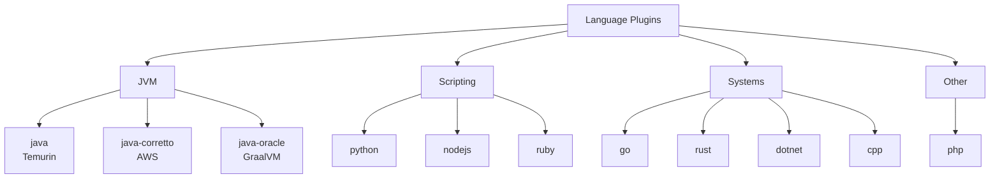

# Language Plugins

Build, test, and compile plugins for major programming languages. All support auto-detection of build tools and package managers.

| Plugin | Description | Compute | Secrets | Key Env Vars |
|--------|-------------|---------|---------|--------------|
| java | Java/Kotlin (Temurin JDK) with Maven/Gradle auto-detect | MEDIUM | None | `JAVA_VERSION`, `KOTLIN_VERSION`, `BUILD_TOOL` |
| java-corretto | Java/Kotlin (Amazon Corretto) for AWS workloads | MEDIUM | None | `JAVA_VERSION`, `KOTLIN_VERSION`, `BUILD_TOOL` |
| java-oracle | Java/Kotlin (Oracle GraalVM) with native-image support | LARGE | None | `JAVA_VERSION`, `KOTLIN_VERSION`, `BUILD_TOOL`, `NATIVE_BUILD` |
| python | Python with pip/poetry/pipenv auto-detect | MEDIUM | None | `PYTHON_VERSION`, `PACKAGE_MANAGER`, `TEST_FRAMEWORK` |
| nodejs | Node.js with npm/yarn/pnpm auto-detect | MEDIUM | None | `NODE_VERSION`, `PACKAGE_MANAGER` |
| go | Go with module support | MEDIUM | None | `GO_VERSION` |
| dotnet | .NET SDK with multi-version support | MEDIUM | None | `DOTNET_VERSION` |
| rust | Rust with Cargo, Clippy, rustfmt | MEDIUM | None | `RUST_VERSION` |
| ruby | Ruby with rspec/rake/minitest auto-detect | MEDIUM | None | `RUBY_VERSION`, `TEST_FRAMEWORK` |
| cpp | C/C++ with cmake/meson/make auto-detect | MEDIUM | None | `BUILD_SYSTEM`, `BUILD_TYPE`, `COMPILER` |
| php | PHP with Composer, Laravel/Symfony support | MEDIUM | None | `PHP_VERSION`, `PACKAGE_MANAGER`, `TEST_FRAMEWORK` |

## Version Managers

Each language plugin uses a dedicated version manager to install and switch between runtime versions:

| Language | Version Manager | Notes |
|----------|----------------|-------|
| Java (all variants) | SDKMAN | Manages JDK distributions, Maven, and Gradle |
| Python | pyenv | Supports CPython and PyPy builds |
| Node.js | nvm | Node Version Manager for LTS and current releases |
| Go | goenv | Go version management |
| .NET | dotnet-install.sh | Official Microsoft install script for SDK and runtime |
| Rust | rustup | Official Rust toolchain installer and manager |
| Ruby | rbenv | Ruby version management with ruby-build plugin |
| C/C++ | System packages | Installed via apt/yum; version selected by `COMPILER` env var |
| PHP | System packages | Installed via apt with ondrej/php PPA |
