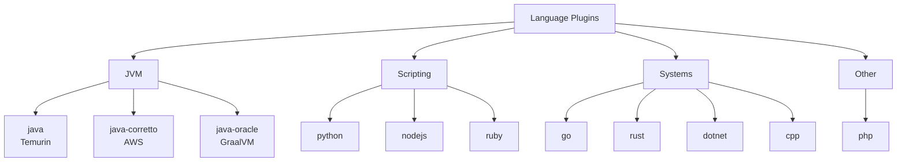

# Language Plugins

Build, test, and compile plugins for major programming languages. Most auto-detect the project's build tool or package manager, so a single plugin works across repos without per-project configuration. Each plugin pins **one** runtime version, baked into its shared base image at build time (single-version model) — there is no runtime version env var to set. Test runs emit standard reports (JUnit XML, coverage) where the toolchain supports them.

```mermaid
flowchart TB
    Lang[Language Plugins]
    Lang --> JVM[JVM]
    Lang --> Scripting[Scripting]
    Lang --> Systems[Systems]
    Lang --> Other[Other]

    JVM --> java[java\nTemurin]
    JVM --> corretto[java-corretto\nAWS]
    JVM --> oracle[java-oracle\nGraalVM]
    Scripting --> python
    Scripting --> nodejs
    Scripting --> ruby

    Systems --> go
    Systems --> rust
    Systems --> dotnet
    Systems --> cpp

    Other --> php
```

| Plugin | Description | Compute | Secrets | Key Env Vars |
|--------|-------------|---------|---------|--------------|
| java | Java/Kotlin (Temurin JDK) with Maven/Gradle auto-detect | MEDIUM | None | `BUILD_TOOL`, `MAVEN_GOAL`, `GRADLE_TASK` |
| java-corretto | Java/Kotlin (Amazon Corretto) for AWS workloads | MEDIUM | None | `BUILD_TOOL`, `MAVEN_GOAL`, `GRADLE_TASK` |
| java-oracle | Java/Kotlin (Oracle GraalVM) with native-image support | LARGE | None | `BUILD_TOOL`, `NATIVE_BUILD`, `MAVEN_GOAL`, `GRADLE_TASK` |
| python | Python with pip/poetry/pipenv auto-detect | MEDIUM | None | `PACKAGE_MANAGER` |
| nodejs | Node.js with npm/yarn/pnpm auto-detect | MEDIUM | None | `PACKAGE_MANAGER` |
| go | Go with module support | MEDIUM | None | None (auto-detects `go.mod`) |
| dotnet | .NET SDK, `dotnet build`/`test` | MEDIUM | None | None (auto-detects `.sln`/`.csproj`) |
| rust | Rust with Cargo, Clippy, rustfmt | MEDIUM | None | None (Cargo auto-detected) |
| ruby | Ruby (Bundler) with rspec/rake test auto-detect | MEDIUM | None | None (Bundler auto-detected) |
| cpp | C/C++ with cmake/meson/make auto-detect (Conan support) | MEDIUM | None | `BUILD_SYSTEM`, `BUILD_TYPE` |
| php | PHP with Composer and PHPUnit support | MEDIUM | None | `COMPOSER_FLAGS` |

`BUILD_TOOL` selects Maven vs Gradle for the JVM plugins (auto-detected otherwise); `MAVEN_GOAL`/`GRADLE_TASK` override the lifecycle goal/task. `PACKAGE_MANAGER` pins npm/yarn/pnpm (Node) or pip/poetry/pipenv (Python) instead of auto-detecting. `NATIVE_BUILD` enables GraalVM native-image on `java-oracle`.

## Runtime Versions

Each language plugin is a thin layer over a shared, single-version base image (for example `pipeline-node-base`, `pipeline-go-base`, `pipeline-jvm-base`), so the runtime version is **pinned at image-build time** — not selectable at runtime:

| Language | Base image | Version pin |
|----------|-----------|-------------|
| Java (Temurin, GraalVM) | `pipeline-plugin-base` | JDK + Maven/Gradle/Kotlin pinned in the plugin image |
| Java (Corretto) | `pipeline-jvm-base` | Amazon Corretto JDK + build tools baked in |
| Python | `pipeline-python-base` | One CPython version baked in |
| Node.js | `pipeline-node-base` | One Node + npm version baked in |
| Go | `pipeline-go-base` | One Go toolchain baked in |
| .NET | `pipeline-dotnet-base` | One .NET SDK baked in |
| Rust | `pipeline-rust-base` | One Rust toolchain (cargo/clippy/rustfmt) baked in |
| Ruby | `pipeline-ruby-base` | One Ruby + Bundler baked in |
| C/C++ | `pipeline-cpp-base` | clang/GCC + CMake/Make/Meson/Conan baked in |
| PHP | `pipeline-php-base` | One PHP + Composer baked in |

To move to a new runtime version, bump the pin in the base image and rebuild (see [Version Management](README.md#version-management)) — there is no per-pipeline version override.
