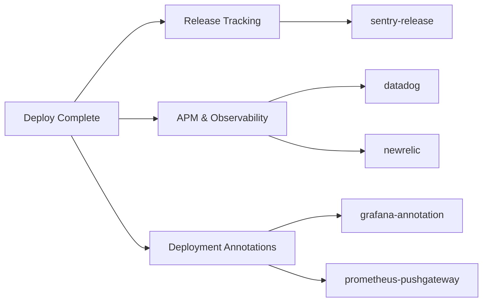

# Monitoring Plugins

APM, observability, and release tracking integrations.

## Plugins

| Plugin | Compute | Secrets | Key Env Vars |
|--------|---------|---------|--------------|
| datadog | SMALL | `DD_API_KEY` | `DD_SITE`, `DD_SERVICE`, `DD_ENV`, `DD_VERSION` |
| newrelic | SMALL | `NEW_RELIC_API_KEY` | `NR_APP_ID`, `NR_REVISION`, `NR_DESCRIPTION` |
| sentry-release | SMALL | `SENTRY_AUTH_TOKEN` | `SENTRY_ORG`, `SENTRY_PROJECT`, `SENTRY_RELEASE`, `SENTRY_SOURCEMAPS_PATH` |
| grafana-annotation | SMALL | `GRAFANA_API_KEY` | `GRAFANA_URL`, `GRAFANA_DASHBOARD_ID`, `ANNOTATION_TAGS` |
| prometheus-pushgateway | SMALL | None | `PUSHGATEWAY_URL`, `METRIC_JOB`, `METRIC_INSTANCE` |

## When to Use

- **datadog** / **newrelic**: Post-deploy APM marker creation and deployment tracking. These plugins notify your observability platform that a new version was deployed so you can correlate performance changes with releases.
- **sentry-release**: Create Sentry releases and upload source maps so errors in production are mapped back to your source code.
- **grafana-annotation**: Mark deployments and pipeline events on Grafana dashboards so you can correlate infrastructure changes with metric shifts.
- **prometheus-pushgateway**: Push build metrics (duration, status, artifact size) to Prometheus via Pushgateway for pipeline observability.

All monitoring plugins use `failureBehavior: warn` by default, so a notification failure will not block the pipeline.
