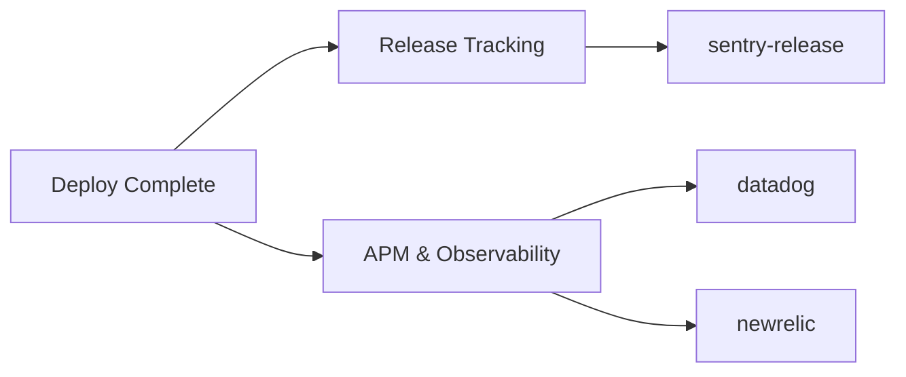

# Monitoring Plugins

APM and release tracking integrations.

## Plugins

| Plugin | Compute | Secrets | Key Env Vars |
|--------|---------|---------|--------------|
| datadog | SMALL | `DD_API_KEY` | `DD_SITE`, `DD_SERVICE`, `DD_ENV`, `DD_VERSION` |
| newrelic | SMALL | `NEW_RELIC_API_KEY` | `NR_APP_ID`, `NR_REVISION`, `NR_DESCRIPTION` |
| sentry-release | SMALL | `SENTRY_AUTH_TOKEN` | `SENTRY_ORG`, `SENTRY_PROJECT`, `SENTRY_RELEASE`, `SENTRY_SOURCEMAPS_PATH` |

## When to Use

- **datadog**: Post-deploy tracking that sends both a deployment event and a `pipeline.deploy` marker metric to Datadog, tagged with service, environment, and version, so you can correlate performance changes with releases.
- **newrelic**: Records a deployment marker against a New Relic application so releases line up with application performance metrics. Requires `NR_APP_ID` to target the application.
- **sentry-release**: Creates a Sentry release, auto-associates commits, finalizes the release, and optionally uploads source maps so errors in production map back to your source code. If `SENTRY_RELEASE` is unset, the version is auto-detected from the repository.

All monitoring plugins run on `SMALL` compute and use `failureBehavior: warn` by default, so a notification failure will not block the pipeline.
