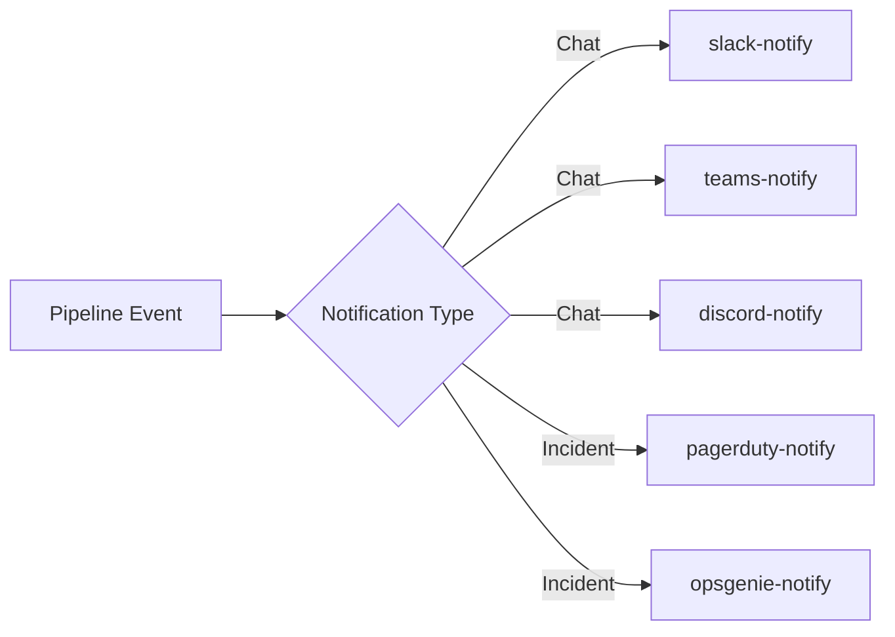

# Notification Plugins

Pipeline status alerts and incident management integrations.

| Plugin | Service | Compute | Secrets | Key Env Vars |
|--------|---------|---------|---------|--------------|
| slack-notify | Slack | SMALL | `SLACK_WEBHOOK_URL` | `NOTIFICATION_TYPE`, `PIPELINE_NAME`, `PIPELINE_STATUS`, `MENTION_ON_FAILURE` |
| teams-notify | Microsoft Teams | SMALL | `TEAMS_WEBHOOK_URL` | `NOTIFICATION_TYPE`, `PIPELINE_NAME`, `PIPELINE_STATUS` |
| pagerduty-notify | PagerDuty | SMALL | `PAGERDUTY_ROUTING_KEY` | `NOTIFICATION_TYPE`, `PD_SEVERITY`, `PD_SOURCE` |
| opsgenie-notify | Opsgenie | SMALL | `OPSGENIE_API_KEY` | `NOTIFICATION_TYPE`, `OG_PRIORITY`, `OG_TEAM` |
| discord-notify | Discord | SMALL | `DISCORD_WEBHOOK_URL` | `NOTIFICATION_TYPE`, `PIPELINE_NAME`, `PIPELINE_STATUS` |
