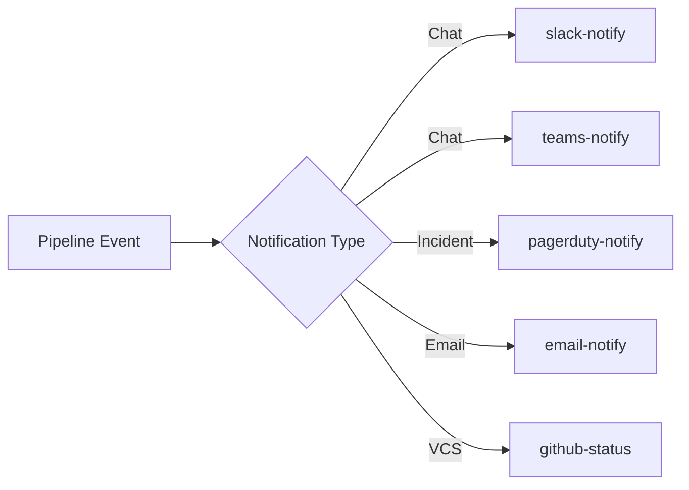

# Notification Plugins

Pipeline status alerts and incident management integrations. All five plugins run as `SMALL` CodeBuildSteps with `failureBehavior: warn`, so a notification or alerting outage never fails your pipeline. Slack and Teams also support arbitrary `custom` messages, and PagerDuty supports both `trigger` and `resolve` events for auto-closing incidents.

| Plugin | Service | Compute | Secrets | Key Env Vars |
|--------|---------|---------|---------|--------------|
| slack-notify | Slack | SMALL | `SLACK_WEBHOOK_URL` | `NOTIFICATION_TYPE`, `PIPELINE_NAME`, `PIPELINE_STATUS`, `MENTION_ON_FAILURE` |
| teams-notify | Microsoft Teams | SMALL | `TEAMS_WEBHOOK_URL` | `NOTIFICATION_TYPE`, `PIPELINE_NAME`, `PIPELINE_STATUS` |
| pagerduty-notify | PagerDuty | SMALL | `PAGERDUTY_ROUTING_KEY` | `NOTIFICATION_TYPE`, `PD_SEVERITY`, `PD_SOURCE` |
| email-notify | Email (SES/SMTP) | SMALL | `SMTP_PASSWORD` (optional) | `EMAIL_PROVIDER`, `EMAIL_TO`, `EMAIL_SUBJECT`, `AWS_REGION` |
| github-status | GitHub | SMALL | `GITHUB_TOKEN` | `GITHUB_OWNER`, `GITHUB_REPO`, `GITHUB_SHA`, `STATUS_CONTEXT` |
