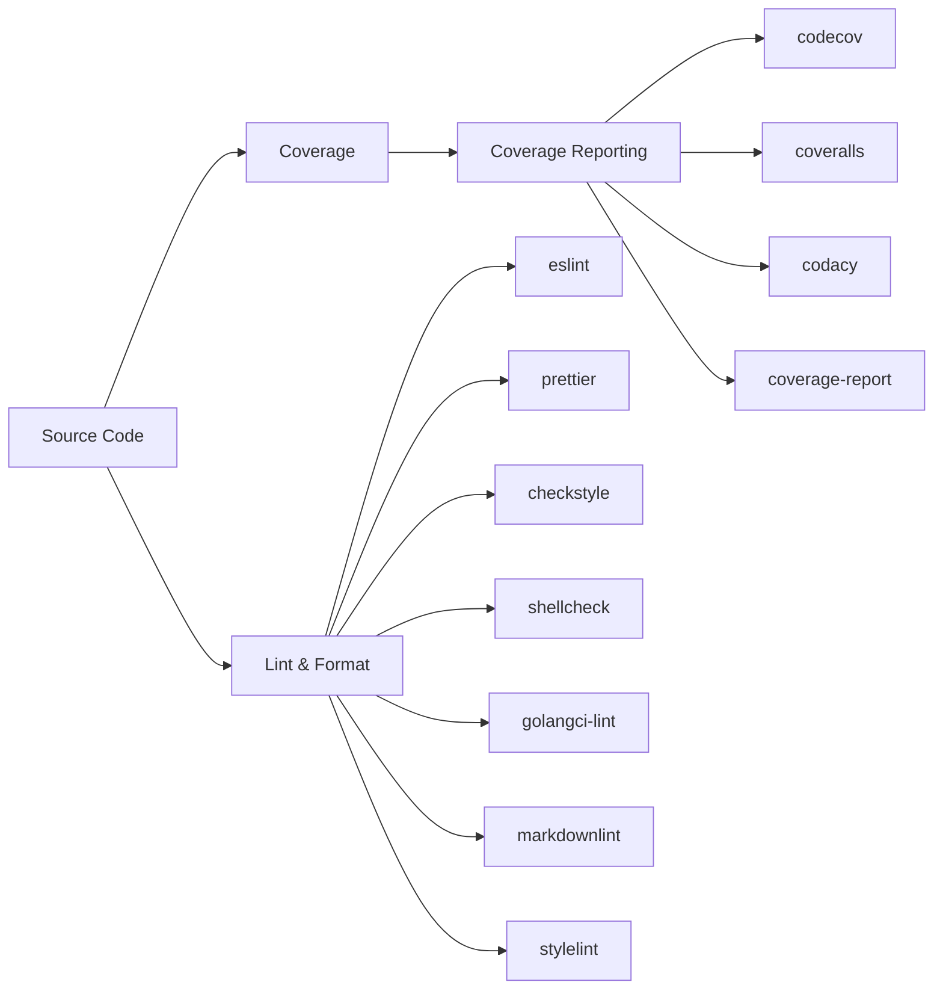

# Code Quality Plugins

Linting, formatting, and code coverage reporting.

## Lint & Format

| Plugin | Language | Compute | Secrets | Key Env Vars |
|--------|----------|---------|---------|--------------|
| eslint | JS/TS | SMALL | None | `NODE_VERSION`, `ESLINT_FORMAT`, `ESLINT_MAX_WARNINGS` |
| prettier | JS/TS/CSS/HTML | SMALL | None | `NODE_VERSION`, `PRETTIER_GLOB` |
| checkstyle | Java | SMALL | None | `CHECKSTYLE_VERSION`, `CHECKSTYLE_CONFIG`, `JAVA_VERSION` |
| shellcheck | Bash/sh/zsh | SMALL | None | `SHELLCHECK_VERSION`, `SHELLCHECK_SEVERITY`, `SHELLCHECK_FORMAT` |
| golangci-lint | Go | MEDIUM | None | `GOLANGCI_LINT_VERSION`, `GOLANGCI_LINT_CONFIG` |
| markdownlint | Markdown | SMALL | None | `MARKDOWNLINT_CONFIG`, `MARKDOWNLINT_GLOB` |
| stylelint | CSS/SCSS/Less | SMALL | None | `STYLELINT_CONFIG`, `STYLELINT_GLOB` |

## Coverage Reporting

| Plugin | Compute | Secrets | Key Env Vars |
|--------|---------|---------|--------------|
| codecov | SMALL | `CODECOV_TOKEN` | `CODECOV_FLAGS`, `CODECOV_FILE` |
| coveralls | SMALL | `COVERALLS_REPO_TOKEN` | `COVERALLS_SERVICE_NAME` |
| codacy | SMALL | `CODACY_PROJECT_TOKEN` | `CODACY_LANGUAGE` |
| coverage-report | SMALL | None | `COVERAGE_THRESHOLD`, `COVERAGE_FORMAT` |
