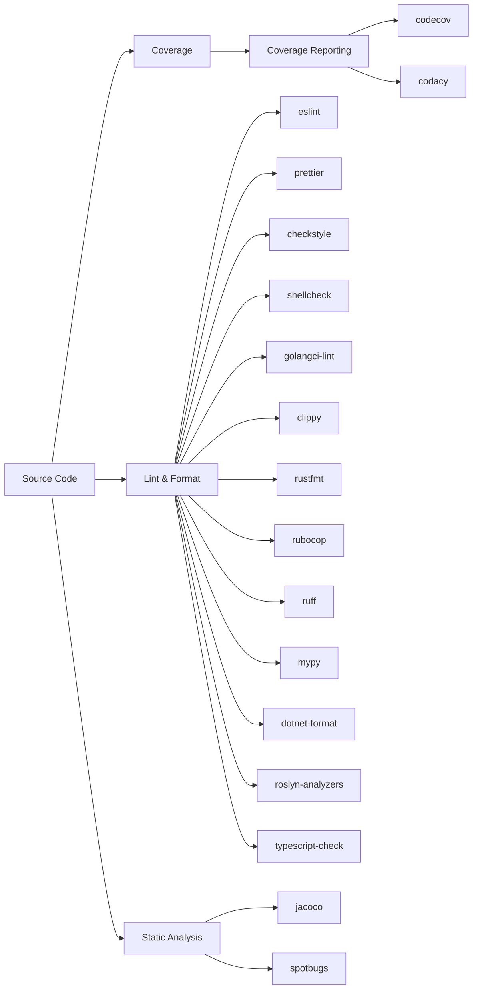

# Code Quality Plugins

Linting, formatting, static analysis, and code coverage reporting. Plugins auto-detect the project's package manager or build tool (for example npm/yarn/pnpm for ESLint, Gradle/Maven for JaCoCo), so a single plugin works across repos without per-project setup. Most run with no secrets; report uploaders supply the relevant token.

## Lint & Format

| Plugin | Language | Compute | Secrets | Key Env Vars |
|--------|----------|---------|---------|--------------|
| eslint | JS/TS | SMALL | None | `NODE_VERSION`, `ESLINT_FORMAT`, `ESLINT_MAX_WARNINGS` |
| prettier | JS/TS/CSS/HTML | SMALL | None | `NODE_VERSION`, `PRETTIER_GLOB` |
| checkstyle | Java | SMALL | None | `CHECKSTYLE_VERSION`, `CHECKSTYLE_CONFIG`, `JAVA_VERSION` |
| shellcheck | Bash/sh/zsh | SMALL | None | `SHELLCHECK_VERSION`, `SHELLCHECK_SEVERITY`, `SHELLCHECK_FORMAT`, `SHELLCHECK_SHELL` |
| golangci-lint | Go | MEDIUM | None | `GO_VERSION`, `GOLANGCI_LINT_TIMEOUT`, `GOLANGCI_LINT_FORMAT` |
| clippy | Rust | SMALL | None | `RUST_VERSION`, `CLIPPY_FLAGS` |
| rustfmt | Rust | SMALL | None | `RUST_VERSION` |
| rubocop | Ruby | SMALL | None | `RUBY_VERSION`, `RUBOCOP_CONFIG` |
| ruff | Python | SMALL | None | `PYTHON_VERSION`, `RUFF_CONFIG` |
| mypy | Python | SMALL | None | `PYTHON_VERSION`, `MYPY_CONFIG` |
| dotnet-format | .NET | SMALL | None | `DOTNET_VERSION` |
| roslyn-analyzers | .NET | SMALL | None | `DOTNET_VERSION`, `TREAT_WARNINGS_AS_ERRORS` |
| typescript-check | TypeScript | SMALL | None | `NODE_VERSION`, `TSC_FLAGS` |

## Static Analysis

| Plugin | Language | Compute | Secrets | Key Env Vars |
|--------|----------|---------|---------|--------------|
| jacoco | Java | SMALL | None | `JAVA_VERSION`, `COVERAGE_THRESHOLD` |
| spotbugs | Java | SMALL | None | `JAVA_VERSION` |

## Coverage Reporting

| Plugin | Compute | Secrets | Key Env Vars |
|--------|---------|---------|--------------|
| codecov | SMALL | `CODECOV_TOKEN` | `CODECOV_FLAGS`, `CODECOV_FILE` |
| codacy | SMALL | `CODACY_PROJECT_TOKEN` | `CODACY_LANGUAGE` |
