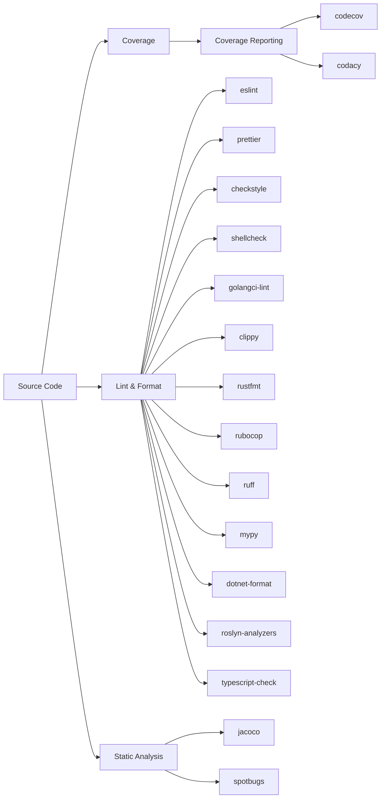

# Code Quality Plugins

Linting, formatting, static analysis, and code coverage reporting. Plugins auto-detect the project's package manager or build tool (for example npm/yarn/pnpm for ESLint, Gradle/Maven for JaCoCo), so a single plugin works across repos without per-project setup. Most run with no secrets; report uploaders supply the relevant token.

```mermaid
flowchart LR
    Code[Source Code] --> LintFmt[Lint & Format]
    Code --> Cov[Coverage]
    Cov --> Report[Coverage Reporting]

    LintFmt --> eslint & prettier & checkstyle & shellcheck & golangci-lint
    LintFmt --> clippy & rustfmt & rubocop & ruff & mypy
    LintFmt --> dotnet-format & roslyn-analyzers & typescript-check
    Code --> StaticAnalysis[Static Analysis]
    StaticAnalysis --> jacoco & spotbugs
    Report --> codecov & codacy
```

## Lint & Format

| Plugin | Language | Compute | Secrets | Key Env Vars |
|--------|----------|---------|---------|--------------|
| eslint | JS/TS | SMALL | None | `ESLINT_FORMAT`, `ESLINT_MAX_WARNINGS` |
| prettier | JS/TS/CSS/HTML | SMALL | None | `PRETTIER_GLOB` |
| checkstyle | Java | SMALL | None | `CHECKSTYLE_CONFIG` |
| shellcheck | Bash/sh/zsh | SMALL | None | `SHELLCHECK_VERSION`, `SHELLCHECK_SEVERITY`, `SHELLCHECK_FORMAT`, `SHELLCHECK_SHELL` |
| golangci-lint | Go | MEDIUM | None | `GOLANGCI_LINT_TIMEOUT`, `GOLANGCI_LINT_FORMAT` |
| clippy | Rust | SMALL | None | `CLIPPY_FLAGS` |
| rustfmt | Rust | SMALL | None | None |
| rubocop | Ruby | SMALL | None | `RUBOCOP_CONFIG` |
| ruff | Python | SMALL | None | `RUFF_CONFIG` |
| mypy | Python | SMALL | None | `MYPY_CONFIG` |
| dotnet-format | .NET | SMALL | None | None |
| roslyn-analyzers | .NET | SMALL | None | `TREAT_WARNINGS_AS_ERRORS` |
| typescript-check | TypeScript | SMALL | None | `TSC_FLAGS` |

## Static Analysis

| Plugin | Language | Compute | Secrets | Key Env Vars |
|--------|----------|---------|---------|--------------|
| jacoco | Java | SMALL | None | `COVERAGE_THRESHOLD` |
| spotbugs | Java | SMALL | None | None |

## Coverage Reporting

| Plugin | Compute | Secrets | Key Env Vars |
|--------|---------|---------|--------------|
| codecov | SMALL | `CODECOV_TOKEN` | `CODECOV_FLAGS`, `CODECOV_FILE` |
| codacy | SMALL | `CODACY_PROJECT_TOKEN` | `CODACY_LANGUAGE` |
