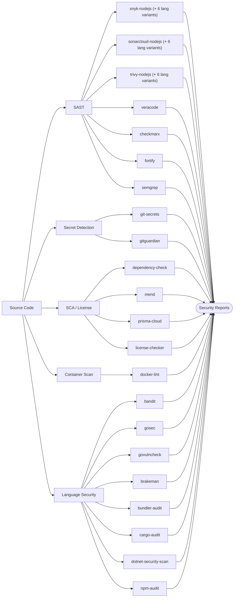

# Security Plugins

Static analysis, dependency scanning, secret detection, container scanning, and license compliance.

## Open Source

| Plugin | Type | Compute | Secrets | Key Env Vars |
|--------|------|---------|---------|--------------|
| snyk-nodejs | SAST/SCA | SMALL | `SNYK_TOKEN` | `SNYK_SEVERITY_THRESHOLD` |
| snyk-python | SAST/SCA | SMALL | `SNYK_TOKEN` | `SNYK_SEVERITY_THRESHOLD`, `PYTHON_VERSION` |
| snyk-java | SAST/SCA | SMALL | `SNYK_TOKEN` | `SNYK_SEVERITY_THRESHOLD`, `JAVA_VERSION` |
| snyk-go | SAST/SCA | SMALL | `SNYK_TOKEN` | `SNYK_SEVERITY_THRESHOLD`, `GO_VERSION` |
| snyk-dotnet | SAST/SCA | SMALL | `SNYK_TOKEN` | `SNYK_SEVERITY_THRESHOLD`, `DOTNET_VERSION` |
| snyk-ruby | SAST/SCA | SMALL | `SNYK_TOKEN` | `SNYK_SEVERITY_THRESHOLD`, `RUBY_VERSION` |
| snyk-rust | SAST/SCA | SMALL | `SNYK_TOKEN` | `SNYK_SEVERITY_THRESHOLD` |
| sonarcloud-nodejs | SAST | SMALL | `SONAR_TOKEN` | `SONAR_SCANNER_VERSION`, `SONAR_ORGANIZATION`, `SONAR_PROJECT_KEY` |
| sonarcloud-python | SAST | SMALL | `SONAR_TOKEN` | `SONAR_SCANNER_VERSION`, `PYTHON_VERSION` |
| sonarcloud-java | SAST | SMALL | `SONAR_TOKEN` | `SONAR_SCANNER_VERSION`, `JAVA_VERSION` |
| sonarcloud-go | SAST | SMALL | `SONAR_TOKEN` | `SONAR_SCANNER_VERSION`, `GO_VERSION` |
| sonarcloud-dotnet | SAST | SMALL | `SONAR_TOKEN` | `SONAR_SCANNER_VERSION`, `DOTNET_VERSION` |
| sonarcloud-ruby | SAST | SMALL | `SONAR_TOKEN` | `SONAR_SCANNER_VERSION`, `RUBY_VERSION` |
| sonarcloud-rust | SAST | SMALL | `SONAR_TOKEN` | `SONAR_SCANNER_VERSION` |
| trivy-nodejs | SAST/SCA/IaC | SMALL | None | `TRIVY_VERSION`, `TRIVY_SEVERITY`, `TRIVY_FORMAT` |
| trivy-python | SAST/SCA | SMALL | None | `TRIVY_VERSION`, `TRIVY_SEVERITY`, `PYTHON_VERSION` |
| trivy-java | SAST/SCA | SMALL | None | `TRIVY_VERSION`, `TRIVY_SEVERITY`, `JAVA_VERSION` |
| trivy-go | SAST/SCA | SMALL | None | `TRIVY_VERSION`, `TRIVY_SEVERITY`, `GO_VERSION` |
| trivy-dotnet | SAST/SCA | SMALL | None | `TRIVY_VERSION`, `TRIVY_SEVERITY`, `DOTNET_VERSION` |
| trivy-ruby | SAST/SCA | SMALL | None | `TRIVY_VERSION`, `TRIVY_SEVERITY`, `RUBY_VERSION` |
| trivy-rust | SAST/SCA | SMALL | None | `TRIVY_VERSION`, `TRIVY_SEVERITY` |
| dependency-check | SCA | MEDIUM | `NVD_API_KEY` (optional) | `DC_VERSION`, `DC_FAIL_ON_CVSS`, `DC_FORMAT` |
| semgrep | SAST | MEDIUM | `SEMGREP_APP_TOKEN` (optional) | `SEMGREP_RULES`, `SEMGREP_SEVERITY`, `SEMGREP_FORMAT` |

## Enterprise (Vendor)

| Plugin | Type | Compute | Secrets | Key Env Vars |
|--------|------|---------|---------|--------------|
| veracode | SAST/DAST | MEDIUM | `VERACODE_API_ID`, `VERACODE_API_KEY` | `VERACODE_SCAN_TYPE`, `VERACODE_APP_NAME` |
| checkmarx | SAST/SCA/IaC | MEDIUM | `CX_CLIENT_SECRET` | `CX_SCAN_TYPE`, `CX_PROJECT_NAME`, `CX_TENANT` |
| fortify | SAST | MEDIUM | `FOD_CLIENT_ID` + `FOD_CLIENT_SECRET` or `FORTIFY_SSC_TOKEN` | `FORTIFY_SCAN_TYPE`, `FORTIFY_APP_NAME` |
| prisma-cloud | Container/IaC | MEDIUM | `PRISMA_ACCESS_KEY`, `PRISMA_SECRET_KEY` | `PRISMA_SCAN_TYPE`, `PRISMA_CONSOLE_URL` |
| mend | SCA/License | SMALL | `MEND_API_KEY`, `MEND_ORG_TOKEN` | `MEND_SCAN_TYPE`, `MEND_PRODUCT_NAME` |

## Secret Detection

| Plugin | Compute | Secrets | Key Env Vars |
|--------|---------|---------|--------------|
| git-secrets | SMALL | None | `GITLEAKS_VERSION`, `SCAN_MODE`, `REPORT_FORMAT` |
| gitguardian | SMALL | `GITGUARDIAN_API_KEY` | `GG_SCAN_TYPE`, `GG_EXIT_ZERO` |

## Container & License

| Plugin | Compute | Secrets | Key Env Vars |
|--------|---------|---------|--------------|
| docker-lint | SMALL | None | `HADOLINT_VERSION`, `DOCKLE_VERSION`, `DOCKER_IMAGE` |
| license-checker | SMALL | None | `LICENSE_DENY`, `LICENSE_ALLOW` |

## Language-Specific Security

| Plugin | Language | Type | Compute | Secrets | Key Env Vars |
|--------|----------|------|---------|---------|--------------|
| bandit | Python | SAST | SMALL | None | `PYTHON_VERSION`, `BANDIT_SEVERITY`, `BANDIT_CONFIDENCE` |
| brakeman | Ruby | SAST | SMALL | None | `RUBY_VERSION`, `BRAKEMAN_CONFIDENCE` |
| bundler-audit | Ruby | SCA | SMALL | None | `RUBY_VERSION` |
| cargo-audit | Rust | SCA | SMALL | None | `RUST_VERSION` |
| dotnet-security-scan | .NET | SAST/SCA | SMALL | None | `DOTNET_VERSION` |
| gosec | Go | SAST | SMALL | None | `GO_VERSION`, `GOSEC_SEVERITY` |
| govulncheck | Go | SCA | SMALL | None | `GO_VERSION` |
| npm-audit | Node.js | SCA | SMALL | None | `NODE_VERSION`, `NPM_AUDIT_LEVEL` |

---

Security plugins with multi-language support (snyk, trivy, sonarcloud) are split into language-specific variants. The base plugin (e.g., `snyk-nodejs`, `trivy-nodejs`, `sonarcloud-nodejs`) covers Node.js projects. Use the language-suffixed variant (e.g., `snyk-python`, `trivy-java`) for other languages — each variant includes the security tool plus the appropriate language runtime.
