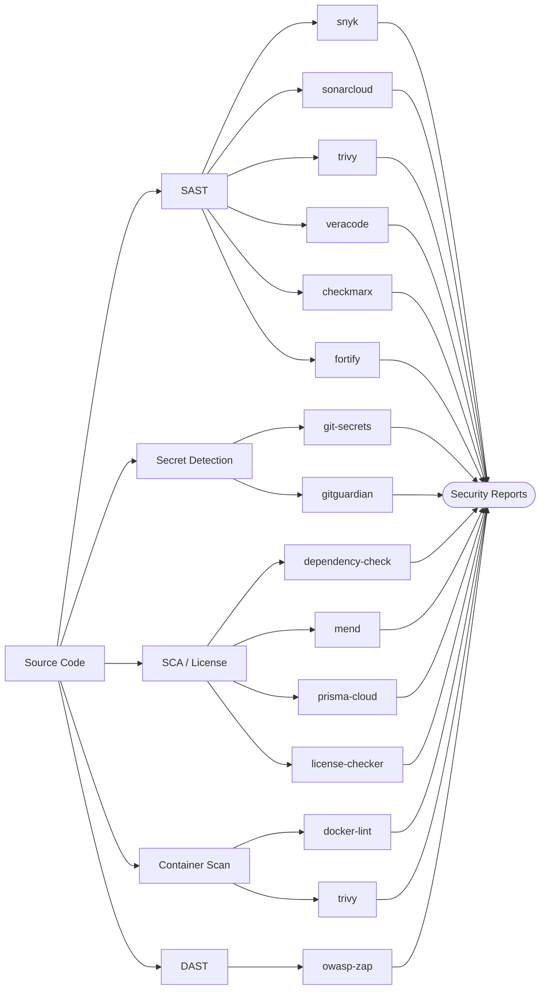

# Security Plugins

Static analysis, dynamic analysis, dependency scanning, secret detection, container scanning, and license compliance.

## Open Source

| Plugin | Type | Compute | Secrets | Key Env Vars |
|--------|------|---------|---------|--------------|
| snyk | SAST/SCA | MEDIUM | `SNYK_TOKEN` | `SNYK_VERSION`, `LANGUAGE`, `LANGUAGE_VERSION` |
| sonarcloud | SAST | MEDIUM | `SONAR_TOKEN` | `SONAR_SCANNER_VERSION`, `LANGUAGE`, `LANGUAGE_VERSION` |
| trivy | SAST/SCA/IaC | MEDIUM | None | `TRIVY_VERSION`, `TRIVY_SEVERITY`, `TRIVY_FORMAT`, `LANGUAGE` |
| owasp-zap | DAST | MEDIUM | None | `ZAP_VERSION`, `ZAP_SCAN_TYPE`, `ZAP_TARGET_URL` |
| dependency-check | SCA | MEDIUM | `NVD_API_KEY` (optional) | `DC_VERSION`, `DC_FAIL_ON_CVSS`, `DC_FORMAT` |

## Enterprise (Vendor)

| Plugin | Type | Compute | Secrets | Key Env Vars |
|--------|------|---------|---------|--------------|
| veracode | SAST/DAST | MEDIUM | `VERACODE_API_ID`, `VERACODE_API_KEY` | `VERACODE_SCAN_TYPE`, `VERACODE_APP_NAME` |
| checkmarx | SAST/SCA/IaC | MEDIUM | `CX_CLIENT_SECRET` | `CX_SCAN_TYPE`, `CX_PROJECT_NAME`, `CX_TENANT` |
| fortify | SAST | MEDIUM | `FOD_CLIENT_ID` + `FOD_CLIENT_SECRET` or `FORTIFY_SSC_TOKEN` | `FORTIFY_SCAN_TYPE`, `FORTIFY_APP_NAME` |
| prisma-cloud | Container/IaC | MEDIUM | `PRISMA_ACCESS_KEY`, `PRISMA_SECRET_KEY` | `PRISMA_SCAN_TYPE`, `PRISMA_CONSOLE_URL` |
| mend | SCA/License | SMALL | `MEND_API_KEY`, `MEND_ORG_TOKEN` | `MEND_SCAN_TYPE`, `MEND_PRODUCT_NAME` |

## Secret Detection

| Plugin | Compute | Secrets | Key Env Vars |
|--------|---------|---------|--------------|
| git-secrets | SMALL | None | `GITLEAKS_VERSION`, `SCAN_MODE`, `REPORT_FORMAT` |
| gitguardian | SMALL | `GITGUARDIAN_API_KEY` | `GG_SCAN_TYPE`, `GG_EXIT_ZERO` |

## Container & License

| Plugin | Compute | Secrets | Key Env Vars |
|--------|---------|---------|--------------|
| docker-lint | SMALL | None | `HADOLINT_VERSION`, `DOCKLE_VERSION`, `DOCKER_IMAGE` |
| license-checker | SMALL | None | `LICENSE_DENY`, `LICENSE_ALLOW` |

---

Security plugins with multi-language support (snyk, trivy, sonarcloud) use `LANGUAGE` and `LANGUAGE_VERSION` env vars to activate the correct runtime.
