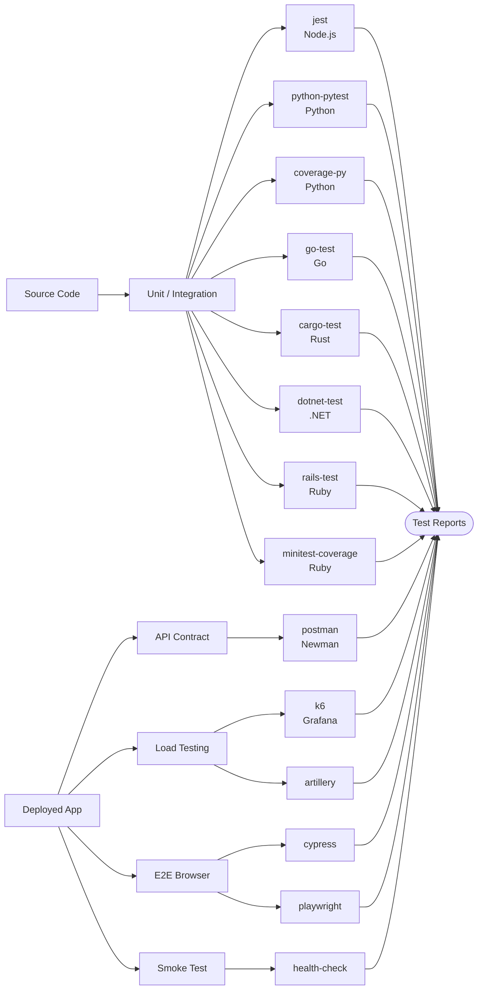

# Testing Plugins

Unit, integration, API contract, load/performance, E2E browser, and smoke testing.

## Unit & Integration

| Plugin | Language | Compute | Secrets | Key Env Vars |
|--------|----------|---------|---------|--------------|
| jest | Node.js | SMALL | None | `NODE_VERSION`, `JEST_CONFIG`, `JEST_COVERAGE` |
| python-pytest | Python | SMALL | None | `PYTHON_VERSION`, `PYTEST_ARGS` |
| coverage-py | Python | SMALL | None | `PYTHON_VERSION`, `COVERAGE_MIN` |
| go-test | Go | SMALL | None | `GO_VERSION`, `GO_TEST_FLAGS` |
| cargo-test | Rust | SMALL | None | `RUST_VERSION`, `CARGO_TEST_FLAGS` |
| dotnet-test | .NET | SMALL | None | `DOTNET_VERSION`, `DOTNET_TEST_PROJECT` |
| rails-test | Ruby | SMALL | None | `RUBY_VERSION`, `RAILS_ENV` |
| minitest-coverage | Ruby | SMALL | None | `RUBY_VERSION`, `COVERAGE_MIN` |

## API Contract

| Plugin | Type | Compute | Secrets | Key Env Vars |
|--------|------|---------|---------|--------------|
| postman | API Contract | SMALL | None | `COLLECTION_FILE`, `ENVIRONMENT_FILE`, `ITERATION_COUNT`, `NEWMAN_TIMEOUT` |

## Load & Performance

| Plugin | Type | Compute | Secrets | Key Env Vars |
|--------|------|---------|---------|--------------|
| k6 | Load/Performance | MEDIUM | None | `K6_VERSION`, `K6_SCRIPT`, `K6_VUS`, `K6_DURATION` |
| artillery | Load/Performance | MEDIUM | None | `ARTILLERY_SCRIPT`, `ARTILLERY_TARGET`, `ARTILLERY_DURATION`, `ARTILLERY_RATE` |

## E2E Browser

| Plugin | Type | Compute | Secrets | Key Env Vars |
|--------|------|---------|---------|--------------|
| cypress | E2E Browser | LARGE | None | `CYPRESS_SPEC`, `CYPRESS_BROWSER`, `CYPRESS_BASE_URL`, `CYPRESS_RECORD_KEY` |
| playwright | E2E Browser | LARGE | None | `PLAYWRIGHT_PROJECT`, `PLAYWRIGHT_BROWSER`, `PLAYWRIGHT_BASE_URL`, `PLAYWRIGHT_WORKERS` |

## Smoke Test

| Plugin | Type | Compute | Secrets | Key Env Vars |
|--------|------|---------|---------|--------------|
| health-check | Smoke Test | SMALL | None | `HEALTH_ENDPOINTS`, `HEALTH_TIMEOUT`, `HEALTH_RETRIES`, `EXPECTED_STATUS` |
