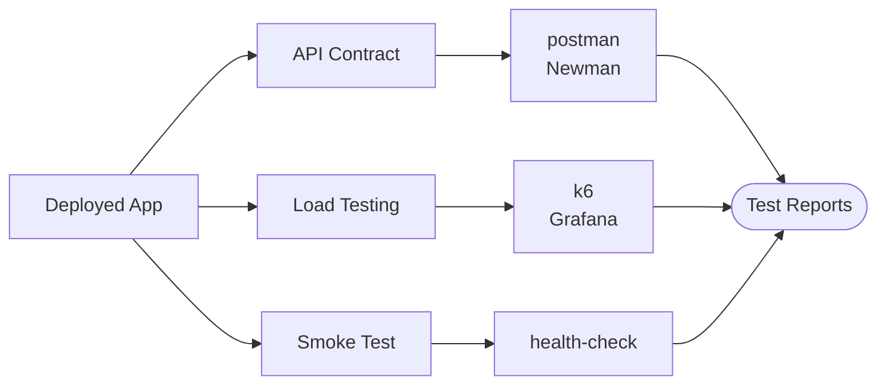

# Testing Plugins

API contract testing, load/performance testing, and post-deployment smoke testing.

| Plugin | Type | Compute | Secrets | Key Env Vars |
|--------|------|---------|---------|--------------|
| postman | API Contract | SMALL | None | `COLLECTION_FILE`, `ENVIRONMENT_FILE`, `ITERATION_COUNT`, `NEWMAN_TIMEOUT` |
| k6 | Load/Performance | MEDIUM | None | `K6_VERSION`, `K6_SCRIPT`, `K6_VUS`, `K6_DURATION` |
| health-check | Smoke Test | SMALL | None | `HEALTH_ENDPOINTS`, `HEALTH_TIMEOUT`, `HEALTH_RETRIES`, `EXPECTED_STATUS` |
