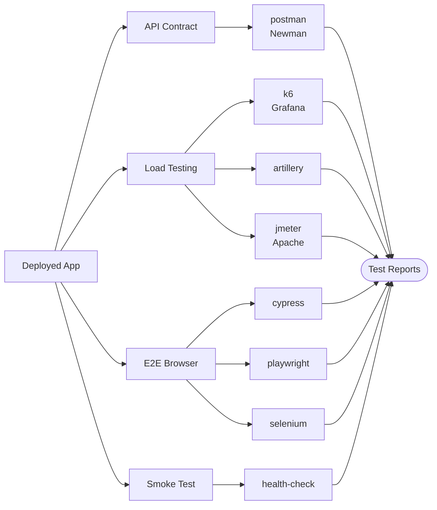

# Testing Plugins

API contract testing, load/performance testing, end-to-end browser testing, and post-deployment smoke testing.

| Plugin | Type | Compute | Secrets | Key Env Vars |
|--------|------|---------|---------|--------------|
| postman | API Contract | SMALL | None | `COLLECTION_FILE`, `ENVIRONMENT_FILE`, `ITERATION_COUNT`, `NEWMAN_TIMEOUT` |
| k6 | Load/Performance | MEDIUM | None | `K6_VERSION`, `K6_SCRIPT`, `K6_VUS`, `K6_DURATION` |
| artillery | Load/Performance | MEDIUM | None | `ARTILLERY_SCRIPT`, `ARTILLERY_TARGET`, `ARTILLERY_DURATION`, `ARTILLERY_RATE` |
| jmeter | Load/Performance | LARGE | None | `JMETER_SCRIPT`, `JMETER_THREADS`, `JMETER_DURATION`, `JMETER_RAMP_UP` |
| cypress | E2E Browser | LARGE | None | `CYPRESS_SPEC`, `CYPRESS_BROWSER`, `CYPRESS_BASE_URL`, `CYPRESS_RECORD_KEY` |
| playwright | E2E Browser | LARGE | None | `PLAYWRIGHT_PROJECT`, `PLAYWRIGHT_BROWSER`, `PLAYWRIGHT_BASE_URL`, `PLAYWRIGHT_WORKERS` |
| selenium | E2E Browser | LARGE | None | `SELENIUM_BROWSER`, `SELENIUM_SUITE`, `SELENIUM_BASE_URL`, `SELENIUM_GRID_URL` |
| health-check | Smoke Test | SMALL | None | `HEALTH_ENDPOINTS`, `HEALTH_TIMEOUT`, `HEALTH_RETRIES`, `EXPECTED_STATUS` |
