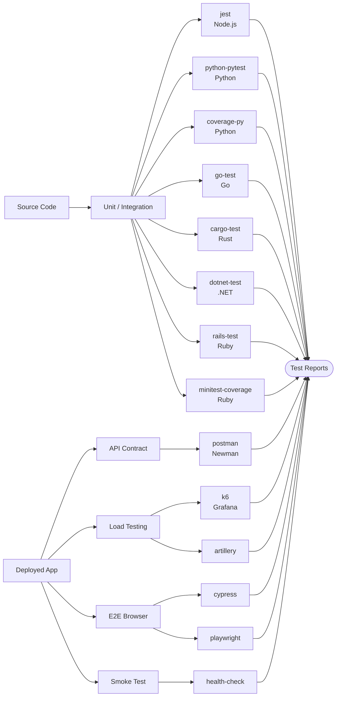

# Testing Plugins

Unit, integration, API contract, load/performance, E2E browser, and smoke testing.

```mermaid
flowchart LR
    Code[Source Code] --> Unit[Unit / Integration]
    Deployed[Deployed App] --> Contract[API Contract]
    Deployed --> Load[Load Testing]
    Deployed --> E2E[E2E Browser]
    Deployed --> Smoke[Smoke Test]

    Unit --> jest[jest\nNode.js]
    Unit --> python-pytest[python-pytest\nPython]
    Unit --> coverage-py[coverage-py\nPython]
    Unit --> go-test[go-test\nGo]
    Unit --> cargo-test[cargo-test\nRust]
    Unit --> dotnet-test[dotnet-test\n.NET]
    Unit --> rails-test[rails-test\nRuby]
    Unit --> minitest-coverage[minitest-coverage\nRuby]

    Contract --> postman[postman\nNewman]
    Load --> k6[k6\nGrafana]
    Load --> artillery
    E2E --> cypress
    E2E --> playwright
    Smoke --> health-check

    jest & python-pytest & coverage-py & go-test & cargo-test & dotnet-test & rails-test & minitest-coverage --> Results([Test Reports])
    postman & k6 & artillery --> Results
    cypress & playwright --> Results
    health-check --> Results
```

## Unit & Integration

| Plugin | Language | Compute | Secrets | Key Env Vars |
|--------|----------|---------|---------|--------------|
| jest | Node.js | SMALL | None | `JEST_CONFIG`, `JEST_JUNIT_OUTPUT_DIR` |
| python-pytest | Python | SMALL | None | `PYTEST_ARGS` |
| coverage-py | Python | SMALL | None | `COVERAGE_THRESHOLD` |
| go-test | Go | SMALL | None | `GOFLAGS` |
| cargo-test | Rust | MEDIUM | None | None |
| dotnet-test | .NET | MEDIUM | None | `CONFIGURATION` |
| rails-test | Ruby | MEDIUM | None | `RAILS_ENV` |
| minitest-coverage | Ruby | SMALL | None | None |

## API Contract

| Plugin | Type | Compute | Secrets | Key Env Vars |
|--------|------|---------|---------|--------------|
| postman | API Contract | SMALL | None | `COLLECTION_FILE`, `ENVIRONMENT_FILE`, `GLOBALS_FILE`, `ITERATION_COUNT`, `NEWMAN_TIMEOUT`, `BAIL_ON_FAILURE` |

## Load & Performance

| Plugin | Type | Compute | Secrets | Key Env Vars |
|--------|------|---------|---------|--------------|
| k6 | Load/Performance | MEDIUM | None | `K6_VERSION`, `K6_SCRIPT`, `K6_VUS`, `K6_DURATION`, `K6_THRESHOLDS` |
| artillery | Load/Performance | MEDIUM | None | `ARTILLERY_CONFIG`, `ARTILLERY_TARGET` |

## E2E Browser

| Plugin | Type | Compute | Secrets | Key Env Vars |
|--------|------|---------|---------|--------------|
| cypress | E2E Browser | LARGE | None | `CYPRESS_SPEC`, `CYPRESS_BROWSER`, `CYPRESS_RECORD_KEY` |
| playwright | E2E Browser | LARGE | None | `PLAYWRIGHT_PROJECT`, `PLAYWRIGHT_WORKERS`, `PLAYWRIGHT_REPORTER` |

## Smoke Test

| Plugin | Type | Compute | Secrets | Key Env Vars |
|--------|------|---------|---------|--------------|
| health-check | Smoke Test | SMALL | None | `HEALTH_ENDPOINTS`, `HEALTH_TIMEOUT`, `HEALTH_RETRIES`, `HEALTH_RETRY_DELAY`, `EXPECTED_STATUS` |
