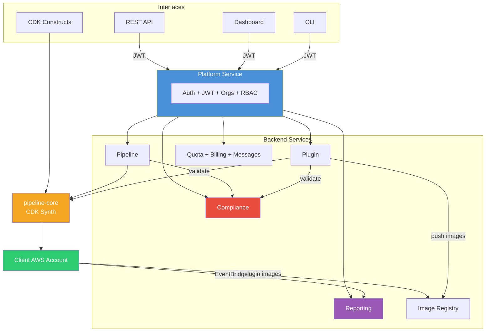

# Self-Service CI/CD for AWS

**Golden paths for developers, guardrails for platform teams.**

Pipeline Builder is a **self-service CI/CD platform for AWS**. Developers self-serve production-ready CodePipelines in minutes — from a dashboard, CLI, CDK, or a single AI prompt — while platform and DevOps teams keep control through **policy-as-code guardrails**, reusable **golden-path templates**, and a central plugin catalog. It takes DevOps off the critical path *without* giving up governance — and every pipeline ships as **native AWS CodePipeline in your own account**, so there's no vendor lock-in and nothing to rip out later.

Rather than hand-wiring AWS CodePipeline, CodeBuild, IAM roles, and deployment stages for every project, teams compose pipelines from governed, reusable building blocks — consistent by default, audited end to end.

[**View on GitHub**](https://github.com/mwashburn160/pipeline-builder) · [**Documentation**]({{ '/docs/' | relative_url }}) · [**Plugin Catalog**]({{ '/docs/plugins/' | relative_url }}) · [**API Reference**]({{ '/docs/api-reference.html' | relative_url }})

---

## At a glance

| 125 | 5 | 4 | 12 | 18 |
|:---:|:-:|:-:|:--:|:--:|
| **plugins** ready to use | **interfaces** to create pipelines | **deploy targets** from laptop to EKS | **AI models** for pipeline generation | **compliance operators** for guardrails |

---

## Why Pipeline Builder

| Challenge | How Pipeline Builder solves it |
|-----------|-------------------------------|
| CI/CD set-up demands deep AWS expertise | Self-service creation via dashboard, CLI, REST API, CDK, or AI prompt — no CDK or buildspec knowledge required |
| Governance happens after the fact | Per-team compliance rules **block** non-compliant pipelines and plugins at creation time (HTTP 403), with a full audit trail |
| Build steps get copy-pasted across teams | 125 versioned, containerized plugins shared from a central catalog — one source of truth, ten categories |
| Teams share infrastructure without isolation | Every pipeline, plugin, secret, quota, and bill scoped to its organization with RBAC and quota enforcement |
| Vendor lock-in with SaaS CI/CD platforms | Pipelines deploy as **native AWS CodePipeline + CodeBuild** in your account — they keep running even if Pipeline Builder is removed |
| No visibility into CI/CD health or cost | EventBridge-fed analytics: success rates, duration percentiles, failure heatmaps, per-team cost attribution |

---

## Capabilities

### Five ways to build a pipeline

Same backend, same compliance, same audit trail — meet developers where they are.

| Interface | Best for | What you do |
|-----------|----------|-------------|
| **Dashboard** | Application developers | Point, click, configure stages visually, deploy |
| **AI prompt** | Brand-new repositories | Paste a Git URL — Pipeline Builder analyzes the repo and generates stages + plugins |
| **CLI** | CI integration, scripting | `pipeline-manager create-pipeline` from any shell |
| **REST API** | Platform teams, automation | Full CRUD + AI generation endpoints |
| **CDK construct** | Infrastructure-as-code shops | `PipelineBuilder` construct deployable from any CDK app |

### Multi-provider AI generation

Generate a complete pipeline — sources, stages, plugins, env vars — from a Git URL or a natural-language prompt. Pick the provider that matches your procurement, data-residency, or model preferences:

| Provider | Models |
|----------|--------|
| Anthropic | Claude Sonnet 4, Claude Haiku 4.5 |
| OpenAI | GPT-4o, GPT-4o Mini |
| Google | Gemini 2.0 Flash, Gemini 2.5 Pro |
| xAI | Grok 3, Grok 3 Fast, Grok 3 Mini |
| Amazon Bedrock | Claude 3.5 Sonnet v2, Nova Pro, Nova Lite |

### 125 pre-built plugins, ten categories

Reusable build steps covering the full CI/CD lifecycle. Every plugin runs as an isolated container step inside AWS CodePipeline, with secrets injected from AWS Secrets Manager at build time.

Plugin images are built with **rootless BuildKit** (`buildkitd`) — the same daemonless path on every target:

- **Rootless & unprivileged** — runs as a non-root user with **no Docker daemon and no docker-socket mount**, removing the dind/socket attack surface.
- **Builds and pushes directly** — Dockerfile build with native **layer caching**, pushing the OCI image straight to the registry.
- **Trust built in** — uses the system CA bundle for registry auth; no per-container cert mounts.
- **One code path everywhere** — EKS, EC2, minikube, and local differ only in where the sidecar is hosted.

| Category | Count | Examples |
|----------|-------|----------|
| Language | 11 | Java, Python, Node.js, Go, Rust, .NET, C++, PHP, Ruby |
| Security | 40 | Snyk, SonarCloud, Trivy, Veracode, Semgrep, Checkmarx, Fortify |
| Quality | 17 | ESLint, Prettier, Checkstyle, Clippy, Ruff, ShellCheck |
| Testing | 14 | Jest, Pytest, Cypress, Playwright, k6, Postman, Artillery |
| Artifact & Registry | 16 | Docker, ECR, GHCR, npm, PyPI, Maven, NuGet, Cargo |
| Deploy | 13 | Terraform, CloudFormation, Kubernetes, Helm, Pulumi, ECS, Lambda, CDK |
| Infrastructure | 5 | CDK synth, manual approval, S3 cache, shell |
| Monitoring | 3 | Datadog, New Relic, Sentry |
| Notification | 5 | Slack, Teams, PagerDuty, email, GitHub status |
| AI | 1 | Dockerfile generation (multi-provider) |

See the [Plugin Catalog]({{ '/docs/plugins/' | relative_url }}) for the full list.

### Policy-as-code compliance

Validate plugins and pipelines **before** they're created — not in a quarterly audit. Platform owners define policy at the organization level; every team inherits enforcement automatically.

- **18 operators** — equals, contains, regex, numeric comparison, value-in-set, field presence, not-empty, array count, string length — plus computed fields (`$count`, `$length`, `$keys`, `$lines`) and cross-field conditions
- **Three severities** — `warning` (advisory), `error` / `critical` (block creation with HTTP 403)
- **Published rule catalog** teams subscribe to, **per-entity exemptions**, and **bulk scans + audit trail** for evidence

### Synth-time templating

A minimal `{{ ... }}` template language for pipeline configs and plugin specs — resolved **once at synthesis time**, with no runtime evaluation, no shell-out, no code execution. Path lookups (`pipeline.*`, `plugin.*`, `env.*`), `| default:` fallbacks, type coercion (`| number`, `| bool`, `| json`), and plugin contracts (`requiredMetadata` / `metadataTypes`) validated at upload. See [Template Syntax]({{ '/docs/templates.html' | relative_url }}).

### Organizations, teams & analytics

An **organization** is the isolation boundary — every pipeline, plugin, secret, quota, and bill is scoped to it. A **team** is an organization optionally nested one level under a parent org (the org → team hierarchy); nesting is opt-in (orgs are flat roots by default), and a parent-org admin manages its teams while visibility, quotas, compliance, and analytics roll up across them.

- **RBAC** — Owner / Admin / Member roles enforced per organization at the API layer; a parent-org admin inherits admin over its teams
- **Per-organization quotas** — `plugins`, `pipelines`, `apiCalls`, `aiCalls`; **feature tiers** (Developer / Pro / Unlimited); a parent's cap can be shared across its teams
- **Isolated secrets** — AWS Secrets Manager per organization (`pipeline-builder/{orgId}/{secret}`), injected at build time, never stored in images
- **Execution analytics** — EventBridge-fed success rates, duration percentiles (p50 / p90 / p99), stage-level failure heatmaps, and per-organization cost attribution (rolled up across child teams for parent orgs)
- **Built for production** — zero-trust internal JWT auth, Kubernetes `health` / `ready` / `warmup` / `metrics` endpoints, graceful degradation

---

## Architecture



| Service | Purpose |
|---------|---------|
| **Platform** | Auth, organizations, teams, users, JWT, RBAC — central gateway |
| **Pipeline** | Pipeline CRUD + AI generation + CDK synthesis |
| **Plugin** | Plugin CRUD + rootless BuildKit (`buildkitd`) image builds + AI generation |
| **Image Registry** | Stores and serves plugin images with token auth, per-org quotas, garbage collection |
| **Compliance** | Per-organization rule enforcement (subscribe to the shared catalog), policy management, audit trail |
| **Reporting** | Execution reports + build analytics via EventBridge |
| **Quota / Billing / Message** | Resource limits, subscriptions, organization announcements |

See [Architecture Flow]({{ '/docs/architecture-flow.html' | relative_url }}) for end-to-end request → build → deploy diagrams.

---

## Get started

**Recommended — install with the CLI.** `pipeline-manager provision` is the primary way to stand up the platform: it picks the target, checks prerequisites — offering to **fetch** missing single-binary tools (`yq`, `kubectl`, `minikube`) and to generate the local `.env` with secrets, no system install — can sparse-clone a fresh machine, and gives you the exact, validated command to run (and, with an AI key set, parses a natural-language goal and diagnoses failures).

```bash
npm install -g @pipeline-builder/pipeline-manager
pipeline-manager provision --target local              # deploy it (shows the plan, then asks to confirm)
pipeline-manager provision --target local --yes        # non-interactive (auto-accept prompts; for CI)
pipeline-manager provision --target local --json       # inspect the plan as JSON, run nothing
# or: pipeline-manager provision --prompt "deploy to EKS in us-east-1 with email"
```

> **`--init <mode>`** controls post-deploy initialization. The default is **`auto`** — the deploy initializes the platform itself — on EC2 on first boot, on EKS in `setup.sh`'s final phase (register admin + load plugins/compliance/samples, over a `kubectl` port-forward); on `local`/`minikube`, `provision` runs init for you. Use **`--init manual`** to run `init-platform` yourself or **`--init skip`** to do nothing. See the [AWS deployment guide](docs/aws-deployment.md#ai-assisted-install-provision).

Prefer to run it directly? The full stack runs locally with Docker — prebuilt public images, no registry login:

```bash
git clone https://github.com/mwashburn160/pipeline-builder.git && cd pipeline-builder
cd deploy/local/docker && ./bin/setup.sh          # 1. pull images + start the stack
cd ../.. && ./deploy/bin/init-platform.sh local   # 2. register admin + load plugins
```

Then open **https://localhost:8443** (default admin `admin@internal` / `SecurePassword123!` — change it immediately on anything beyond your laptop).

From there:

1. **Deploy** the platform — choose Local, Minikube, [EC2]({{ '/docs/aws-deployment.html' | relative_url }}), or EKS
2. **Register** an admin user and organization
3. **Load plugins** from the catalog or upload your own
4. **Build pipelines** through the dashboard, CLI, API, or AI prompt

| Target | Best for | Cost |
|--------|----------|------|
| **Local** | Development | Free |
| **Minikube** | Local Kubernetes | Free |
| **EC2** | Dev / staging | ~$140–265/mo |
| **EKS (Auto Mode)** | Production | ~$150–400/mo |

---

## Documentation

| Guide | Description |
|-------|-------------|
| [API Reference]({{ '/docs/api-reference.html' | relative_url }}) | REST endpoints for pipelines, plugins, compliance, reporting, and AI |
| [CDK Usage]({{ '/docs/cdk-usage.html' | relative_url }}) | `PipelineBuilder` construct, sources, stages, VPC, IAM, secrets |
| [Compliance]({{ '/docs/compliance.html' | relative_url }}) | Per-org rule engine with 18 operators, computed fields, audit trail |
| [Metadata Keys]({{ '/docs/metadata-keys.html' | relative_url }}) | 80 typed CodePipeline, CodeBuild, networking, and IAM configuration keys |
| [Template Syntax]({{ '/docs/templates.html' | relative_url }}) | Synth-time interpolation for pipeline configs and plugin specs |
| [AWS Deployment]({{ '/docs/aws-deployment.html' | relative_url }}) | EC2 and EKS deployment, post-deploy setup |
| [Plugin Catalog]({{ '/docs/plugins/' | relative_url }}) | 125 pre-built plugins across 10 categories |
| [Samples]({{ '/docs/samples.html' | relative_url }}) | Pipeline configs for 7 languages and CDK patterns |
