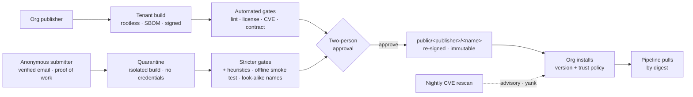
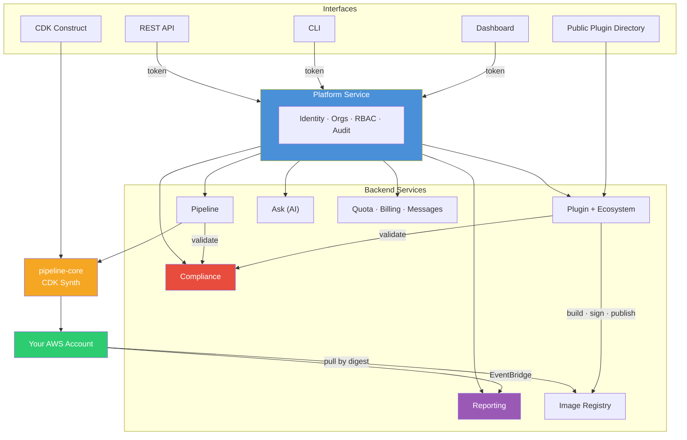

# Self-Service CI/CD for AWS

**Golden paths for developers, guardrails for platform teams.**

Pipeline Builder is a **self-hosted, self-service CI/CD platform for AWS**. Developers get a production-ready AWS CodePipeline in minutes from the dashboard, the CLI, the REST API, a CDK construct, or a single AI prompt. Platform and security teams stay in control through policy-as-code compliance, governed golden-path templates, and a signed, moderated plugin ecosystem.

Every pipeline is synthesized as **native AWS CodePipeline + CodeBuild in your own AWS account**. There is no proprietary runner and no lock-in: if you remove Pipeline Builder, your pipelines keep running.

[**View on GitHub**](https://github.com/mwashburn160/pipeline-builder) · [**Documentation**]({{ '/docs/' | relative_url }}) · [**Plugin Catalog**]({{ '/docs/plugins/' | relative_url }}) · [**API Reference**]({{ '/docs/api-reference.html' | relative_url }})

---

## Highlights

- **Five ways to build, one set of rules.** The dashboard, AI prompt, CLI, REST API, and CDK construct all go through the same compliance checks, quotas, and audit trail.
- **AI across 5 providers and 14 models.** Generate a whole pipeline from a Git URL or a sentence, or ask the in-app assistant. The assistant can read and propose, but never writes on its own.
- **A plugin ecosystem, not just a catalog.** 119 Official plugins sit in a public, searchable directory, alongside listings from Verified, Community, and Unverified publishers. Orgs install plugins with version and trust policies, and users rate and review them. Every listing and version is approved by two people.
- **Supply chain you can verify.** Every plugin image is built by rootless BuildKit, carries an SBOM, is cosign-signed with its trust tier, and is pinned by digest. A nightly CVE rescan drives security advisories.
- **Plugin quarantine.** Anonymous submissions are optional and off by default. Each one lands in quarantine storage, is built on an isolated BuildKit with no credentials, runs a smoke test with no network, and must pass fail-closed gates (CVE scan, license, lint, malware and credential-access heuristics, look-alike names) plus human moderation before it's listed.
- **Governance before the fact.** 18-operator policy-as-code blocks non-compliant pipelines and plugins at creation, with curated SOC 2 / PCI / CIS rule libraries available.
- **Modern identity.** Passkeys, TOTP, SSO over OIDC or SAML 2.0, SCIM provisioning, scoped personal access keys, service accounts, and CLI sign-in by device authorization.
- **Evidence by default.** The audit trail is hash-chained and verifiable. Each org's logs are isolated as their own tenant. DORA metrics use measured lead times.
- **Runs anywhere you do.** Deploy to a laptop, a single EC2 host, or EKS Auto Mode. Every target runs the same Istio ambient mesh with strict mTLS.

## At a glance

| 119 | 5 | 14 | 18 | 4 | 4 |
|:---:|:-:|:--:|:--:|:-:|:-:|
| **Official plugins** in 10 categories | **interfaces** to build pipelines | **AI models** across 5 providers | **compliance operators** | **plugin trust tiers** | **deploy targets**, from laptop to EKS |

---

## Why Pipeline Builder

| Challenge | How Pipeline Builder solves it |
|-----------|--------------------------------|
| CI/CD setup demands deep AWS expertise | Self-service creation from a dashboard, CLI, API, CDK, or AI prompt; no CDK or buildspec knowledge required |
| Governance happens after the fact | Compliance rules **block** non-compliant pipelines and plugins at creation, with exemptions and a full audit trail |
| Build steps are copy-pasted across teams | Versioned, containerized plugins shared through a governed ecosystem with installs, version policies, and reviews |
| Third-party build steps are a supply-chain risk | Signed, SBOM-attested, digest-pinned images; trust tiers baked into signatures; two-person approval for every public listing |
| Teams share infrastructure without isolation | Everything is scoped per organization, with RBAC, quotas, per-org secrets, per-org log tenants, and row-level security |
| SaaS CI/CD creates lock-in | Pipelines deploy as native AWS resources in your account and keep running without the platform |
| No visibility into delivery health | EventBridge-fed analytics, DORA metrics, maturity scorecards, and plugin health scores |

---

## Capabilities

### Build pipelines five ways

| Interface | Best for | What you do |
|-----------|----------|-------------|
| **Dashboard** | Application developers | Configure sources and stages visually, then deploy |
| **AI prompt** | New repositories | Paste a Git URL; the repo is analyzed and stages and plugins are generated for you |
| **CLI** | Scripting and CI | `pipeline-manager pipeline create` from any shell |
| **REST API** | Platform automation | Full CRUD plus AI generation endpoints |
| **CDK construct** | Infrastructure-as-code teams | Deploy the `PipelineBuilder` construct from any CDK app |

**Golden-path templates.** Platform teams publish governed starters with declared inputs. A developer picks one, sets the project and target repository, and gets a pipeline that still passes compliance and quota checks. One template targets any repo:


```json
{
  "name": "node-service",
  "inputs": [{ "name": "repoUrl", "label": "Repository URL", "type": "string", "required": true }],
  "props": { "synth": { "source": { "repositoryUrl": "{{ vars.repoUrl }}" } }, "stages": [] }
}
```


**Synth-time templating.** A small `{{ .. }}` language for pipeline configs and plugin specs is resolved once, at synthesis, with no runtime evaluation and no shell-out. It supports path lookups, `| default:` fallbacks, type coercion, and plugin contracts that are validated at upload. See [Template Syntax]({{ '/docs/templates.html' | relative_url }}).

### AI that proposes, you decide

| Provider | Models |
|----------|--------|
| Anthropic | Claude Sonnet 5, Claude Opus 5, Claude Haiku 4.5 |
| OpenAI | GPT-5.6 Sol, GPT-5.6 Terra, GPT-5.6 Luna |
| Google | Gemini 3.7 Flash, Gemini 3.1 Pro |
| xAI | Grok 4.6, Grok 4.5, Grok 4.3 |
| Amazon Bedrock | Claude Sonnet 4.5, Amazon Nova Pro, Amazon Nova Lite |

- **Pipeline generation** from a Git URL or natural language. It draws on the plugins your org can actually use and prefers your own, Official, and Verified plugins.
- **Plugin generation** writes a Dockerfile and spec checked against the catalog's lint rules.
- **Ask**, an in-app assistant grounded in the docs and your org's data. Anything it drafts is created only when you confirm, through your own session.

### Plugin ecosystem

A plugin runs inside CodeBuild with your pipeline's secrets and IAM role, so a shared plugin is a supply-chain dependency. The ecosystem treats it as one. Every public plugin is built by the platform, gated, approved by two people, signed with its trust tier, pinned by digest, and watched for new CVEs after it ships.


```mermaid
flowchart LR
  O["Org publisher"] --> T["Tenant build<br/>rootless · SBOM · signed"]
  A["Anonymous submitter<br/>verified email · proof of work"] --> Q["Quarantine<br/>isolated build · no credentials"]
  T --> G["Automated gates<br/>lint · license · CVE · contract"]
  Q --> H["Stricter gates<br/>+ heuristics · offline smoke test · look-alike names"]
  G --> M{"Two-person<br/>approval"}
  H --> M
  M -->|approve| P["public/&lt;publisher&gt;/&lt;name&gt;<br/>re-signed · immutable"]
  P --> I["Org installs<br/>version + trust policy"]
  I --> R["Pipeline pulls<br/>by digest"]
  S["Nightly CVE rescan"] -.->|advisory · yank| I
```

**Discover**
- **Public directory**: `/plugins` has full-text search, facets, category pages, and a page per plugin with README, versions, SBOM, advisories, reviews, and health. Anyone can browse it without signing in, and sign-in is always one click away.
- **119 Official plugins** in 10 categories (table below), maintained under the `pipeline-builder` publisher and available to every org by default.

**Trust tiers and governance**
- **Four tiers**: **Official**, **Verified** (Team+ publishers with a verified domain and MFA), **Community** (any signed-in org), and **Unverified** (anonymous submissions).
- **Tier in the signature.** The tier and publisher are baked into each image's cosign signature and checked on every lookup. A mismatch fails the step (`409 IMAGE_VERIFICATION_FAILED`).
- **Only the system org approves.** Every new listing and version needs **two-person approval with no self-dealing**, from a dedicated system-org-only **Ecosystem Manager** role at MFA-level assurance. Tenants submit requests; they can't publish directly.
- **Auto-approval**, where configured, applies only to narrow, gate-green updates such as Official patch and minor releases. It is capped and audited.

**Plugin quarantine for anonymous submissions** (optional, off by default)
- **Identity-light, not identity-free.** A submission needs a verified email via a single-use magic link and a **self-hosted proof-of-work** challenge (no third-party captcha, so it works air-gapped). Each email and IP gets at most 3 submissions a day. The email is stored only hashed and encrypted, is never displayed, and is purged 90 days after the decision.
- **Quarantine storage.** The zip lands in a dedicated `plugin-quarantine` bucket with 30-day expiry. The image goes to a `quarantine/<id>` registry namespace that only the plugin service can reach: no tenant, and not even a super admin, can list or pull it.
- **Isolated build pool.** Submissions are built on a **separate BuildKit** that is never the tenant builder. It has no credentials, no service-account token, and no cloud identity. On EKS it runs on its own tainted node pool. Egress is limited to package mirrors and the registry, and the mesh blocks it from reaching every other service.
- **Fail-closed gates**: spec and contract validation, SPDX license, Dockerfile lint, a non-root image, a grype vulnerability threshold, and **heuristics** that look for crypto miners, obfuscated payloads, cloud-credential and metadata-endpoint access, pipe-to-shell installs, and secret-looking defaults. A **smoke test** then runs with no network.
- **Name protection**: reserved names and **confusable look-alikes** of popular plugins are refused.
- **Human moderation.** Moderators see the gate report, every heuristic finding, the SBOM, and a diff against the previous version. Approved submissions are listed as `community/<name>` at the **Unverified** tier. The submitter can later **claim** the listing by creating an account with the same email.

**Supply chain**
- **Rootless BuildKit** runs with no Docker daemon and no socket mount, and every image runs as non-root.
- Every image carries an **SPDX SBOM** and **SLSA provenance**.
- Upload hardening rejects zip bombs, path traversal, and symlink entries.
- **Pinned at request time.** A request pins the digest, so the image that ships is the one that was reviewed.
- On approval, the image is copied into a read-only `public/*` namespace and **re-signed fresh**. Listed versions are **immutable**, and pipelines pull by digest on every run.

**Consume on your terms**
- Orgs **install** listings with semver version policies, choose which trust tiers they allow, block specific listings, and can require **in-org approval** for new installs. Teams inherit their parent's installs.
- Pipelines reference plugins by publisher and version range. Resolution is predictable: your own org, then your parent org, then Official. A same-name shadow comes with a warning.

**Respond fast**
- A **nightly CVE rescan** drafts security advisories when a new critical or high vulnerability hits a listed version, and security fixes get a faster review lane.
- Published advisories notify every installing org, and pipelines **warn or block** per org policy.
- Moderators can **yank** versions or **suspend** listings instantly. Publishers can pause or deprecate their own.

**Quality signals**
- **Reviews and ratings** from signed-in users, with a **verified-use** badge drawn from real runs, moderation, and publisher replies.
- **Health score** from 0 to 100, built from runtime success rate, vulnerabilities, freshness (including base-image age), signing, smoke test, docs, and rating. It is shown in the directory and used to rank AI suggestions.
- **Publisher Insights**: installs, k-anonymous active-org counts, success rate, rating trend, and open reports and advisories.

**Author with confidence**
- `pipeline-manager plugin new | validate | test | publish` scaffolds from base images and runs the server's own lint, template-contract, and heuristic checks locally.
- **Catalog metadata is detected** from the package (spec, README, Dockerfile labels), and you accept or edit each field.
- AI plugin generation flags similar existing plugins to curb duplicates.

| Category | Count | Examples |
|----------|-------|----------|
| Language | 11 | Java, Python, Node.js, Go, Rust, .NET, C++, PHP, Ruby |
| Security | 34 | Snyk, SonarCloud, Trivy, Veracode, Semgrep, Checkmarx, Fortify |
| Quality | 17 | ESLint, Prettier, Checkstyle, Clippy, Ruff, ShellCheck |
| Testing | 14 | Jest, Pytest, Cypress, Playwright, k6, Postman, Artillery |
| Artifact & Registry | 16 | Docker, ECR, GHCR, npm, PyPI, Maven, NuGet, Cargo |
| Deploy | 13 | Terraform, CloudFormation, Kubernetes, Helm, Pulumi, ECS, Lambda, CDK |
| Infrastructure | 5 | CDK synth, manual approval, S3 cache, shell |
| Monitoring | 3 | Datadog, New Relic, Sentry |
| Notification | 5 | Slack, Teams, PagerDuty, email, GitHub status |
| AI | 1 | Dockerfile generation (multi-provider) |

See [Installing Plugins]({{ '/docs/plugin-installing.html' | relative_url }}) and [Publishing Plugins]({{ '/docs/plugin-publishing.html' | relative_url }}).

### Policy-as-code compliance

Validate plugins and pipelines **before** they exist, not in a quarterly audit.

- **18 operators** plus computed fields (`$count`, `$length`, `$keys`, `$lines`) and cross-field conditions
- **Three severities**: `warning` is advisory; `error` and `critical` block creation with HTTP 403
- **Rule catalog and inheritance.** Subscribe to recommended rules rule by rule; parent orgs push rules down to teams
- **Curated add-ons**: **Standard** (CI/CD best practices), **Advanced** (SOC 2 / PCI / CIS), or the **Suite**; authoring your own rules stays free
- **Exemptions, scheduled scans, and evidence**, with notifications by inbox, email, or signed webhook

See [Compliance]({{ '/docs/compliance.html' | relative_url }}).

### Organizations, access, and identity

- **Organizations and teams.** An organization is the isolation boundary. Teams nest one level under a parent, which is opt-in. Visibility, compliance, pooled quotas, and analytics roll across the hierarchy.
- **RBAC.** Roles are sets of fine-grained `resource:action` permissions. Custom roles are supported, reads and writes are both enforced, and privilege changes revoke live sessions.
- **Sign-in.** Email and password with breached-password checks, six social providers, and per-org SSO over **OIDC or SAML 2.0**, with just-in-time membership, group → role mapping, and **SCIM 2.0**.
- **Strong authentication.** **Passkeys** and **TOTP**, with assurance levels for sensitive admin actions, two-person MFA reset, and consent-gated support impersonation.
- **Machine access.** Personal access keys scoped to a subset of your permissions, service accounts, JWKS-published signing keys, and CLI device sign-in.
- **Plans and billing.** Developer, Pro, Team, and Enterprise tiers with stackable add-on bundles, coupons, and credits, via Stripe or AWS Marketplace.

See [Roles & Permissions]({{ '/docs/permissions.html' | relative_url }}) and [Authentication & SSO]({{ '/docs/authentication.html' | relative_url }}).

### Observe and improve

- **Execution analytics.** Success rates, p50/p90/p99 durations, failure heatmaps, and per-org cost. The ingestion Lambda runs in your account and **never forwards your AWS account number or pipeline ARNs**.
- **DORA metrics.** Deployment frequency, change failure rate, MTTR fed by an incident webhook, and **measured** commit-to-deploy lead time, with performance bands and trends. See [DORA Metrics]({{ '/docs/dora-metrics.html' | relative_url }}).
- **Developer portal.** Catalog ownership, *My Services*, and an A–F maturity scorecard per pipeline. See [Developer Portal]({{ '/docs/developer-portal.html' | relative_url }}).
- **Per-org logs.** Each org is its own log tenant, with masking at ingest and gated export. See [Logs]({{ '/docs/observability-logs.html' | relative_url }}).
- **Tamper-evident audit.** A per-tenant hash chain you can check with `/audit/verify`, and a durable spool that survives outages. See [Audit Events]({{ '/docs/audit-events.html' | relative_url }}).

### Built for production

- **Zero-trust internals.** Short-lived signed service tokens, plus an **Istio ambient mesh** enforcing STRICT mTLS and identity-based authorization on every target. See [Service Mesh]({{ '/docs/service-mesh.html' | relative_url }}).
- **Data safety.** Per-tenant row-level security in Postgres, restorable soft deletes, and documented backups with RPO/RTO targets.
- **Operable.** `/health`, `/ready`, `/warmup`, and `/metrics` on every service; Prometheus, Thanos, Grafana, Alertmanager, Jaeger, and Kiali included.

---

## Architecture


```mermaid
flowchart TB
    subgraph Interfaces
        DASH["Dashboard"] & CLI["CLI"] & API["REST API"] & CDK["CDK Construct"] & DIR["Public Plugin Directory"]
    end

    subgraph Platform["Platform Service"]
        AUTH["Identity · Orgs · RBAC · Audit"]
    end

    subgraph Backend["Backend Services"]
        PIPELINE["Pipeline"] & PLUGIN["Plugin + Ecosystem"]
        COMPLIANCE["Compliance"]
        REPORTING["Reporting"]
        REGISTRY["Image Registry"]
        ASK["Ask (AI)"]
        SUPPORT["Quota · Billing · Messages"]
    end

    CORE["pipeline-core<br/>CDK Synth"]
    AWS["Your AWS Account"]

    DASH & CLI & API -->|token| Platform
    DIR --> PLUGIN
    CDK --> CORE
    Platform --> PIPELINE & PLUGIN & COMPLIANCE & REPORTING & ASK & SUPPORT
    PLUGIN & PIPELINE -->|validate| COMPLIANCE
    PLUGIN -->|build · sign · publish| REGISTRY
    PIPELINE --> CORE
    CORE --> AWS
    AWS -->|pull by digest| REGISTRY
    AWS -->|EventBridge| REPORTING

    style Platform fill:#4A90D9,color:#fff
    style CORE fill:#F5A623,color:#fff
    style AWS fill:#2ECC71,color:#fff
    style COMPLIANCE fill:#E74C3C,color:#fff
    style REPORTING fill:#9B59B6,color:#fff
```

| Service | Purpose |
|---------|---------|
| **Platform** | Identity (passwords, OAuth, SSO, passkeys, TOTP, SCIM), organizations and teams, RBAC, audit trail, log access |
| **Pipeline** | Pipeline CRUD, AI generation, templates, CDK synthesis |
| **Plugin** | Plugin builds (rootless BuildKit) and the plugin ecosystem: publishers, listings, installs, reviews, advisories, public directory |
| **Image Registry** | Plugin images with token auth, signing and SBOM attestation, per-org storage quotas, garbage collection |
| **Compliance** | Per-org rule enforcement, rule catalog and subscriptions, scans, exemptions |
| **Reporting** | Execution analytics, DORA metrics, incidents, via EventBridge |
| **Ask** | Grounded in-app AI assistant (read and propose only) |
| **Quota / Billing / Message** | Pooled resource limits, subscriptions and bundles, announcements, conversations, and attachments |

See [Architecture Flow]({{ '/docs/architecture-flow.html' | relative_url }}) for end-to-end request → build → deploy diagrams.

---

## Get started

**Recommended: install with the CLI.** `pipeline-manager infra provision` picks the target, checks prerequisites, can fetch missing single-binary tools and generate the local `.env`, and builds the exact, validated command to run.

```bash
npm install -g @pipeline-builder/pipeline-manager
pipeline-manager infra provision --target docker              # show the plan, then ask to confirm
pipeline-manager infra provision --target docker --yes        # non-interactive (for CI)
pipeline-manager infra provision --target docker --json       # print the plan as JSON, run nothing
# or: pipeline-manager infra provision --prompt "deploy to EKS in us-east-1 with email"
```

Prefer to run it directly? The full stack runs locally with Docker, from prebuilt public images with no registry login:

```bash
git clone https://github.com/mwashburn160/pipeline-builder.git && cd pipeline-builder
(cd deploy/local/docker && ./bin/setup.sh)     # 1. pull images and start the stack
./deploy/bin/init-platform.sh docker           # 2. register the admin and load plugins
```

Then open **https://localhost:8443** and sign in as `admin@internal` / `Pipeline-Builder-Dev-2026!`. Change this password immediately on anything beyond your laptop.

| Target | Best for | Cost |
|--------|----------|------|
| **Local (Docker Compose)** | Development | Free |
| **Minikube** | Local Kubernetes | Free |
| **[EC2]({{ '/docs/aws-deployment.html' | relative_url }}#ec2)** | Dev / staging | ~$140–265/mo |
| **[EKS (Auto Mode)]({{ '/docs/aws-deployment.html' | relative_url }}#eks)** | Production | ~$150–400/mo |

---

## Documentation

Browse the full docs at **[{{ '/docs/' | relative_url }}]({{ '/docs/' | relative_url }})**, or read the source on **[GitHub](https://github.com/mwashburn160/pipeline-builder)**.

### Start here

| Guide | Description |
|-------|-------------|
| [Documentation hub]({{ '/docs/' | relative_url }}) | The full index, grouped: Build · Govern · Operate · Reference |
| [Onboarding a New Organization]({{ '/docs/onboarding.html' | relative_url }}) | First admin: login → org → members → access key → `store-token` → `setup-events` → first pipeline |
| [Content Index]({{ '/docs/content-index.html' | relative_url }}) | A–Z keyword and topic index |
| [Pipeline Manager CLI]({{ '/docs/pipeline-manager.html' | relative_url }}) | Provision the platform, build and deploy pipelines, author plugins |
| [AWS Deployment]({{ '/docs/aws-deployment.html' | relative_url }}) | Deploy to EC2 or EKS: modes, post-deploy setup, teardown |

### Build

| Guide | Description |
|-------|-------------|
| [Developer Guide]({{ '/docs/developer-guide.html' | relative_url }}) | Five ways to create a pipeline, plus patterns for 7 languages |
| [CDK Usage]({{ '/docs/cdk-usage.html' | relative_url }}) | `PipelineBuilder` construct: sources, stages, VPC, IAM, secrets |
| [Template Syntax]({{ '/docs/templates.html' | relative_url }}) | Synth-time interpolation and golden-path templates |
| [Metadata Keys]({{ '/docs/metadata-keys.html' | relative_url }}) | Typed CodePipeline, CodeBuild, networking, and IAM keys |
| [Plugin Catalog]({{ '/docs/plugins/' | relative_url }}) | 119 Official plugins across 10 categories |
| [Installing Plugins]({{ '/docs/plugin-installing.html' | relative_url }}) | Trust tiers, installs, version policies, reviews |
| [Publishing Plugins]({{ '/docs/plugin-publishing.html' | relative_url }}) | Publisher profiles, publish requests, catalog metadata |
| [Developer Portal]({{ '/docs/developer-portal.html' | relative_url }}) | Catalog ownership, My Services, golden paths, scorecards |
| [Samples]({{ '/docs/samples.html' | relative_url }}) | Ready-to-load pipeline configs for 7 languages, plus CDK patterns |

### Govern

| Guide | Description |
|-------|-------------|
| [Organization Benefits]({{ '/docs/organization-benefits.html' | relative_url }}) | What orgs gain from standardizing on the platform |
| [Roles & Permissions]({{ '/docs/permissions.html' | relative_url }}) | Permission catalog, built-in roles, assurance tiers, impersonation |
| [Compliance]({{ '/docs/compliance.html' | relative_url }}) | Per-org rule engine: validation, enforcement, add-ons, audit |
| [Authentication & SSO]({{ '/docs/authentication.html' | relative_url }}) | Passwords, OAuth, OIDC and SAML SSO, SCIM, passkeys, TOTP |
| [Audit Events]({{ '/docs/audit-events.html' | relative_url }}) | Hash-chained trail, verification, action catalog |
| [Logs]({{ '/docs/observability-logs.html' | relative_url }}) | Per-org application logs: search, masking, export |
| [Billing Providers]({{ '/docs/billing-providers.html' | relative_url }}) | Stripe and AWS Marketplace setup |
| [Billing Add-on Bundles]({{ '/docs/billing-bundles.html' | relative_url }}) | Stackable add-ons that raise pooled caps and unlock features |
| [Billing Discounts]({{ '/docs/billing-discounts.html' | relative_url }}) | Coupon codes and usage credits |

### Operate

| Guide | Description |
|-------|-------------|
| [Deploy Operations]({{ '/docs/deploy-operations.html' | relative_url }}) | Preflight, secret rotation, backups and DR, teardown |
| [Service Mesh]({{ '/docs/service-mesh.html' | relative_url }}) | Istio ambient: STRICT mTLS and identity-based authorization |
| [Environment Variables]({{ '/docs/environment-variables.html' | relative_url }}) | Every configuration variable, by subsystem |
| [DORA Metrics]({{ '/docs/dora-metrics.html' | relative_url }}) | Deployment frequency, change failure rate, MTTR, lead time |
| [Incident Webhook]({{ '/docs/incidents-webhook.html' | relative_url }}) | Connect PagerDuty, Datadog, or Alertmanager for CFR and MTTR |

### Reference

| Guide | Description |
|-------|-------------|
| [API Reference]({{ '/docs/api-reference.html' | relative_url }}) | REST endpoints for pipelines, plugins, compliance, reporting, and AI |
| [Error Handling]({{ '/docs/error-handling.html' | relative_url }}) | Error-to-HTTP convention |
| [Architecture Flow]({{ '/docs/architecture-flow.html' | relative_url }}) | End-to-end flow diagrams (request → build → deploy) |
