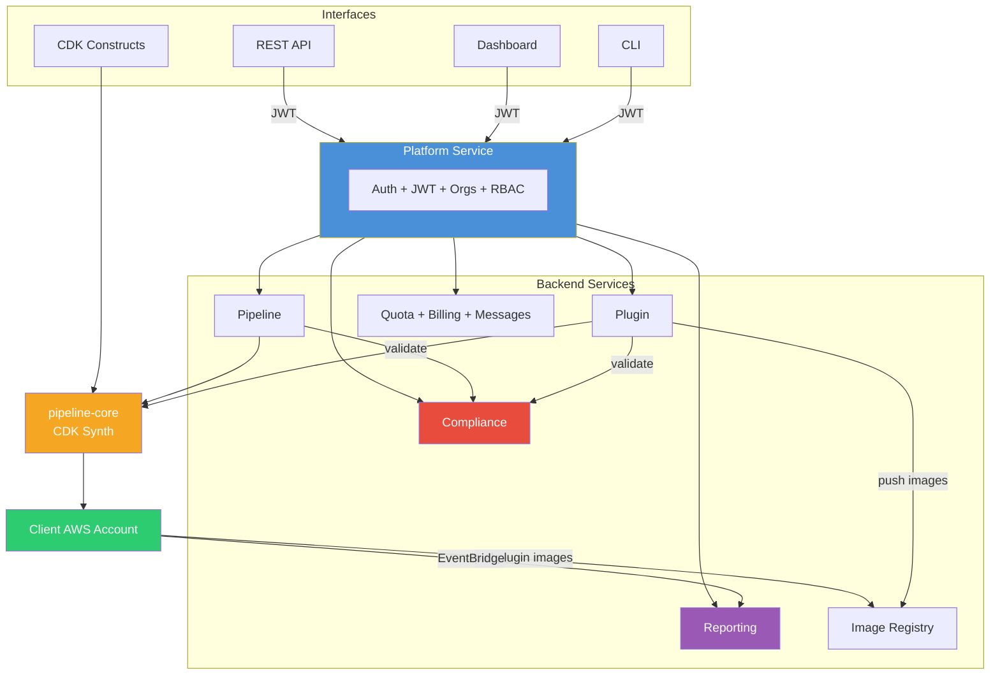

# Self-Service CI/CD for AWS

**Golden paths for developers, guardrails for platform teams.**

Pipeline Builder is a **self-service CI/CD platform for AWS**. Developers self-serve production-ready CodePipelines in minutes — from a dashboard, CLI, CDK, or a single AI prompt — while platform and DevOps teams keep control through **policy-as-code guardrails**, reusable **golden-path templates**, and a central plugin catalog. It takes DevOps off the critical path *without* giving up governance — and every pipeline ships as **native AWS CodePipeline in your own account**, so there's no vendor lock-in and nothing to rip out later.

Rather than hand-wiring AWS CodePipeline, CodeBuild, IAM roles, and deployment stages for every project, teams compose pipelines from governed, reusable building blocks — consistent by default, audited end to end.

[**View on GitHub**](https://github.com/mwashburn160/pipeline-builder) · [**Documentation**]({{ '/docs/' | relative_url }}) · [**Plugin Catalog**]({{ '/docs/plugins/' | relative_url }}) · [**API Reference**]({{ '/docs/api-reference.html' | relative_url }})

---

## At a glance

| 119 | 5 | 4 | 12 | 18 |
|:---:|:-:|:-:|:--:|:--:|
| **plugins** ready to use | **interfaces** to create pipelines | **deploy targets** from laptop to EKS | **AI models** for pipeline generation | **compliance operators** for guardrails |

---

## Why Pipeline Builder

| Challenge | How Pipeline Builder solves it |
|-----------|-------------------------------|
| CI/CD set-up demands deep AWS expertise | Self-service creation via dashboard, CLI, REST API, CDK, or AI prompt — no CDK or buildspec knowledge required |
| Governance happens after the fact | Per-team compliance rules **block** non-compliant pipelines and plugins at creation time (HTTP 403), with a full audit trail |
| Build steps get copy-pasted across teams | 119 versioned, containerized plugins shared from a central catalog — one source of truth, ten categories |
| Teams share infrastructure without isolation | Every pipeline, plugin, secret, quota, and bill scoped to its organization with RBAC and quota enforcement |
| Vendor lock-in with SaaS CI/CD platforms | Pipelines deploy as **native AWS CodePipeline + CodeBuild** in your account — they keep running even if Pipeline Builder is removed |
| No visibility into CI/CD health or cost | EventBridge-fed analytics: success rates, duration percentiles, failure heatmaps, per-team cost attribution |

---

## Capabilities

### Five ways to build a pipeline

Same backend, same compliance, same audit trail — meet developers where they are.

| Interface | Best for | What you do |
|-----------|----------|-------------|
| **Dashboard** | Application developers | Point, click, configure stages visually, deploy |
| **AI prompt** | Brand-new repositories | Paste a Git URL — Pipeline Builder analyzes the repo and generates stages + plugins |
| **CLI** | CI integration, scripting | `pipeline-manager pipeline create` from any shell |
| **REST API** | Platform teams, automation | Full CRUD + AI generation endpoints |
| **CDK construct** | Infrastructure-as-code shops | `PipelineBuilder` construct deployable from any CDK app |

### Multi-provider AI generation

Generate a complete pipeline — sources, stages, plugins, env vars — from a Git URL or a natural-language prompt. Pick the provider that matches your procurement, data-residency, or model preferences:

| Provider | Models |
|----------|--------|
| Anthropic | Claude Sonnet 4, Claude Haiku 4.5 |
| OpenAI | GPT-4o, GPT-4o Mini |
| Google | Gemini 2.0 Flash, Gemini 2.5 Pro |
| xAI | Grok 3, Grok 3 Fast, Grok 3 Mini |
| Amazon Bedrock | Claude 3.5 Sonnet v2, Nova Pro, Nova Lite |

### 119 pre-built plugins, ten categories

Reusable build steps covering the full CI/CD lifecycle. Every plugin runs as an isolated container step inside AWS CodePipeline, with secrets injected from AWS Secrets Manager at build time.

Plugin images are built with **rootless BuildKit** (`buildkitd`) — the same daemonless path on every target:

- **Rootless & unprivileged** — runs as a non-root user with **no Docker daemon and no docker-socket mount**, removing the dind/socket attack surface.
- **Builds and pushes directly** — Dockerfile build with native **layer caching**, pushing the OCI image straight to the registry.
- **Trust built in** — uses the system CA bundle for registry auth; no per-container cert mounts.
- **One code path everywhere** — EKS, EC2, minikube, and local differ only in where the sidecar is hosted.

| Category | Count | Examples |
|----------|-------|----------|
| Language | 11 | Java, Python, Node.js, Go, Rust, .NET, C++, PHP, Ruby |
| Security | 34 | Snyk, SonarCloud, Trivy, Veracode, Semgrep, Checkmarx, Fortify |
| Quality | 17 | ESLint, Prettier, Checkstyle, Clippy, Ruff, ShellCheck |
| Testing | 14 | Jest, Pytest, Cypress, Playwright, k6, Postman, Artillery |
| Artifact & Registry | 16 | Docker, ECR, GHCR, npm, PyPI, Maven, NuGet, Cargo |
| Deploy | 13 | Terraform, CloudFormation, Kubernetes, Helm, Pulumi, ECS, Lambda, CDK |
| Infrastructure | 5 | CDK synth, manual approval, S3 cache, shell |
| Monitoring | 3 | Datadog, New Relic, Sentry |
| Notification | 5 | Slack, Teams, PagerDuty, email, GitHub status |
| AI | 1 | Dockerfile generation (multi-provider) |

See the [Plugin Catalog]({{ '/docs/plugins/' | relative_url }}) for the full list.

### Policy-as-code compliance

Validate plugins and pipelines **before** they're created — not in a quarterly audit. Platform owners define policy at the organization level; every team inherits enforcement automatically.

- **18 operators** — equals, contains, regex, numeric comparison, value-in-set, field presence, not-empty, array count, string length — plus computed fields (`$count`, `$length`, `$keys`, `$lines`) and cross-field conditions
- **Three severities** — `warning` (advisory), `error` / `critical` (block creation with HTTP 403)
- **Published rule catalog** teams subscribe to, **per-entity exemptions**, and **bulk scans + audit trail** for evidence
- **Notifications** on block (and opt-in warnings) via in-app inbox, email, or signed webhook — immediate or daily/weekly digests

### Synth-time templating

A minimal `{{ ... }}` template language for pipeline configs and plugin specs — resolved **once at synthesis time**, with no runtime evaluation, no shell-out, no code execution. Path lookups (`pipeline.*`, `plugin.*`, `env.*`), `| default:` fallbacks, type coercion (`| number`, `| bool`, `| json`), and plugin contracts (`requiredMetadata` / `metadataTypes`) validated at upload. See [Template Syntax]({{ '/docs/templates.html' | relative_url }}).

### Golden-path pipeline templates

Platform teams publish reusable, governed starters; developers instantiate one by filling a few inputs — including the **target repository** — instead of hand-building a pipeline. A template is a `BuilderProps` with placeholder variables plus declared inputs, so **one template targets any repo**:


```json
{
  "name": "node-service",
  "inputs": [{ "name": "repoUrl", "label": "Repository URL", "type": "string", "required": true }],
  "props": { "synth": { "source": { "repositoryUrl": "{{ vars.repoUrl }}" } }, "stages": [] }
}
```


Create from an existing pipeline (*Save as template*), author a new one, or **import** a template JSON on the Templates page; then *Use template* → set **Project** + **Target repository** → **Create** (compliance + quota still apply). See [Template Syntax]({{ '/docs/templates.html' | relative_url }}#golden-pipeline-templates).

### Organizations, teams & analytics

An **organization** is the isolation boundary — every pipeline, plugin, secret, quota, and bill is scoped to it. A **team** is an organization optionally nested one level under a parent org (the org → team hierarchy); nesting is opt-in (orgs are flat roots by default), and a parent-org admin manages its teams while visibility, quotas, compliance, and analytics roll up across them.

- **RBAC** — access via **Roles**: each Role is a named set of fine-grained `resource:action` permissions (reads and writes both enforced), and a user's effective permissions are the **union of the Roles assigned to them** (no separate role-based baseline). Built-in Roles (**Admin**, **Member**) plus admin-defined custom Roles; the coarse **Owner / Admin / Member** label is *derived* (governs ownership/seats, not permissions), a global **Super Admin** spans everything, and a parent-org admin inherits admin over its teams. Privilege changes invalidate live sessions (short-TTL tokens + `tokenVersion`). See [Roles & Permissions]({{ '/docs/permissions.html' | relative_url }})
- **Per-organization quotas** — `plugins`, `pipelines`, `apiCalls`, `aiCalls`, storage, and `seats`; **feature tiers** (Developer / Pro / Team / Enterprise, plus a hidden **Unlimited** tier that is the default when billing is disabled and never shown when it's enabled) with stackable [add-on bundles]({{ '/docs/billing-bundles.html' | relative_url }}) that raise pooled caps and grantable [discounts]({{ '/docs/billing-discounts.html' | relative_url }}) (coupons + usage credits); a parent's caps pool across its teams
- **Isolated secrets** — AWS Secrets Manager per organization (`pipeline-builder/{orgId}/{secret}`), injected at build time, never stored in images
- **Execution analytics** — EventBridge-fed success rates, duration percentiles (p50 / p90 / p99), stage-level failure heatmaps, and per-organization cost attribution (rolled up across child teams for parent orgs)
- **DORA metrics** — deployment frequency, change failure rate, MTTR, and a lead-time proxy with Elite/High/Medium/Low performance bands and a trend sparkline on the Reports page (median successful run time is an approximation, *not* true commit→production lead time); see [DORA Metrics]({{ '/docs/dora-metrics.html' | relative_url }})
- **Developer portal** — a catalog with **ownership** (a *My Services* view of what you own), **golden-path templates** you instantiate by filling a few inputs (governed by the same compliance + quota checks), and a per-pipeline **maturity scorecard** blending compliance posture with DORA into an A–F grade; see [Developer Portal]({{ '/docs/developer-portal.html' | relative_url }})
- **Tamper-evident audit trail** — every privileged action hash-chained per tenant with a sysadmin `/audit/verify`, forgery-locked service ingest, and a durable spool so the security log survives an outage (see [Audit Events]({{ '/docs/audit-events.html' | relative_url }}))
- **Built for production** — zero-trust internal JWT auth, Kubernetes `health` / `ready` / `warmup` / `metrics` endpoints, graceful degradation

### Authentication & SSO

Sign in with email + password, a social provider, or corporate SSO — side by side. See [Authentication & SSO]({{ '/docs/authentication.html' | relative_url }}).

- **OAuth social login** (platform-wide) — "Sign in with" **Google, GitHub, Facebook, Microsoft, GitLab, LinkedIn**. Each provider turns on when its `OAUTH_<P>_CLIENT_ID` / `_SECRET` env is set (fail-soft — unconfigured providers are hidden), and the login page renders its buttons data-driven from the enabled set; one app registration per provider, global to the deployment
- **Per-org enterprise SSO** (OIDC) — an organization registers its own IdP (`OrgIdpConfig`): **generic OIDC** (Okta, Microsoft Entra ID, Auth0, Ping, OneLogin, Keycloak, AWS IAM Identity Center) plus a named **AWS Cognito** provider (region + userPoolId → derived discovery). The IdP's `id_token` is JWKS-validated; `allowedEmailDomains` gates a domain and **forces its users through SSO**. Gated on the `sso` tier/bundle entitlement and configurable by a platform operator (`/admin/org-idp`) or by an org's own admin via self-service (gated on `org:settings`)
- **Other providers** — Apple, X, Amazon, and Discord are reachable via generic OIDC where OIDC-compliant; a native **Sign in with Apple** button is a planned addition (signed-JWT client secret + `form_post`)

---

## Architecture


```mermaid
flowchart TB
    subgraph Interfaces
        CLI["CLI"] & DASH["Dashboard"] & API["REST API"] & CDK["CDK Constructs"]
    end

    subgraph Platform["Platform Service"]
        AUTH["Auth + JWT + Orgs + RBAC"]
    end

    subgraph Backend["Backend Services"]
        PLUGIN["Plugin"] & PIPELINE["Pipeline"]
        COMPLIANCE["Compliance"]
        REPORTING["Reporting"]
        REGISTRY["Image Registry"]
        SUPPORT["Quota + Billing + Messages"]
    end

    CORE["pipeline-core<br/>CDK Synth"]
    AWS["Client AWS Account"]

    CLI & DASH & API -->|JWT| Platform
    CDK --> CORE
    Platform --> PLUGIN & PIPELINE & COMPLIANCE & REPORTING & SUPPORT
    PLUGIN & PIPELINE -->|validate| COMPLIANCE
    PLUGIN -->|push images| REGISTRY
    PLUGIN & PIPELINE --> CORE
    CORE --> AWS
    AWS -->|pull plugin images| REGISTRY
    AWS -->|EventBridge| REPORTING

    style Platform fill:#4A90D9,color:#fff
    style CORE fill:#F5A623,color:#fff
    style AWS fill:#2ECC71,color:#fff
    style COMPLIANCE fill:#E74C3C,color:#fff
    style REPORTING fill:#9B59B6,color:#fff
```

| Service | Purpose |
|---------|---------|
| **Platform** | Auth, organizations, teams, users, JWT, RBAC — central gateway |
| **Pipeline** | Pipeline CRUD + AI generation + CDK synthesis |
| **Plugin** | Plugin CRUD + rootless BuildKit (`buildkitd`) image builds + AI generation |
| **Image Registry** | Stores and serves plugin images with token auth, per-org quotas, garbage collection |
| **Compliance** | Per-organization rule enforcement (subscribe to the shared catalog), policy management, audit trail |
| **Reporting** | Execution reports + build analytics via EventBridge |
| **Quota / Billing / Message** | Resource limits, subscriptions, organization announcements |

See [Architecture Flow]({{ '/docs/architecture-flow.html' | relative_url }}) for end-to-end request → build → deploy diagrams.

---

## Get started

**Recommended — install with the CLI.** `pipeline-manager infra provision` is the primary way to stand up the platform: it picks the target, checks prerequisites — offering to **fetch** missing single-binary tools (`yq`, `kubectl`, `minikube`) and to generate the local `.env` with secrets, no system install — can sparse-clone a fresh machine, and gives you the exact, validated command to run (and, with an AI key set, parses a natural-language goal and diagnoses failures).

```bash
npm install -g @pipeline-builder/pipeline-manager
pipeline-manager infra provision --target docker              # deploy it (shows the plan, then asks to confirm)
pipeline-manager infra provision --target docker --yes        # non-interactive (auto-accept prompts; for CI)
pipeline-manager infra provision --target docker --json       # inspect the plan as JSON, run nothing
# or: pipeline-manager infra provision --prompt "deploy to EKS in us-east-1 with email"
```

> **`--init <mode>`** controls post-deploy initialization. The default is **`auto`** — the deploy initializes the platform itself — on EC2 on first boot, on EKS in `setup.sh`'s final phase (register admin + load plugins/compliance/samples, over a `kubectl` port-forward); on `local`/`minikube`, `infra provision` runs init for you. Use **`--init manual`** to run `init-platform` yourself or **`--init skip`** to do nothing. See the [AWS deployment guide]({{ '/docs/aws-deployment.html' | relative_url }}#ai-assisted-install-infra-provision).

Prefer to run it directly? The full stack runs locally with Docker — prebuilt public images, no registry login:

```bash
git clone https://github.com/mwashburn160/pipeline-builder.git && cd pipeline-builder
cd deploy/local/docker && ./bin/setup.sh          # 1. pull images + start the stack
cd ../.. && ./deploy/bin/init-platform.sh docker   # 2. register admin + load plugins
```

Then open **https://localhost:8443** (default admin `admin@internal` / `SecurePassword123!` — change it immediately on anything beyond your laptop).

From there:

1. **Deploy** the platform — choose Local, Minikube, [EC2]({{ '/docs/aws-deployment.html' | relative_url }}), or EKS
2. **Register** an admin user and organization
3. **Load plugins** from the catalog or upload your own
4. **Build pipelines** through the dashboard, CLI, API, or AI prompt

| Target | Best for | Cost |
|--------|----------|------|
| **Local** | Development | Free |
| **Minikube** | Local Kubernetes | Free |
| **EC2** | Dev / staging | ~$140–265/mo |
| **EKS (Auto Mode)** | Production | ~$150–400/mo |

---

## Documentation

Browse the full docs at **[{{ '/docs/' | relative_url }}]({{ '/docs/' | relative_url }})**, or read the source on **[GitHub](https://github.com/mwashburn160/pipeline-builder)**.

### Getting Started

| Guide | Description |
|-------|-------------|
| [Overview]({{ '/docs/' | relative_url }}) | Key concepts, usage guides, operational how-to |
| [Pipeline Manager CLI]({{ '/docs/pipeline-manager.html' | relative_url }}) | The `pipeline-manager` CLI — provision the platform, build/deploy pipelines, manage plugins |
| [Developer Guide]({{ '/docs/developer-guide.html' | relative_url }}) | Cut-and-paste pipeline examples for 7 languages |
| [Samples]({{ '/docs/samples.html' | relative_url }}) | Pipeline configs and CDK patterns |
| [Organization Benefits]({{ '/docs/organization-benefits.html' | relative_url }}) | What orgs gain from standardizing on the platform |
| [Architecture Flow]({{ '/docs/architecture-flow.html' | relative_url }}) | End-to-end flow diagrams (request → build → deploy) |

### Developer Reference

| Guide | Description |
|-------|-------------|
| [API Reference]({{ '/docs/api-reference.html' | relative_url }}) | REST endpoints for pipelines, plugins, compliance, reporting, and AI |
| [Developer Portal]({{ '/docs/developer-portal.html' | relative_url }}) | Catalog ownership & My Services, golden-path templates, per-pipeline maturity scorecards |
| [Roles & Permissions]({{ '/docs/permissions.html' | relative_url }}) | Permission catalog, built-in Roles, enforcement, session invalidation |
| [Authentication & SSO]({{ '/docs/authentication.html' | relative_url }}) | OAuth social login (Google/GitHub/Facebook/Microsoft/GitLab/LinkedIn) + per-org enterprise SSO (OIDC, AWS Cognito) |
| [CDK Usage]({{ '/docs/cdk-usage.html' | relative_url }}) | `PipelineBuilder` construct, sources, stages, VPC, IAM, secrets |
| [Metadata Keys]({{ '/docs/metadata-keys.html' | relative_url }}) | 80 typed CodePipeline, CodeBuild, networking, and IAM configuration keys |
| [Template Syntax]({{ '/docs/templates.html' | relative_url }}) | Synth-time interpolation for pipeline configs and plugin specs |
| [Error Handling]({{ '/docs/error-handling.html' | relative_url }}) | Error-to-HTTP convention — throw typed `AppError`s |
| [Plugin Catalog]({{ '/docs/plugins/' | relative_url }}) | 119 pre-built plugins across 10 categories |

### Operations

| Guide | Description |
|-------|-------------|
| [AWS Deployment]({{ '/docs/aws-deployment.html' | relative_url }}) | EC2 and EKS deployment, post-deploy setup |
| [Environment Variables]({{ '/docs/environment-variables.html' | relative_url }}) | Full config reference for all services |
| [Compliance]({{ '/docs/compliance.html' | relative_url }}) | Per-org rule engine with 18 operators, computed fields, audit trail |
| [Audit Events]({{ '/docs/audit-events.html' | relative_url }}) | Tamper-evident trail — hash-chain + verify, ingest security, durable spool |
| [DORA Metrics]({{ '/docs/dora-metrics.html' | relative_url }}) | Deployment frequency, change failure rate, MTTR, lead-time proxy, trend |
| [Billing Add-on Bundles]({{ '/docs/billing-bundles.html' | relative_url }}) | Stackable add-ons that raise pooled caps and unlock features |
| [Billing Discounts]({{ '/docs/billing-discounts.html' | relative_url }}) | Coupon codes + usage credits — one-time, recurring, or credit |
